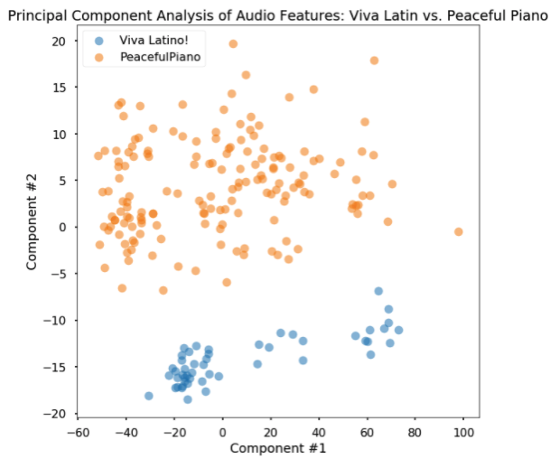
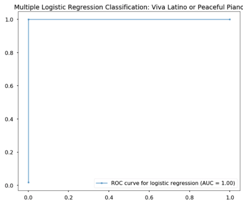
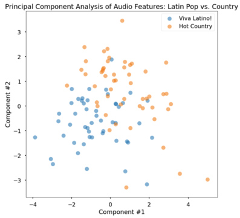
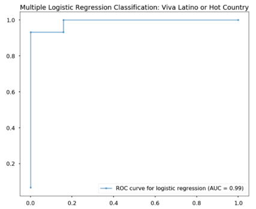
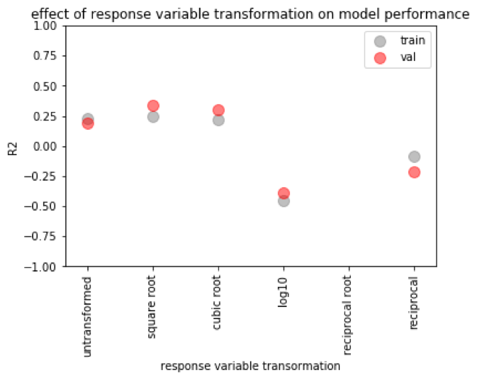
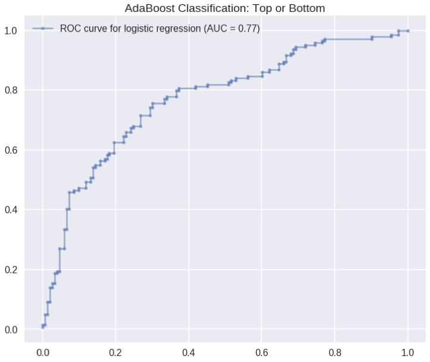

# AC209a Final Report: Predicting playlist success on the Spotify platform

#### Group Members: Max, Erica, and Elmer
#### Group Number: 58

Hello, welcome to our website for our data science final project.

 
 
 

## Table of contents
1. [Problem Statement and Motivation](#Problem_Statement)

2. [Introduction and Description of Data](#introduction)

    1. [Introduction](#intro1)

    2. [Exploratory Data Analysis](#EDA)

3. [Literature Review/Related Work](#paragraph2)

4. [Modeling Approach and Project Trajectory](#paragraph2)

5. [Results, Conclusions, and Future Work](#paragraph2)
    1. [Results](#subparagraph1)
    2. [Conclusions](#subparagraph1)
    3. [Future Work](#subparagraph1)

6. [References](#paragraph2)

## 1. Problem Statement and Motivation 
Our project had two specific goals:
- To build a model for predicting playlist success (with the # of playlist followers as a measure of success)
- Develop a method to generate new “fresh” playlists for a user based on playlist they currently like. 

Motivation:
As a company, Spotify makes profit by having users subscribe to their platform. Spotify therefore wants to keep their users interested in their platform. A way they plan to achieve this is by continuously providing “fresh” new content (songs and podcasts) to the user. This keeps the user happy because they can justify their subscription with the fact that spotify is providing a service of providing new interesting content. Towards this goal, we want to develop methodology to interpreting what factors are important for making playlists that are successful (have a large # of users subscribing/following)

## 2. Introduction and Description of Data 
### Obtaining raw data through the Spotify API 

Using the python library Spotipy (a python wrapper for the Spotify API), we obtained complete meta-data for 1587 playlists. All of these playlists are playlists published to the Spotify platform directly by Spotify, and thus their associated username was ‘Spotify’. 

When we started exploring the data available through Spotify API in depth, we first found there was information describing the playlist directly, (such as the number of followers, track IDs, or the number of tracks. We then decided that to obtain significant characteristics for prediction we would need to query information about the tracks that comprise the playlist. The extra layers of information we would need to parse are diagramed below in figure 1.

 

Figure 1. A rough schematic of the layers of data available through the spotify API

For each of the 1587 playlists we then obtained the meta-data of following associated information:

- All tracks information associated with each playlist ( 63902 tracks)
- All audio features associated with each track (63902 tracks )
- All artist information associated with each track ( 20139 artists)
- All album information associated with each track

Here is the Jupyter notebook where all audio features were obtained through the Spotify API:  
[ParsingAll_AudioFeatures_120417](notebook_Markdown/ParsingAll_AudioFeatures_120417.html)

For details as to the exact metadata available for each playlist, track, artist, or album refer to the Spotify API Object Model documentation. (https://developer.spotify.com/web-api/object-model/)

#### Creating predictors from the raw API data 

#### Inferring playlist genre 
A challenge we faced was that the spotify API did not directly provide any genre classification for their playlists. To overcome this we inferred a playlist’s dominant genre by looking at the artist genre’s associated with all tracks in a playlist. We defined a playlist’s dominant genre as the genre that was best represented across all track’s artist’s genres. We found the general genre of “pop” dominated the platform with more than double the # of playlists than any other genre. 
 

 

### 2. Exploratory Data Analysis 

 
This is the distribution of the number of followers for each playlist. We can observe that the distribution is left-skewed, and therefore, requires additional transformations before using it as a response variable. 

 

The Today’s Top Hits is an outlier. It has more than twice the number of followers of RapCavier which is second in number of followers. (Note: there were some playlists that we couldn’t retrieved from spotify api so some of the top playlists may not be present here).

### Exploration of audio features 
Next, we began to explore audio feature characteristics of all 63902 songs present in our dataset.  Our interest in using audio features come from the fact that audio features are blind to the actual popularity of specific artists or tracks.

The question we asked of the audio features is what is the correlation between all 13 audio features available for each track. What we found was most audio features were not highly correlated in any way (with a few exceptions). Energy and loudness appear to have a strong positive correlation, while energy and acousticness have a strong negative correlation. In general the lack of extremely high correlation between audio features indicates that they are all likely to be informative to our model. 
 

 

Next, we looked into the potential for audio features to allow for classification of songs as belonging to specific genres/playlists. To test this we started 3 sets of tracks:

Hot Country: 52 tracks
Viva Latino: 50 tracks
Peaceful Piano: 162 tracks

First I asked how well Viva Latino is separated from Peaceful Piano in the first two principal components of the data. I found that they very clearly separated, 
 

 
Next, I used a logistic regression classifier to classify tracks as coming from either of the two playlists. The logistic regression classifier performed perfectly differentiating latin pop songs from piano music (Test Accuracy = 100%).
 

 
I next performed a similar comparison of Viva Latino and Hot Country. I found that latin pop music was qualitatively not as separable, but still distinguishable in PCA space. The logistic regression classifier performed decently (Test Accuracy = 88.2%).

 

 

 

 

## 3. Modeling Approach and Project Trajectory 
### Null Model 
We started off our project by building a simple null model that simply just uses the average # of followers of the training set as a prediction for any playlist.
We found that this null model performed poorly (Test R^2 = -1e-2) and show no predictive ability.
This provided us with a reference for the performance of a model that uses no predictors. Instead this model is just using the response variables of the training set to predict the response of variables of the test set. If the use of a predictor increases test performance by any amount above R^2 =0 this is an indication that this predictor yields some predictive power.
### Regression Models 

We explored a simple linear regression model, and found the results poor (R2 less than 0 for the validation set). We determined that we needed to use dimensionality reduction, so we tried Lasso and Ridge regression techniques, and also PCA. Ridge and Lasso regression gave R2 values around 0.2, much better than baseline! 
We wanted to also explore if transforming the response variable would impact our model’s predictive success, since we saw that the playlist followers appeared to have a skewed distribution (as shown in exploratory data analysis). We tried the square root, cubic root, log (base 10), and inverse of the response variable and trained models. We saw that the R2 values for Ridge and Lasso Regression were higher given a square root or cubic root transformation. The best performance was Lasso Regression using a transformed response variable of square root. 
 

 
Linear regression with Lasso regression, using the square root-transformed response variable seems like our best model. But we want to know how it's working - what are the important features? For linear regression, we found 19 parameters with a p value of <0.05, mostly containing genre information, audio feature information, and some spotify features, such as recommendations. The most significant features by far (p values 1e-16) were for newly-released tracks (a feature we engineered from date of release) and one for spotify-featured playlists. The using spotify's featured playlists as a parameter seems like a poor way to move forward with using this model to generate a successful playlist, since we can't control whether or not spotify features it, and that seems cheap anyway, we want our playlist to be successful because it's good, not because spotify features it. We also looked at the nonzero coefficients from Lasso regression, seen below. There were some different trends, but we still saw that spotify’s featured playlists dominated (the third-largest coefficient). 

 

 
For the rest of the project we will NOT use any attributes (track, artist, album) that directly tell tell the model anything about popularity or followers. This will result in technically a model with test performance, but we believe that the model that is produced without using popularity/followers will be better identifying attributes that truly make a playlist more popular with users. So, we tried using the square root transformed response variable, and building lasso regression model. Our R2 value was less than 0.
So, we decided to remove spotify-featured playlists from the dataset. Using playlists that have been featured on spotify might be biasing our dataset. There may be a trend between the features of a playlist and its number of followers that is obscured by the inflation playlist followers gets after it has been featured. Since the distribution of these playlist follower values was different, we tried building models using both un-transformed and transformed response variables. Interestingly, we found we got an R2 value less than 0 for the transformed response variables, but we got an R2 value of 0.11 when we used un-transformed response variable. Again, we used lasso regression.  Unfortunately, we saw that there were few non-zero coefficients. 
 

 
We tested this model on the test set and found an R2 value of 0.13, which we thought was quite good compared to our null model, considering we didn’t use any popularities, followers, or spotify featured/recommended parameters for prediction. We also tried some classification modeling predicting successful or not successful playlists, when tested on our test set, we saw and AUC on our ROC curve of 0.77, again, this model used the same features. 
 

 

In the future, we would have liked to have spent more time engineering features, and preferably focusing on the audio features.   

## 4. Results, Conclusions, and Future Work 
### Results 
#### Building a playlist 
##### Introduction 
To suggest a new playlist to a user, we implemented an algorithm called Simulated Annealing. This is a global optimization approach inspired from a concept in statistical physics. The algorithm essentially describes the motion of molecules when it is heated up to large temperature and when the system is cooled. The idea here is that the molecules will reach a global minimum energy point after cooling, and hence, we can use it a global optimization method.  
##### Method 
We can adopt this global minimization algorithm to minimize a predefined cost function (in physics it’ll be the energy of the system defined by the boltzmann distribution). The cost function essentially forces us to incorporate tracks that maximizes the chance of success. For sake of simplicity and computational time, we only used audio features for fitting our model and running this algorithm. We’ve taken a pre-existing code for ‘Simulated Annealing’ and adapted it for playlists generation. 
In this method, we first fit a logistic regression model with our training set, and from our test set, we randomly generate a playlist with about 30-35 tracks in it. We use this playlist and other initial conditions to initiate the algorithm. The algorithm will go through a number of iterations replacing a track in our playlist with another track from our set of remaining tracks. The algorithm will accept the new playlist only if it lowers our cost function. At the end, the algorithm will return a playlist that minimizes the overall cost function. 

##### Results 

 

 

 

 

We can see that our new playlist takes tracks from playlists with relatively low followers if we modify the cost function so that it penalizes more for playlists with large number of followers (blue bar graphs above). We can also see that there are some tracks from the same playlist that was used in the old playlist. This shows that the algorithm doesn’t replace the playlist completely, but I tries to retain certain characters. However, the mean popularity of the tracks in our playlist increased slightly. 
If we adjust the cost function so that it penalizes more when the playlist is not as successful, we can see that the tracks are obtained from playlists with large number of followers. Note: that the initial playlist used for the two cases were different from each other due to kernel restarting.

 

  

 

 

These plots show that regardless of the cost function the algorithm seeks to generate playlists that have similar mean track popularity.

### Conclusion 

### Future Work 
#### Improving our predictive model for playlist success: 
A major challenge that we faced when developing a predictive model for playlist success is that a playlists success on the Spotify platform is largely dependent on how well advertised it is on the Spotify main page and in different genre categories. This creates a platform where there is preferential exposure for specific artists. An interesting future direction for this work would be to expand the analysis to playlists created by spotify users. This would provide 2 benefits over using Spotify’s public playlists. 1) It would mean that their would be less bias in exposure to the Spotify user base, and 2) there are several orders of magnitude more playlists published by the Spotify user base.

#### Building a Playlist: 
The approach we’ve taken was somewhat naive. We worked under the assumption that the spotify user has an eclectic taste for tracks which is why we seeded a randomly generated playlist to our algorithm. In reality, we know individuals want tracks related to the ones they liked. Therefore, for future work, we should limit our tracks we incorporate to our playlist to ones that are related to each other. The similar tracks can be obtained through spotify recommendations or we can take a mathematical approach in which calculate the “distance” between tracks using metrics such as Frobenius Distance. Furthermore, there are several parameters that we can tweak to generate a better playlist such as the “temperature” and “cooling length”. For example, increasing the cooling time will give our system enough time to find the global minimum. Finally, the model we used for generating the playlist just uses a subset of all our features. In the future, we can rerun this algorithm with an expanded feature and also try out different classification models other than the one used in the algorithm.

## 5. Literature Review/Related Work 
https://towardsdatascience.com/is-my-spotify-music-boring-an-analysis-involving-music-data-and-machine-learning-47550ae931de 

http://spotipy.readthedocs.io/en/latest/#installation 

https://developer.spotify.com/web-api/tutorial/ 

http://www.sciencedirect.com/science/article/pii/S0020025507004045

https://github.com/perrygeo/simanneal/blob/master/simanneal/anneal.py

- [Project Overview](pages/overview.html)
- [Data sources/processing](pages/independent_site.html)
- [Exploratory Data Analysis of Spotify Data](pages/user_site.html)
- [Exploratory Data Analysis of Spotify Data](pages/project_site.html)
- [Building a baseline model to predict playlist success](pages/nojekyll.html)
- [Improving out model](pages/local_test.html)
- [Prediction of song genre based on audio features](pages/resources.html)

