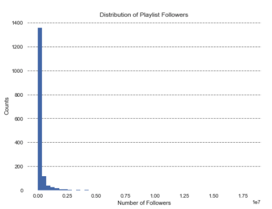

# AC209a Final Report: Predicting playlist success on the Spotify platform

#### Group Members: Max, Erica, and Elmer

Hello, welcome to our website for our data science final project.

 
 
 

## Table of contents
1. [Problem Statement and Motivation](#Problem_Statement)

2. [Introduction and Description of Data](#introduction)

    1. [Introduction](#intro1)

    2. [Exploratory Data Analysis](#EDA)

3. [Literature Review/Related Work](#paragraph2)

4. [Modeling Approach and Project Trajectory](#paragraph2)

5. [Results, Conclusions, and Future Work](#paragraph2)
    1. [Results](#subparagraph1)
    2. [Conclusions](#subparagraph1)
    3. [Future Work](#subparagraph1)

6. [References](#paragraph2)

## 1. Problem Statement and Motivation 
Some text

## 2. Introduction and Description of Data 
Some text

Here is the Jupyter notebook where all audio features were obtained through the Spotify API:  
[ParsingAll_AudioFeatures_120417](notebook_Markdown/ParsingAll_AudioFeatures_120417.html)

### 2. Exploratory Data Analysis 

This is the distribution of the number of followers for each playlist. We can observe that the distribution is left-skewed, and therefore, requires additional transformations before using it as a response variable. 

### Sub paragraph 
This is a sub paragraph, formatted in heading 3 style

## 3. Literature Review/Related Work 

## 4. Modeling Approach and Project Trajectory 

## 5. Results, Conclusions, and Future Work 

### Conclusion 

### Future Work 
#### Building a Playlist: 
The approach we’ve taken was somewhat naive. We worked under the assumption that the spotify user has an eclectic taste for tracks which is why we seeded a randomly generated playlist to our algorithm. In reality, we know individuals want tracks related to the ones they liked. Therefore, for future work, we should limit our tracks we incorporate to our playlist to ones that are related to each other. The similar tracks can be obtained through spotify recommendations or we can take a mathematical approach in which calculate the “distance” between tracks using metrics such as Frobenius Distance. Furthermore, there are several parameters that we can tweak to generate a better playlist such as the “temperature” and “cooling length”. For example, increasing the cooling time will give our system enough time to find the global minimum. Finally, the model we used for generating the playlist just uses a subset of all our features. In the future, we can rerun this algorithm with an expanded feature and also try out different classification models other than the one used in the algorithm.

## Another paragraph 
The second paragraph text
 
 
 
 
 
 
 
 
 
 
 
 
- [Project Overview](pages/overview.html)
- [Data sources/processing](pages/independent_site.html)
- [Exploratory Data Analysis of Spotify Data](pages/user_site.html)
- [Exploratory Data Analysis of Spotify Data](pages/project_site.html)
- [Building a baseline model to predict playlist success](pages/nojekyll.html)
- [Improving out model](pages/local_test.html)
- [Prediction of song genre based on audio features](pages/resources.html)

