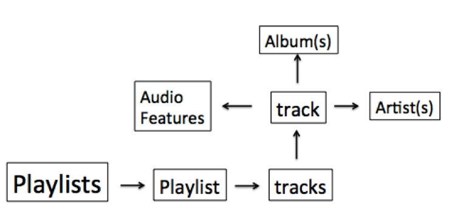
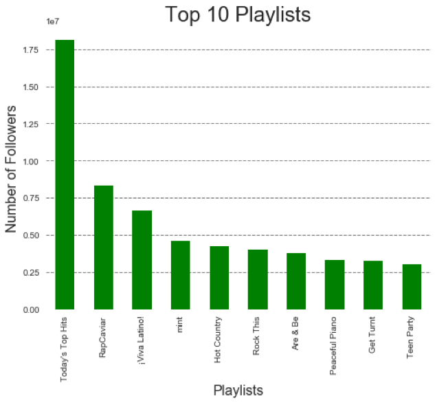
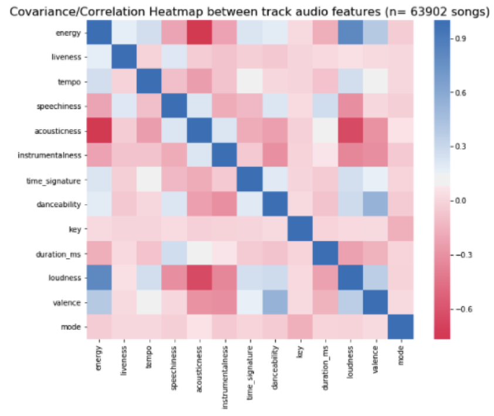
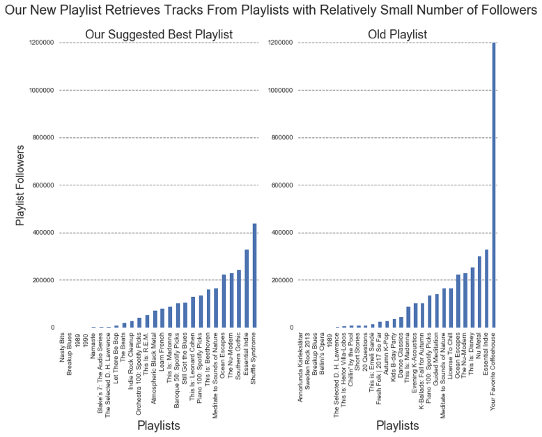
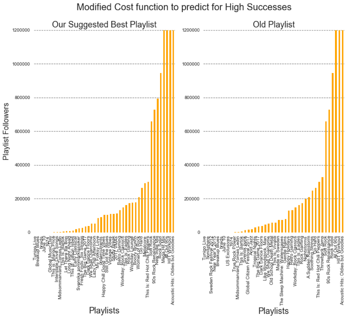
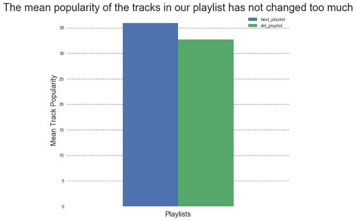
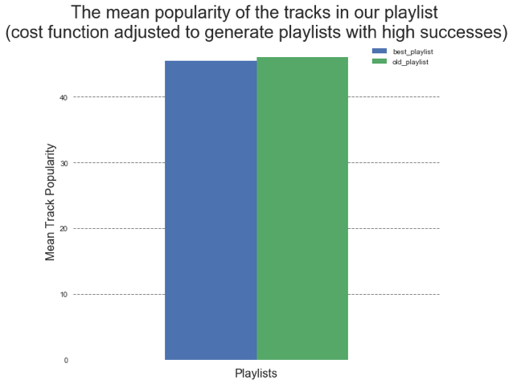

# AC209a Final Report: Predicting playlist success on the Spotify platform

#### Group Members: Max, Erica, and Elmer

Hello, welcome to our website for our data science final project.

 
 
 

## Table of contents
1. [Problem Statement and Motivation](#Problem_Statement)

2. [Introduction and Description of Data](#introduction)

    1. [Introduction](#intro1)

    2. [Exploratory Data Analysis](#EDA)

3. [Literature Review/Related Work](#paragraph2)

4. [Modeling Approach and Project Trajectory](#paragraph2)

5. [Results, Conclusions, and Future Work](#paragraph2)
    1. [Results](#subparagraph1)
    2. [Conclusions](#subparagraph1)
    3. [Future Work](#subparagraph1)

6. [References](#paragraph2)

## 1. Problem Statement and Motivation 
-  Goal: Our primary goal is to construct a predictive model for playlist success (as measured by # of followers).

-  Talk about: Spotify wants to keep users interested in their platform. A way they plan to achieve this is by continuously providing “fresh” content to the user. This keeps the user happy because they are discovering new music they like. 

## 2. Introduction and Description of Data 
### Obtaining raw data through the Spotify API 

Using the python library Spotipy (a python wrapper for the Spotify API), we obtained complete meta-data for 1587 playlists. All of these playlists are playlists published to the Spotify platform directly by Spotify, and thus their associated username was ‘Spotify’. 

When we started exploring the data available through Spotify API in depth, we first found there was information describing the playlist directly, (such as the number of followers, track IDs, or the number of tracks. We then decided that to obtain significant characteristics for prediction we would need to query information about the tracks that comprise the playlist. The extra layers of information we would need to parse are diagramed below in figure 1.

  

Figure 1. A rough schematic of the layers of data available through the spotify API

For each of the 1587 playlists we then obtained the meta-data of following associated information:

- All tracks information associated with each playlist
- All audio features associated with each track
- All artist information associated with each track
- All album information associated with each track

Here is the Jupyter notebook where all audio features were obtained through the Spotify API:  
[ParsingAll_AudioFeatures_120417](notebook_Markdown/ParsingAll_AudioFeatures_120417.html)

For details as to the exact metadata available for each playlist, track, artist, or album refer to the Spotify API Object Model documentation. (https://developer.spotify.com/web-api/object-model/)

After obtaining all the above associated information stored for each playlist, the following 

Engineering predictors from the raw playlist meta data

#### Inferring playlist genre 
A challenge we faced was that the spotify API did not directly provide any genre classification for their playlists. To overcome this we inferred a playlist’s dominant genre by looking at the artist genre’s associated with all tracks in a playlist. We defined a playlist’s dominant genre as the genre that was best represented across all track’s artist’s genres. 
 

  

### 2. Exploratory Data Analysis 

 
This is the distribution of the number of followers for each playlist. We can observe that the distribution is left-skewed, and therefore, requires additional transformations before using it as a response variable. 

 

The Today’s Top Hits is an outlier. It has more than twice the number of followers of RapCavier which is second in number of followers. (Note: there were some playlists that we couldn’t retrieved from spotify api so some of the top playlists may not be present here).

### Exploration of audio features 
 

  

## 3. Literature Review/Related Work 
https://towardsdatascience.com/is-my-spotify-music-boring-an-analysis-involving-music-data-and-machine-learning-47550ae931de 

http://spotipy.readthedocs.io/en/latest/#installation 

https://developer.spotify.com/web-api/tutorial/ 

http://www.sciencedirect.com/science/article/pii/S0020025507004045

https://github.com/perrygeo/simanneal/blob/master/simanneal/anneal.py

## 4. Modeling Approach and Project Trajectory 
Null Model
We started off our project by building a simple null model that simply just uses the average # of followers of the training set as a prediction for any playlist.
We found that this null model performed poorly (Test R^2 = 1e-5) and show no predictive ability.
This provided us with a reference for the performance of a model that uses no predictors. Instead this model is just using the response variables of the training set to predict the response of variables of the test set. 
All the models that we use from here on out are using the attributes we obtained through the Spotify API to. 
If the use of a predictor increases test performance by any amount above R^2 =0 this is an indication that this predictor yields some predictive power.

Very simple baseline model (W/ popularity) 

For the rest of the project we will NOT use any attributes (track, artist, album) that directly tell tell the model anything about popularity or followers. This will result in technically a model with test performance, but we believe that the model that is produced without using popularity/followers will be better identifying attributes that truly make a playlist more popular with users. 

## 5. Results, Conclusions, and Future Work 
### Results 

#### Building a playlist 
##### Introduction 
To suggest a new playlist to a user, we implemented an algorithm called Simulated Annealing. This is a global optimization approach inspired from a concept in statistical physics. The algorithm essentially describes the motion of molecules when it is heated up to large temperature and when the system is cooled. The idea here is that the molecules will reach a global minimum energy point after cooling, and hence, we can use it a global optimization method.  
##### Method 
We can adopt this global minimization algorithm to minimize a predefined cost function (in physics it’ll be the energy of the system defined by the boltzmann distribution). The cost function essentially forces us to incorporate tracks that maximizes the chance of success. For sake of simplicity and computational time, we only used audio features for fitting our model and running this algorithm. We’ve taken a pre-existing code for ‘Simulated Annealing’ and adapted it for playlists generation. 
In this method, we first fit a logistic regression model with our training set, and from our test set, we randomly generate a playlist with about 30-35 tracks in it. We use this playlist and other initial conditions to initiate the algorithm. The algorithm will go through a number of iterations replacing a track in our playlist with another track from our set of remaining tracks. The algorithm will accept the new playlist only if it lowers our cost function. At the end, the algorithm will return a playlist that minimizes the overall cost function. 

##### Results 

 

  

 

  

We can see that our new playlist takes tracks from playlists with relatively low followers if we modify the cost function so that it penalizes more for playlists with large number of followers (blue bar graphs above). We can also see that there are some tracks from the same playlist that was used in the old playlist. This shows that the algorithm doesn’t replace the playlist completely, but I tries to retain certain characters. However, the mean popularity of the tracks in our playlist increased slightly. 
If we adjust the cost function so that it penalizes more when the playlist is not as successful, we can see that the tracks are obtained from playlists with large number of followers. Note: that the initial playlist used for the two cases were different from each other due to kernel restarting.

 

  

 

  

These plots show that regardless of the cost function the algorithm seeks to generate playlists that have similar mean track popularity.

### Conclusion 

### Future Work 
#### Improving our predictive model for playlist success: 
TEXT

#### Building a Playlist: 
The approach we’ve taken was somewhat naive. We worked under the assumption that the spotify user has an eclectic taste for tracks which is why we seeded a randomly generated playlist to our algorithm. In reality, we know individuals want tracks related to the ones they liked. Therefore, for future work, we should limit our tracks we incorporate to our playlist to ones that are related to each other. The similar tracks can be obtained through spotify recommendations or we can take a mathematical approach in which calculate the “distance” between tracks using metrics such as Frobenius Distance. Furthermore, there are several parameters that we can tweak to generate a better playlist such as the “temperature” and “cooling length”. For example, increasing the cooling time will give our system enough time to find the global minimum. Finally, the model we used for generating the playlist just uses a subset of all our features. In the future, we can rerun this algorithm with an expanded feature and also try out different classification models other than the one used in the algorithm.

## Another paragraph 
The second paragraph text
 
 
 
 
 
 
 
 
 
 
 
 
- [Project Overview](pages/overview.html)
- [Data sources/processing](pages/independent_site.html)
- [Exploratory Data Analysis of Spotify Data](pages/user_site.html)
- [Exploratory Data Analysis of Spotify Data](pages/project_site.html)
- [Building a baseline model to predict playlist success](pages/nojekyll.html)
- [Improving out model](pages/local_test.html)
- [Prediction of song genre based on audio features](pages/resources.html)

