# Audio Features Analysis

I am inspired by this blog post: https://towardsdatascience.com/is-my-spotify-music-boring-an-analysis-involving-music-data-and-machine-learning-47550ae931de  

I am going to employ a similar analysis strategy.
        
        


```python
# Import statements
import numpy as np
import pandas as pd
import matplotlib
import spotipy
import spotipy.util as util
import sys
import matplotlib.pyplot as plt
from time import sleep

import seaborn as sns

%matplotlib inline

import ast

import time

from sklearn.manifold import TSNE

from sklearn.ensemble import RandomForestClassifier
from sklearn.ensemble import GradientBoostingClassifier

from sklearn import preprocessing
```


```python
# Create spotify object for API calls
import spotipy
from spotipy.oauth2 import SpotifyClientCredentials

client_credentials_manager = SpotifyClientCredentials(client_id='edecee7ae47c4187a736c1abe70f79fa', 
                                                      client_secret='b3ca8746bdef4cf6810c6ac8e4efb1ff')
sp = spotipy.Spotify(client_credentials_manager=client_credentials_manager)


```


```python
targetUsername = 'spotify'

playlists = sp.user_playlists(targetUsername, limit=50)

```


```python
def getPlayListIDs(username, sp):
    playlists = sp.user_playlists(targetUsername, limit=50)
    allPlaylist_ids = []

    while playlists:
        for i, playlist in enumerate(playlists['items']):

            if playlist['name'] == None:
                #print(playlist)
                continue

            #print("%4d %s %s" % (i + 1 + playlists['offset'], playlist['id'],  playlist['name']))

            allPlaylist_ids.append(playlist["id"])

        if playlists['next']:
            playlists = sp.next(playlists)
        else:
            playlists = None
            
    return allPlaylist_ids
```


```python
allPlaylist_ids = getPlayListIDs('spotify', sp)
```


```python
allPlaylist_ids[0]
```


    '37i9dQZF1DXcBWIGoYBM5M'


```python
TodaysTopHits_ID = allPlaylist_ids[0]

hot_Country_ID = allPlaylist_ids[5]

Viva_Latino_ID = allPlaylist_ids[6]

Peaceful_Piano_ID = allPlaylist_ids[9]
```


```python
Viva_Latino_ID
```


    '37i9dQZF1DX10zKzsJ2jva'


### Define functions to extract Audio Features
https://github.com/juandes/spotify-audio-features-data-experiment/blob/master/get_data.py
    
    


```python
username = targetUsername
playlist_id = TodaysTopHits_ID

offset = 0
songs = []
items = []
track_IDs = []
while True:
    content = sp.user_playlist_tracks(username, playlist_id, fields=None, limit=100, offset=offset, market=None)
    songs += content['items']
    if content['next'] is not None:
        offset += 100
    else:
        break
```


```python
from tqdm import tqdm
```


```python
def getAudioFeatures_FromAllTracksInPlaylist (username, playlist_id):
    ''''''
    print("Getting all track IDs associated with target playlist: \n")
    offset = 0
    songs = []
    items = []
    track_IDs = []
    while True:
        content = sp.user_playlist_tracks(username, playlist_id, fields=None, limit=100, offset=offset, market=None)
        songs += content['items']
        if content['next'] is not None:
            offset += 100
        else:
            break
    
    listOfTrack_AudioFeatures = []

    print("Getting audio features for track:")
    
    for track in tqdm(songs):
        track_Name = track["track"]["name"]     
        track_ID = track["track"]["id"] 


        track_explicit = track["track"]['explicit']


        features = sp.audio_features(track_ID)[0] # Get audio features for this specific track

        track_AudioFeatures = [features['energy'], features['liveness'],
                                  features['tempo'], features['speechiness'],
                                  features['acousticness'], features['instrumentalness'],
                                  features['time_signature'], features['danceability'],
                                  features['key'], features['duration_ms'],
                                  features['loudness'], features['valence'],
                                  features['mode'], features['uri']]


        trackData = ( [ track_Name, track_ID, track_explicit] + track_AudioFeatures )

        listOfTrack_AudioFeatures.append(trackData)


    audioFeaturesDF = pd.DataFrame(listOfTrack_AudioFeatures, 
                                    columns= ["track_name", "track_id", "explicit",
                                               'energy', 'liveness',
                                               'tempo', 'speechiness',
                                               'acousticness', 'instrumentalness',
                                               'time_signature', 'danceability',
                                               'key', 'duration_ms', 'loudness',
                                               'valence', 'mode', 'track_uri'])
    
    
    return audioFeaturesDF
```


```python
topHits_AudioFeatures = getAudioFeatures_FromAllTracksInPlaylist ('spotify', TodaysTopHits_ID)


hot_Country_AudioFeatures = getAudioFeatures_FromAllTracksInPlaylist ('spotify', hot_Country_ID)


Viva_Latino_AudioFeatures = getAudioFeatures_FromAllTracksInPlaylist ('spotify', Viva_Latino_ID)

Peaceful_Piano_AudioFeatures = getAudioFeatures_FromAllTracksInPlaylist ('spotify', Peaceful_Piano_ID)

```

    Getting all track IDs associated with target playlist: 
    


      2%|▏         | 1/50 [00:00<00:08,  5.50it/s]

    Getting audio features for track:


    100%|██████████| 50/50 [00:09<00:00,  5.42it/s]


    Getting all track IDs associated with target playlist: 
    


      2%|▏         | 1/52 [00:00<00:09,  5.65it/s]

    Getting audio features for track:


    100%|██████████| 52/52 [00:09<00:00,  5.36it/s]


    Getting all track IDs associated with target playlist: 
    


      2%|▏         | 1/50 [00:00<00:08,  5.60it/s]

    Getting audio features for track:


    100%|██████████| 50/50 [00:09<00:00,  5.16it/s]


    Getting all track IDs associated with target playlist: 
    


      0%|          | 0/162 [00:00<?, ?it/s]

    Getting audio features for track:


    100%|██████████| 162/162 [00:31<00:00,  5.13it/s]


```python

```


    (52, 18)


```python
print(hot_Country_AudioFeatures.shape)
print(Viva_Latino_AudioFeatures.shape)
print(Peaceful_Piano_AudioFeatures.shape)
```

    (52, 18)
    (50, 18)
    (162, 18)


```python

```


    (162, 18)


```python
Viva_Latino_AudioFeatures.describe()
```


<div>
<style>
    .dataframe thead tr:only-child th {
        text-align: right;
    }

    .dataframe thead th {
        text-align: left;
    }

    .dataframe tbody tr th {
        vertical-align: top;
    }
</style>
<table border="1" class="dataframe">
  <thead>
    <tr style="text-align: right;">
      <th></th>
      <th>energy</th>
      <th>liveness</th>
      <th>tempo</th>
      <th>speechiness</th>
      <th>acousticness</th>
      <th>instrumentalness</th>
      <th>time_signature</th>
      <th>danceability</th>
      <th>key</th>
      <th>duration_ms</th>
      <th>loudness</th>
      <th>valence</th>
      <th>mode</th>
    </tr>
  </thead>
  <tbody>
    <tr>
      <th>count</th>
      <td>50.000000</td>
      <td>50.000000</td>
      <td>50.000000</td>
      <td>50.000000</td>
      <td>50.000000</td>
      <td>50.000000</td>
      <td>50.0</td>
      <td>50.000000</td>
      <td>50.000000</td>
      <td>50.000000</td>
      <td>50.000000</td>
      <td>50.000000</td>
      <td>50.000000</td>
    </tr>
    <tr>
      <th>mean</th>
      <td>0.761240</td>
      <td>0.162910</td>
      <td>119.247580</td>
      <td>0.084734</td>
      <td>0.157854</td>
      <td>0.000158</td>
      <td>4.0</td>
      <td>0.732460</td>
      <td>4.380000</td>
      <td>215499.720000</td>
      <td>-4.840680</td>
      <td>0.665120</td>
      <td>0.600000</td>
    </tr>
    <tr>
      <th>std</th>
      <td>0.115924</td>
      <td>0.108004</td>
      <td>33.377811</td>
      <td>0.043976</td>
      <td>0.119643</td>
      <td>0.000721</td>
      <td>0.0</td>
      <td>0.069825</td>
      <td>3.562217</td>
      <td>26718.382442</td>
      <td>1.500765</td>
      <td>0.180287</td>
      <td>0.494872</td>
    </tr>
    <tr>
      <th>min</th>
      <td>0.477000</td>
      <td>0.049700</td>
      <td>79.987000</td>
      <td>0.031800</td>
      <td>0.010600</td>
      <td>0.000000</td>
      <td>4.0</td>
      <td>0.527000</td>
      <td>0.000000</td>
      <td>173720.000000</td>
      <td>-9.210000</td>
      <td>0.206000</td>
      <td>0.000000</td>
    </tr>
    <tr>
      <th>25%</th>
      <td>0.690250</td>
      <td>0.086975</td>
      <td>94.984000</td>
      <td>0.051125</td>
      <td>0.041450</td>
      <td>0.000000</td>
      <td>4.0</td>
      <td>0.701250</td>
      <td>1.000000</td>
      <td>196139.750000</td>
      <td>-5.710500</td>
      <td>0.556000</td>
      <td>0.000000</td>
    </tr>
    <tr>
      <th>50%</th>
      <td>0.787500</td>
      <td>0.120000</td>
      <td>102.335500</td>
      <td>0.072850</td>
      <td>0.147500</td>
      <td>0.000000</td>
      <td>4.0</td>
      <td>0.738000</td>
      <td>4.000000</td>
      <td>210253.000000</td>
      <td>-4.806000</td>
      <td>0.720500</td>
      <td>1.000000</td>
    </tr>
    <tr>
      <th>75%</th>
      <td>0.854750</td>
      <td>0.252250</td>
      <td>142.969250</td>
      <td>0.102950</td>
      <td>0.225000</td>
      <td>0.000012</td>
      <td>4.0</td>
      <td>0.774750</td>
      <td>6.750000</td>
      <td>229747.500000</td>
      <td>-3.670250</td>
      <td>0.792750</td>
      <td>1.000000</td>
    </tr>
    <tr>
      <th>max</th>
      <td>0.970000</td>
      <td>0.423000</td>
      <td>183.817000</td>
      <td>0.199000</td>
      <td>0.549000</td>
      <td>0.004500</td>
      <td>4.0</td>
      <td>0.909000</td>
      <td>11.000000</td>
      <td>297485.000000</td>
      <td>-1.715000</td>
      <td>0.922000</td>
      <td>1.000000</td>
    </tr>
  </tbody>
</table>
</div>


```python
hot_Country_AudioFeatures.describe()
```


<div>
<style>
    .dataframe thead tr:only-child th {
        text-align: right;
    }

    .dataframe thead th {
        text-align: left;
    }

    .dataframe tbody tr th {
        vertical-align: top;
    }
</style>
<table border="1" class="dataframe">
  <thead>
    <tr style="text-align: right;">
      <th></th>
      <th>energy</th>
      <th>liveness</th>
      <th>tempo</th>
      <th>speechiness</th>
      <th>acousticness</th>
      <th>instrumentalness</th>
      <th>time_signature</th>
      <th>danceability</th>
      <th>key</th>
      <th>duration_ms</th>
      <th>loudness</th>
      <th>valence</th>
      <th>mode</th>
    </tr>
  </thead>
  <tbody>
    <tr>
      <th>count</th>
      <td>52.000000</td>
      <td>52.000000</td>
      <td>52.000000</td>
      <td>52.000000</td>
      <td>52.000000</td>
      <td>52.000000</td>
      <td>52.0</td>
      <td>52.000000</td>
      <td>52.000000</td>
      <td>52.000000</td>
      <td>52.000000</td>
      <td>52.000000</td>
      <td>52.000000</td>
    </tr>
    <tr>
      <th>mean</th>
      <td>0.706231</td>
      <td>0.148637</td>
      <td>118.156308</td>
      <td>0.042362</td>
      <td>0.166265</td>
      <td>0.000018</td>
      <td>4.0</td>
      <td>0.597327</td>
      <td>5.807692</td>
      <td>195403.230769</td>
      <td>-5.942077</td>
      <td>0.581635</td>
      <td>0.903846</td>
    </tr>
    <tr>
      <th>std</th>
      <td>0.143658</td>
      <td>0.080038</td>
      <td>31.635135</td>
      <td>0.017265</td>
      <td>0.172263</td>
      <td>0.000086</td>
      <td>0.0</td>
      <td>0.091834</td>
      <td>3.272215</td>
      <td>23648.101987</td>
      <td>1.738029</td>
      <td>0.161357</td>
      <td>0.297678</td>
    </tr>
    <tr>
      <th>min</th>
      <td>0.346000</td>
      <td>0.059700</td>
      <td>76.020000</td>
      <td>0.023700</td>
      <td>0.000907</td>
      <td>0.000000</td>
      <td>4.0</td>
      <td>0.336000</td>
      <td>0.000000</td>
      <td>149293.000000</td>
      <td>-11.409000</td>
      <td>0.230000</td>
      <td>0.000000</td>
    </tr>
    <tr>
      <th>25%</th>
      <td>0.625000</td>
      <td>0.091700</td>
      <td>91.984750</td>
      <td>0.030525</td>
      <td>0.043575</td>
      <td>0.000000</td>
      <td>4.0</td>
      <td>0.550500</td>
      <td>4.000000</td>
      <td>180065.750000</td>
      <td>-6.952000</td>
      <td>0.493000</td>
      <td>1.000000</td>
    </tr>
    <tr>
      <th>50%</th>
      <td>0.721500</td>
      <td>0.116500</td>
      <td>112.037000</td>
      <td>0.035450</td>
      <td>0.110000</td>
      <td>0.000000</td>
      <td>4.0</td>
      <td>0.595000</td>
      <td>6.000000</td>
      <td>192326.500000</td>
      <td>-5.591500</td>
      <td>0.568500</td>
      <td>1.000000</td>
    </tr>
    <tr>
      <th>75%</th>
      <td>0.821750</td>
      <td>0.176250</td>
      <td>142.519750</td>
      <td>0.046050</td>
      <td>0.226250</td>
      <td>0.000000</td>
      <td>4.0</td>
      <td>0.646250</td>
      <td>9.000000</td>
      <td>211681.500000</td>
      <td>-4.794250</td>
      <td>0.680250</td>
      <td>1.000000</td>
    </tr>
    <tr>
      <th>max</th>
      <td>0.935000</td>
      <td>0.473000</td>
      <td>200.054000</td>
      <td>0.093300</td>
      <td>0.751000</td>
      <td>0.000576</td>
      <td>4.0</td>
      <td>0.846000</td>
      <td>11.000000</td>
      <td>265173.000000</td>
      <td>-2.794000</td>
      <td>0.883000</td>
      <td>1.000000</td>
    </tr>
  </tbody>
</table>
</div>


```python
Peaceful_Piano_AudioFeatures.describe()
```


<div>
<style>
    .dataframe thead tr:only-child th {
        text-align: right;
    }

    .dataframe thead th {
        text-align: left;
    }

    .dataframe tbody tr th {
        vertical-align: top;
    }
</style>
<table border="1" class="dataframe">
  <thead>
    <tr style="text-align: right;">
      <th></th>
      <th>energy</th>
      <th>liveness</th>
      <th>tempo</th>
      <th>speechiness</th>
      <th>acousticness</th>
      <th>instrumentalness</th>
      <th>time_signature</th>
      <th>danceability</th>
      <th>key</th>
      <th>duration_ms</th>
      <th>loudness</th>
      <th>valence</th>
      <th>mode</th>
    </tr>
  </thead>
  <tbody>
    <tr>
      <th>count</th>
      <td>162.000000</td>
      <td>162.000000</td>
      <td>162.000000</td>
      <td>162.000000</td>
      <td>162.000000</td>
      <td>162.000000</td>
      <td>162.000000</td>
      <td>162.000000</td>
      <td>162.000000</td>
      <td>162.000000</td>
      <td>162.000000</td>
      <td>162.000000</td>
      <td>162.000000</td>
    </tr>
    <tr>
      <th>mean</th>
      <td>0.076704</td>
      <td>0.111066</td>
      <td>109.237543</td>
      <td>0.046958</td>
      <td>0.987080</td>
      <td>0.909784</td>
      <td>3.586420</td>
      <td>0.379525</td>
      <td>4.944444</td>
      <td>182494.487654</td>
      <td>-23.901062</td>
      <td>0.162366</td>
      <td>0.444444</td>
    </tr>
    <tr>
      <th>std</th>
      <td>0.070006</td>
      <td>0.037794</td>
      <td>33.708073</td>
      <td>0.012521</td>
      <td>0.012511</td>
      <td>0.053427</td>
      <td>0.823906</td>
      <td>0.116592</td>
      <td>3.471714</td>
      <td>76893.096463</td>
      <td>5.054998</td>
      <td>0.125409</td>
      <td>0.498445</td>
    </tr>
    <tr>
      <th>min</th>
      <td>0.002530</td>
      <td>0.049800</td>
      <td>60.419000</td>
      <td>0.026600</td>
      <td>0.903000</td>
      <td>0.586000</td>
      <td>1.000000</td>
      <td>0.134000</td>
      <td>0.000000</td>
      <td>54333.000000</td>
      <td>-39.053000</td>
      <td>0.036000</td>
      <td>0.000000</td>
    </tr>
    <tr>
      <th>25%</th>
      <td>0.025150</td>
      <td>0.093550</td>
      <td>76.116250</td>
      <td>0.038850</td>
      <td>0.987000</td>
      <td>0.899000</td>
      <td>3.000000</td>
      <td>0.303250</td>
      <td>2.000000</td>
      <td>134066.250000</td>
      <td>-27.469750</td>
      <td>0.073350</td>
      <td>0.000000</td>
    </tr>
    <tr>
      <th>50%</th>
      <td>0.054300</td>
      <td>0.104000</td>
      <td>110.570000</td>
      <td>0.044700</td>
      <td>0.991000</td>
      <td>0.922000</td>
      <td>4.000000</td>
      <td>0.374500</td>
      <td>5.000000</td>
      <td>161323.500000</td>
      <td>-23.111500</td>
      <td>0.130000</td>
      <td>0.000000</td>
    </tr>
    <tr>
      <th>75%</th>
      <td>0.107250</td>
      <td>0.116500</td>
      <td>132.932750</td>
      <td>0.051650</td>
      <td>0.994000</td>
      <td>0.937750</td>
      <td>4.000000</td>
      <td>0.448750</td>
      <td>8.000000</td>
      <td>216752.000000</td>
      <td>-20.681000</td>
      <td>0.219000</td>
      <td>1.000000</td>
    </tr>
    <tr>
      <th>max</th>
      <td>0.362000</td>
      <td>0.339000</td>
      <td>209.191000</td>
      <td>0.115000</td>
      <td>0.996000</td>
      <td>0.973000</td>
      <td>5.000000</td>
      <td>0.705000</td>
      <td>11.000000</td>
      <td>589095.000000</td>
      <td>-13.501000</td>
      <td>0.868000</td>
      <td>1.000000</td>
    </tr>
  </tbody>
</table>
</div>


```python
Viva_Latino_AudioFeatures["playlist_Name"] = 0
Peaceful_Piano_AudioFeatures["playlist_Name"] = 1
hot_Country_AudioFeatures["playlist_Name"] = 2
```


```python
Viva_Latino_AudioFeatures["playlist_Name"] = 0
Peaceful_Piano_AudioFeatures["playlist_Name"] = 1
hot_Country_AudioFeatures["playlist_Name"] = 2
udioFeatures_Piano_Latino_Country = pd.concat( [Peaceful_Piano_AudioFeatures, 
                                                 Viva_Latino_AudioFeatures, 
                                                 hot_Country_AudioFeatures] )    


```


```python
Viva_Latino_AudioFeatures["playlist_Name"] = 0
Peaceful_Piano_AudioFeatures["playlist_Name"] = 1

```


```python
audioFeatures_Latino_Piano = pd.concat( [Viva_Latino_AudioFeatures, 
                                         Peaceful_Piano_AudioFeatures] )
```


```python
audioFeatures_Latino_Piano.head()
```


<div>
<style>
    .dataframe thead tr:only-child th {
        text-align: right;
    }

    .dataframe thead th {
        text-align: left;
    }

    .dataframe tbody tr th {
        vertical-align: top;
    }
</style>
<table border="1" class="dataframe">
  <thead>
    <tr style="text-align: right;">
      <th></th>
      <th>track_name</th>
      <th>track_id</th>
      <th>explicit</th>
      <th>energy</th>
      <th>liveness</th>
      <th>tempo</th>
      <th>speechiness</th>
      <th>acousticness</th>
      <th>instrumentalness</th>
      <th>time_signature</th>
      <th>danceability</th>
      <th>key</th>
      <th>duration_ms</th>
      <th>loudness</th>
      <th>valence</th>
      <th>mode</th>
      <th>track_uri</th>
      <th>playlist_Name</th>
    </tr>
  </thead>
  <tbody>
    <tr>
      <th>0</th>
      <td>Corazón</td>
      <td>4lESS6vuruP6a79KWRaQou</td>
      <td>False</td>
      <td>0.768</td>
      <td>0.1620</td>
      <td>98.989</td>
      <td>0.1220</td>
      <td>0.2830</td>
      <td>0.000023</td>
      <td>4</td>
      <td>0.871</td>
      <td>4</td>
      <td>184067</td>
      <td>-5.401</td>
      <td>0.765</td>
      <td>0</td>
      <td>spotify:track:4lESS6vuruP6a79KWRaQou</td>
      <td>0</td>
    </tr>
    <tr>
      <th>1</th>
      <td>Échame La Culpa</td>
      <td>2hl6q70unbviGo3g1R7uFx</td>
      <td>False</td>
      <td>0.889</td>
      <td>0.0925</td>
      <td>96.024</td>
      <td>0.0429</td>
      <td>0.0328</td>
      <td>0.000000</td>
      <td>4</td>
      <td>0.726</td>
      <td>0</td>
      <td>173720</td>
      <td>-3.655</td>
      <td>0.649</td>
      <td>1</td>
      <td>spotify:track:2hl6q70unbviGo3g1R7uFx</td>
      <td>0</td>
    </tr>
    <tr>
      <th>2</th>
      <td>Sensualidad</td>
      <td>5hcisvFMidkMJlElTO9Qmw</td>
      <td>False</td>
      <td>0.681</td>
      <td>0.0962</td>
      <td>140.006</td>
      <td>0.0983</td>
      <td>0.4230</td>
      <td>0.000000</td>
      <td>4</td>
      <td>0.807</td>
      <td>11</td>
      <td>297485</td>
      <td>-6.268</td>
      <td>0.676</td>
      <td>1</td>
      <td>spotify:track:5hcisvFMidkMJlElTO9Qmw</td>
      <td>0</td>
    </tr>
    <tr>
      <th>3</th>
      <td>Me Rehúso</td>
      <td>6Zosz8w6CmdGMZM6p4JlbQ</td>
      <td>False</td>
      <td>0.794</td>
      <td>0.0497</td>
      <td>104.827</td>
      <td>0.0698</td>
      <td>0.0258</td>
      <td>0.000000</td>
      <td>4</td>
      <td>0.746</td>
      <td>1</td>
      <td>205741</td>
      <td>-6.331</td>
      <td>0.447</td>
      <td>1</td>
      <td>spotify:track:6Zosz8w6CmdGMZM6p4JlbQ</td>
      <td>0</td>
    </tr>
    <tr>
      <th>4</th>
      <td>Criminal</td>
      <td>2SmgFAhQkQCQPyBiBxR6Te</td>
      <td>False</td>
      <td>0.806</td>
      <td>0.2550</td>
      <td>79.987</td>
      <td>0.0563</td>
      <td>0.0347</td>
      <td>0.000090</td>
      <td>4</td>
      <td>0.816</td>
      <td>2</td>
      <td>232550</td>
      <td>-3.023</td>
      <td>0.822</td>
      <td>0</td>
      <td>spotify:track:2SmgFAhQkQCQPyBiBxR6Te</td>
      <td>0</td>
    </tr>
  </tbody>
</table>
</div>


```python
Viva_Latino_AudioFeatures["playlist_Name"] = 0
hot_Country_AudioFeatures["playlist_Name"] = 1
```


```python
audioFeatures_Latino_Country = pd.concat( [Viva_Latino_AudioFeatures, 
                                           hot_Country_AudioFeatures] )   
```


```python
# Imports for Log Reg, etc
import pandas as pd
from sklearn.linear_model import SGDClassifier
from sklearn.model_selection import GridSearchCV
from sklearn import metrics

from sklearn.model_selection import train_test_split

from sklearn.linear_model import LogisticRegressionCV
from sklearn.linear_model import LogisticRegression

from sklearn.metrics import roc_curve, auc
```

### Using Logistic Regression to classify tracks as coming from "Viva Latino" or Peaceful Piano


```python
audioFeatures_OfInterest = ['energy', 'liveness',
                            'tempo', 'speechiness',
                            'acousticness', 'instrumentalness',
                            'time_signature', 'danceability',
                            'key', 'loudness', 'valence', 'mode']
```


```python
df = audioFeatures_Latino_Piano

X = df[audioFeatures_OfInterest] # Audio Features
y = df["playlist_Name"] # Playlist labels

X_train, X_test, y_train, y_test = train_test_split(X, y, test_size=0.33, random_state=42)

#regParameters = [1e-4,1e-3,1e-2,1e-1,1,10,100,1000,10000]

LogRed_CV = LogisticRegressionCV(cv=5, penalty='l2')

LogRed_CV.fit(X_train, y_train)

Predictions_LogReg_Train = LogRed_CV.predict(X_train)

Predictions_LogReg_Test = LogRed_CV.predict(X_test)

print("Multiple Logistic Regression Classification: Viva Latino or Peaceful Piano")
print("-------------------------------------")
print("Accuracy on train set:", LogRed_CV.score(X_train, y_train))
print("Accuracy on test set:", LogRed_CV.score(X_test, y_test))


sns.set_context("poster")

fpr_LR, tpr_LR, thresholds_LR = roc_curve(y_test, LogRed_CV.predict_proba(X_test)[:,1])

roc_auc_LR = auc(fpr_LR, tpr_LR)
name_LR = "logistic regression"

fig, ax = plt.subplots(1, 1, figsize=(12, 10))
ax.plot(fpr_LR, tpr_LR, '.-', alpha=0.5, label='ROC curve for %s (AUC = %0.2f)' % (name_LR, roc_auc_LR))


plt.show()

```

    Multiple Logistic Regression Classification: Viva Latino or Peaceful Piano
    -------------------------------------
    Accuracy on train set: 1.0
    Accuracy on test set: 1.0


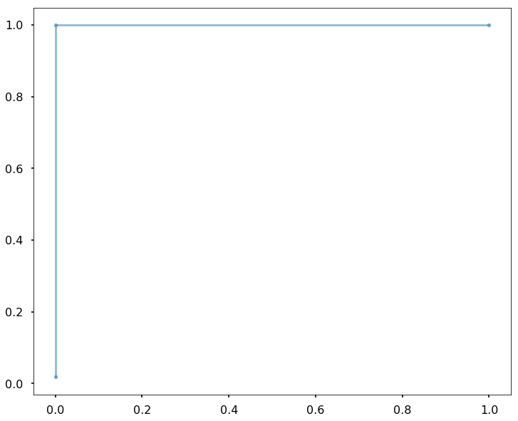


### Using Logistic Regression to classify tracks as coming from "Viva Latino" or Hot Country


```python
df = audioFeatures_Latino_Country

X = df[audioFeatures_OfInterest] # Audio Features
y = df["playlist_Name"] # Playlist labels

X_train, X_test, y_train, y_test = train_test_split(X, y, test_size=0.33, random_state=42)


#regParameters = [1e-4,1e-3,1e-2,1e-1,1,10,100,1000,10000]

LogRed_CV = LogisticRegressionCV(cv=5, penalty='l2')


LogRed_CV.fit(X_train, y_train)

Predictions_LogReg_Train = LogRed_CV.predict(X_train)

Predictions_LogReg_Test = LogRed_CV.predict(X_test)

print("Multiple Logistic Regression Classification: Viva Latino or Hot Country")
print("-------------------------------------")
print("Accuracy on train set:", LogRed_CV.score(X_train, y_train))
print("Accuracy on test set:", LogRed_CV.score(X_test, y_test))


sns.set_context("poster")

fpr_LR, tpr_LR, thresholds_LR = roc_curve(y_test, LogRed_CV.predict_proba(X_test)[:,1])

roc_auc_LR = auc(fpr_LR, tpr_LR)
name_LR = "logistic regression"

fig, ax = plt.subplots(1, 1, figsize=(12, 10))
ax.plot(fpr_LR, tpr_LR, '.-', alpha=0.5, label='ROC curve for %s (AUC = %0.2f)' % (name_LR, roc_auc_LR))


plt.show()

```

    Multiple Logistic Regression Classification: Viva Latino or Hot Country
    -------------------------------------
    Accuracy on train set: 0.897058823529
    Accuracy on test set: 0.852941176471


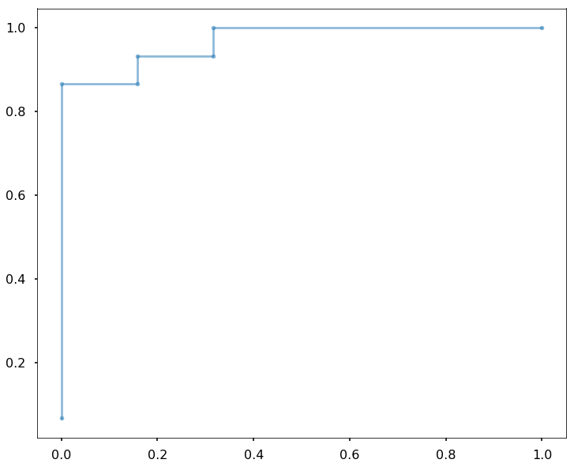


## Using t-SNE to cluster tracks from "Viva Latino" and Peaceful Piano


```python
Playlist_Label = audioFeatures_Latino_Piano["playlist_Name"]

audioFeatures_X = audioFeatures_Latino_Piano[audioFeatures_OfInterest]

tSNE = TSNE(n_components=2, perplexity=10, n_iter=10000)
X_tSNE = tSNE.fit_transform(audioFeatures_X)

```


```python
X_tSNE_Latino = X_tSNE[Playlist_Label == 0]
X_tSNE_Piano = X_tSNE[Playlist_Label == 1]

plt.figure(figsize=(10,10))

plt.scatter(X_tSNE_Latino[:,0], X_tSNE_Latino[:,1], alpha=0.5, label = "Viva Latino!")
plt.scatter(X_tSNE_Piano[:,0], X_tSNE_Piano[:,1], alpha=0.5, label = "PeacefulPiano")


plt.xlabel("tSNE #1")
plt.ylabel("tSNE #2") 
plt.legend()
plt.show()
```


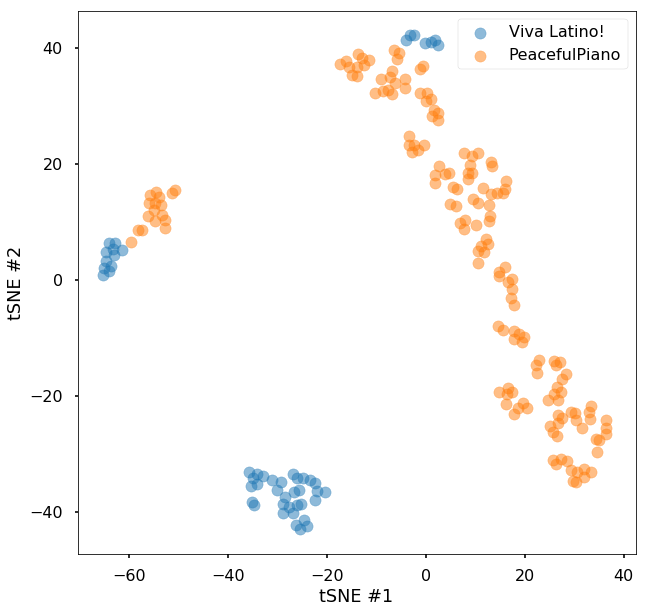


```python
from sklearn.decomposition import PCA

pca = PCA(n_components=2)
X_pca = pca.fit_transform(audioFeatures_X)

```


```python
X_pca_Latino = X_pca[Playlist_Label == 0]
X_pca_Piano = X_pca[Playlist_Label == 1]

plt.figure(figsize=(10,10))

plt.scatter(X_pca_Latino[:,0], X_pca_Latino[:,1], alpha=0.5, label = "Viva Latino!")
plt.scatter(X_pca_Piano[:,0], X_pca_Piano[:,1], alpha=0.5, label = "PeacefulPiano")

plt.title("Principal Component Analysis of Audio Features: Viva Latin vs. Peaceful Piano")
plt.xlabel("Component #1")
plt.ylabel("Component #2") 
plt.legend()
plt.show()
```


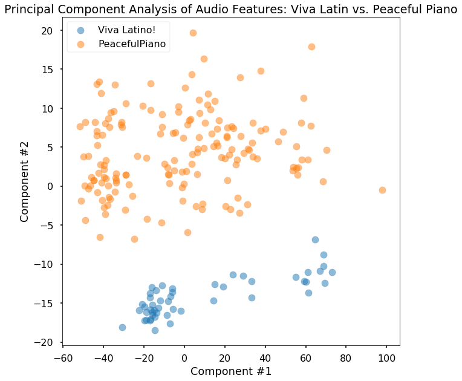


```python
audioFeatures_Latino_Piano
```


<div>
<style>
    .dataframe thead tr:only-child th {
        text-align: right;
    }

    .dataframe thead th {
        text-align: left;
    }

    .dataframe tbody tr th {
        vertical-align: top;
    }
</style>
<table border="1" class="dataframe">
  <thead>
    <tr style="text-align: right;">
      <th></th>
      <th>track_name</th>
      <th>track_id</th>
      <th>explicit</th>
      <th>energy</th>
      <th>liveness</th>
      <th>tempo</th>
      <th>speechiness</th>
      <th>acousticness</th>
      <th>instrumentalness</th>
      <th>time_signature</th>
      <th>danceability</th>
      <th>key</th>
      <th>duration_ms</th>
      <th>loudness</th>
      <th>valence</th>
      <th>mode</th>
      <th>track_uri</th>
      <th>playlist_Name</th>
    </tr>
  </thead>
  <tbody>
    <tr>
      <th>0</th>
      <td>Corazón</td>
      <td>4lESS6vuruP6a79KWRaQou</td>
      <td>False</td>
      <td>0.76800</td>
      <td>0.1620</td>
      <td>98.989</td>
      <td>0.1220</td>
      <td>0.2830</td>
      <td>0.000023</td>
      <td>4</td>
      <td>0.871</td>
      <td>4</td>
      <td>184067</td>
      <td>-5.401</td>
      <td>0.7650</td>
      <td>0</td>
      <td>spotify:track:4lESS6vuruP6a79KWRaQou</td>
      <td>0</td>
    </tr>
    <tr>
      <th>1</th>
      <td>Échame La Culpa</td>
      <td>2hl6q70unbviGo3g1R7uFx</td>
      <td>False</td>
      <td>0.88900</td>
      <td>0.0925</td>
      <td>96.024</td>
      <td>0.0429</td>
      <td>0.0328</td>
      <td>0.000000</td>
      <td>4</td>
      <td>0.726</td>
      <td>0</td>
      <td>173720</td>
      <td>-3.655</td>
      <td>0.6490</td>
      <td>1</td>
      <td>spotify:track:2hl6q70unbviGo3g1R7uFx</td>
      <td>0</td>
    </tr>
    <tr>
      <th>2</th>
      <td>Sensualidad</td>
      <td>5hcisvFMidkMJlElTO9Qmw</td>
      <td>False</td>
      <td>0.68100</td>
      <td>0.0962</td>
      <td>140.006</td>
      <td>0.0983</td>
      <td>0.4230</td>
      <td>0.000000</td>
      <td>4</td>
      <td>0.807</td>
      <td>11</td>
      <td>297485</td>
      <td>-6.268</td>
      <td>0.6760</td>
      <td>1</td>
      <td>spotify:track:5hcisvFMidkMJlElTO9Qmw</td>
      <td>0</td>
    </tr>
    <tr>
      <th>3</th>
      <td>Me Rehúso</td>
      <td>6Zosz8w6CmdGMZM6p4JlbQ</td>
      <td>False</td>
      <td>0.79400</td>
      <td>0.0497</td>
      <td>104.827</td>
      <td>0.0698</td>
      <td>0.0258</td>
      <td>0.000000</td>
      <td>4</td>
      <td>0.746</td>
      <td>1</td>
      <td>205741</td>
      <td>-6.331</td>
      <td>0.4470</td>
      <td>1</td>
      <td>spotify:track:6Zosz8w6CmdGMZM6p4JlbQ</td>
      <td>0</td>
    </tr>
    <tr>
      <th>4</th>
      <td>Criminal</td>
      <td>2SmgFAhQkQCQPyBiBxR6Te</td>
      <td>False</td>
      <td>0.80600</td>
      <td>0.2550</td>
      <td>79.987</td>
      <td>0.0563</td>
      <td>0.0347</td>
      <td>0.000090</td>
      <td>4</td>
      <td>0.816</td>
      <td>2</td>
      <td>232550</td>
      <td>-3.023</td>
      <td>0.8220</td>
      <td>0</td>
      <td>spotify:track:2SmgFAhQkQCQPyBiBxR6Te</td>
      <td>0</td>
    </tr>
    <tr>
      <th>5</th>
      <td>Se Preparó</td>
      <td>3mxWDt0eKXfl4C1e4oIP0J</td>
      <td>False</td>
      <td>0.82100</td>
      <td>0.3110</td>
      <td>171.077</td>
      <td>0.0852</td>
      <td>0.2220</td>
      <td>0.000010</td>
      <td>4</td>
      <td>0.739</td>
      <td>1</td>
      <td>188080</td>
      <td>-4.233</td>
      <td>0.6930</td>
      <td>1</td>
      <td>spotify:track:3mxWDt0eKXfl4C1e4oIP0J</td>
      <td>0</td>
    </tr>
    <tr>
      <th>6</th>
      <td>Havana - Remix</td>
      <td>3whrwq4DtvucphBPUogRuJ</td>
      <td>False</td>
      <td>0.57900</td>
      <td>0.1330</td>
      <td>105.031</td>
      <td>0.0321</td>
      <td>0.3980</td>
      <td>0.000023</td>
      <td>4</td>
      <td>0.751</td>
      <td>2</td>
      <td>199095</td>
      <td>-4.036</td>
      <td>0.3490</td>
      <td>1</td>
      <td>spotify:track:3whrwq4DtvucphBPUogRuJ</td>
      <td>0</td>
    </tr>
    <tr>
      <th>7</th>
      <td>Downtown</td>
      <td>3Ga6eKrUFf12ouh9Yw3v2D</td>
      <td>False</td>
      <td>0.67900</td>
      <td>0.0680</td>
      <td>166.008</td>
      <td>0.1350</td>
      <td>0.1800</td>
      <td>0.000073</td>
      <td>4</td>
      <td>0.775</td>
      <td>4</td>
      <td>193456</td>
      <td>-4.985</td>
      <td>0.6190</td>
      <td>0</td>
      <td>spotify:track:3Ga6eKrUFf12ouh9Yw3v2D</td>
      <td>0</td>
    </tr>
    <tr>
      <th>8</th>
      <td>Perro Fiel</td>
      <td>70lnL3QaSOIIyMa2X9aVRL</td>
      <td>False</td>
      <td>0.76000</td>
      <td>0.0548</td>
      <td>183.817</td>
      <td>0.1980</td>
      <td>0.1870</td>
      <td>0.000000</td>
      <td>4</td>
      <td>0.750</td>
      <td>1</td>
      <td>195213</td>
      <td>-4.836</td>
      <td>0.8930</td>
      <td>1</td>
      <td>spotify:track:70lnL3QaSOIIyMa2X9aVRL</td>
      <td>0</td>
    </tr>
    <tr>
      <th>9</th>
      <td>Mayores</td>
      <td>7JNh1cfm0eXjqFVOzKLyau</td>
      <td>False</td>
      <td>0.85500</td>
      <td>0.0990</td>
      <td>96.989</td>
      <td>0.0436</td>
      <td>0.1410</td>
      <td>0.004500</td>
      <td>4</td>
      <td>0.743</td>
      <td>5</td>
      <td>202453</td>
      <td>-3.976</td>
      <td>0.8710</td>
      <td>0</td>
      <td>spotify:track:7JNh1cfm0eXjqFVOzKLyau</td>
      <td>0</td>
    </tr>
    <tr>
      <th>10</th>
      <td>Déjala Que Vuelva (feat. Manuel Turizo)</td>
      <td>33bnxcjePIkcmNjEFTJX0l</td>
      <td>False</td>
      <td>0.78800</td>
      <td>0.0753</td>
      <td>170.019</td>
      <td>0.0785</td>
      <td>0.0482</td>
      <td>0.000000</td>
      <td>4</td>
      <td>0.681</td>
      <td>1</td>
      <td>220117</td>
      <td>-4.323</td>
      <td>0.8390</td>
      <td>1</td>
      <td>spotify:track:33bnxcjePIkcmNjEFTJX0l</td>
      <td>0</td>
    </tr>
    <tr>
      <th>11</th>
      <td>Por Favor</td>
      <td>0Pki3Th0SL5rJ5e6ShUbJJ</td>
      <td>False</td>
      <td>0.76100</td>
      <td>0.0625</td>
      <td>98.025</td>
      <td>0.0926</td>
      <td>0.2090</td>
      <td>0.000003</td>
      <td>4</td>
      <td>0.752</td>
      <td>2</td>
      <td>199067</td>
      <td>-4.630</td>
      <td>0.6970</td>
      <td>1</td>
      <td>spotify:track:0Pki3Th0SL5rJ5e6ShUbJJ</td>
      <td>0</td>
    </tr>
    <tr>
      <th>12</th>
      <td>Báilame - Remix</td>
      <td>3VClLWqNn80Llv0PJOsKgr</td>
      <td>False</td>
      <td>0.86600</td>
      <td>0.0696</td>
      <td>96.011</td>
      <td>0.0497</td>
      <td>0.2480</td>
      <td>0.000005</td>
      <td>4</td>
      <td>0.791</td>
      <td>6</td>
      <td>217080</td>
      <td>-4.236</td>
      <td>0.7100</td>
      <td>1</td>
      <td>spotify:track:3VClLWqNn80Llv0PJOsKgr</td>
      <td>0</td>
    </tr>
    <tr>
      <th>13</th>
      <td>Que Va</td>
      <td>6J1R5wtPXiHiwiPstOSI56</td>
      <td>False</td>
      <td>0.82800</td>
      <td>0.0601</td>
      <td>90.993</td>
      <td>0.0502</td>
      <td>0.1340</td>
      <td>0.000000</td>
      <td>4</td>
      <td>0.774</td>
      <td>0</td>
      <td>238160</td>
      <td>-3.412</td>
      <td>0.8410</td>
      <td>1</td>
      <td>spotify:track:6J1R5wtPXiHiwiPstOSI56</td>
      <td>0</td>
    </tr>
    <tr>
      <th>14</th>
      <td>Vuelve</td>
      <td>0gCPvo1GkbtPhMqg5Gbx1K</td>
      <td>False</td>
      <td>0.54100</td>
      <td>0.1180</td>
      <td>130.025</td>
      <td>0.0318</td>
      <td>0.1700</td>
      <td>0.000000</td>
      <td>4</td>
      <td>0.728</td>
      <td>1</td>
      <td>279613</td>
      <td>-5.664</td>
      <td>0.2060</td>
      <td>1</td>
      <td>spotify:track:0gCPvo1GkbtPhMqg5Gbx1K</td>
      <td>0</td>
    </tr>
    <tr>
      <th>15</th>
      <td>Felices los 4</td>
      <td>0qYTZCo5Bwh1nsUFGZP3zn</td>
      <td>False</td>
      <td>0.78900</td>
      <td>0.3510</td>
      <td>93.973</td>
      <td>0.1460</td>
      <td>0.2310</td>
      <td>0.000000</td>
      <td>4</td>
      <td>0.755</td>
      <td>5</td>
      <td>229849</td>
      <td>-4.502</td>
      <td>0.7370</td>
      <td>1</td>
      <td>spotify:track:0qYTZCo5Bwh1nsUFGZP3zn</td>
      <td>0</td>
    </tr>
    <tr>
      <th>16</th>
      <td>Suena El Dembow</td>
      <td>0woHVOh3KXLSDv8VU9XwZ4</td>
      <td>False</td>
      <td>0.85400</td>
      <td>0.1210</td>
      <td>91.906</td>
      <td>0.0584</td>
      <td>0.1620</td>
      <td>0.000000</td>
      <td>4</td>
      <td>0.703</td>
      <td>0</td>
      <td>195813</td>
      <td>-4.462</td>
      <td>0.6890</td>
      <td>1</td>
      <td>spotify:track:0woHVOh3KXLSDv8VU9XwZ4</td>
      <td>0</td>
    </tr>
    <tr>
      <th>17</th>
      <td>Bella y Sensual</td>
      <td>0ERbK7qVqveCaBWIiYCrl3</td>
      <td>False</td>
      <td>0.71300</td>
      <td>0.0506</td>
      <td>179.864</td>
      <td>0.0937</td>
      <td>0.2280</td>
      <td>0.000000</td>
      <td>4</td>
      <td>0.635</td>
      <td>11</td>
      <td>204701</td>
      <td>-6.909</td>
      <td>0.7490</td>
      <td>1</td>
      <td>spotify:track:0ERbK7qVqveCaBWIiYCrl3</td>
      <td>0</td>
    </tr>
    <tr>
      <th>18</th>
      <td>Mi Gente</td>
      <td>4ipnJyDU3Lq15qBAYNqlqK</td>
      <td>False</td>
      <td>0.67800</td>
      <td>0.1280</td>
      <td>102.681</td>
      <td>0.0998</td>
      <td>0.0164</td>
      <td>0.000013</td>
      <td>4</td>
      <td>0.535</td>
      <td>11</td>
      <td>189440</td>
      <td>-4.906</td>
      <td>0.2870</td>
      <td>0</td>
      <td>spotify:track:4ipnJyDU3Lq15qBAYNqlqK</td>
      <td>0</td>
    </tr>
    <tr>
      <th>19</th>
      <td>Escápate Conmigo</td>
      <td>2cnKEkpVUSV4wnjQiTWfH6</td>
      <td>False</td>
      <td>0.86400</td>
      <td>0.0853</td>
      <td>92.028</td>
      <td>0.0599</td>
      <td>0.0245</td>
      <td>0.000045</td>
      <td>4</td>
      <td>0.747</td>
      <td>8</td>
      <td>232787</td>
      <td>-3.181</td>
      <td>0.7540</td>
      <td>0</td>
      <td>spotify:track:2cnKEkpVUSV4wnjQiTWfH6</td>
      <td>0</td>
    </tr>
    <tr>
      <th>20</th>
      <td>Robarte un Beso</td>
      <td>4z3GJkrtH97Bj6fRta983T</td>
      <td>False</td>
      <td>0.88400</td>
      <td>0.3610</td>
      <td>95.046</td>
      <td>0.0501</td>
      <td>0.0902</td>
      <td>0.000000</td>
      <td>4</td>
      <td>0.748</td>
      <td>10</td>
      <td>193159</td>
      <td>-3.556</td>
      <td>0.6780</td>
      <td>1</td>
      <td>spotify:track:4z3GJkrtH97Bj6fRta983T</td>
      <td>0</td>
    </tr>
    <tr>
      <th>21</th>
      <td>Ahora Dice</td>
      <td>5LVoGJTyG6fLJgoGkY2QAZ</td>
      <td>False</td>
      <td>0.68900</td>
      <td>0.1230</td>
      <td>144.127</td>
      <td>0.1700</td>
      <td>0.2860</td>
      <td>0.000000</td>
      <td>4</td>
      <td>0.706</td>
      <td>6</td>
      <td>271080</td>
      <td>-5.533</td>
      <td>0.4110</td>
      <td>1</td>
      <td>spotify:track:5LVoGJTyG6fLJgoGkY2QAZ</td>
      <td>0</td>
    </tr>
    <tr>
      <th>22</th>
      <td>3 A.M.</td>
      <td>0yyZN5ASdrYu0XYWFzfxUu</td>
      <td>False</td>
      <td>0.84000</td>
      <td>0.1190</td>
      <td>101.990</td>
      <td>0.0879</td>
      <td>0.0112</td>
      <td>0.000000</td>
      <td>4</td>
      <td>0.702</td>
      <td>0</td>
      <td>183573</td>
      <td>-3.547</td>
      <td>0.6240</td>
      <td>1</td>
      <td>spotify:track:0yyZN5ASdrYu0XYWFzfxUu</td>
      <td>0</td>
    </tr>
    <tr>
      <th>23</th>
      <td>Bonita</td>
      <td>693iqPOQvhI7PobtR8CC8v</td>
      <td>False</td>
      <td>0.86800</td>
      <td>0.2900</td>
      <td>96.042</td>
      <td>0.0400</td>
      <td>0.0106</td>
      <td>0.002520</td>
      <td>4</td>
      <td>0.782</td>
      <td>5</td>
      <td>265747</td>
      <td>-1.715</td>
      <td>0.8840</td>
      <td>0</td>
      <td>spotify:track:693iqPOQvhI7PobtR8CC8v</td>
      <td>0</td>
    </tr>
    <tr>
      <th>24</th>
      <td>SUTRA</td>
      <td>6ELe1Do1bYtaCtLqjYTglW</td>
      <td>False</td>
      <td>0.74500</td>
      <td>0.1510</td>
      <td>180.123</td>
      <td>0.1460</td>
      <td>0.0507</td>
      <td>0.000002</td>
      <td>4</td>
      <td>0.747</td>
      <td>9</td>
      <td>203853</td>
      <td>-3.335</td>
      <td>0.8050</td>
      <td>1</td>
      <td>spotify:track:6ELe1Do1bYtaCtLqjYTglW</td>
      <td>0</td>
    </tr>
    <tr>
      <th>25</th>
      <td>Explícale</td>
      <td>48yAM9xWBwT4Ac9G1y20rw</td>
      <td>False</td>
      <td>0.69000</td>
      <td>0.1030</td>
      <td>125.086</td>
      <td>0.1480</td>
      <td>0.0583</td>
      <td>0.000000</td>
      <td>4</td>
      <td>0.808</td>
      <td>1</td>
      <td>223147</td>
      <td>-4.151</td>
      <td>0.6400</td>
      <td>1</td>
      <td>spotify:track:48yAM9xWBwT4Ac9G1y20rw</td>
      <td>0</td>
    </tr>
    <tr>
      <th>26</th>
      <td>Una Lady Como Tú</td>
      <td>7MHN1aCFtLXjownGhvEQlF</td>
      <td>False</td>
      <td>0.47700</td>
      <td>0.3490</td>
      <td>94.983</td>
      <td>0.0434</td>
      <td>0.5490</td>
      <td>0.000000</td>
      <td>4</td>
      <td>0.788</td>
      <td>4</td>
      <td>213027</td>
      <td>-7.348</td>
      <td>0.8600</td>
      <td>1</td>
      <td>spotify:track:7MHN1aCFtLXjownGhvEQlF</td>
      <td>0</td>
    </tr>
    <tr>
      <th>27</th>
      <td>Como Antes</td>
      <td>5YzA563GXTuwQaRq24z1k5</td>
      <td>False</td>
      <td>0.87600</td>
      <td>0.3940</td>
      <td>94.987</td>
      <td>0.1720</td>
      <td>0.1820</td>
      <td>0.000000</td>
      <td>4</td>
      <td>0.813</td>
      <td>1</td>
      <td>210773</td>
      <td>-4.278</td>
      <td>0.7460</td>
      <td>0</td>
      <td>spotify:track:5YzA563GXTuwQaRq24z1k5</td>
      <td>0</td>
    </tr>
    <tr>
      <th>28</th>
      <td>Mi Gente (feat. Beyoncé)</td>
      <td>7fwXWKdDNI5IutOMc5OKYw</td>
      <td>False</td>
      <td>0.71400</td>
      <td>0.2530</td>
      <td>104.996</td>
      <td>0.0792</td>
      <td>0.0249</td>
      <td>0.000000</td>
      <td>4</td>
      <td>0.705</td>
      <td>11</td>
      <td>209733</td>
      <td>-6.390</td>
      <td>0.4340</td>
      <td>0</td>
      <td>spotify:track:7fwXWKdDNI5IutOMc5OKYw</td>
      <td>0</td>
    </tr>
    <tr>
      <th>29</th>
      <td>Hey DJ</td>
      <td>209gZgcfLq2aUuu51vOWBl</td>
      <td>False</td>
      <td>0.81900</td>
      <td>0.3890</td>
      <td>89.980</td>
      <td>0.0867</td>
      <td>0.0309</td>
      <td>0.000000</td>
      <td>4</td>
      <td>0.792</td>
      <td>5</td>
      <td>205520</td>
      <td>-5.418</td>
      <td>0.4330</td>
      <td>1</td>
      <td>spotify:track:209gZgcfLq2aUuu51vOWBl</td>
      <td>0</td>
    </tr>
    <tr>
      <th>...</th>
      <td>...</td>
      <td>...</td>
      <td>...</td>
      <td>...</td>
      <td>...</td>
      <td>...</td>
      <td>...</td>
      <td>...</td>
      <td>...</td>
      <td>...</td>
      <td>...</td>
      <td>...</td>
      <td>...</td>
      <td>...</td>
      <td>...</td>
      <td>...</td>
      <td>...</td>
      <td>...</td>
    </tr>
    <tr>
      <th>132</th>
      <td>Tristane</td>
      <td>0nPZeEqDdrGiljPZliz8fm</td>
      <td>False</td>
      <td>0.14100</td>
      <td>0.1040</td>
      <td>147.524</td>
      <td>0.0654</td>
      <td>0.9840</td>
      <td>0.659000</td>
      <td>4</td>
      <td>0.448</td>
      <td>10</td>
      <td>134265</td>
      <td>-20.929</td>
      <td>0.2000</td>
      <td>0</td>
      <td>spotify:track:0nPZeEqDdrGiljPZliz8fm</td>
      <td>1</td>
    </tr>
    <tr>
      <th>133</th>
      <td>Song for A</td>
      <td>181ybi6b0dYJBcQzETKv67</td>
      <td>False</td>
      <td>0.00472</td>
      <td>0.0712</td>
      <td>81.181</td>
      <td>0.0531</td>
      <td>0.9920</td>
      <td>0.938000</td>
      <td>4</td>
      <td>0.466</td>
      <td>5</td>
      <td>145812</td>
      <td>-28.546</td>
      <td>0.2330</td>
      <td>1</td>
      <td>spotify:track:181ybi6b0dYJBcQzETKv67</td>
      <td>1</td>
    </tr>
    <tr>
      <th>134</th>
      <td>The Approaching Night</td>
      <td>4eoDPVbSx04PlypRDwjsXk</td>
      <td>False</td>
      <td>0.10100</td>
      <td>0.1000</td>
      <td>93.079</td>
      <td>0.0428</td>
      <td>0.9920</td>
      <td>0.915000</td>
      <td>4</td>
      <td>0.427</td>
      <td>9</td>
      <td>399667</td>
      <td>-23.867</td>
      <td>0.0929</td>
      <td>0</td>
      <td>spotify:track:4eoDPVbSx04PlypRDwjsXk</td>
      <td>1</td>
    </tr>
    <tr>
      <th>135</th>
      <td>Written on the Sky</td>
      <td>02xmGU9unopKjpblPRC67j</td>
      <td>False</td>
      <td>0.11700</td>
      <td>0.1110</td>
      <td>125.288</td>
      <td>0.0511</td>
      <td>0.9920</td>
      <td>0.909000</td>
      <td>3</td>
      <td>0.373</td>
      <td>10</td>
      <td>99867</td>
      <td>-25.222</td>
      <td>0.1890</td>
      <td>0</td>
      <td>spotify:track:02xmGU9unopKjpblPRC67j</td>
      <td>1</td>
    </tr>
    <tr>
      <th>136</th>
      <td>Time Spent</td>
      <td>3ZLzPbSOw4OfVqa5zyEWCu</td>
      <td>False</td>
      <td>0.08940</td>
      <td>0.1640</td>
      <td>72.983</td>
      <td>0.0266</td>
      <td>0.9900</td>
      <td>0.937000</td>
      <td>4</td>
      <td>0.389</td>
      <td>4</td>
      <td>129773</td>
      <td>-24.719</td>
      <td>0.1700</td>
      <td>0</td>
      <td>spotify:track:3ZLzPbSOw4OfVqa5zyEWCu</td>
      <td>1</td>
    </tr>
    <tr>
      <th>137</th>
      <td>Squares of life</td>
      <td>2C6BCDdtYjbbbAucqaw9NG</td>
      <td>False</td>
      <td>0.01020</td>
      <td>0.0919</td>
      <td>71.967</td>
      <td>0.0386</td>
      <td>0.9930</td>
      <td>0.918000</td>
      <td>4</td>
      <td>0.270</td>
      <td>11</td>
      <td>165035</td>
      <td>-22.340</td>
      <td>0.0600</td>
      <td>0</td>
      <td>spotify:track:2C6BCDdtYjbbbAucqaw9NG</td>
      <td>1</td>
    </tr>
    <tr>
      <th>138</th>
      <td>Le onde</td>
      <td>6sEz1Cd0HVXRXuvIw9zAmK</td>
      <td>False</td>
      <td>0.12700</td>
      <td>0.0932</td>
      <td>119.504</td>
      <td>0.0579</td>
      <td>0.9820</td>
      <td>0.846000</td>
      <td>3</td>
      <td>0.233</td>
      <td>2</td>
      <td>323933</td>
      <td>-28.498</td>
      <td>0.0453</td>
      <td>1</td>
      <td>spotify:track:6sEz1Cd0HVXRXuvIw9zAmK</td>
      <td>1</td>
    </tr>
    <tr>
      <th>139</th>
      <td>Old Friends</td>
      <td>77q2I17hdHukGdJJpxYOke</td>
      <td>False</td>
      <td>0.12300</td>
      <td>0.1030</td>
      <td>74.240</td>
      <td>0.0675</td>
      <td>0.9920</td>
      <td>0.924000</td>
      <td>4</td>
      <td>0.498</td>
      <td>0</td>
      <td>295250</td>
      <td>-20.059</td>
      <td>0.1660</td>
      <td>1</td>
      <td>spotify:track:77q2I17hdHukGdJJpxYOke</td>
      <td>1</td>
    </tr>
    <tr>
      <th>140</th>
      <td>Tail Lights</td>
      <td>38Li7bOUatKi99v9U4FqOo</td>
      <td>False</td>
      <td>0.24100</td>
      <td>0.0964</td>
      <td>113.634</td>
      <td>0.0322</td>
      <td>0.9720</td>
      <td>0.879000</td>
      <td>3</td>
      <td>0.351</td>
      <td>8</td>
      <td>206813</td>
      <td>-27.069</td>
      <td>0.2360</td>
      <td>1</td>
      <td>spotify:track:38Li7bOUatKi99v9U4FqOo</td>
      <td>1</td>
    </tr>
    <tr>
      <th>141</th>
      <td>Kyiv</td>
      <td>7aOuRnqDQQOaXwgeVY0YBp</td>
      <td>False</td>
      <td>0.12200</td>
      <td>0.0913</td>
      <td>172.837</td>
      <td>0.0358</td>
      <td>0.9730</td>
      <td>0.941000</td>
      <td>4</td>
      <td>0.346</td>
      <td>2</td>
      <td>183307</td>
      <td>-19.750</td>
      <td>0.8060</td>
      <td>0</td>
      <td>spotify:track:7aOuRnqDQQOaXwgeVY0YBp</td>
      <td>1</td>
    </tr>
    <tr>
      <th>142</th>
      <td>Orfeo et Eurydice: Mélodie for Piano Solo</td>
      <td>3DnLGuX4YU3PGein8vo5Zt</td>
      <td>False</td>
      <td>0.00506</td>
      <td>0.0643</td>
      <td>70.188</td>
      <td>0.0528</td>
      <td>0.9950</td>
      <td>0.933000</td>
      <td>5</td>
      <td>0.440</td>
      <td>2</td>
      <td>284640</td>
      <td>-35.112</td>
      <td>0.1150</td>
      <td>0</td>
      <td>spotify:track:3DnLGuX4YU3PGein8vo5Zt</td>
      <td>1</td>
    </tr>
    <tr>
      <th>143</th>
      <td>Sustain</td>
      <td>12ZrUYjD11STbDbPUt8BBY</td>
      <td>False</td>
      <td>0.22900</td>
      <td>0.1520</td>
      <td>209.191</td>
      <td>0.0648</td>
      <td>0.9880</td>
      <td>0.925000</td>
      <td>4</td>
      <td>0.257</td>
      <td>0</td>
      <td>146273</td>
      <td>-14.015</td>
      <td>0.0841</td>
      <td>0</td>
      <td>spotify:track:12ZrUYjD11STbDbPUt8BBY</td>
      <td>1</td>
    </tr>
    <tr>
      <th>144</th>
      <td>Meadow Mornings</td>
      <td>5QcpXwGONi7bKyphLwySs5</td>
      <td>False</td>
      <td>0.00253</td>
      <td>0.0954</td>
      <td>128.994</td>
      <td>0.0492</td>
      <td>0.9940</td>
      <td>0.948000</td>
      <td>1</td>
      <td>0.367</td>
      <td>9</td>
      <td>138820</td>
      <td>-26.785</td>
      <td>0.2280</td>
      <td>0</td>
      <td>spotify:track:5QcpXwGONi7bKyphLwySs5</td>
      <td>1</td>
    </tr>
    <tr>
      <th>145</th>
      <td>Summer Waltz / The Drive</td>
      <td>4FSCzl1G0xzaaE6hiNELv4</td>
      <td>False</td>
      <td>0.09460</td>
      <td>0.1400</td>
      <td>145.596</td>
      <td>0.0473</td>
      <td>0.9690</td>
      <td>0.877000</td>
      <td>3</td>
      <td>0.336</td>
      <td>0</td>
      <td>90093</td>
      <td>-21.595</td>
      <td>0.2440</td>
      <td>1</td>
      <td>spotify:track:4FSCzl1G0xzaaE6hiNELv4</td>
      <td>1</td>
    </tr>
    <tr>
      <th>146</th>
      <td>River Running</td>
      <td>2C9AXrdWbRl1qd7z5oLRgm</td>
      <td>False</td>
      <td>0.20500</td>
      <td>0.0909</td>
      <td>69.435</td>
      <td>0.0608</td>
      <td>0.9880</td>
      <td>0.887000</td>
      <td>4</td>
      <td>0.433</td>
      <td>7</td>
      <td>221562</td>
      <td>-14.938</td>
      <td>0.1320</td>
      <td>1</td>
      <td>spotify:track:2C9AXrdWbRl1qd7z5oLRgm</td>
      <td>1</td>
    </tr>
    <tr>
      <th>147</th>
      <td>Solitude Hymns</td>
      <td>37OB3SoyxFzsTzEIrCYkG0</td>
      <td>False</td>
      <td>0.10800</td>
      <td>0.1040</td>
      <td>118.084</td>
      <td>0.0370</td>
      <td>0.9930</td>
      <td>0.857000</td>
      <td>4</td>
      <td>0.313</td>
      <td>5</td>
      <td>188355</td>
      <td>-23.401</td>
      <td>0.1190</td>
      <td>1</td>
      <td>spotify:track:37OB3SoyxFzsTzEIrCYkG0</td>
      <td>1</td>
    </tr>
    <tr>
      <th>148</th>
      <td>I Promise</td>
      <td>2L8ZiTLLejiY9O7qhhoday</td>
      <td>False</td>
      <td>0.24800</td>
      <td>0.1290</td>
      <td>60.419</td>
      <td>0.0461</td>
      <td>0.9720</td>
      <td>0.650000</td>
      <td>4</td>
      <td>0.304</td>
      <td>11</td>
      <td>265142</td>
      <td>-29.531</td>
      <td>0.1250</td>
      <td>1</td>
      <td>spotify:track:2L8ZiTLLejiY9O7qhhoday</td>
      <td>1</td>
    </tr>
    <tr>
      <th>149</th>
      <td>At Night</td>
      <td>4QGD0QyFrCOOplMtVGNFiE</td>
      <td>False</td>
      <td>0.19100</td>
      <td>0.1130</td>
      <td>131.900</td>
      <td>0.0338</td>
      <td>0.9880</td>
      <td>0.924000</td>
      <td>3</td>
      <td>0.367</td>
      <td>3</td>
      <td>163200</td>
      <td>-15.824</td>
      <td>0.1590</td>
      <td>0</td>
      <td>spotify:track:4QGD0QyFrCOOplMtVGNFiE</td>
      <td>1</td>
    </tr>
    <tr>
      <th>150</th>
      <td>Quiet Resource</td>
      <td>5FoZCDCl6WhrAIm4Ygyjg7</td>
      <td>False</td>
      <td>0.02050</td>
      <td>0.0962</td>
      <td>68.983</td>
      <td>0.0425</td>
      <td>0.9950</td>
      <td>0.930000</td>
      <td>1</td>
      <td>0.349</td>
      <td>5</td>
      <td>207349</td>
      <td>-26.793</td>
      <td>0.0396</td>
      <td>1</td>
      <td>spotify:track:5FoZCDCl6WhrAIm4Ygyjg7</td>
      <td>1</td>
    </tr>
    <tr>
      <th>151</th>
      <td>Rays of Hope</td>
      <td>4RuYDrJ4a2ybcEVkSy1xFB</td>
      <td>False</td>
      <td>0.05840</td>
      <td>0.1000</td>
      <td>143.786</td>
      <td>0.0322</td>
      <td>0.9910</td>
      <td>0.946000</td>
      <td>3</td>
      <td>0.222</td>
      <td>2</td>
      <td>121045</td>
      <td>-22.440</td>
      <td>0.0471</td>
      <td>0</td>
      <td>spotify:track:4RuYDrJ4a2ybcEVkSy1xFB</td>
      <td>1</td>
    </tr>
    <tr>
      <th>152</th>
      <td>My Piano Night</td>
      <td>31dgOyBLg64GEgdbsBjwXy</td>
      <td>False</td>
      <td>0.02050</td>
      <td>0.1100</td>
      <td>109.130</td>
      <td>0.0487</td>
      <td>0.9490</td>
      <td>0.934000</td>
      <td>4</td>
      <td>0.404</td>
      <td>0</td>
      <td>285309</td>
      <td>-29.908</td>
      <td>0.0371</td>
      <td>0</td>
      <td>spotify:track:31dgOyBLg64GEgdbsBjwXy</td>
      <td>1</td>
    </tr>
    <tr>
      <th>153</th>
      <td>Liberations</td>
      <td>3tBSK5WCWFTa5SZ5uelB4P</td>
      <td>False</td>
      <td>0.09490</td>
      <td>0.0898</td>
      <td>78.027</td>
      <td>0.0412</td>
      <td>0.9940</td>
      <td>0.931000</td>
      <td>3</td>
      <td>0.606</td>
      <td>1</td>
      <td>142031</td>
      <td>-21.652</td>
      <td>0.1240</td>
      <td>0</td>
      <td>spotify:track:3tBSK5WCWFTa5SZ5uelB4P</td>
      <td>1</td>
    </tr>
    <tr>
      <th>154</th>
      <td>Moods of the Valley</td>
      <td>1yarqgJfk6Mb93UV7qsKGE</td>
      <td>False</td>
      <td>0.10200</td>
      <td>0.1060</td>
      <td>137.699</td>
      <td>0.0478</td>
      <td>0.9930</td>
      <td>0.941000</td>
      <td>4</td>
      <td>0.424</td>
      <td>6</td>
      <td>227472</td>
      <td>-21.383</td>
      <td>0.1040</td>
      <td>1</td>
      <td>spotify:track:1yarqgJfk6Mb93UV7qsKGE</td>
      <td>1</td>
    </tr>
    <tr>
      <th>155</th>
      <td>To the Sky (Moderate)</td>
      <td>71pCkKd9FwWQSgJIuPmrDt</td>
      <td>False</td>
      <td>0.07780</td>
      <td>0.0775</td>
      <td>60.583</td>
      <td>0.0443</td>
      <td>0.9880</td>
      <td>0.894000</td>
      <td>4</td>
      <td>0.315</td>
      <td>9</td>
      <td>276795</td>
      <td>-19.953</td>
      <td>0.0381</td>
      <td>0</td>
      <td>spotify:track:71pCkKd9FwWQSgJIuPmrDt</td>
      <td>1</td>
    </tr>
    <tr>
      <th>156</th>
      <td>Phase One</td>
      <td>7qllArIuXeYNDfc6j9ANqj</td>
      <td>False</td>
      <td>0.36200</td>
      <td>0.1130</td>
      <td>93.053</td>
      <td>0.0275</td>
      <td>0.9630</td>
      <td>0.953000</td>
      <td>4</td>
      <td>0.365</td>
      <td>1</td>
      <td>123160</td>
      <td>-16.292</td>
      <td>0.1080</td>
      <td>0</td>
      <td>spotify:track:7qllArIuXeYNDfc6j9ANqj</td>
      <td>1</td>
    </tr>
    <tr>
      <th>157</th>
      <td>Pinô</td>
      <td>2Ai5UUXyxaulVbompgrzlo</td>
      <td>False</td>
      <td>0.04530</td>
      <td>0.1120</td>
      <td>80.743</td>
      <td>0.0378</td>
      <td>0.9950</td>
      <td>0.927000</td>
      <td>4</td>
      <td>0.494</td>
      <td>5</td>
      <td>165995</td>
      <td>-28.914</td>
      <td>0.1030</td>
      <td>1</td>
      <td>spotify:track:2Ai5UUXyxaulVbompgrzlo</td>
      <td>1</td>
    </tr>
    <tr>
      <th>158</th>
      <td>Summer's End</td>
      <td>5EfJGWuhGsdTJaNyIarvCi</td>
      <td>False</td>
      <td>0.09260</td>
      <td>0.1050</td>
      <td>167.974</td>
      <td>0.0401</td>
      <td>0.9870</td>
      <td>0.926000</td>
      <td>4</td>
      <td>0.303</td>
      <td>5</td>
      <td>213387</td>
      <td>-18.854</td>
      <td>0.3230</td>
      <td>0</td>
      <td>spotify:track:5EfJGWuhGsdTJaNyIarvCi</td>
      <td>1</td>
    </tr>
    <tr>
      <th>159</th>
      <td>Arctic Tern</td>
      <td>3guxwqIaamTCMA0rXL5uKj</td>
      <td>False</td>
      <td>0.00458</td>
      <td>0.0920</td>
      <td>175.166</td>
      <td>0.0464</td>
      <td>0.9940</td>
      <td>0.923000</td>
      <td>4</td>
      <td>0.134</td>
      <td>8</td>
      <td>144500</td>
      <td>-33.929</td>
      <td>0.0863</td>
      <td>0</td>
      <td>spotify:track:3guxwqIaamTCMA0rXL5uKj</td>
      <td>1</td>
    </tr>
    <tr>
      <th>160</th>
      <td>Some</td>
      <td>2TkGYqnVFS0T5u2PYN6JQS</td>
      <td>False</td>
      <td>0.00289</td>
      <td>0.0747</td>
      <td>95.641</td>
      <td>0.0460</td>
      <td>0.9760</td>
      <td>0.933000</td>
      <td>5</td>
      <td>0.333</td>
      <td>5</td>
      <td>253911</td>
      <td>-33.467</td>
      <td>0.1910</td>
      <td>1</td>
      <td>spotify:track:2TkGYqnVFS0T5u2PYN6JQS</td>
      <td>1</td>
    </tr>
    <tr>
      <th>161</th>
      <td>La Mer</td>
      <td>76uQrmsyHQjqLS6YaDLK6X</td>
      <td>False</td>
      <td>0.12800</td>
      <td>0.0902</td>
      <td>110.401</td>
      <td>0.0586</td>
      <td>0.9930</td>
      <td>0.898000</td>
      <td>5</td>
      <td>0.428</td>
      <td>9</td>
      <td>270485</td>
      <td>-21.204</td>
      <td>0.0782</td>
      <td>0</td>
      <td>spotify:track:76uQrmsyHQjqLS6YaDLK6X</td>
      <td>1</td>
    </tr>
  </tbody>
</table>
<p>212 rows × 18 columns</p>
</div>


```python
X_Latino = audioFeatures_Latino_Piano[Playlist_Label == 0][["energy", "danceability"] ]
X_Piano = audioFeatures_Latino_Piano[Playlist_Label == 1][["energy", "danceability"] ]

plt.figure(figsize=(10,10))

plt.scatter(X_Latino["energy"], X_Latino["danceability"], alpha=0.5, label = "Viva Latino!")
plt.scatter(X_Piano["energy"], X_Piano["danceability"], alpha=0.5, label = "PeacefulPiano")


plt.xlabel("energy")
plt.ylabel("danceability") 
plt.legend()
plt.show()
```


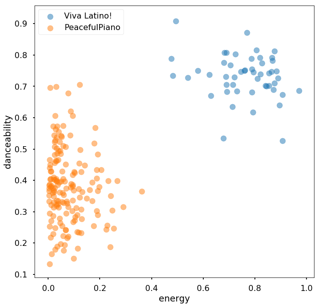


## Using t-SNE to cluster tracks from "Viva Latino" and Hot Country


```python
Playlist_Label = audioFeatures_Latino_Country["playlist_Name"]

audioFeatures_X = audioFeatures_Latino_Country[audioFeatures_OfInterest]

tSNE = TSNE(n_components=2, perplexity=5, n_iter=10000)
X_tSNE = tSNE.fit_transform(audioFeatures_X)
X_tSNE = tSNE.fit_transform(preprocessing.scale(audioFeatures_X))

```


```python
X_tSNE_Latino = X_tSNE[Playlist_Label == 0]
X_tSNE_Country = X_tSNE[Playlist_Label == 1]

plt.figure(figsize=(10,10))

plt.scatter(X_tSNE_Latino[:,0], X_tSNE_Latino[:,1], alpha=0.5, label = "Viva Latino!")
plt.scatter(X_tSNE_Country[:,0], X_tSNE_Country[:,1], alpha=0.5, label = "Hot Country")


plt.xlabel("tSNE #1")
plt.ylabel("tSNE #2") 
plt.legend()
plt.show()
```


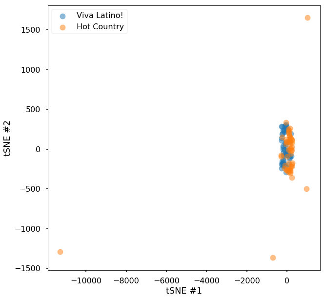


```python
from sklearn.decomposition import PCA

pca = PCA(n_components=2)
X_pca = pca.fit_transform(audioFeatures_X)
X_pca_std = pca.fit_transform(preprocessing.scale(audioFeatures_X) )
```


```python
X_pca_Latino_std = X_pca_std[Playlist_Label == 0]
X_pca_Country_std = X_pca_std[Playlist_Label == 1]

plt.figure(figsize=(10,10))

plt.scatter(X_pca_Latino_std[:,0], X_pca_Latino_std[:,1], alpha=0.5, label = "Viva Latino!")
plt.scatter(X_pca_Country_std[:,0], X_pca_Country_std[:,1], alpha=0.5, label = "Hot Country")

plt.title("Principal Component Analysis of Audio Features: Latin Pop vs. Country")

plt.xlabel("Component #1")
plt.ylabel("Component #2") 
plt.legend()
plt.show()
```


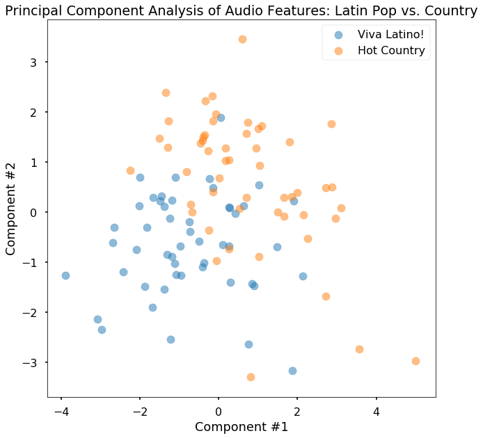


```python
X_pca_Latino = X_pca[Playlist_Label == 0]
X_pca_Country = X_pca[Playlist_Label == 1]

plt.figure(figsize=(10,10))

plt.scatter(X_pca_Latino[:,0], X_pca_Latino[:,1], alpha=0.5, label = "Viva Latino!")
plt.scatter(X_pca_Country[:,0], X_pca_Country[:,1], alpha=0.5, label = "Hot Country")


plt.xlabel("Component #1")
plt.ylabel("Component #2") 
plt.legend()
plt.show()
```


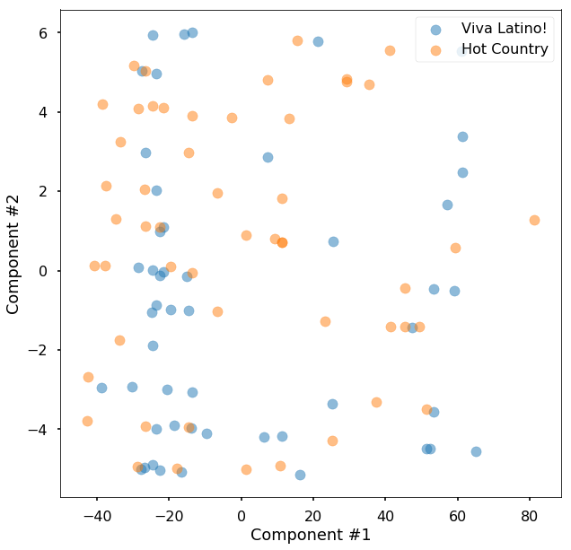


```python
df = audioFeatures_Latino_Piano

X = preprocessing.scale(df[audioFeatures_OfInterest]) # Audio Features
#X = df[audioFeatures_OfInterest]
y = df["playlist_Name"] # Playlist labels

X_train, X_test, y_train, y_test = train_test_split(X, y, test_size=0.33, random_state=42)


#regParameters = [1e-4,1e-3,1e-2,1e-1,1,10,100,1000,10000]


# Perform a grid search with cross validation to search for the best parameters.
LogRed_CV = LogisticRegressionCV(cv=5)
#LogRed_CV = GradientBoostingClassifier(max_depth=200, random_state=0)


LogRed_CV.fit(X_train, y_train)

Predictions_LogReg_Train = LogRed_CV.predict(X_train)

Predictions_LogReg_Test = LogRed_CV.predict(X_test)

print("Multiple Logistic Regression Classification: Viva Latino or Peaceful Piano")
print("-------------------------------------")
print("Accuracy on train set:", LogRed_CV.score(X_train, y_train))
print("Accuracy on test set:", LogRed_CV.score(X_test, y_test))


sns.set_context("poster")

fpr_LR, tpr_LR, thresholds_LR = roc_curve(y_test, LogRed_CV.predict_proba(X_test)[:,1])

roc_auc_LR = auc(fpr_LR, tpr_LR)
name_LR = "logistic regression"

fig, ax = plt.subplots(1, 1, figsize=(12, 10))
ax.plot(fpr_LR, tpr_LR, '.-', alpha=0.5, label='ROC curve for %s (AUC = %0.2f)' % (name_LR, roc_auc_LR))

ax.set_title("Multiple Logistic Regression Classification: Viva Latino or Peaceful Piano")

ax.legend()
plt.show()

```

    Multiple Logistic Regression Classification: Viva Latino or Peaceful Piano
    -------------------------------------
    Accuracy on train set: 1.0
    Accuracy on test set: 1.0


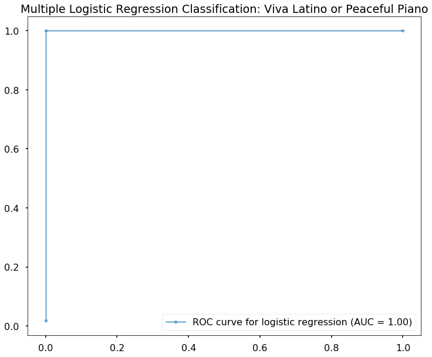


```python
df = audioFeatures_Latino_Country

X = preprocessing.scale(df[audioFeatures_OfInterest]) # Audio Features
#X = df[audioFeatures_OfInterest]
y = df["playlist_Name"] # Playlist labels

X_train, X_test, y_train, y_test = train_test_split(X, y, test_size=0.33, random_state=42)


#regParameters = [1e-4,1e-3,1e-2,1e-1,1,10,100,1000,10000]


# Perform a grid search with cross validation to search for the best parameters.
LogRed_CV = LogisticRegressionCV(cv=5)
#LogRed_CV = GradientBoostingClassifier(max_depth=200, random_state=0)


LogRed_CV.fit(X_train, y_train)

Predictions_LogReg_Train = LogRed_CV.predict(X_train)

Predictions_LogReg_Test = LogRed_CV.predict(X_test)

print("Multiple Logistic Regression Classification: Viva Latino or Hot Country")
print("-------------------------------------")
print("Accuracy on train set:", LogRed_CV.score(X_train, y_train))
print("Accuracy on test set:", LogRed_CV.score(X_test, y_test))


sns.set_context("poster")

fpr_LR, tpr_LR, thresholds_LR = roc_curve(y_test, LogRed_CV.predict_proba(X_test)[:,1])

roc_auc_LR = auc(fpr_LR, tpr_LR)
name_LR = "logistic regression"

fig, ax = plt.subplots(1, 1, figsize=(12, 10))
ax.plot(fpr_LR, tpr_LR, '.-', alpha=0.5, label='ROC curve for %s (AUC = %0.2f)' % (name_LR, roc_auc_LR))

ax.set_title("Multiple Logistic Regression Classification: Viva Latino or Hot Country")

ax.legend()
plt.show()

```

    Multiple Logistic Regression Classification: Viva Latino or Hot Country
    -------------------------------------
    Accuracy on train set: 0.926470588235
    Accuracy on test set: 0.882352941176


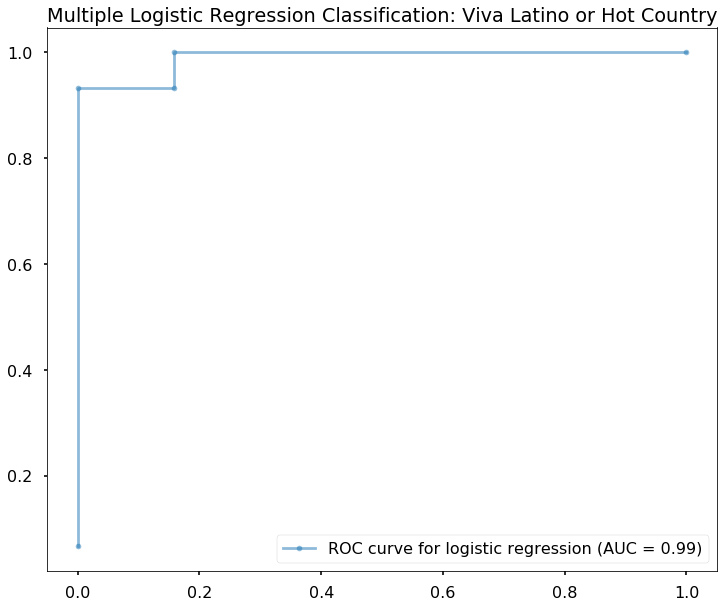


```python
df = audioFeatures_Latino_Country

X = df[audioFeatures_OfInterest] # Audio Features
y = df["playlist_Name"] # Playlist labels

X_train, X_test, y_train, y_test = train_test_split(X, y, test_size=0.33, random_state=42)


#regParameters = [1e-4,1e-3,1e-2,1e-1,1,10,100,1000,10000]


# Perform a grid search with cross validation to search for the best parameters.
LogRed_CV = RandomForestClassifier(max_depth=2, random_state=0)
#LogRed_CV = GradientBoostingClassifier(max_depth=200, random_state=0)


LogRed_CV.fit(X_train, y_train)

Predictions_LogReg_Train = LogRed_CV.predict(X_train)

Predictions_LogReg_Test = LogRed_CV.predict(X_test)

print("Multiple Logistic Regression Classification: Viva Latino or Peaceful Piano")
print("-------------------------------------")
print("Accuracy on train set:", LogRed_CV.score(X_train, y_train))
print("Accuracy on test set:", LogRed_CV.score(X_test, y_test))


sns.set_context("poster")

fpr_LR, tpr_LR, thresholds_LR = roc_curve(y_test, LogRed_CV.predict_proba(X_test)[:,1])

roc_auc_LR = auc(fpr_LR, tpr_LR)
name_LR = "logistic regression"

fig, ax = plt.subplots(1, 1, figsize=(12, 10))
ax.plot(fpr_LR, tpr_LR, '.-', alpha=0.5, label='ROC curve for %s (AUC = %0.2f)' % (name_LR, roc_auc_LR))

ax.legend()
plt.show()

```

    Multiple Logistic Regression Classification: Viva Latino or Peaceful Piano
    -------------------------------------
    Accuracy on train set: 0.970588235294
    Accuracy on test set: 0.852941176471


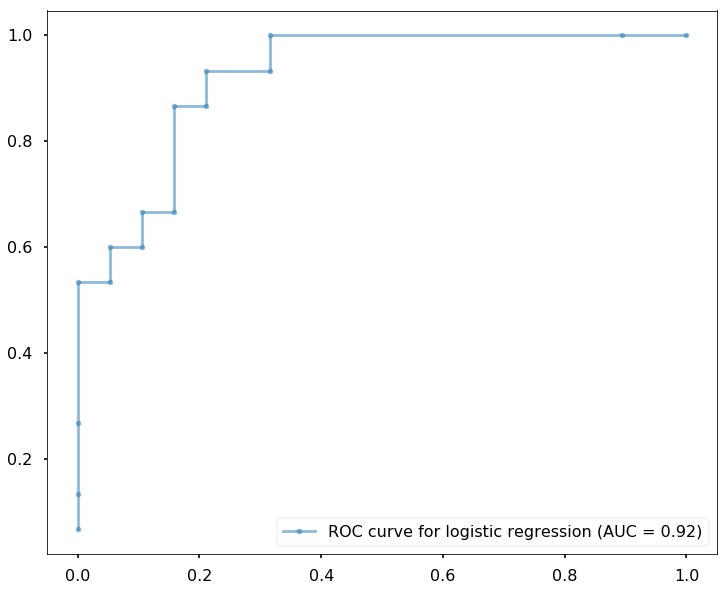


```python
Viva_Latino_AudioFeatures["playlist_Name"] = 0
Peaceful_Piano_AudioFeatures["playlist_Name"] = 1
hot_Country_AudioFeatures["playlist_Name"] = 2
audioFeatures_Piano_Latino_Country = pd.concat( [Peaceful_Piano_AudioFeatures, 
                                                 Viva_Latino_AudioFeatures, 
                                                 hot_Country_AudioFeatures] ) 
```


```python
Playlist_Label = audioFeatures_Piano_Latino_Country["playlist_Name"]

audioFeatures_X = audioFeatures_Piano_Latino_Country[audioFeatures_OfInterest]

X_pca_std = pca.fit_transform(preprocessing.scale(audioFeatures_X) )
```


```python
X_pca_Latino_std = X_pca_std[Playlist_Label == 0]
X_pca_Piano_std = X_pca_std[Playlist_Label == 1]
X_pca_Country_std = X_pca_std[Playlist_Label == 2]

plt.figure(figsize=(10,10))

plt.scatter(X_pca_Latino_std[:,0], X_pca_Latino_std[:,1], alpha=0.5, label = "Viva Latino!")
plt.scatter(X_pca_Piano[:,0], X_pca_Piano[:,1], alpha=0.5, label = "PeacefulPiano")
plt.scatter(X_pca_Country_std[:,0], X_pca_Country_std[:,1], alpha=0.5, label = "Hot Country")


plt.title("Principal Component Analysis of Audio Features: Latin Pop vs. Country")

plt.xlabel("Component #1")
plt.ylabel("Component #2") 
plt.legend()
plt.show()
```


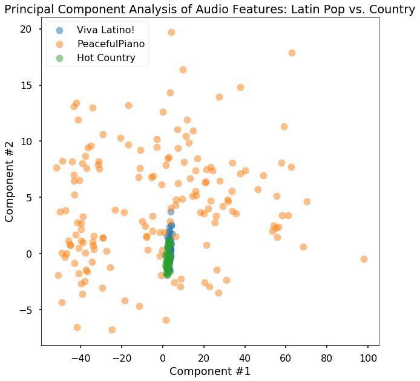

