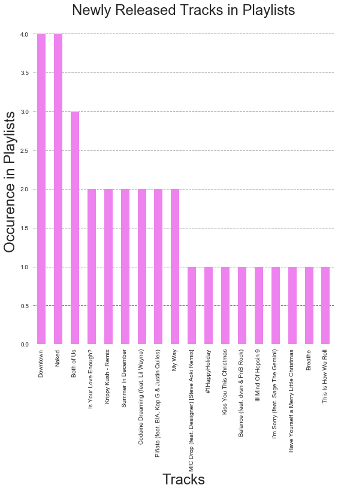

```python
%matplotlib inline
import numpy as np
import pandas as pd
import matplotlib
import spotipy
import spotipy.util as util
import sys

import matplotlib.pyplot as plt
from sklearn.linear_model import LogisticRegressionCV
import sklearn.metrics as metrics
from sklearn.preprocessing import PolynomialFeatures
from sklearn.discriminant_analysis import LinearDiscriminantAnalysis
from sklearn.discriminant_analysis import QuadraticDiscriminantAnalysis
from sklearn.neighbors import KNeighborsClassifier
from sklearn.tree import DecisionTreeClassifier
from sklearn.model_selection import cross_val_score
#import pydotplus
#import io
from sklearn.tree import export_graphviz
from IPython.display import Image
from IPython.display import display
from matplotlib import colors
import seaborn as sns

```

## Connect to Spotify Api


```python
token = util.prompt_for_user_token(username='DOSER',scope='user-library-read',client_id='02320eb8112d4b00951525fbb50494b4',client_secret='5a72850d24844c7289da60ee357a9545',redirect_uri='http://localhost:8888/callback')
sp = spotipy.Spotify(auth=token)
```


```python
def get_user_info(spapi,userid):
    user = spapi.user
    display_name = user['display_name']
    external_urls = user['display_name']
    followers = user['display_name']
    href = user['display_name']
    images = user['display_name']
    typeofuser = user['display_name']
    uri = user['display_name']

    
get_user_info(sp,sp.current_user()['id'])
```

## Get User Playlist info


```python
#retrieves the id for each playlist
def get_user_playlist_id(spapi,userid):
    listof_userplaylist_id = []
    #dictionary of items
    items = spapi.user_playlists(userid)['items']
    for item in items:
        #retrieve playlist id
        user_playlist_id = item['id']

        #append id to list
        listof_userplaylist_id.append(user_playlist_id)
    return listof_userplaylist_id


#list of all the playlist ids
user_play_ids = get_user_playlist_id(sp,'spotify')

```


    '37i9dQZF1DXcBWIGoYBM5M'


## Get Information About the Playlists


```python
#retrieve information of playlists
def get_dictionary_for_specific_playlist(spapi,userid,playlistid):
    #get tracks in this playlist
    tracksinplaylist = spapi.user_playlist_tracks(userid,playlistid)
    playlist = spapi.user_playlist(userid,playlistid)
    playlist_name = playlist['name']
    playlist_followers = playlist['followers']['total']
    
    listoftracks_in_playlist = []
    #Loop through the tracks in the playlist
    for eachtrack in tracksinplaylist['items']:
        track = eachtrack['track']
        track_name = track['name']
        track_id = track['id']
        track_number = track['track_number']
        track_duration = track['duration_ms']
        track_popularity = track['popularity']
        
        #the album the track is associated with
        track_album = track['album']
        track_album_id = track_album['id']
        
        #the artist of the track
        track_artist = track['artists']
        artist_name = track_artist[0]['name']
        artist_id = track_artist[0]['id']

        dictionary = {
            'playlist_name': playlist_name,
            'playlist_followers': playlist_followers,
            'playlist_id': playlistid,
            'track_name' : track_name, 
            'track_id' : track_id,
            'track_number' : track_number,
            'track_duration(ms)' : track_duration,
            'track_popularity' : track_popularity,
            'album_id' : track_album_id,
            'artist_name' : artist_name,
            'artist_id' : artist_id
        }
        
        listoftracks_in_playlist.append(dictionary)
        
    return listoftracks_in_playlist

#loop through all playlists
listofdicts = []
for eachplaylist in user_play_ids:
    d_track = get_dictionary_for_specific_playlist(sp,'spotify',eachplaylist)
    listofdicts.append(d_track)

#flatten lists
flattened_list = [y for x in listofdicts for y in x]
df_track = pd.DataFrame(flattened_list)
df_track.head()
```


<div>
<style>
    .dataframe thead tr:only-child th {
        text-align: right;
    }

    .dataframe thead th {
        text-align: left;
    }

    .dataframe tbody tr th {
        vertical-align: top;
    }
</style>
<table border="1" class="dataframe">
  <thead>
    <tr style="text-align: right;">
      <th></th>
      <th>album_id</th>
      <th>artist_id</th>
      <th>artist_name</th>
      <th>playlist_followers</th>
      <th>playlist_id</th>
      <th>playlist_name</th>
      <th>track_duration(ms)</th>
      <th>track_id</th>
      <th>track_name</th>
      <th>track_number</th>
      <th>track_popularity</th>
    </tr>
  </thead>
  <tbody>
    <tr>
      <th>0</th>
      <td>5gQZvWM1o8NkQndueJtZcP</td>
      <td>0C8ZW7ezQVs4URX5aX7Kqx</td>
      <td>Selena Gomez</td>
      <td>18125710</td>
      <td>37i9dQZF1DXcBWIGoYBM5M</td>
      <td>Today's Top Hits</td>
      <td>197993</td>
      <td>0tBbt8CrmxbjRP0pueQkyU</td>
      <td>Wolves</td>
      <td>1</td>
      <td>88</td>
    </tr>
    <tr>
      <th>1</th>
      <td>2Z3mc0fTq3MqUCKdUuHa9O</td>
      <td>6fOMl44jA4Sp5b9PpYCkzz</td>
      <td>NF</td>
      <td>18125710</td>
      <td>37i9dQZF1DXcBWIGoYBM5M</td>
      <td>Today's Top Hits</td>
      <td>212120</td>
      <td>2amzBJRBPOGszBem4FedfE</td>
      <td>Let You Down</td>
      <td>1</td>
      <td>61</td>
    </tr>
    <tr>
      <th>2</th>
      <td>22fC2LDiA1zJgUS9ru5GP5</td>
      <td>246dkjvS1zLTtiykXe5h60</td>
      <td>Post Malone</td>
      <td>18125710</td>
      <td>37i9dQZF1DXcBWIGoYBM5M</td>
      <td>Today's Top Hits</td>
      <td>229573</td>
      <td>42CeaId2XNlxugDvyqHfDf</td>
      <td>Candy Paint</td>
      <td>1</td>
      <td>84</td>
    </tr>
    <tr>
      <th>3</th>
      <td>3g56eEg5YgMf3LZPHCMOx2</td>
      <td>4nDoRrQiYLoBzwC5BhVJzF</td>
      <td>Camila Cabello</td>
      <td>18125710</td>
      <td>37i9dQZF1DXcBWIGoYBM5M</td>
      <td>Today's Top Hits</td>
      <td>199095</td>
      <td>3whrwq4DtvucphBPUogRuJ</td>
      <td>Havana - Remix</td>
      <td>1</td>
      <td>83</td>
    </tr>
    <tr>
      <th>4</th>
      <td>2QBJu1rJWSPtTiWxwIY2H7</td>
      <td>04gDigrS5kc9YWfZHwBETP</td>
      <td>Maroon 5</td>
      <td>18125710</td>
      <td>37i9dQZF1DXcBWIGoYBM5M</td>
      <td>Today's Top Hits</td>
      <td>190642</td>
      <td>7eFmN6wnsb7WowRKAqRFfs</td>
      <td>Wait</td>
      <td>3</td>
      <td>46</td>
    </tr>
  </tbody>
</table>
</div>


## Get information about the albums and tracks within it


```python
#retrieves album and the tracks within it
def get_albuminfo(spapi,albumid):
    listofinfo_in_album = []
    album_ = spapi.album(albumid)
    
    release_date = album_['release_date'] 
    artist_ = album_['artists']
    album_name = album_['name']
    album_id = album_['id']
    albumtracks = album_['tracks']
    album_popularity = album_['popularity']
    for eachtrack in albumtracks['items']:
                
        track_duration_ms = eachtrack['duration_ms']
        track_id = eachtrack['id']
        track_name = eachtrack['name']
        track_number = eachtrack['track_number']
        
        dictionary = {
            'release_date': release_date,
            'album_name': album_name,
            'album_id': album_id,
            'album_popularity': album_popularity,
            'track_duration_ms': track_duration_ms,
            'track_id': track_id,
            'track_name': track_name,
            'track_number': track_number
        }
        listofinfo_in_album.append(dictionary)
    return listofinfo_in_album

listofdicts = []
#find the album id for each track
for albumid in df_track['album_id'].unique():
    d_album = get_albuminfo(sp,albumid)  
    listofdicts.append(d_album)
    
#flatten lists
flattened_list = [y for x in listofdicts for y in x]
df_album = pd.DataFrame(flattened_list)
#convert to date and year
df_album['release_date'] = pd.to_datetime(df_album['release_date'])
#just get month and year
df_album['year']  = df_album['release_date'].dt.year 
df_album['month'] = df_album['release_date'].dt.month
df_album.drop('release_date', axis=1)

df_album.head()
```


<div>
<style>
    .dataframe thead tr:only-child th {
        text-align: right;
    }

    .dataframe thead th {
        text-align: left;
    }

    .dataframe tbody tr th {
        vertical-align: top;
    }
</style>
<table border="1" class="dataframe">
  <thead>
    <tr style="text-align: right;">
      <th></th>
      <th>album_id</th>
      <th>album_name</th>
      <th>album_popularity</th>
      <th>release_date</th>
      <th>track_duration_ms</th>
      <th>track_id</th>
      <th>track_name</th>
      <th>track_number</th>
      <th>year</th>
      <th>month</th>
    </tr>
  </thead>
  <tbody>
    <tr>
      <th>0</th>
      <td>5gQZvWM1o8NkQndueJtZcP</td>
      <td>Wolves</td>
      <td>83</td>
      <td>2017-10-25</td>
      <td>197993</td>
      <td>0tBbt8CrmxbjRP0pueQkyU</td>
      <td>Wolves</td>
      <td>1</td>
      <td>2017</td>
      <td>10</td>
    </tr>
    <tr>
      <th>1</th>
      <td>2Z3mc0fTq3MqUCKdUuHa9O</td>
      <td>Let You Down</td>
      <td>56</td>
      <td>2017-09-15</td>
      <td>212120</td>
      <td>2amzBJRBPOGszBem4FedfE</td>
      <td>Let You Down</td>
      <td>1</td>
      <td>2017</td>
      <td>9</td>
    </tr>
    <tr>
      <th>2</th>
      <td>22fC2LDiA1zJgUS9ru5GP5</td>
      <td>Candy Paint</td>
      <td>79</td>
      <td>2017-10-20</td>
      <td>229573</td>
      <td>42CeaId2XNlxugDvyqHfDf</td>
      <td>Candy Paint</td>
      <td>1</td>
      <td>2017</td>
      <td>10</td>
    </tr>
    <tr>
      <th>3</th>
      <td>3g56eEg5YgMf3LZPHCMOx2</td>
      <td>Havana (Remix)</td>
      <td>78</td>
      <td>2017-11-12</td>
      <td>199095</td>
      <td>3whrwq4DtvucphBPUogRuJ</td>
      <td>Havana - Remix</td>
      <td>1</td>
      <td>2017</td>
      <td>11</td>
    </tr>
    <tr>
      <th>4</th>
      <td>2QBJu1rJWSPtTiWxwIY2H7</td>
      <td>Red Pill Blues (Deluxe)</td>
      <td>57</td>
      <td>2017-11-03</td>
      <td>239751</td>
      <td>4shuixS6TZ8CAvZ3za06dm</td>
      <td>Best 4 U</td>
      <td>1</td>
      <td>2017</td>
      <td>11</td>
    </tr>
  </tbody>
</table>
</div>


## Get album info only for newly released tracks


```python
'''
Get album info for newly released tracks
'''
newrelease = sp.new_releases('US',limit=50)
newrelease = newrelease['albums']
newrelease = newrelease['items']
#albumIDs = temp['id']
#get new release album infos
listofdicts = []
for eachalbum in newrelease:
    albumid = eachalbum['id']
    d_album_newrelease = get_albuminfo(sp,albumid)  
    listofdicts.append(d_album_newrelease)

#flatten lists
flattened_list = [y for x in listofdicts for y in x]
df_album_newrelease = pd.DataFrame(flattened_list)
#convert to date and year
df_album_newrelease['release_date'] = pd.to_datetime(df_album_newrelease['release_date'])
#just get month and year
df_album_newrelease['year']  = df_album_newrelease['release_date'].dt.year 
df_album_newrelease['month'] = df_album_newrelease['release_date'].dt.month
df_album_newrelease.drop('release_date', axis=1)

df_album_newrelease.head()
```


<div>
<style>
    .dataframe thead tr:only-child th {
        text-align: right;
    }

    .dataframe thead th {
        text-align: left;
    }

    .dataframe tbody tr th {
        vertical-align: top;
    }
</style>
<table border="1" class="dataframe">
  <thead>
    <tr style="text-align: right;">
      <th></th>
      <th>album_id</th>
      <th>album_name</th>
      <th>album_popularity</th>
      <th>release_date</th>
      <th>track_duration_ms</th>
      <th>track_id</th>
      <th>track_name</th>
      <th>track_number</th>
      <th>year</th>
      <th>month</th>
    </tr>
  </thead>
  <tbody>
    <tr>
      <th>0</th>
      <td>037hz3oZyrgcJOheyhPMnC</td>
      <td>Utopia</td>
      <td>56</td>
      <td>2017-11-24</td>
      <td>299969</td>
      <td>5DoSDqhMe4Zi0dLVayOewW</td>
      <td>Arisen My Senses</td>
      <td>1</td>
      <td>2017</td>
      <td>11</td>
    </tr>
    <tr>
      <th>1</th>
      <td>037hz3oZyrgcJOheyhPMnC</td>
      <td>Utopia</td>
      <td>56</td>
      <td>2017-11-24</td>
      <td>305703</td>
      <td>6oJyKKdsJjo6E8vqr0hC2B</td>
      <td>Blissing Me</td>
      <td>2</td>
      <td>2017</td>
      <td>11</td>
    </tr>
    <tr>
      <th>2</th>
      <td>037hz3oZyrgcJOheyhPMnC</td>
      <td>Utopia</td>
      <td>56</td>
      <td>2017-11-24</td>
      <td>393579</td>
      <td>3BEJxxZPPJKCTyNjiaxmny</td>
      <td>The Gate</td>
      <td>3</td>
      <td>2017</td>
      <td>11</td>
    </tr>
    <tr>
      <th>3</th>
      <td>037hz3oZyrgcJOheyhPMnC</td>
      <td>Utopia</td>
      <td>56</td>
      <td>2017-11-24</td>
      <td>282739</td>
      <td>1weQhXd8J4Z6IqNswNTTEa</td>
      <td>Utopia</td>
      <td>4</td>
      <td>2017</td>
      <td>11</td>
    </tr>
    <tr>
      <th>4</th>
      <td>037hz3oZyrgcJOheyhPMnC</td>
      <td>Utopia</td>
      <td>56</td>
      <td>2017-11-24</td>
      <td>586517</td>
      <td>5yGhCwFX6VOldPFh4Y21PK</td>
      <td>Body Memory</td>
      <td>5</td>
      <td>2017</td>
      <td>11</td>
    </tr>
  </tbody>
</table>
</div>


```python
#merge album information with playlist information
df_album_track = df_album.merge(df_track, on='album_id', how = 'inner')

df_album_track.head()
```


<div>
<style>
    .dataframe thead tr:only-child th {
        text-align: right;
    }

    .dataframe thead th {
        text-align: left;
    }

    .dataframe tbody tr th {
        vertical-align: top;
    }
</style>
<table border="1" class="dataframe">
  <thead>
    <tr style="text-align: right;">
      <th></th>
      <th>album_id</th>
      <th>album_name</th>
      <th>album_popularity</th>
      <th>release_date</th>
      <th>track_duration_ms</th>
      <th>track_id_x</th>
      <th>track_name_x</th>
      <th>track_number_x</th>
      <th>year</th>
      <th>month</th>
      <th>artist_id</th>
      <th>artist_name</th>
      <th>playlist_followers</th>
      <th>playlist_id</th>
      <th>playlist_name</th>
      <th>track_duration(ms)</th>
      <th>track_id_y</th>
      <th>track_name_y</th>
      <th>track_number_y</th>
      <th>track_popularity</th>
    </tr>
  </thead>
  <tbody>
    <tr>
      <th>0</th>
      <td>5gQZvWM1o8NkQndueJtZcP</td>
      <td>Wolves</td>
      <td>83</td>
      <td>2017-10-25</td>
      <td>197993</td>
      <td>0tBbt8CrmxbjRP0pueQkyU</td>
      <td>Wolves</td>
      <td>1</td>
      <td>2017</td>
      <td>10</td>
      <td>0C8ZW7ezQVs4URX5aX7Kqx</td>
      <td>Selena Gomez</td>
      <td>18125710</td>
      <td>37i9dQZF1DXcBWIGoYBM5M</td>
      <td>Today's Top Hits</td>
      <td>197993</td>
      <td>0tBbt8CrmxbjRP0pueQkyU</td>
      <td>Wolves</td>
      <td>1</td>
      <td>88</td>
    </tr>
    <tr>
      <th>1</th>
      <td>2Z3mc0fTq3MqUCKdUuHa9O</td>
      <td>Let You Down</td>
      <td>56</td>
      <td>2017-09-15</td>
      <td>212120</td>
      <td>2amzBJRBPOGszBem4FedfE</td>
      <td>Let You Down</td>
      <td>1</td>
      <td>2017</td>
      <td>9</td>
      <td>6fOMl44jA4Sp5b9PpYCkzz</td>
      <td>NF</td>
      <td>18125710</td>
      <td>37i9dQZF1DXcBWIGoYBM5M</td>
      <td>Today's Top Hits</td>
      <td>212120</td>
      <td>2amzBJRBPOGszBem4FedfE</td>
      <td>Let You Down</td>
      <td>1</td>
      <td>61</td>
    </tr>
    <tr>
      <th>2</th>
      <td>22fC2LDiA1zJgUS9ru5GP5</td>
      <td>Candy Paint</td>
      <td>79</td>
      <td>2017-10-20</td>
      <td>229573</td>
      <td>42CeaId2XNlxugDvyqHfDf</td>
      <td>Candy Paint</td>
      <td>1</td>
      <td>2017</td>
      <td>10</td>
      <td>246dkjvS1zLTtiykXe5h60</td>
      <td>Post Malone</td>
      <td>18125710</td>
      <td>37i9dQZF1DXcBWIGoYBM5M</td>
      <td>Today's Top Hits</td>
      <td>229573</td>
      <td>42CeaId2XNlxugDvyqHfDf</td>
      <td>Candy Paint</td>
      <td>1</td>
      <td>84</td>
    </tr>
    <tr>
      <th>3</th>
      <td>3g56eEg5YgMf3LZPHCMOx2</td>
      <td>Havana (Remix)</td>
      <td>78</td>
      <td>2017-11-12</td>
      <td>199095</td>
      <td>3whrwq4DtvucphBPUogRuJ</td>
      <td>Havana - Remix</td>
      <td>1</td>
      <td>2017</td>
      <td>11</td>
      <td>4nDoRrQiYLoBzwC5BhVJzF</td>
      <td>Camila Cabello</td>
      <td>18125710</td>
      <td>37i9dQZF1DXcBWIGoYBM5M</td>
      <td>Today's Top Hits</td>
      <td>199095</td>
      <td>3whrwq4DtvucphBPUogRuJ</td>
      <td>Havana - Remix</td>
      <td>1</td>
      <td>83</td>
    </tr>
    <tr>
      <th>4</th>
      <td>3g56eEg5YgMf3LZPHCMOx2</td>
      <td>Havana (Remix)</td>
      <td>78</td>
      <td>2017-11-12</td>
      <td>199095</td>
      <td>3whrwq4DtvucphBPUogRuJ</td>
      <td>Havana - Remix</td>
      <td>1</td>
      <td>2017</td>
      <td>11</td>
      <td>4nDoRrQiYLoBzwC5BhVJzF</td>
      <td>Camila Cabello</td>
      <td>6636459</td>
      <td>37i9dQZF1DX10zKzsJ2jva</td>
      <td>¡Viva Latino!</td>
      <td>199095</td>
      <td>3whrwq4DtvucphBPUogRuJ</td>
      <td>Havana - Remix</td>
      <td>1</td>
      <td>83</td>
    </tr>
  </tbody>
</table>
</div>


## EDA with our Dataframe 
Note we have done EDA with our all the playlists, but here, we've just taken a subset to quickly explore what features will be potentially important.


```python
fig,ax = plt.subplots(1,1,figsize = (10,8))


df_album_track.groupby('playlist_id').mean().plot(x = 'album_popularity', y ='track_popularity',kind='scatter',ax=ax)
ax.set_xlabel('Mean Album Popularity',fontsize = 18)
ax.set_ylabel('Playlist Popularity',fontsize = 16)
ax.set_axis_bgcolor('white')
ax.grid(b=None, which='major', axis='y', color='gray', linestyle='--', linewidth=1)
ax.set_title('Tracks from Popular Albums Increase Playlist Popularity',fontsize = 18)

                                                                                                                           
```

    /Users/erho1100/anaconda/lib/python3.6/site-packages/ipykernel_launcher.py:7: MatplotlibDeprecationWarning: The set_axis_bgcolor function was deprecated in version 2.0. Use set_facecolor instead.
      import sys


    <matplotlib.text.Text at 0x1208ee208>


```python
fig,ax = plt.subplots(1,1,figsize = (10,8))


df_album_track.groupby('playlist_id').mean().plot(x = 'album_popularity', y ='playlist_followers',kind='scatter',ax=ax)
ax.set_xlabel('Mean Album Popularity',fontsize = 18)
ax.set_ylabel('Playlist Followers',fontsize = 16)
ax.set_axis_bgcolor('white')
ax.grid(b=None, which='major', axis='y', color='gray', linestyle='--', linewidth=1)
ax.set_title('Tracks from Popular Albums Increase Playlist Followers',fontsize = 18)

                 
```

    /Users/erho1100/anaconda/lib/python3.6/site-packages/ipykernel_launcher.py:7: MatplotlibDeprecationWarning: The set_axis_bgcolor function was deprecated in version 2.0. Use set_facecolor instead.
      import sys


    <matplotlib.text.Text at 0x122b16160>


```python
fig,ax = plt.subplots(1,1, figsize = (10,10))
df_album_track.groupby('year').mean().sort_values(by = 'track_popularity',ascending = False)['track_popularity'][0:25].plot(kind='bar',color='orange',ax=ax)

ax.set_xlabel('Release Date (Year)',fontsize=24)
ax.set_ylabel('Playlist Popularity',fontsize=24)
ax.set_title('Popularity (Top 25) of the Playlist Generated with Tracks Released on a Given Year ',fontsize=24)
ax.set_axis_bgcolor('white')
ax.grid(b=None, which='major', axis='y', color='gray', linestyle='--', linewidth=1)

```

    /Users/erho1100/anaconda/lib/python3.6/site-packages/ipykernel_launcher.py:7: MatplotlibDeprecationWarning: The set_axis_bgcolor function was deprecated in version 2.0. Use set_facecolor instead.
      import sys


```python
fig,ax = plt.subplots(1,1, figsize = (10,10))
df_album_track.groupby('year').mean().sort_values(by = 'playlist_followers',ascending = False)['playlist_followers'][0:25].plot(kind='bar',color='orange',ax=ax)

ax.set_xlabel('Release Date (Year)',fontsize=24)
ax.set_ylabel('Playlist Followers',fontsize=24)
ax.set_title('Number of Followers of a Playlist (Top25) Generated with Tracks Released on a Given Year ',fontsize=24)
ax.set_axis_bgcolor('white')
ax.grid(b=None, which='major', axis='y', color='gray', linestyle='--', linewidth=1)
```

    /Users/erho1100/anaconda/lib/python3.6/site-packages/ipykernel_launcher.py:7: MatplotlibDeprecationWarning: The set_axis_bgcolor function was deprecated in version 2.0. Use set_facecolor instead.
      import sys


```python
fig,ax = plt.subplots(1,1, figsize = (10,10))
df_album_track.groupby('month').mean().sort_values(by = 'track_popularity',ascending = False)['track_popularity'][0:25].plot(kind='bar',color='orange',ax=ax)

ax.set_xlabel('Release Date (Month)',fontsize=24)
ax.set_ylabel('Playlist Popularity',fontsize=24)
ax.set_title('Popularity(Top25) of the Playlist Generated with Tracks Released on a Given Month ',fontsize=24)
ax.set_axis_bgcolor('white')
ax.grid(b=None, which='major', axis='y', color='gray', linestyle='--', linewidth=1)


```

    /Users/erho1100/anaconda/lib/python3.6/site-packages/ipykernel_launcher.py:7: MatplotlibDeprecationWarning: The set_axis_bgcolor function was deprecated in version 2.0. Use set_facecolor instead.
      import sys


```python
fig,ax = plt.subplots(1,1, figsize = (10,10))
df_album_track.groupby('month').mean().sort_values(by = 'playlist_followers',ascending = False)['playlist_followers'][0:25].plot(kind='bar',color='orange',ax=ax)

ax.set_xlabel('Release Date (Month)',fontsize=24)
ax.set_ylabel('Playlist Followers',fontsize=24)
ax.set_title('Number of Followers of the Playlist Generated with Tracks Released on a Given Month ',fontsize=24)
ax.set_axis_bgcolor('white')
ax.grid(b=None, which='major', axis='y', color='gray', linestyle='--', linewidth=1)


```

    /Users/erho1100/anaconda/lib/python3.6/site-packages/ipykernel_launcher.py:7: MatplotlibDeprecationWarning: The set_axis_bgcolor function was deprecated in version 2.0. Use set_facecolor instead.
      import sys


```python
fig,ax = plt.subplots(1,1, figsize=(10,8))
df_album_track.groupby('playlist_id').mean().plot(x = 'track_duration(ms)', y ='track_popularity',kind='scatter',ax=ax)

ax.set_xlabel('Playlist Duration (ms)',fontsize=24)
ax.set_ylabel('Playlist Popularity',fontsize=24)

ax.set_title('Playlist Duration Does Not Influence Playlist Popularity',fontsize=24)
ax.set_axis_bgcolor('white')
ax.grid(b=None, which='major', axis='y', color='gray', linestyle='--', linewidth=1)


```

    /Users/erho1100/anaconda/lib/python3.6/site-packages/ipykernel_launcher.py:8: MatplotlibDeprecationWarning: The set_axis_bgcolor function was deprecated in version 2.0. Use set_facecolor instead.
      


```python
fig,ax = plt.subplots(1,1, figsize=(10,8))
df_album_track.groupby('playlist_id').mean().plot(x = 'track_duration(ms)', y ='playlist_followers',kind='scatter',ax=ax)

ax.set_xlabel('Playlist Duration (ms)',fontsize=24)
ax.set_ylabel('Playlist Followers',fontsize=24)

ax.set_title('Playlist Duration Does Not Influence Playlist Followers',fontsize=24)
ax.set_axis_bgcolor('white')
ax.grid(b=None, which='major', axis='y', color='gray', linestyle='--', linewidth=1)


```

    /Users/erho1100/anaconda/lib/python3.6/site-packages/ipykernel_launcher.py:8: MatplotlibDeprecationWarning: The set_axis_bgcolor function was deprecated in version 2.0. Use set_facecolor instead.
      


```python
fig,ax = plt.subplots(1,1, figsize = (10,10))
df_album_track.groupby('album_name').mean().sort_values(by = 'track_popularity',ascending = False)['track_popularity'][0:25].plot(kind='bar',color='orange',ax=ax)

ax.set_xlabel('Album',fontsize=24)
ax.set_ylabel('Playlist Popularity',fontsize=24)
ax.set_title('Popularity (Top 25) of the Playlist Generated Given a Album ',fontsize=24)
ax.set_axis_bgcolor('white')
ax.grid(b=None, which='major', axis='y', color='gray', linestyle='--', linewidth=1)


```

    /Users/erho1100/anaconda/lib/python3.6/site-packages/ipykernel_launcher.py:7: MatplotlibDeprecationWarning: The set_axis_bgcolor function was deprecated in version 2.0. Use set_facecolor instead.
      import sys


```python
fig,ax = plt.subplots(1,1, figsize = (10,10))
df_album_track.groupby('album_name').mean().sort_values(by = 'track_popularity',ascending = False)['track_popularity'][0:25].plot(kind='bar',color='orange',ax=ax)

ax.set_xlabel('Album',fontsize=24)
ax.set_ylabel('Playlist Popularity',fontsize=24)
ax.set_title('Popularity (Top 25) of the Playlist Generated Given a Album ',fontsize=24)
ax.set_axis_bgcolor('white')
ax.grid(b=None, which='major', axis='y', color='gray', linestyle='--', linewidth=1)


```


```python
fig,ax = plt.subplots(1,1, figsize = (8,8))
df_album_track.groupby('track_name_x').mean().sort_values(by = 'playlist_followers',ascending = False)['playlist_followers'][0:25].plot(kind='bar',color='orange',ax=ax)

ax.set_xlabel('Track',fontsize=24)
ax.set_ylabel('Playlist Followers',fontsize=24)
ax.set_title('Number of Followers of a Playlist (Top25) Generated Given a Track ',fontsize=24)
ax.set_axis_bgcolor('white')
ax.grid(b=None, which='major', axis='y', color='gray', linestyle='--', linewidth=1)


```

    /Users/erho1100/anaconda/lib/python3.6/site-packages/ipykernel_launcher.py:7: MatplotlibDeprecationWarning: The set_axis_bgcolor function was deprecated in version 2.0. Use set_facecolor instead.
      import sys


```python
fig,ax = plt.subplots(1,1, figsize = (10,10))
df_album_track.groupby('artist_name').mean().sort_values(by = 'track_popularity',ascending = False)['track_popularity'][0:25].plot(kind='bar',color='orange',ax=ax)

ax.set_xlabel('Artist',fontsize=24)
ax.set_ylabel('Playlist Popularity',fontsize=24)
ax.set_title('Popularity (Top 25) of the Playlist Generated Given a Artist ',fontsize=24)
ax.set_axis_bgcolor('white')
ax.grid(b=None, which='major', axis='y', color='gray', linestyle='--', linewidth=1)


```

    /Users/erho1100/anaconda/lib/python3.6/site-packages/ipykernel_launcher.py:7: MatplotlibDeprecationWarning: The set_axis_bgcolor function was deprecated in version 2.0. Use set_facecolor instead.
      import sys


```python
fig,ax = plt.subplots(1,1, figsize = (10,10))
df_album_track.groupby('artist_name').mean().sort_values(by = 'playlist_followers',ascending = False)['playlist_followers'][0:25].plot(kind='bar',color='orange',ax=ax)

ax.set_xlabel('Artist',fontsize=24)
ax.set_ylabel('Playlist Followers',fontsize=24)
ax.set_title('Number of Followers of a Playlist Generated Given a Artist ',fontsize=24)
ax.set_axis_bgcolor('white')
ax.grid(b=None, which='major', axis='y', color='gray', linestyle='--', linewidth=1)


```

    /Users/erho1100/anaconda/lib/python3.6/site-packages/ipykernel_launcher.py:7: MatplotlibDeprecationWarning: The set_axis_bgcolor function was deprecated in version 2.0. Use set_facecolor instead.
      import sys


```python
#find tracks in playlists that are newly released
listofindices = np.zeros((df_track.shape[0], df_album_newrelease.shape[0]))
for i,tid in enumerate(df_album_newrelease['track_id']):
    indices = df_track['track_id'] == tid
    
    listofindices[:,i] = indices
fig, ax = plt.subplots(nrows=1, ncols=1, figsize = (9,10))
ax = df_track[np.sum(listofindices,axis=1)>0].groupby('track_name').count().sort_values(by = 'artist_id',ascending=[False])['artist_id'].plot(kind='bar',color='violet')
ax.set_xlabel('Tracks',fontsize=24)
ax.set_ylabel('Occurence in Playlists',fontsize=24)
ax.set_title('Newly Released Tracks in Playlists',fontsize=24)
ax.set_axis_bgcolor('white')
ax.grid(b=None, which='major', axis='y', color='gray', linestyle='--', linewidth=1)
```

    /Users/erho1100/anaconda/lib/python3.6/site-packages/ipykernel_launcher.py:12: MatplotlibDeprecationWarning: The set_axis_bgcolor function was deprecated in version 2.0. Use set_facecolor instead.
      if sys.path[0] == '':





```python
#Presence of Newly Released Tracks and Playlist Popularity
fig, ax = plt.subplots(1,2,figsize = (9,10), sharey = 'row')
df_track[np.sum(listofindices,axis=1)>0].groupby('playlist_id').mean().sort_values(by = 'track_popularity',ascending = False)['track_popularity'].plot(kind='bar',color='violet', ax = ax[0])
df_track[np.sum(listofindices,axis=1)==0].groupby('playlist_id').mean().sort_values(by = 'track_popularity',ascending = False)['track_popularity'].plot(kind='bar',color='green', ax = ax[1])

ax[0].set_xticklabels('')
ax[0].set_xlabel('Playlists',fontsize = 18)
ax[0].set_ylabel('Playlist Popularity',fontsize = 16)
ax[0].set_axis_bgcolor('white')
ax[0].grid(b=None, which='major', axis='y', color='gray', linestyle='--', linewidth=1)
ax[0].set_title('Newly Released Tracks',fontsize = 18)

ax[1].set_xticklabels('')
ax[1].set_xlabel('Playlists',fontsize = 18)
ax[1].set_axis_bgcolor('white')
ax[1].grid(b=None, which='major', axis='y', color='gray', linestyle='--', linewidth=1)
ax[1].set_title('Old Tracks',fontsize = 18)

plt.suptitle('Playlists Contains Either', fontsize = 20)

```

    /Users/erho1100/anaconda/lib/python3.6/site-packages/ipykernel_launcher.py:9: MatplotlibDeprecationWarning: The set_axis_bgcolor function was deprecated in version 2.0. Use set_facecolor instead.
      if __name__ == '__main__':
    /Users/erho1100/anaconda/lib/python3.6/site-packages/ipykernel_launcher.py:15: MatplotlibDeprecationWarning: The set_axis_bgcolor function was deprecated in version 2.0. Use set_facecolor instead.
      from ipykernel import kernelapp as app


    <matplotlib.text.Text at 0x11df159b0>


```python
#Presence of Newly Released Tracks and Playlist Popularity
fig, ax = plt.subplots(1,2,figsize = (9,10), sharey = 'row')
df_track[np.sum(listofindices,axis=1)>0].groupby('playlist_id').mean().sort_values(by = 'playlist_followers',ascending = False)['playlist_followers'].plot(kind='bar',color='violet', ax = ax[0])
df_track[np.sum(listofindices,axis=1)==0].groupby('playlist_id').mean().sort_values(by = 'playlist_followers',ascending = False)['playlist_followers'].plot(kind='bar',color='green', ax = ax[1])

ax[0].set_xticklabels('')
ax[0].set_xlabel('Playlists',fontsize = 18)
ax[0].set_ylabel('Playlist Followers',fontsize = 16)
ax[0].set_axis_bgcolor('white')
ax[0].grid(b=None, which='major', axis='y', color='gray', linestyle='--', linewidth=1)
ax[0].set_title('Newly Released Tracks',fontsize = 18)

ax[1].set_xticklabels('')
ax[1].set_xlabel('Playlists',fontsize = 18)
ax[1].set_axis_bgcolor('white')
ax[1].grid(b=None, which='major', axis='y', color='gray', linestyle='--', linewidth=1)
ax[1].set_title('Old Tracks',fontsize = 18)

plt.suptitle('Playlists Contains Either', fontsize = 20)


```

    /Users/erho1100/anaconda/lib/python3.6/site-packages/ipykernel_launcher.py:9: MatplotlibDeprecationWarning: The set_axis_bgcolor function was deprecated in version 2.0. Use set_facecolor instead.
      if __name__ == '__main__':
    /Users/erho1100/anaconda/lib/python3.6/site-packages/ipykernel_launcher.py:15: MatplotlibDeprecationWarning: The set_axis_bgcolor function was deprecated in version 2.0. Use set_facecolor instead.
      from ipykernel import kernelapp as app


    <matplotlib.text.Text at 0x126190d30>


```python
def get_artist_info(spapi, datframe_artistID):
    listof_artistinfo = []
    listof_artistID = list(datframe_artistID['artist_id'].unique())
    
    for each_artist_id in listof_artistID: 
        playlistID = datframe_artistID.loc[datframe_artistID['artist_id'] == each_artist_id,'playlist_id'].values[:]
        artist_ = spapi.artist(each_artist_id)
        artist_followers = artist_['followers']['total']
        artist_genres = artist_['genres']
        artist_id = artist_['id']
        artist_name = artist_['name']
        artist_popularity = artist_['popularity']

        dictionary = {
            'playlist_id': playlistID,
            'artist_followers': artist_followers,
            'artist_genres': artist_genres,
            'artist_id': artist_id,
            'artist_name': artist_name,
            'artist_popularity': artist_popularity
        }
        listof_artistinfo.append(dictionary)
    return listof_artistinfo

d_artist = get_artist_info(sp,df_track)

df_artist = pd.DataFrame(d_artist)
df_artist.head()
```


<div>
<style>
    .dataframe thead tr:only-child th {
        text-align: right;
    }

    .dataframe thead th {
        text-align: left;
    }

    .dataframe tbody tr th {
        vertical-align: top;
    }
</style>
<table border="1" class="dataframe">
  <thead>
    <tr style="text-align: right;">
      <th></th>
      <th>artist_followers</th>
      <th>artist_genres</th>
      <th>artist_id</th>
      <th>artist_name</th>
      <th>artist_popularity</th>
      <th>playlist_id</th>
    </tr>
  </thead>
  <tbody>
    <tr>
      <th>0</th>
      <td>6822378</td>
      <td>[dance pop, pop, post-teen pop]</td>
      <td>0C8ZW7ezQVs4URX5aX7Kqx</td>
      <td>Selena Gomez</td>
      <td>93</td>
      <td>[37i9dQZF1DXcBWIGoYBM5M]</td>
    </tr>
    <tr>
      <th>1</th>
      <td>500032</td>
      <td>[]</td>
      <td>6fOMl44jA4Sp5b9PpYCkzz</td>
      <td>NF</td>
      <td>90</td>
      <td>[37i9dQZF1DXcBWIGoYBM5M]</td>
    </tr>
    <tr>
      <th>2</th>
      <td>1989324</td>
      <td>[pop rap, rap]</td>
      <td>246dkjvS1zLTtiykXe5h60</td>
      <td>Post Malone</td>
      <td>100</td>
      <td>[37i9dQZF1DXcBWIGoYBM5M, 37i9dQZF1DXcBWIGoYBM5...</td>
    </tr>
    <tr>
      <th>3</th>
      <td>1255146</td>
      <td>[dance pop, pop, post-teen pop]</td>
      <td>4nDoRrQiYLoBzwC5BhVJzF</td>
      <td>Camila Cabello</td>
      <td>94</td>
      <td>[37i9dQZF1DXcBWIGoYBM5M, 37i9dQZF1DX10zKzsJ2jva]</td>
    </tr>
    <tr>
      <th>4</th>
      <td>9087963</td>
      <td>[dance pop, pop, pop christmas]</td>
      <td>04gDigrS5kc9YWfZHwBETP</td>
      <td>Maroon 5</td>
      <td>95</td>
      <td>[37i9dQZF1DXcBWIGoYBM5M, 37i9dQZF1DXcBWIGoYBM5...</td>
    </tr>
  </tbody>
</table>
</div>


```python

fig,ax = plt.subplots(1,1,figsize=(8,8))


df_artist.plot( x = 'artist_popularity', y ='artist_followers', kind='scatter', ax = ax)


ax.set_xlabel('Artist Popularity',fontsize = 18)
ax.set_ylabel('Artist Followers',fontsize = 16)
ax.set_axis_bgcolor('white')
ax.grid(b=None, which='major', axis='y', color='gray', linestyle='--', linewidth=1)
ax.set_title('After around 2 Million Followers, Popularity Grows Exponentially ',fontsize = 18)


```

    /Users/erho1100/anaconda/lib/python3.6/site-packages/ipykernel_launcher.py:10: MatplotlibDeprecationWarning: The set_axis_bgcolor function was deprecated in version 2.0. Use set_facecolor instead.
      # Remove the CWD from sys.path while we load stuff.


    <matplotlib.text.Text at 0x116bde828>


```python
#join artist with playlist
df_artist_track = df_artist.merge(df_track, on='artist_id', how = 'inner')
df_artist_track.head()
```


<div>
<style>
    .dataframe thead tr:only-child th {
        text-align: right;
    }

    .dataframe thead th {
        text-align: left;
    }

    .dataframe tbody tr th {
        vertical-align: top;
    }
</style>
<table border="1" class="dataframe">
  <thead>
    <tr style="text-align: right;">
      <th></th>
      <th>artist_followers</th>
      <th>artist_genres</th>
      <th>artist_id</th>
      <th>artist_name_x</th>
      <th>artist_popularity</th>
      <th>playlist_id_x</th>
      <th>album_id</th>
      <th>artist_name_y</th>
      <th>playlist_followers</th>
      <th>playlist_id_y</th>
      <th>playlist_name</th>
      <th>track_duration(ms)</th>
      <th>track_id</th>
      <th>track_name</th>
      <th>track_number</th>
      <th>track_popularity</th>
    </tr>
  </thead>
  <tbody>
    <tr>
      <th>0</th>
      <td>6822378</td>
      <td>[dance pop, pop, post-teen pop]</td>
      <td>0C8ZW7ezQVs4URX5aX7Kqx</td>
      <td>Selena Gomez</td>
      <td>93</td>
      <td>[37i9dQZF1DXcBWIGoYBM5M]</td>
      <td>5gQZvWM1o8NkQndueJtZcP</td>
      <td>Selena Gomez</td>
      <td>18125710</td>
      <td>37i9dQZF1DXcBWIGoYBM5M</td>
      <td>Today's Top Hits</td>
      <td>197993</td>
      <td>0tBbt8CrmxbjRP0pueQkyU</td>
      <td>Wolves</td>
      <td>1</td>
      <td>88</td>
    </tr>
    <tr>
      <th>1</th>
      <td>500032</td>
      <td>[]</td>
      <td>6fOMl44jA4Sp5b9PpYCkzz</td>
      <td>NF</td>
      <td>90</td>
      <td>[37i9dQZF1DXcBWIGoYBM5M]</td>
      <td>2Z3mc0fTq3MqUCKdUuHa9O</td>
      <td>NF</td>
      <td>18125710</td>
      <td>37i9dQZF1DXcBWIGoYBM5M</td>
      <td>Today's Top Hits</td>
      <td>212120</td>
      <td>2amzBJRBPOGszBem4FedfE</td>
      <td>Let You Down</td>
      <td>1</td>
      <td>61</td>
    </tr>
    <tr>
      <th>2</th>
      <td>1989324</td>
      <td>[pop rap, rap]</td>
      <td>246dkjvS1zLTtiykXe5h60</td>
      <td>Post Malone</td>
      <td>100</td>
      <td>[37i9dQZF1DXcBWIGoYBM5M, 37i9dQZF1DXcBWIGoYBM5...</td>
      <td>22fC2LDiA1zJgUS9ru5GP5</td>
      <td>Post Malone</td>
      <td>18125710</td>
      <td>37i9dQZF1DXcBWIGoYBM5M</td>
      <td>Today's Top Hits</td>
      <td>229573</td>
      <td>42CeaId2XNlxugDvyqHfDf</td>
      <td>Candy Paint</td>
      <td>1</td>
      <td>84</td>
    </tr>
    <tr>
      <th>3</th>
      <td>1989324</td>
      <td>[pop rap, rap]</td>
      <td>246dkjvS1zLTtiykXe5h60</td>
      <td>Post Malone</td>
      <td>100</td>
      <td>[37i9dQZF1DXcBWIGoYBM5M, 37i9dQZF1DXcBWIGoYBM5...</td>
      <td>5s0rmjP8XOPhP6HhqOhuyC</td>
      <td>Post Malone</td>
      <td>18125710</td>
      <td>37i9dQZF1DXcBWIGoYBM5M</td>
      <td>Today's Top Hits</td>
      <td>223346</td>
      <td>75ZvA4QfFiZvzhj2xkaWAh</td>
      <td>I Fall Apart</td>
      <td>7</td>
      <td>90</td>
    </tr>
    <tr>
      <th>4</th>
      <td>1989324</td>
      <td>[pop rap, rap]</td>
      <td>246dkjvS1zLTtiykXe5h60</td>
      <td>Post Malone</td>
      <td>100</td>
      <td>[37i9dQZF1DXcBWIGoYBM5M, 37i9dQZF1DXcBWIGoYBM5...</td>
      <td>1YCRXKLDRB0UnbrFUJ4F6e</td>
      <td>Post Malone</td>
      <td>18125710</td>
      <td>37i9dQZF1DXcBWIGoYBM5M</td>
      <td>Today's Top Hits</td>
      <td>218320</td>
      <td>1OmcAT5Y8eg5bUPv9qJT4R</td>
      <td>rockstar</td>
      <td>1</td>
      <td>96</td>
    </tr>
  </tbody>
</table>
</div>


```python
fig,ax = plt.subplots(1,1,figsize=(8,8))


df_artist_track.groupby('playlist_id_y').mean().plot(x = 'artist_popularity',y = 'track_popularity',kind='scatter',color='blue',ax=ax)

ax.set_xlabel('Artist Popularity',fontsize = 18)
ax.set_ylabel('Playlist Popularity',fontsize = 16)
ax.set_axis_bgcolor('white')
ax.grid(b=None, which='major', axis='y', color='gray', linestyle='--', linewidth=1)
ax.set_title(' Playlist Popularity is Correlated with Artist Popularity',fontsize = 18)


```

    /Users/erho1100/anaconda/lib/python3.6/site-packages/ipykernel_launcher.py:8: MatplotlibDeprecationWarning: The set_axis_bgcolor function was deprecated in version 2.0. Use set_facecolor instead.
      


    <matplotlib.text.Text at 0x116c6d080>


```python
fig,ax = plt.subplots(1,1,figsize=(8,8))


df_artist_track.groupby('playlist_id_y').mean().plot(x = 'track_popularity',y = 'playlist_followers',kind='scatter',color='blue',ax=ax)

ax.set_xlabel('Playlist Popularity',fontsize = 18)
ax.set_ylabel('Playlist Followers',fontsize = 16)
ax.set_axis_bgcolor('white')
ax.grid(b=None, which='major', axis='y', color='gray', linestyle='--', linewidth=1)
ax.set_title(' Playlist Followers is Slightly Correlated with Playlist Popularity',fontsize = 18)


```

    /Users/erho1100/anaconda/lib/python3.6/site-packages/ipykernel_launcher.py:8: MatplotlibDeprecationWarning: The set_axis_bgcolor function was deprecated in version 2.0. Use set_facecolor instead.
      


    <matplotlib.text.Text at 0x120900b70>


```python
fig,ax = plt.subplots(1,1,figsize=(8,8))


df_artist_track.groupby('playlist_id_y').mean().plot(x = 'artist_popularity',y = 'playlist_followers',kind='scatter',color='blue',ax=ax)

ax.set_xlabel('Artist Popularity',fontsize = 18)
ax.set_ylabel('Playlist Followers',fontsize = 16)
ax.set_axis_bgcolor('white')
ax.grid(b=None, which='major', axis='y', color='gray', linestyle='--', linewidth=1)
ax.set_title(' Playlist Followers is Slightly Correlated with Artist Popularity',fontsize = 18)


```

    /Users/erho1100/anaconda/lib/python3.6/site-packages/ipykernel_launcher.py:8: MatplotlibDeprecationWarning: The set_axis_bgcolor function was deprecated in version 2.0. Use set_facecolor instead.
      


    <matplotlib.text.Text at 0x1261f8eb8>


```python
fig,ax = plt.subplots(1,1,figsize=(8,8))


df_artist_track.groupby('playlist_id_y').mean().plot(x = 'track_popularity',y = 'artist_followers',kind='scatter',color='blue',ax=ax)

ax.set_xlabel('Playlist Popularity',fontsize = 18)
ax.set_ylabel('Mean Number of Artist Followers',fontsize = 16)
ax.set_axis_bgcolor('white')
ax.grid(b=None, which='major', axis='y', color='gray', linestyle='--', linewidth=1)


```

    /Users/erho1100/anaconda/lib/python3.6/site-packages/ipykernel_launcher.py:8: MatplotlibDeprecationWarning: The set_axis_bgcolor function was deprecated in version 2.0. Use set_facecolor instead.
      


```python
fig,ax = plt.subplots(1,1,figsize=(8,8))


df_artist_track.groupby('playlist_id_y').mean().plot(x = 'artist_followers',y = 'playlist_followers',kind='scatter',color='blue',ax=ax)

ax.set_xlabel('Mean Number of Artist Followers',fontsize = 18)
ax.set_ylabel('Playlist Followers',fontsize = 16)
ax.set_axis_bgcolor('white')
ax.grid(b=None, which='major', axis='y', color='gray', linestyle='--', linewidth=1)


```

    /Users/erho1100/anaconda/lib/python3.6/site-packages/ipykernel_launcher.py:8: MatplotlibDeprecationWarning: The set_axis_bgcolor function was deprecated in version 2.0. Use set_facecolor instead.
      


```python
fig,ax = plt.subplots(1,1, figsize = (10,10))
df_artist_track['artist_genres'] = df_artist_track['artist_genres'].astype('str')
df_artist_track.groupby('artist_genres').mean().sort_values(by = 'track_popularity',ascending = False)['track_popularity'][0:25].plot(kind='bar',color='orange',ax=ax)

ax.set_xlabel('Artist Genres',fontsize=24)
ax.set_ylabel('Playlist Popularity',fontsize=24)
ax.set_title('Popularity (Top 25) of the Playlist Generated Given a Artist Genre ',fontsize=24)
ax.set_axis_bgcolor('white')
ax.grid(b=None, which='major', axis='y', color='gray', linestyle='--', linewidth=1)


```

    /Users/erho1100/anaconda/lib/python3.6/site-packages/ipykernel_launcher.py:8: MatplotlibDeprecationWarning: The set_axis_bgcolor function was deprecated in version 2.0. Use set_facecolor instead.
      


```python
fig,ax = plt.subplots(1,1, figsize = (10,10))
df_artist_track['artist_genres'] = df_artist_track['artist_genres'].astype('str')
df_artist_track.groupby('artist_genres').mean().sort_values(by = 'playlist_followers',ascending = False)['playlist_followers'][0:25].plot(kind='bar',color='orange',ax=ax)

ax.set_xlabel('Artist Genres',fontsize=24)
ax.set_ylabel('Playlist Followers',fontsize=24)
ax.set_title('Number of Followers of a Playlist (Top25) Generated Given a Artist Genre ',fontsize=24)
ax.set_axis_bgcolor('white')
ax.grid(b=None, which='major', axis='y', color='gray', linestyle='--', linewidth=1)


```

    /Users/erho1100/anaconda/lib/python3.6/site-packages/ipykernel_launcher.py:8: MatplotlibDeprecationWarning: The set_axis_bgcolor function was deprecated in version 2.0. Use set_facecolor instead.
      


