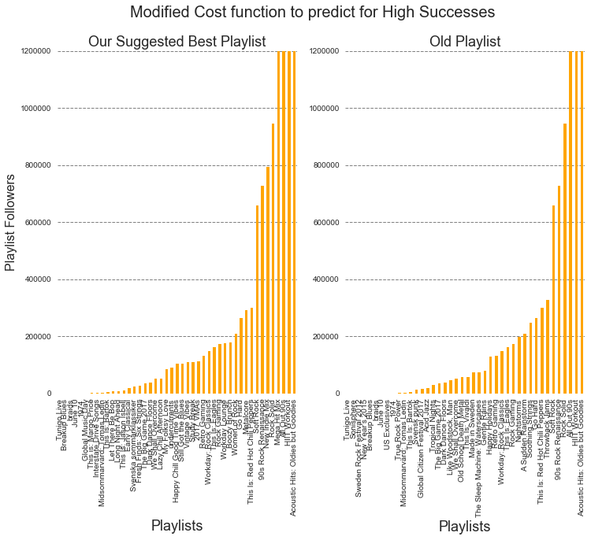
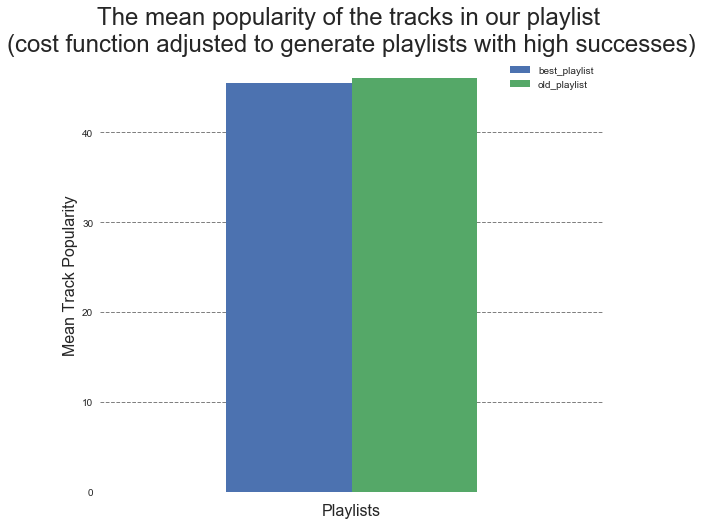
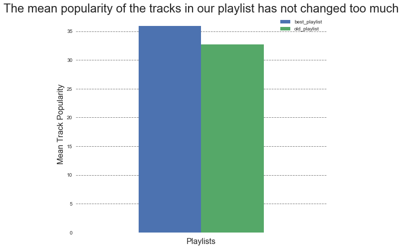

```python
%matplotlib inline
import numpy as np
import pandas as pd
import matplotlib
import spotipy
import spotipy.util as util
import sys

import matplotlib.pyplot as plt
from sklearn.linear_model import LogisticRegressionCV
import sklearn.metrics as metrics
from sklearn.preprocessing import PolynomialFeatures
from sklearn.discriminant_analysis import LinearDiscriminantAnalysis
from sklearn.discriminant_analysis import QuadraticDiscriminantAnalysis
from sklearn.neighbors import KNeighborsClassifier
from sklearn.tree import DecisionTreeClassifier
from sklearn.model_selection import cross_val_score
#import pydotplus
#import io
from sklearn.tree import export_graphviz
from IPython.display import Image
from IPython.display import display
from matplotlib import colors
import seaborn as sns

```


```python
from spotipy.oauth2 import SpotifyClientCredentials
client_credentials_manager = SpotifyClientCredentials(client_id='02320eb8112d4b00951525fbb50494b4', client_secret='5a72850d24844c7289da60ee357a9545')
sp = spotipy.Spotify(client_credentials_manager=client_credentials_manager)

#token = util.prompt_for_user_token(username='DOSER',scope='user-library-read',client_id='02320eb8112d4b00951525fbb50494b4',client_secret='5a72850d24844c7289da60ee357a9545',redirect_uri='http://localhost:8888/callback')
#sp = spotipy.Spotify(auth=token)
```

## Importing Data Generated From our EDA


```python
ER_DF_complete_1 = pd.read_csv('ER_DF_complete_1.csv')
ER_DF_complete_2 = pd.read_csv('ER_DF_complete_2.csv')
df_track_album_artist = pd.read_csv('DF_track_album_artist.csv')
df_without_albumtracks = pd.read_csv('df_without_albumtracks.csv')
Track_AudioFeatures_AllTracks = pd.read_csv('Track_AudioFeatures_AllTracks.csv')
```

## Smooth Annealing Algorithm
This function basically implments the smooth annealing algorithm which essentially find the global minimum of a function. Note the following function was obtained from and was modified for our application.


```python
def sa(energyfunc, initials, epochs, tempfunc, iterfunc, proposalfunc,old_playlist,remainingtracks):
    accumulator=[]
    #solution is just the probabilities of seeing a playlist 
    best_solution = old_solution = initials['solution']
    T=initials['T']
    length=initials['length']
    best_playlist = old_playlist #with individual track information
    #cost function
    best_energy = old_energy = energyfunc(old_solution)
    accepted=0
    total=0
    for index in range(epochs):
        print("Epoch", index)
        if index > 0:
            T = tempfunc(T)
            length=iterfunc(length)
        print("Temperature", T, "Length", length)
        for it in range(length):
            total+=1
            #new_solution = proposalfunc(old_solution) #import playlist spit out probability; solution proba
            new_solution = proposalfunc.predict_proba(get_mean_std_audio(old_playlist))
            new_solution = new_solution[0][1:3]
            new_energy = energyfunc(new_solution)
            new_playlist,remainingtracks = get_newplaylist(old_playlist,remainingtracks)
            
            # Use a min here as you could get a "probability" > 1
            alpha = min(1, np.exp((old_energy - new_energy)/T))
            if ((new_energy < old_energy) or (np.random.uniform() < alpha)):
                # Accept proposed solution
                accepted+=1
                accumulator.append((T, new_solution, new_energy))
                if new_energy < best_energy:
                    # Replace previous best with this one
                    best_energy = new_energy
                    best_solution = new_solution
                    best_index=total
                    best_temp=T
                    best_playlist = new_playlist
                old_energy = new_energy
                old_solution = new_solution
                old_playlist = new_playlist
            else:
                # Keep the old stuff
                accumulator.append((T, old_solution, old_energy))
    
    best_meta=dict(index=best_index, temp=best_temp)
    print("frac accepted", accepted/total, "total iterations", total, 'bmeta', best_meta)
    return best_meta, best_solution, best_energy, accumulator,best_playlist

```

## Split Audio Feature Data
We splitted the audio feature data into training and test set.
The 30 random tracks from the test set was used to generate a "seed" playlist. This can be thought of as a playlist that the user specifies. 
The rest of the test set was used to modify the playlist and make it better


```python
Track_AudioFeatures_AllTracks.drop(['Unnamed: 0','track_uri'],axis=1,inplace=True)
audio_trn, audio_tst = train_test_split(Track_AudioFeatures_AllTracks, test_size = 0.5,random_state = 0)

msk = np.random.rand(len(audio_tst)) < 0.001
#randomly generate playlist
audio_playlist_seed_trackid = audio_tst[msk]
#remaining tracks that would be used to modify playlist
remaining_tracks = audio_tst[~msk]

audio_playlist_seed = audio_playlist_seed_trackid.drop(['track_id'],axis=1,inplace=False)
audio_playlist_seed.head() #randomly generated playlist; info not aggregated
```


<div>
<style>
    .dataframe thead tr:only-child th {
        text-align: right;
    }

    .dataframe thead th {
        text-align: left;
    }

    .dataframe tbody tr th {
        vertical-align: top;
    }
</style>
<table border="1" class="dataframe">
  <thead>
    <tr style="text-align: right;">
      <th></th>
      <th>energy</th>
      <th>liveness</th>
      <th>tempo</th>
      <th>speechiness</th>
      <th>acousticness</th>
      <th>instrumentalness</th>
      <th>time_signature</th>
      <th>danceability</th>
      <th>key</th>
      <th>duration_ms</th>
      <th>loudness</th>
      <th>valence</th>
      <th>mode</th>
    </tr>
  </thead>
  <tbody>
    <tr>
      <th>27369</th>
      <td>0.9990</td>
      <td>0.9740</td>
      <td>114.008</td>
      <td>0.0549</td>
      <td>0.760000</td>
      <td>0.9340</td>
      <td>4.0</td>
      <td>0.166</td>
      <td>5.0</td>
      <td>129116.0</td>
      <td>-20.872</td>
      <td>0.00001</td>
      <td>1.0</td>
    </tr>
    <tr>
      <th>32441</th>
      <td>0.8720</td>
      <td>0.3200</td>
      <td>80.384</td>
      <td>0.0405</td>
      <td>0.000119</td>
      <td>0.0232</td>
      <td>4.0</td>
      <td>0.297</td>
      <td>3.0</td>
      <td>309987.0</td>
      <td>-5.881</td>
      <td>0.53300</td>
      <td>0.0</td>
    </tr>
    <tr>
      <th>41074</th>
      <td>0.7090</td>
      <td>0.1430</td>
      <td>139.986</td>
      <td>0.0339</td>
      <td>0.068700</td>
      <td>0.0000</td>
      <td>4.0</td>
      <td>0.555</td>
      <td>6.0</td>
      <td>225547.0</td>
      <td>-7.375</td>
      <td>0.40200</td>
      <td>0.0</td>
    </tr>
    <tr>
      <th>39287</th>
      <td>0.0718</td>
      <td>0.0771</td>
      <td>56.363</td>
      <td>0.0397</td>
      <td>0.981000</td>
      <td>0.8810</td>
      <td>4.0</td>
      <td>0.201</td>
      <td>5.0</td>
      <td>590293.0</td>
      <td>-24.800</td>
      <td>0.03930</td>
      <td>1.0</td>
    </tr>
    <tr>
      <th>37592</th>
      <td>0.1570</td>
      <td>0.0520</td>
      <td>112.888</td>
      <td>0.0406</td>
      <td>0.990000</td>
      <td>0.8740</td>
      <td>4.0</td>
      <td>0.303</td>
      <td>11.0</td>
      <td>257973.0</td>
      <td>-19.231</td>
      <td>0.08350</td>
      <td>0.0</td>
    </tr>
  </tbody>
</table>
</div>


```python
'''
Just obtaining the mean and std of the audio features for each playlist
'''
#aggregate tracks in a playlist 
def get_mean_std_audio(df_audioinfo):
    audio_playlist_seed_agg = pd.DataFrame(columns = df_audioinfo.columns+'mean')
    audio_playlist_seed_agg.loc[0,audio_playlist_seed_agg.columns] = df_audioinfo.mean().values

    audio_playlist_seed_agg2 = pd.DataFrame(columns = df_audioinfo.columns + 'std')
    audio_playlist_seed_agg2.loc[0,audio_playlist_seed_agg2.columns] = df_audioinfo.std().values

    audio_playlist_seed_aggFinal = pd.concat([audio_playlist_seed_agg,audio_playlist_seed_agg2],axis=1)
    return audio_playlist_seed_aggFinal

#mean std dataframe
audio_final_df_playlist_seed = get_mean_std_audio(audio_playlist_seed)
audio_final_df_playlist_seed.head()
```


<div>
<style>
    .dataframe thead tr:only-child th {
        text-align: right;
    }

    .dataframe thead th {
        text-align: left;
    }

    .dataframe tbody tr th {
        vertical-align: top;
    }
</style>
<table border="1" class="dataframe">
  <thead>
    <tr style="text-align: right;">
      <th></th>
      <th>energymean</th>
      <th>livenessmean</th>
      <th>tempomean</th>
      <th>speechinessmean</th>
      <th>acousticnessmean</th>
      <th>instrumentalnessmean</th>
      <th>time_signaturemean</th>
      <th>danceabilitymean</th>
      <th>keymean</th>
      <th>duration_msmean</th>
      <th>...</th>
      <th>speechinessstd</th>
      <th>acousticnessstd</th>
      <th>instrumentalnessstd</th>
      <th>time_signaturestd</th>
      <th>danceabilitystd</th>
      <th>keystd</th>
      <th>duration_msstd</th>
      <th>loudnessstd</th>
      <th>valencestd</th>
      <th>modestd</th>
    </tr>
  </thead>
  <tbody>
    <tr>
      <th>0</th>
      <td>0.526757</td>
      <td>0.235161</td>
      <td>116.103</td>
      <td>0.181896</td>
      <td>0.51041</td>
      <td>0.228729</td>
      <td>3.78261</td>
      <td>0.536391</td>
      <td>4.34783</td>
      <td>250176</td>
      <td>...</td>
      <td>0.302632</td>
      <td>0.344497</td>
      <td>0.393748</td>
      <td>0.735868</td>
      <td>0.184827</td>
      <td>3.2975</td>
      <td>123689</td>
      <td>7.24212</td>
      <td>0.214279</td>
      <td>0.50687</td>
    </tr>
  </tbody>
</table>
<p>1 rows × 26 columns</p>
</div>


```python
'''
A function to replace tracks in the playlist. 
The algorithm will call this function.
'''
#this function will be used to incorporate tracks into the playlist
def get_newplaylist(oldplaylist,remainingtracks):
    sizeofsample = len(oldplaylist)-1
    newplaylist = oldplaylist.sample(sizeofsample)
    #index of the track to add
    add_track_index = np.random.choice(remainingtracks.index.values, 1, replace=False)
    #track to add
    add_track = remainingtracks[remainingtracks.index.values == add_track_index]
    #remaining tracks after taking a track from the remaining track
    remainingtracks = remainingtracks[remainingtracks.index.values!=add_track_index]
    newplaylist = pd.concat([newplaylist,add_track])
    
    return newplaylist,remainingtracks

```


```python
'''
process audio data extracting mean and std. transforming it to a feature for playlist
'''
dftemp = Track_AudioFeatures_AllTracks.copy()
dftemp = dftemp.drop(['track_id'],axis=1)
df_audio_combined = Track_AudioFeatures_AllTracks.merge(ER_DF_complete_1.loc[:,['playlist_id','track_id','playlist_followers']],on = ['track_id'],how='inner')
df_audio_combined = df_audio_combined.drop('track_id',axis=1)
df_audio_combined1 = pd.DataFrame((df_audio_combined.groupby('playlist_id').mean()).loc[:,dftemp.columns].values)
df_audio_combined1.columns = dftemp.columns +'mean'
df_audio_combined2 = pd.DataFrame((df_audio_combined.groupby('playlist_id').std()).loc[:,dftemp.columns].values)
df_audio_combined2.columns = dftemp.columns + 'std'
Y_followers = pd.DataFrame(df_audio_combined.groupby('playlist_id').mean().playlist_followers.values)
Y_followers.columns = ['playlist_followers']
df_audio_final = pd.concat([df_audio_combined1,df_audio_combined2,Y_followers],axis=1)


```


```python
df_audio_combined.head()
```


<div>
<style>
    .dataframe thead tr:only-child th {
        text-align: right;
    }

    .dataframe thead th {
        text-align: left;
    }

    .dataframe tbody tr th {
        vertical-align: top;
    }
</style>
<table border="1" class="dataframe">
  <thead>
    <tr style="text-align: right;">
      <th></th>
      <th>energy</th>
      <th>liveness</th>
      <th>tempo</th>
      <th>speechiness</th>
      <th>acousticness</th>
      <th>instrumentalness</th>
      <th>time_signature</th>
      <th>danceability</th>
      <th>key</th>
      <th>duration_ms</th>
      <th>loudness</th>
      <th>valence</th>
      <th>mode</th>
      <th>playlist_id</th>
      <th>playlist_followers</th>
    </tr>
  </thead>
  <tbody>
    <tr>
      <th>0</th>
      <td>0.828</td>
      <td>0.2880</td>
      <td>115.648</td>
      <td>0.0521</td>
      <td>0.0245</td>
      <td>0.0108</td>
      <td>4.0</td>
      <td>0.566</td>
      <td>0.0</td>
      <td>320227.0</td>
      <td>-6.800</td>
      <td>0.737</td>
      <td>1.0</td>
      <td>37i9dQZF1DX1zGrZmezKvb</td>
      <td>219</td>
    </tr>
    <tr>
      <th>1</th>
      <td>0.830</td>
      <td>0.0882</td>
      <td>140.732</td>
      <td>0.0954</td>
      <td>0.5390</td>
      <td>0.0000</td>
      <td>4.0</td>
      <td>0.689</td>
      <td>8.0</td>
      <td>171560.0</td>
      <td>-8.774</td>
      <td>0.815</td>
      <td>1.0</td>
      <td>37i9dQZF1DX9XIFQuFvzM4</td>
      <td>1885187</td>
    </tr>
    <tr>
      <th>2</th>
      <td>0.479</td>
      <td>0.0808</td>
      <td>118.117</td>
      <td>0.0279</td>
      <td>0.7470</td>
      <td>0.3100</td>
      <td>4.0</td>
      <td>0.544</td>
      <td>3.0</td>
      <td>302880.0</td>
      <td>-10.878</td>
      <td>0.434</td>
      <td>1.0</td>
      <td>37i9dQZF1DWTVIaV4KJYuq</td>
      <td>408789</td>
    </tr>
    <tr>
      <th>3</th>
      <td>0.479</td>
      <td>0.0808</td>
      <td>118.117</td>
      <td>0.0279</td>
      <td>0.7470</td>
      <td>0.3100</td>
      <td>4.0</td>
      <td>0.544</td>
      <td>3.0</td>
      <td>302880.0</td>
      <td>-10.878</td>
      <td>0.434</td>
      <td>1.0</td>
      <td>37i9dQZF1DWXmlLSKkfdAk</td>
      <td>2314099</td>
    </tr>
    <tr>
      <th>4</th>
      <td>0.267</td>
      <td>0.1060</td>
      <td>96.975</td>
      <td>0.0284</td>
      <td>0.7200</td>
      <td>0.9130</td>
      <td>4.0</td>
      <td>0.385</td>
      <td>5.0</td>
      <td>218867.0</td>
      <td>-15.564</td>
      <td>0.155</td>
      <td>1.0</td>
      <td>37i9dQZF1DWZtZ8vUCzche</td>
      <td>156765</td>
    </tr>
  </tbody>
</table>
</div>


## Training a Classifier
The followers (response variable) was divided into quantiles and the trained classifier will be used in the algorithm to predict the probability of being in the top quantile of followers. The probability was then fed into a cost function so that we maximize the chance of being in the top quantile


```python
'''
Traing LogiticRegression Classifier
by dividing the followers by quantiles we are making it into a classification problem
'''
#divide the followers by quantiles
q =  [0, .25, .5, .75, 1.]
df = df_audio_final.copy()
df['playlist_followers'] = pd.qcut(df['playlist_followers'], q,labels = False)
#split data into training and test
data_train, data_test = train_test_split(df, test_size = 0.5,random_state = 0)
ytrain = data_train['playlist_followers']
xtrain = data_train.drop(['playlist_followers'],axis = 1)
ytest = data_test['playlist_followers']
xtest = data_test.drop(['playlist_followers'],axis = 1)
clf = LogisticRegressionCV(Cs=10,penalty = 'l2')
clf.fit(xtrain, ytrain)

```


    LogisticRegressionCV(Cs=10, class_weight=None, cv=None, dual=False,
               fit_intercept=True, intercept_scaling=1.0, max_iter=100,
               multi_class='ovr', n_jobs=1, penalty='l2', random_state=None,
               refit=True, scoring=None, solver='lbfgs', tol=0.0001, verbose=0)


## Initializing the function and Running it!


```python
import math
tf = lambda t: 0.8*t #temperature function
itf = lambda length: math.ceil(1.2*length) #iteration function
ep = 30
#energy function; just a cost function
ef = lambda x: 10**4*(1-(0.25*x[0] + 0.75*x[1]))
#initial conditions
soln = clf.predict_proba(audio_final_df_playlist_seed)#audio_final_df_playlist_seed just aggregated the track info
soln = soln[0][1:3]
#just making a copy of the the remaining tracks
remain_t= remaining_tracks.copy()
remain_t.drop('track_id',inplace=True,axis=1)
#dictionary of initialization
inits=dict(solution=soln, length=25, T=100)

#we just need the best playlist
b_meta, b_solution, b_energy, accum,b_playlist = sa(ef, inits, ep, tf, itf,
                                                                      clf,audio_playlist_seed,remain_t)


```

    Epoch 0
    Temperature 100 Length 25
    Epoch 1
    Temperature 80.0 Length 30
    Epoch 2
    Temperature 64.0 Length 36
    Epoch 3
    Temperature 51.2 Length 44
    Epoch 4
    Temperature 40.96000000000001 Length 53
    Epoch 5
    Temperature 32.76800000000001 Length 64
    Epoch 6
    Temperature 26.21440000000001 Length 77
    Epoch 7
    Temperature 20.97152000000001 Length 93
    Epoch 8
    Temperature 16.777216000000006 Length 112
    Epoch 9
    Temperature 13.421772800000006 Length 135
    Epoch 10
    Temperature 10.737418240000006 Length 162
    Epoch 11
    Temperature 8.589934592000004 Length 195
    Epoch 12
    Temperature 6.871947673600004 Length 234
    Epoch 13
    Temperature 5.497558138880003 Length 281
    Epoch 14
    Temperature 4.398046511104003 Length 338
    Epoch 15
    Temperature 3.5184372088832023 Length 406
    Epoch 16
    Temperature 2.814749767106562 Length 488
    Epoch 17
    Temperature 2.25179981368525 Length 586
    Epoch 18
    Temperature 1.8014398509482001 Length 704
    Epoch 19
    Temperature 1.4411518807585602 Length 845
    Epoch 20
    Temperature 1.1529215046068482 Length 1014
    Epoch 21
    Temperature 0.9223372036854786 Length 1217
    Epoch 22
    Temperature 0.7378697629483829 Length 1461
    Epoch 23
    Temperature 0.5902958103587064 Length 1754
    Epoch 24
    Temperature 0.4722366482869651 Length 2105
    Epoch 25
    Temperature 0.3777893186295721 Length 2526
    Epoch 26
    Temperature 0.3022314549036577 Length 3032
    Epoch 27
    Temperature 0.24178516392292618 Length 3639
    Epoch 28
    Temperature 0.19342813113834095 Length 4367
    Epoch 29
    Temperature 0.15474250491067276 Length 5241
    frac accepted 0.004957778915046059 total iterations 31264 bmeta {'index': 25, 'temp': 100}


## This is our Seeded playlist


```python
oldPlaylist_trackID_additional.loc[:,['artist_name','track_name']]

```


<div>
<style>
    .dataframe thead tr:only-child th {
        text-align: right;
    }

    .dataframe thead th {
        text-align: left;
    }

    .dataframe tbody tr th {
        vertical-align: top;
    }
</style>
<table border="1" class="dataframe">
  <thead>
    <tr style="text-align: right;">
      <th></th>
      <th>artist_name</th>
      <th>track_name</th>
    </tr>
  </thead>
  <tbody>
    <tr>
      <th>0</th>
      <td>Red Hot Chili Peppers</td>
      <td>Under The Bridge</td>
    </tr>
    <tr>
      <th>1</th>
      <td>Red Hot Chili Peppers</td>
      <td>Under The Bridge</td>
    </tr>
    <tr>
      <th>2</th>
      <td>Red Hot Chili Peppers</td>
      <td>Under The Bridge</td>
    </tr>
    <tr>
      <th>3</th>
      <td>Red Hot Chili Peppers</td>
      <td>Under The Bridge</td>
    </tr>
    <tr>
      <th>4</th>
      <td>Red Hot Chili Peppers</td>
      <td>Under The Bridge</td>
    </tr>
    <tr>
      <th>5</th>
      <td>Red Hot Chili Peppers</td>
      <td>Under The Bridge</td>
    </tr>
    <tr>
      <th>6</th>
      <td>Red Hot Chili Peppers</td>
      <td>Under The Bridge</td>
    </tr>
    <tr>
      <th>7</th>
      <td>Red Hot Chili Peppers</td>
      <td>Under The Bridge</td>
    </tr>
    <tr>
      <th>8</th>
      <td>Mother Nature Sound FX</td>
      <td>Caribbean Thunderstorm</td>
    </tr>
    <tr>
      <th>9</th>
      <td>Mother Nature Sound FX</td>
      <td>Caribbean Thunderstorm</td>
    </tr>
    <tr>
      <th>10</th>
      <td>Mother Nature Sound FX</td>
      <td>Caribbean Thunderstorm</td>
    </tr>
    <tr>
      <th>11</th>
      <td>Mother Nature Sound FX</td>
      <td>Caribbean Thunderstorm</td>
    </tr>
    <tr>
      <th>12</th>
      <td>Mother Nature Sound FX</td>
      <td>Caribbean Thunderstorm</td>
    </tr>
    <tr>
      <th>13</th>
      <td>Showtek</td>
      <td>Believer - Frontliner Remix</td>
    </tr>
    <tr>
      <th>14</th>
      <td>Lady Gaga</td>
      <td>Poker Face</td>
    </tr>
    <tr>
      <th>15</th>
      <td>Tigirlily</td>
      <td>Just Another Breakup Song</td>
    </tr>
    <tr>
      <th>16</th>
      <td>Gene Autry</td>
      <td>Rudolph the Red-Nosed Reindeer</td>
    </tr>
    <tr>
      <th>17</th>
      <td>Donika Nimani</td>
      <td>We Were on a Break (Precis som Ross &amp; Rach)</td>
    </tr>
    <tr>
      <th>18</th>
      <td>Iggy Azalea</td>
      <td>Work</td>
    </tr>
    <tr>
      <th>19</th>
      <td>Case Studies</td>
      <td>Driving East, And Through Her</td>
    </tr>
    <tr>
      <th>20</th>
      <td>Case Studies</td>
      <td>Driving East, And Through Her</td>
    </tr>
    <tr>
      <th>21</th>
      <td>Chase &amp; Status</td>
      <td>Blind Faith</td>
    </tr>
    <tr>
      <th>22</th>
      <td>Bo Donaldson &amp; The Heywoods</td>
      <td>Billy, Don't Be A Hero</td>
    </tr>
    <tr>
      <th>23</th>
      <td>Max Richter</td>
      <td>On Reflection</td>
    </tr>
    <tr>
      <th>24</th>
      <td>Rain Sounds of Brentwood</td>
      <td>Tropical Rain with Distant Thunder</td>
    </tr>
    <tr>
      <th>25</th>
      <td>No Doubt</td>
      <td>Just A Girl</td>
    </tr>
    <tr>
      <th>26</th>
      <td>No Doubt</td>
      <td>Just A Girl</td>
    </tr>
    <tr>
      <th>27</th>
      <td>Eagles</td>
      <td>One Of These Nights</td>
    </tr>
    <tr>
      <th>28</th>
      <td>Eagles</td>
      <td>One Of These Nights</td>
    </tr>
    <tr>
      <th>29</th>
      <td>Night Ranger</td>
      <td>Sister Christian</td>
    </tr>
    <tr>
      <th>30</th>
      <td>Antonio Vivaldi</td>
      <td>Concerto in C Major for Two Trumpets and Strin...</td>
    </tr>
    <tr>
      <th>31</th>
      <td>Alonzo Fas 3</td>
      <td>Ett meningsfullt liv</td>
    </tr>
    <tr>
      <th>32</th>
      <td>Martin Luther King, Jr.</td>
      <td>Civil Rights &amp; Social Privilege</td>
    </tr>
    <tr>
      <th>33</th>
      <td>Groove Collective</td>
      <td>Anthem</td>
    </tr>
    <tr>
      <th>34</th>
      <td>Tomas Ledin</td>
      <td>Sommaren är kort - Live In Sweden / 1993</td>
    </tr>
    <tr>
      <th>35</th>
      <td>Gruesome</td>
      <td>Dimensions of Horror</td>
    </tr>
    <tr>
      <th>36</th>
      <td>Rihanna</td>
      <td>Pon de Replay</td>
    </tr>
    <tr>
      <th>37</th>
      <td>Johnny Winter</td>
      <td>Leland Mississippi Blues - Live at The Woodsto...</td>
    </tr>
    <tr>
      <th>38</th>
      <td>Arch Enemy</td>
      <td>Vultures</td>
    </tr>
    <tr>
      <th>39</th>
      <td>Mark Greene</td>
      <td>Neon Lights - Jonno &amp; Gibson Remix</td>
    </tr>
    <tr>
      <th>40</th>
      <td>Seinabo Sey</td>
      <td>Hard Time - Kretsen Remix</td>
    </tr>
    <tr>
      <th>41</th>
      <td>Light Asylum</td>
      <td>Heart of Dust</td>
    </tr>
    <tr>
      <th>42</th>
      <td>Béla Bartók</td>
      <td>Mikrokosmos: 7 Pieces for 2 Pianos, 4 Hands, B...</td>
    </tr>
  </tbody>
</table>
</div>


## This our Suggested Playlist


```python
bestPlaylist_trackID_additional.loc[:,['artist_name','track_name']]
```


<div>
<style>
    .dataframe thead tr:only-child th {
        text-align: right;
    }

    .dataframe thead th {
        text-align: left;
    }

    .dataframe tbody tr th {
        vertical-align: top;
    }
</style>
<table border="1" class="dataframe">
  <thead>
    <tr style="text-align: right;">
      <th></th>
      <th>artist_name</th>
      <th>track_name</th>
    </tr>
  </thead>
  <tbody>
    <tr>
      <th>0</th>
      <td>Béla Bartók</td>
      <td>Mikrokosmos: 7 Pieces for 2 Pianos, 4 Hands, B...</td>
    </tr>
    <tr>
      <th>1</th>
      <td>Eagles</td>
      <td>One Of These Nights</td>
    </tr>
    <tr>
      <th>2</th>
      <td>Eagles</td>
      <td>One Of These Nights</td>
    </tr>
    <tr>
      <th>3</th>
      <td>Chase &amp; Status</td>
      <td>Blind Faith</td>
    </tr>
    <tr>
      <th>4</th>
      <td>Wolfgang Amadeus Mozart</td>
      <td>Così fan tutte, K. 588: Sinfonia</td>
    </tr>
    <tr>
      <th>5</th>
      <td>Braids</td>
      <td>Amends</td>
    </tr>
    <tr>
      <th>6</th>
      <td>Braids</td>
      <td>Amends</td>
    </tr>
    <tr>
      <th>7</th>
      <td>Seinabo Sey</td>
      <td>Hard Time - Kretsen Remix</td>
    </tr>
    <tr>
      <th>8</th>
      <td>Lasse Berghagen</td>
      <td>En kväll i juni</td>
    </tr>
    <tr>
      <th>9</th>
      <td>Orbital Plane</td>
      <td>I Am Love</td>
    </tr>
    <tr>
      <th>10</th>
      <td>Orbital Plane</td>
      <td>I Am Love</td>
    </tr>
    <tr>
      <th>11</th>
      <td>Martin Luther King, Jr.</td>
      <td>Civil Rights &amp; Social Privilege</td>
    </tr>
    <tr>
      <th>12</th>
      <td>Jason Isbell and the 400 Unit</td>
      <td>Last of My Kind</td>
    </tr>
    <tr>
      <th>13</th>
      <td>Red Hot Chili Peppers</td>
      <td>Under The Bridge</td>
    </tr>
    <tr>
      <th>14</th>
      <td>Red Hot Chili Peppers</td>
      <td>Under The Bridge</td>
    </tr>
    <tr>
      <th>15</th>
      <td>Red Hot Chili Peppers</td>
      <td>Under The Bridge</td>
    </tr>
    <tr>
      <th>16</th>
      <td>Red Hot Chili Peppers</td>
      <td>Under The Bridge</td>
    </tr>
    <tr>
      <th>17</th>
      <td>Red Hot Chili Peppers</td>
      <td>Under The Bridge</td>
    </tr>
    <tr>
      <th>18</th>
      <td>Red Hot Chili Peppers</td>
      <td>Under The Bridge</td>
    </tr>
    <tr>
      <th>19</th>
      <td>Red Hot Chili Peppers</td>
      <td>Under The Bridge</td>
    </tr>
    <tr>
      <th>20</th>
      <td>Red Hot Chili Peppers</td>
      <td>Under The Bridge</td>
    </tr>
    <tr>
      <th>21</th>
      <td>Tomas Ledin</td>
      <td>Sommaren är kort - Live In Sweden / 1993</td>
    </tr>
    <tr>
      <th>22</th>
      <td>Rattlerette</td>
      <td>Here Be Dragons</td>
    </tr>
    <tr>
      <th>23</th>
      <td>Rattlerette</td>
      <td>Here Be Dragons</td>
    </tr>
    <tr>
      <th>24</th>
      <td>Bo Donaldson &amp; The Heywoods</td>
      <td>Billy, Don't Be A Hero</td>
    </tr>
    <tr>
      <th>25</th>
      <td>Miike Snow</td>
      <td>Song for No One</td>
    </tr>
    <tr>
      <th>26</th>
      <td>Mark Greene</td>
      <td>Neon Lights - Jonno &amp; Gibson Remix</td>
    </tr>
    <tr>
      <th>27</th>
      <td>Andy Palacio</td>
      <td>Wátina (I Called Out)</td>
    </tr>
    <tr>
      <th>28</th>
      <td>Miss May I</td>
      <td>Shadows Inside</td>
    </tr>
    <tr>
      <th>29</th>
      <td>Taylor Swift</td>
      <td>Look What You Made Me Do</td>
    </tr>
    <tr>
      <th>30</th>
      <td>Taylor Swift</td>
      <td>Look What You Made Me Do</td>
    </tr>
    <tr>
      <th>31</th>
      <td>Taylor Swift</td>
      <td>Look What You Made Me Do</td>
    </tr>
    <tr>
      <th>32</th>
      <td>Taylor Swift</td>
      <td>Look What You Made Me Do</td>
    </tr>
    <tr>
      <th>33</th>
      <td>Showtek</td>
      <td>Believer - Frontliner Remix</td>
    </tr>
    <tr>
      <th>34</th>
      <td>Eastmountainsouth</td>
      <td>So Are You To Me</td>
    </tr>
    <tr>
      <th>35</th>
      <td>Tigirlily</td>
      <td>Just Another Breakup Song</td>
    </tr>
    <tr>
      <th>36</th>
      <td>Fats Navarro</td>
      <td>The Chase</td>
    </tr>
    <tr>
      <th>37</th>
      <td>Walter Trout</td>
      <td>Gonna Hurt Like Hell (feat. Kenny Wayne Shepherd)</td>
    </tr>
    <tr>
      <th>38</th>
      <td>Suzi Quatro</td>
      <td>If You Can't Give Me Love</td>
    </tr>
    <tr>
      <th>39</th>
      <td>Margo Price</td>
      <td>Hurtin' (On the Bottle)</td>
    </tr>
    <tr>
      <th>40</th>
      <td>Margo Price</td>
      <td>Hurtin' (On the Bottle)</td>
    </tr>
    <tr>
      <th>41</th>
      <td>Margo Price</td>
      <td>Hurtin' (On the Bottle)</td>
    </tr>
    <tr>
      <th>42</th>
      <td>Lady Gaga</td>
      <td>Poker Face</td>
    </tr>
    <tr>
      <th>43</th>
      <td>Fuel</td>
      <td>Shimmer - Single Version</td>
    </tr>
    <tr>
      <th>44</th>
      <td>Curls</td>
      <td>Emotion</td>
    </tr>
  </tbody>
</table>
</div>


## Now we are attachking track_ids to the tracks in our newly generated playlist
We are doing this to explore the characteristics of the generated playlist


```python
#just add track id to best playlist
bestPlaylist_trackID = b_playlist.merge(pd.DataFrame(Track_AudioFeatures_AllTracks['track_id']),right_index=True,left_index=True, how='inner')
#obtain additional features for old playlist
oldPlaylist_trackID_additional = audio_playlist_seed_trackid.merge(ER_DF_complete_1,on='track_id',how='inner')

#obtain additional features for bestplaylist
bestPlaylist_trackID_additional = bestPlaylist_trackID.merge(ER_DF_complete_1,on='track_id',how='inner')
bestPlaylist_trackID_additional.head()
```


<div>
<style>
    .dataframe thead tr:only-child th {
        text-align: right;
    }

    .dataframe thead th {
        text-align: left;
    }

    .dataframe tbody tr th {
        vertical-align: top;
    }
</style>
<table border="1" class="dataframe">
  <thead>
    <tr style="text-align: right;">
      <th></th>
      <th>energy</th>
      <th>liveness</th>
      <th>tempo</th>
      <th>speechiness</th>
      <th>acousticness</th>
      <th>instrumentalness</th>
      <th>time_signature</th>
      <th>danceability</th>
      <th>key</th>
      <th>duration_ms</th>
      <th>...</th>
      <th>album_id</th>
      <th>artist_id</th>
      <th>artist_name</th>
      <th>playlist_followers</th>
      <th>playlist_id</th>
      <th>playlist_name</th>
      <th>track_duration(ms)</th>
      <th>track_name</th>
      <th>track_number</th>
      <th>track_popularity</th>
    </tr>
  </thead>
  <tbody>
    <tr>
      <th>0</th>
      <td>0.1800</td>
      <td>0.108</td>
      <td>93.082</td>
      <td>0.0525</td>
      <td>0.671</td>
      <td>0.615</td>
      <td>1.0</td>
      <td>0.351</td>
      <td>8.0</td>
      <td>261987.0</td>
      <td>...</td>
      <td>3jeTB3j3QmUs8SPIVleHtU</td>
      <td>5l8VQNuIg0turYE1VtM9zV</td>
      <td>Leonard Cohen</td>
      <td>129860</td>
      <td>37i9dQZF1DWVpFvorxSZ6K</td>
      <td>This Is: Leonard Cohen</td>
      <td>261986</td>
      <td>It Seemed the Better Way</td>
      <td>7</td>
      <td>51</td>
    </tr>
    <tr>
      <th>1</th>
      <td>0.0101</td>
      <td>0.106</td>
      <td>94.211</td>
      <td>0.2600</td>
      <td>0.896</td>
      <td>0.000</td>
      <td>4.0</td>
      <td>0.457</td>
      <td>2.0</td>
      <td>733067.0</td>
      <td>...</td>
      <td>6k7rZXvU0hNjd4bTljxp3U</td>
      <td>2424G4yH7tJBPlbAoiVmc3</td>
      <td>Penton Overseas, Inc.</td>
      <td>79336</td>
      <td>37i9dQZF1DWTJSgpZmw7H2</td>
      <td>Learn French</td>
      <td>733066</td>
      <td>Adjectives, Adverbs, Prepositions, Conjunctions 4</td>
      <td>4</td>
      <td>2</td>
    </tr>
    <tr>
      <th>2</th>
      <td>0.1570</td>
      <td>0.052</td>
      <td>112.888</td>
      <td>0.0406</td>
      <td>0.990</td>
      <td>0.874</td>
      <td>4.0</td>
      <td>0.303</td>
      <td>11.0</td>
      <td>257973.0</td>
      <td>...</td>
      <td>4bWLEbpYaale8pc0pDQe1F</td>
      <td>15NSFL63oPhmpXLcZHny2N</td>
      <td>Fazıl Say</td>
      <td>135600</td>
      <td>37i9dQZF1DXah8e1pvF5oE</td>
      <td>Piano 100: Spotify Picks</td>
      <td>257972</td>
      <td>Sevenlere Dair, Op. 12/3</td>
      <td>5</td>
      <td>39</td>
    </tr>
    <tr>
      <th>3</th>
      <td>0.0677</td>
      <td>0.288</td>
      <td>82.097</td>
      <td>0.0388</td>
      <td>0.951</td>
      <td>0.775</td>
      <td>3.0</td>
      <td>0.247</td>
      <td>3.0</td>
      <td>962067.0</td>
      <td>...</td>
      <td>7rlxqGPPD528fqY8YC9ivh</td>
      <td>2wOqMjp9TyABvtHdOSOTUS</td>
      <td>Ludwig van Beethoven</td>
      <td>160104</td>
      <td>37i9dQZF1DX12YIlzNkccL</td>
      <td>This Is: Beethoven</td>
      <td>962066</td>
      <td>Beethoven: Symphony No. 3 in E-Flat Major, Op....</td>
      <td>5</td>
      <td>45</td>
    </tr>
    <tr>
      <th>4</th>
      <td>0.0677</td>
      <td>0.288</td>
      <td>82.097</td>
      <td>0.0388</td>
      <td>0.951</td>
      <td>0.775</td>
      <td>3.0</td>
      <td>0.247</td>
      <td>3.0</td>
      <td>962067.0</td>
      <td>...</td>
      <td>7rlxqGPPD528fqY8YC9ivh</td>
      <td>2wOqMjp9TyABvtHdOSOTUS</td>
      <td>Ludwig van Beethoven</td>
      <td>41605</td>
      <td>37i9dQZF1DXddGd6mP5X2a</td>
      <td>Orchestra 100: Spotify Picks</td>
      <td>962066</td>
      <td>Beethoven: Symphony No. 3 in E-Flat Major, Op....</td>
      <td>5</td>
      <td>45</td>
    </tr>
  </tbody>
</table>
<p>5 rows × 25 columns</p>
</div>


## Exploring the Generated Playlist


```python
#Mean Popularity of our New Playlist
fig,ax = fig,ax = plt.subplots(1,2,figsize=(12,8))
bestPlaylist_trackID_additional.groupby('playlist_name').mean().playlist_followers.sort_values(ascending=True).plot(kind='bar',ax=ax[0],color='orange')
oldPlaylist_trackID_additional.groupby('playlist_name').mean().playlist_followers.sort_values(ascending=True).plot(kind='bar',ax=ax[1],color='orange')


#ax[0].set_xticklabels('')
ax[0].set_xlabel('Playlists',fontsize = 18)
ax[0].set_ylabel('Playlist Followers',fontsize = 16)
ax[0].set_ylim([0,1200000])
ax[0].set_axis_bgcolor('white')
ax[0].grid(b=None, which='major', axis='y', color='gray', linestyle='--', linewidth=1)
ax[0].set_title('Our Suggested Best Playlist',fontsize = 18)

#ax[1].set_xticklabels('')
ax[1].set_xlabel('Playlists',fontsize = 18)
ax[1].set_ylim([0,1200000])
ax[1].set_axis_bgcolor('white')
ax[1].grid(b=None, which='major', axis='y', color='gray', linestyle='--', linewidth=1)
ax[1].set_title('Old Playlist',fontsize = 18)

plt.suptitle('Modified Cost function to predict for High Successes', fontsize = 20)


```

    /Users/erho1100/anaconda/lib/python3.6/site-packages/ipykernel_launcher.py:12: MatplotlibDeprecationWarning: The set_axis_bgcolor function was deprecated in version 2.0. Use set_facecolor instead.
      if sys.path[0] == '':
    /Users/erho1100/anaconda/lib/python3.6/site-packages/ipykernel_launcher.py:19: MatplotlibDeprecationWarning: The set_axis_bgcolor function was deprecated in version 2.0. Use set_facecolor instead.


    <matplotlib.text.Text at 0x13c144c88>





```python
#Mean Popularity of our New Playlist
fig,ax = fig,ax = plt.subplots(1,1,figsize=(9,8))
best_mean_trk_pop = bestPlaylist_trackID_additional.mean().track_popularity
old_mean_trk_pop = oldPlaylist_trackID_additional.mean().track_popularity
mean_track_pop = pd.DataFrame(index =[0], columns=['best_playlist','old_playlist'])
mean_track_pop= mean_track_pop.fillna({'best_playlist':best_mean_trk_pop,'old_playlist':old_mean_trk_pop})
mean_track_pop.plot(kind='bar',ax=ax)

ax.set_xlabel('Playlists',fontsize=16)
ax.set_ylabel('Mean Track Popularity',fontsize=16)
ax.set_axis_bgcolor('white')
ax.grid(b=None, which='major', axis='y', color='gray', linestyle='--', linewidth=1)
ax.set_title('The mean popularity of the tracks in our playlist \n(cost function adjusted to generate playlists with high successes)',fontsize=24)
ax.set_xticklabels('')

```

    /Users/erho1100/anaconda/lib/python3.6/site-packages/ipykernel_launcher.py:11: MatplotlibDeprecationWarning: The set_axis_bgcolor function was deprecated in version 2.0. Use set_facecolor instead.
      # This is added back by InteractiveShellApp.init_path()


    []





```python
#Mean Popularity of our New Playlist
fig,ax = fig,ax = plt.subplots(1,1,figsize=(9,8))
best_mean_trk_pop = bestPlaylist_trackID_additional.mean().track_popularity
old_mean_trk_pop = oldPlaylist_trackID_additional.mean().track_popularity
mean_track_pop = pd.DataFrame(index =[0], columns=['best_playlist','old_playlist'])
mean_track_pop= mean_track_pop.fillna({'best_playlist':best_mean_trk_pop,'old_playlist':old_mean_trk_pop})
mean_track_pop.plot(kind='bar',ax=ax)

ax.set_xlabel('Playlists',fontsize=16)
ax.set_ylabel('Mean Track Popularity',fontsize=16)
ax.set_axis_bgcolor('white')
ax.grid(b=None, which='major', axis='y', color='gray', linestyle='--', linewidth=1)
ax.set_title('The mean popularity of the tracks in our playlist has not changed too much',fontsize=24)
ax.set_xticklabels('')

```

    /Users/erho1100/anaconda/lib/python3.6/site-packages/ipykernel_launcher.py:11: MatplotlibDeprecationWarning: The set_axis_bgcolor function was deprecated in version 2.0. Use set_facecolor instead.
      # This is added back by InteractiveShellApp.init_path()


    []




