```python
%matplotlib inline
import numpy as np
import pandas as pd
import matplotlib
import spotipy
import spotipy.util as util
from spotipy.oauth2 import SpotifyClientCredentials
import sys
import matplotlib.pyplot as plt
from time import sleep
from collections import Counter
from sklearn.linear_model import LinearRegression
from sklearn.metrics import mean_squared_error, r2_score
import statsmodels.api as sm
from statsmodels.api import OLS
from sklearn.preprocessing import PolynomialFeatures
from sklearn.linear_model import Ridge
from sklearn.linear_model import Lasso
from sklearn.linear_model import RidgeCV
from sklearn.linear_model import LassoCV
from sklearn.model_selection import GridSearchCV
from sklearn.decomposition import PCA
from sklearn.preprocessing import MinMaxScaler
from sklearn import preprocessing
from sklearn.preprocessing import MinMaxScaler
from sklearn.neighbors import KNeighborsRegressor
from sklearn.preprocessing import StandardScaler
from sklearn.model_selection import train_test_split

```

    /home/erica/python/anaconda3/lib/python3.6/site-packages/statsmodels/compat/pandas.py:56: FutureWarning: The pandas.core.datetools module is deprecated and will be removed in a future version. Please use the pandas.tseries module instead.
      from pandas.core import datetools


Uploading our dataframe with all engineered features of interest


```python
df = pd.read_csv('/home/erica/Downloads/modeling_df.csv')
df = df.drop('artist_followers',axis=1)
df.head()
```


<div>
<style>
    .dataframe thead tr:only-child th {
        text-align: right;
    }

    .dataframe thead th {
        text-align: left;
    }

    .dataframe tbody tr th {
        vertical-align: top;
    }
</style>
<table border="1" class="dataframe">
  <thead>
    <tr style="text-align: right;">
      <th></th>
      <th>Unnamed: 0</th>
      <th>release_year_diff</th>
      <th>release_month_diff</th>
      <th>playlist_id</th>
      <th>artists_per_track</th>
      <th>number_tracks</th>
      <th>number_of_genres</th>
      <th>playlist_followers</th>
      <th>track_duration(ms)</th>
      <th>dominant_genre_acousmatic</th>
      <th>...</th>
      <th>speechiness_y</th>
      <th>acousticness_y</th>
      <th>instrumentalness_y</th>
      <th>time_signature_y</th>
      <th>danceability_y</th>
      <th>key_y</th>
      <th>duration_ms_y</th>
      <th>loudness_y</th>
      <th>valence_y</th>
      <th>mode_y</th>
    </tr>
  </thead>
  <tbody>
    <tr>
      <th>0</th>
      <td>0</td>
      <td>17.0</td>
      <td>8.0</td>
      <td>01WIu4Rst0xeZnTunWxUL7</td>
      <td>0.384615</td>
      <td>65</td>
      <td>99</td>
      <td>23.0</td>
      <td>1.203072e+06</td>
      <td>0</td>
      <td>...</td>
      <td>0.352956</td>
      <td>0.289052</td>
      <td>0.175111</td>
      <td>0.528059</td>
      <td>0.122818</td>
      <td>3.831173</td>
      <td>1.407763e+06</td>
      <td>6.588808</td>
      <td>0.170671</td>
      <td>0.434122</td>
    </tr>
    <tr>
      <th>1</th>
      <td>1</td>
      <td>31.0</td>
      <td>6.0</td>
      <td>056jpfChuMP5D1NMMaDXRR</td>
      <td>0.033333</td>
      <td>30</td>
      <td>8</td>
      <td>6190.0</td>
      <td>3.307805e+05</td>
      <td>0</td>
      <td>...</td>
      <td>0.077817</td>
      <td>0.164292</td>
      <td>0.270791</td>
      <td>0.000000</td>
      <td>0.074540</td>
      <td>3.546084</td>
      <td>8.687627e+04</td>
      <td>1.235932</td>
      <td>0.141140</td>
      <td>0.466092</td>
    </tr>
    <tr>
      <th>2</th>
      <td>2</td>
      <td>21.0</td>
      <td>8.0</td>
      <td>05dTMGk8MjnpQg3bKuoXcc</td>
      <td>0.901961</td>
      <td>51</td>
      <td>75</td>
      <td>333.0</td>
      <td>2.567173e+05</td>
      <td>0</td>
      <td>...</td>
      <td>0.023981</td>
      <td>0.261471</td>
      <td>0.068757</td>
      <td>0.300327</td>
      <td>0.133804</td>
      <td>3.538140</td>
      <td>8.111940e+04</td>
      <td>3.305971</td>
      <td>0.251370</td>
      <td>0.482640</td>
    </tr>
    <tr>
      <th>3</th>
      <td>3</td>
      <td>12.0</td>
      <td>8.0</td>
      <td>070FVPBKvfu6M5tf4I9rt2</td>
      <td>0.900000</td>
      <td>30</td>
      <td>64</td>
      <td>73.0</td>
      <td>2.738869e+05</td>
      <td>0</td>
      <td>...</td>
      <td>0.075732</td>
      <td>0.222374</td>
      <td>0.183141</td>
      <td>0.345746</td>
      <td>0.108553</td>
      <td>3.675955</td>
      <td>8.025760e+04</td>
      <td>2.798294</td>
      <td>0.163551</td>
      <td>0.504007</td>
    </tr>
    <tr>
      <th>4</th>
      <td>4</td>
      <td>2.0</td>
      <td>7.0</td>
      <td>08vPKM3pmoyF6crB2EtASQ</td>
      <td>0.937500</td>
      <td>32</td>
      <td>41</td>
      <td>6182.0</td>
      <td>2.286980e+05</td>
      <td>0</td>
      <td>...</td>
      <td>0.089786</td>
      <td>0.270141</td>
      <td>0.101206</td>
      <td>0.353553</td>
      <td>0.126652</td>
      <td>3.738288</td>
      <td>2.853897e+04</td>
      <td>2.523320</td>
      <td>0.162358</td>
      <td>0.507007</td>
    </tr>
  </tbody>
</table>
<p>5 rows × 323 columns</p>
</div>


```python
df.shape
```


    (1587, 323)


# Regression Modeling

### Splitting 

We'll generate a test set for our final analysis on a chosen model, and also split off a validation set from our training set to do cross validation


```python
np.random.seed(9001)
msk = np.random.rand(len(df)) < 0.75
train = df[msk]
test = df[~msk]
train.shape, test.shape
```


    ((1188, 323), (399, 323))


```python
train, val =  train_test_split(train, test_size=.25)
train.shape,val.shape,test.shape
```


    ((891, 323), (297, 323), (399, 323))


```python
list(train)
```


    ['Unnamed: 0',
     'release_year_diff',
     'release_month_diff',
     'playlist_id',
     'artists_per_track',
     'number_tracks',
     'number_of_genres',
     'playlist_followers',
     'track_duration(ms)',
     'dominant_genre_acousmatic',
     'dominant_genre_acoustic blues',
     'dominant_genre_adult standards',
     'dominant_genre_album rock',
     'dominant_genre_alt-indie rock',
     'dominant_genre_alternative country',
     'dominant_genre_alternative dance',
     'dominant_genre_alternative hip hop',
     'dominant_genre_alternative metal',
     'dominant_genre_alternative rock',
     'dominant_genre_ambient',
     'dominant_genre_anthem emo',
     'dominant_genre_anti-folk',
     'dominant_genre_antiviral pop',
     'dominant_genre_argentine rock',
     'dominant_genre_art rock',
     'dominant_genre_avant-garde',
     'dominant_genre_avant-garde jazz',
     'dominant_genre_azontobeats',
     'dominant_genre_barnmusik',
     'dominant_genre_baroque',
     'dominant_genre_bass trap',
     'dominant_genre_beats',
     'dominant_genre_bebop',
     'dominant_genre_big band',
     'dominant_genre_big room',
     'dominant_genre_black metal',
     'dominant_genre_bluegrass',
     'dominant_genre_blues',
     'dominant_genre_blues-rock',
     'dominant_genre_bossa nova',
     'dominant_genre_boy band',
     'dominant_genre_brazilian composition',
     'dominant_genre_brill building pop',
     'dominant_genre_british blues',
     'dominant_genre_british folk',
     'dominant_genre_british invasion',
     'dominant_genre_brostep',
     'dominant_genre_brutal death metal',
     'dominant_genre_bubblegum dance',
     'dominant_genre_cabaret',
     'dominant_genre_ccm',
     'dominant_genre_celtic',
     'dominant_genre_chamber pop',
     'dominant_genre_chanson',
     "dominant_genre_children's christmas",
     "dominant_genre_children's music",
     'dominant_genre_chillhop',
     'dominant_genre_chillwave',
     'dominant_genre_christian hip hop',
     'dominant_genre_christian music',
     'dominant_genre_christmas',
     'dominant_genre_classic funk rock',
     'dominant_genre_classic rock',
     'dominant_genre_classical',
     'dominant_genre_classify',
     'dominant_genre_comedy',
     'dominant_genre_comic',
     'dominant_genre_compositional ambient',
     'dominant_genre_contemporary country',
     'dominant_genre_contemporary jazz',
     'dominant_genre_contemporary post-bop',
     'dominant_genre_cool jazz',
     'dominant_genre_country',
     'dominant_genre_country blues',
     'dominant_genre_country gospel',
     'dominant_genre_country road',
     'dominant_genre_country rock',
     'dominant_genre_dance pop',
     'dominant_genre_dance rock',
     'dominant_genre_dancehall',
     'dominant_genre_danish pop',
     'dominant_genre_dark jazz',
     'dominant_genre_death metal',
     'dominant_genre_deep big room',
     'dominant_genre_deep funk',
     'dominant_genre_deep groove house',
     'dominant_genre_deep hardstyle',
     'dominant_genre_deep indie r&b',
     'dominant_genre_deep melodic euro house',
     'dominant_genre_deep pop edm',
     'dominant_genre_deep pop r&b',
     'dominant_genre_deep swedish hip hop',
     'dominant_genre_deep swedish indie pop',
     'dominant_genre_desi',
     'dominant_genre_dirty south rap',
     'dominant_genre_disco',
     'dominant_genre_djent',
     'dominant_genre_doo-wop',
     'dominant_genre_doom metal',
     'dominant_genre_drama',
     'dominant_genre_drone folk',
     'dominant_genre_drum and bass',
     'dominant_genre_dub',
     'dominant_genre_early music',
     'dominant_genre_edm',
     'dominant_genre_electric blues',
     'dominant_genre_electro',
     'dominant_genre_electro house',
     'dominant_genre_electro swing',
     'dominant_genre_electronic',
     'dominant_genre_electronic trap',
     'dominant_genre_emo',
     'dominant_genre_escape room',
     'dominant_genre_europop',
     'dominant_genre_eurovision',
     'dominant_genre_filter house',
     'dominant_genre_fingerstyle',
     'dominant_genre_float house',
     'dominant_genre_fluxwork',
     'dominant_genre_focus',
     'dominant_genre_folk',
     'dominant_genre_folk metal',
     'dominant_genre_folk rock',
     'dominant_genre_folk-pop',
     'dominant_genre_footwork',
     'dominant_genre_fourth world',
     'dominant_genre_funk',
     'dominant_genre_gangster rap',
     'dominant_genre_garage rock',
     'dominant_genre_gospel',
     'dominant_genre_gothic symphonic metal',
     'dominant_genre_grime',
     'dominant_genre_grunge',
     'dominant_genre_guidance',
     'dominant_genre_gypsy jazz',
     'dominant_genre_hard rock',
     'dominant_genre_hardcore',
     'dominant_genre_hawaiian',
     'dominant_genre_healing',
     'dominant_genre_heavy christmas',
     'dominant_genre_hip hop',
     'dominant_genre_hip pop',
     'dominant_genre_hollywood',
     'dominant_genre_house',
     'dominant_genre_indie folk',
     'dominant_genre_indie jazz',
     'dominant_genre_indie pop',
     'dominant_genre_indie poptimism',
     'dominant_genre_indie psych-rock',
     'dominant_genre_indie punk',
     'dominant_genre_indie r&b',
     'dominant_genre_indie rock',
     'dominant_genre_indiecoustica',
     'dominant_genre_indietronica',
     'dominant_genre_irish folk',
     'dominant_genre_irish rock',
     'dominant_genre_j-rock',
     'dominant_genre_jam band',
     'dominant_genre_jazz',
     'dominant_genre_jazz blues',
     'dominant_genre_jazz christmas',
     'dominant_genre_jazz funk',
     'dominant_genre_jazz fusion',
     'dominant_genre_jazz metal',
     'dominant_genre_judaica',
     'dominant_genre_jump blues',
     'dominant_genre_k-pop',
     'dominant_genre_korean pop',
     'dominant_genre_latin',
     'dominant_genre_lift kit',
     'dominant_genre_mandible',
     'dominant_genre_mellow gold',
     'dominant_genre_melodic death metal',
     'dominant_genre_metal',
     'dominant_genre_metalcore',
     'dominant_genre_minimal',
     'dominant_genre_modern blues',
     'dominant_genre_modern classical',
     'dominant_genre_modern rock',
     'dominant_genre_motown',
     'dominant_genre_movie tunes',
     'dominant_genre_native american',
     'dominant_genre_neo mellow',
     'dominant_genre_neo soul',
     'dominant_genre_neo-psychedelic',
     'dominant_genre_new age',
     'dominant_genre_new americana',
     'dominant_genre_new orleans blues',
     'dominant_genre_new romantic',
     'dominant_genre_new wave',
     'dominant_genre_new wave pop',
     'dominant_genre_new weird america',
     'dominant_genre_noise pop',
     'dominant_genre_nu gaze',
     'dominant_genre_nursery',
     'dominant_genre_nwobhm',
     'dominant_genre_oratory',
     'dominant_genre_outlaw country',
     'dominant_genre_permanent wave',
     'dominant_genre_poetry',
     'dominant_genre_pop',
     'dominant_genre_pop christmas',
     'dominant_genre_pop punk',
     'dominant_genre_pop rap',
     'dominant_genre_pop rock',
     'dominant_genre_post rock',
     'dominant_genre_post-grunge',
     'dominant_genre_post-metal',
     'dominant_genre_post-screamo',
     'dominant_genre_post-teen pop',
     'dominant_genre_power metal',
     'dominant_genre_power pop',
     'dominant_genre_preverb',
     'dominant_genre_progressive bluegrass',
     'dominant_genre_progressive deathcore',
     'dominant_genre_progressive house',
     'dominant_genre_progressive metal',
     'dominant_genre_progressive rock',
     'dominant_genre_psychedelic rock',
     'dominant_genre_psychobilly',
     'dominant_genre_pub rock',
     'dominant_genre_punk',
     'dominant_genre_quiet storm',
     'dominant_genre_r&b',
     'dominant_genre_rap',
     'dominant_genre_rap metal',
     'dominant_genre_reading',
     'dominant_genre_redneck',
     'dominant_genre_reggae',
     'dominant_genre_reggae rock',
     'dominant_genre_reggaeton',
     'dominant_genre_relaxative',
     'dominant_genre_rock',
     'dominant_genre_rock steady',
     'dominant_genre_rock-and-roll',
     'dominant_genre_rockabilly',
     'dominant_genre_romantic',
     'dominant_genre_roots reggae',
     'dominant_genre_roots rock',
     'dominant_genre_salsa',
     'dominant_genre_screamo',
     'dominant_genre_serialism',
     'dominant_genre_show tunes',
     'dominant_genre_singer-songwriter',
     'dominant_genre_ska punk',
     'dominant_genre_skate punk',
     'dominant_genre_sleep',
     'dominant_genre_slow core',
     'dominant_genre_sludge metal',
     'dominant_genre_smooth jazz',
     'dominant_genre_soft rock',
     'dominant_genre_soul',
     'dominant_genre_soundtrack',
     'dominant_genre_southern rock',
     'dominant_genre_speed metal',
     'dominant_genre_stomp and holler',
     'dominant_genre_strut',
     'dominant_genre_swedish alternative rock',
     'dominant_genre_swedish eurodance',
     'dominant_genre_swedish folk pop',
     'dominant_genre_swedish idol pop',
     'dominant_genre_swedish indie pop',
     'dominant_genre_swedish indie rock',
     'dominant_genre_swedish jazz',
     'dominant_genre_swedish pop',
     'dominant_genre_swedish punk',
     'dominant_genre_tango',
     'dominant_genre_tech house',
     'dominant_genre_texas blues',
     'dominant_genre_tracestep',
     'dominant_genre_traditional folk',
     'dominant_genre_traditional swing',
     'dominant_genre_trap francais',
     'dominant_genre_trap music',
     'dominant_genre_tropical house',
     'dominant_genre_underground hip hop',
     'dominant_genre_uplifting trance',
     'dominant_genre_urban contemporary',
     'dominant_genre_vapor soul',
     'dominant_genre_video game music',
     'dominant_genre_viral pop',
     'dominant_genre_vocal jazz',
     'dominant_genre_voidgaze',
     'dominant_genre_west coast trap',
     'dominant_genre_world',
     'year_dif',
     'Unnamed: 0.1',
     'num_of_newly_released_tracks',
     'num_of_tracks_in_playlist',
     'fraction_newly_released_tracks',
     'num_of_toptrack_in_playlist',
     'fraction_top_tracks_given_artist',
     '2012-2016 featured O/X',
     'num_of_spotify_recommended_in_playlist',
     'num_of_spotify_recommended(given genre)_in_playlist',
     'fraction_spotify_recommended(given artist)',
     'fraction_spotify_recommended(given genre)',
     'energy_x',
     'liveness_x',
     'tempo_x',
     'speechiness_x',
     'acousticness_x',
     'instrumentalness_x',
     'time_signature_x',
     'danceability_x',
     'key_x',
     'duration_ms_x',
     'loudness_x',
     'valence_x',
     'mode_x',
     'energy_y',
     'liveness_y',
     'tempo_y',
     'speechiness_y',
     'acousticness_y',
     'instrumentalness_y',
     'time_signature_y',
     'danceability_y',
     'key_y',
     'duration_ms_y',
     'loudness_y',
     'valence_y',
     'mode_y']


Splitting off our response variables and predictors, making sure to not include any parameters that will bias


```python
ytrain = train['playlist_followers']
xtrain = train.drop(['playlist_followers','playlist_id','Unnamed: 0','Unnamed: 0.1'],axis = 1)
yval = val['playlist_followers']
xval = val.drop(['playlist_followers','playlist_id','Unnamed: 0','Unnamed: 0.1'],axis = 1)
ytest = test['playlist_followers']
xtest = test.drop(['playlist_followers','playlist_id','Unnamed: 0','Unnamed: 0.1'],axis = 1)
```

## NULL MODEL! : Predict the average # of followers for all playlists 

This gives a baseline of how well can we do with literally no model. This null model is what we get if we use no predictors to inform our predictions


```python
AvrgFollowers_Train = np.mean(ytrain)

Y_test_predictions = [AvrgFollowers_Train] * len(yval)
Y_train_predictions = [AvrgFollowers_Train] * len(ytrain)

print('train R2 = ', r2_score(ytrain, Y_train_predictions))
print('test R2 = ', r2_score(yval, Y_test_predictions))
```

    train R2 =  0.0
    test R2 =  -0.00741552736784


### Multiple Linear


```python
model = OLS(endog=ytrain, exog=xtrain)
result = model.fit()

y_hat_train = result.predict()
y_hat_test = result.predict(exog=xval)

print('train R2 = ', r2_score(ytrain, y_hat_train))
print('validation R2 = ', r2_score(yval, y_hat_test))
result.summary()
```

    train R2 =  0.314170981099
    validation R2 =  -0.233465703858


<table class="simpletable">
<caption>OLS Regression Results</caption>
<tr>
  <th>Dep. Variable:</th>    <td>playlist_followers</td> <th>  R-squared:         </th> <td>   0.365</td> 
</tr>
<tr>
  <th>Model:</th>                    <td>OLS</td>        <th>  Adj. R-squared:    </th> <td>   0.111</td> 
</tr>
<tr>
  <th>Method:</th>              <td>Least Squares</td>   <th>  F-statistic:       </th> <td>   1.440</td> 
</tr>
<tr>
  <th>Date:</th>              <td>Thu, 07 Dec 2017</td>  <th>  Prob (F-statistic):</th> <td>0.000176</td> 
</tr>
<tr>
  <th>Time:</th>                  <td>23:17:05</td>      <th>  Log-Likelihood:    </th> <td> -13234.</td> 
</tr>
<tr>
  <th>No. Observations:</th>       <td>   891</td>       <th>  AIC:               </th> <td>2.698e+04</td>
</tr>
<tr>
  <th>Df Residuals:</th>           <td>   637</td>       <th>  BIC:               </th> <td>2.819e+04</td>
</tr>
<tr>
  <th>Df Model:</th>               <td>   254</td>       <th>                     </th>     <td> </td>    
</tr>
<tr>
  <th>Covariance Type:</th>       <td>nonrobust</td>     <th>                     </th>     <td> </td>    
</tr>
</table>
<table class="simpletable">
<tr>
                           <td></td>                              <th>coef</th>     <th>std err</th>      <th>t</th>      <th>P>|t|</th>  <th>[0.025</th>    <th>0.975]</th>  
</tr>
<tr>
  <th>release_year_diff</th>                                   <td> 3046.8744</td> <td> 7702.754</td> <td>    0.396</td> <td> 0.693</td> <td>-1.21e+04</td> <td> 1.82e+04</td>
</tr>
<tr>
  <th>release_month_diff</th>                                  <td>-2.068e+04</td> <td> 2.39e+04</td> <td>   -0.866</td> <td> 0.387</td> <td>-6.76e+04</td> <td> 2.62e+04</td>
</tr>
<tr>
  <th>artists_per_track</th>                                   <td> 5.365e+04</td> <td> 1.63e+05</td> <td>    0.330</td> <td> 0.742</td> <td>-2.66e+05</td> <td> 3.73e+05</td>
</tr>
<tr>
  <th>number_tracks</th>                                       <td>-2177.3728</td> <td> 2298.069</td> <td>   -0.947</td> <td> 0.344</td> <td>-6690.080</td> <td> 2335.334</td>
</tr>
<tr>
  <th>number_of_genres</th>                                    <td>-2028.8467</td> <td> 1724.990</td> <td>   -1.176</td> <td> 0.240</td> <td>-5416.201</td> <td> 1358.507</td>
</tr>
<tr>
  <th>track_duration(ms)</th>                                  <td>   -0.0278</td> <td>    0.663</td> <td>   -0.042</td> <td> 0.967</td> <td>   -1.329</td> <td>    1.273</td>
</tr>
<tr>
  <th>dominant_genre_acousmatic</th>                           <td> 2.502e-05</td> <td>    0.000</td> <td>    0.135</td> <td> 0.893</td> <td>   -0.000</td> <td>    0.000</td>
</tr>
<tr>
  <th>dominant_genre_acoustic blues</th>                       <td>   -0.0002</td> <td>    0.001</td> <td>   -0.264</td> <td> 0.792</td> <td>   -0.002</td> <td>    0.001</td>
</tr>
<tr>
  <th>dominant_genre_adult standards</th>                      <td> 3.576e+05</td> <td> 3.36e+05</td> <td>    1.065</td> <td> 0.287</td> <td>-3.02e+05</td> <td> 1.02e+06</td>
</tr>
<tr>
  <th>dominant_genre_album rock</th>                           <td> 4.392e+05</td> <td> 3.03e+05</td> <td>    1.450</td> <td> 0.148</td> <td>-1.56e+05</td> <td> 1.03e+06</td>
</tr>
<tr>
  <th>dominant_genre_alt-indie rock</th>                       <td> 5.071e+05</td> <td> 8.38e+05</td> <td>    0.605</td> <td> 0.545</td> <td>-1.14e+06</td> <td> 2.15e+06</td>
</tr>
<tr>
  <th>dominant_genre_alternative country</th>                  <td>-1.672e+04</td> <td> 4.71e+05</td> <td>   -0.035</td> <td> 0.972</td> <td>-9.43e+05</td> <td> 9.09e+05</td>
</tr>
<tr>
  <th>dominant_genre_alternative dance</th>                    <td> 3.378e+05</td> <td> 4.05e+05</td> <td>    0.835</td> <td> 0.404</td> <td>-4.57e+05</td> <td> 1.13e+06</td>
</tr>
<tr>
  <th>dominant_genre_alternative hip hop</th>                  <td> 1.985e+05</td> <td> 8.72e+05</td> <td>    0.228</td> <td> 0.820</td> <td>-1.51e+06</td> <td> 1.91e+06</td>
</tr>
<tr>
  <th>dominant_genre_alternative metal</th>                    <td> 4.616e+05</td> <td>  2.7e+05</td> <td>    1.713</td> <td> 0.087</td> <td>-6.77e+04</td> <td> 9.91e+05</td>
</tr>
<tr>
  <th>dominant_genre_alternative rock</th>                     <td>  3.86e+05</td> <td> 3.07e+05</td> <td>    1.258</td> <td> 0.209</td> <td>-2.17e+05</td> <td> 9.89e+05</td>
</tr>
<tr>
  <th>dominant_genre_ambient</th>                              <td> 2.733e+05</td> <td> 8.69e+05</td> <td>    0.314</td> <td> 0.753</td> <td>-1.43e+06</td> <td> 1.98e+06</td>
</tr>
<tr>
  <th>dominant_genre_anthem emo</th>                           <td> 1.411e-06</td> <td>    0.000</td> <td>    0.009</td> <td> 0.993</td> <td>   -0.000</td> <td>    0.000</td>
</tr>
<tr>
  <th>dominant_genre_anti-folk</th>                            <td> 3.517e+05</td> <td> 8.47e+05</td> <td>    0.415</td> <td> 0.678</td> <td>-1.31e+06</td> <td> 2.01e+06</td>
</tr>
<tr>
  <th>dominant_genre_antiviral pop</th>                        <td> 4.322e+05</td> <td> 8.35e+05</td> <td>    0.517</td> <td> 0.605</td> <td>-1.21e+06</td> <td> 2.07e+06</td>
</tr>
<tr>
  <th>dominant_genre_argentine rock</th>                       <td> 3.373e+05</td> <td> 8.84e+05</td> <td>    0.382</td> <td> 0.703</td> <td> -1.4e+06</td> <td> 2.07e+06</td>
</tr>
<tr>
  <th>dominant_genre_art rock</th>                             <td> 3.783e+05</td> <td> 8.46e+05</td> <td>    0.447</td> <td> 0.655</td> <td>-1.28e+06</td> <td> 2.04e+06</td>
</tr>
<tr>
  <th>dominant_genre_avant-garde</th>                          <td> 2.102e+05</td> <td> 9.26e+05</td> <td>    0.227</td> <td> 0.820</td> <td>-1.61e+06</td> <td> 2.03e+06</td>
</tr>
<tr>
  <th>dominant_genre_avant-garde jazz</th>                     <td> 1.821e+05</td> <td> 8.52e+05</td> <td>    0.214</td> <td> 0.831</td> <td>-1.49e+06</td> <td> 1.85e+06</td>
</tr>
<tr>
  <th>dominant_genre_azontobeats</th>                          <td>-3.433e+04</td> <td> 8.37e+05</td> <td>   -0.041</td> <td> 0.967</td> <td>-1.68e+06</td> <td> 1.61e+06</td>
</tr>
<tr>
  <th>dominant_genre_barnmusik</th>                            <td> 1.948e+05</td> <td> 9.08e+05</td> <td>    0.215</td> <td> 0.830</td> <td>-1.59e+06</td> <td> 1.98e+06</td>
</tr>
<tr>
  <th>dominant_genre_baroque</th>                              <td>  2.38e+05</td> <td> 5.53e+05</td> <td>    0.430</td> <td> 0.667</td> <td>-8.49e+05</td> <td> 1.32e+06</td>
</tr>
<tr>
  <th>dominant_genre_bass trap</th>                            <td>   -0.0001</td> <td>    0.000</td> <td>   -0.488</td> <td> 0.626</td> <td>   -0.001</td> <td>    0.000</td>
</tr>
<tr>
  <th>dominant_genre_beats</th>                                <td>-4406.8113</td> <td> 8.61e+05</td> <td>   -0.005</td> <td> 0.996</td> <td> -1.7e+06</td> <td> 1.69e+06</td>
</tr>
<tr>
  <th>dominant_genre_bebop</th>                                <td>-3.247e+04</td> <td> 9.07e+05</td> <td>   -0.036</td> <td> 0.971</td> <td>-1.81e+06</td> <td> 1.75e+06</td>
</tr>
<tr>
  <th>dominant_genre_big band</th>                             <td> 1.291e+05</td> <td> 8.83e+05</td> <td>    0.146</td> <td> 0.884</td> <td> -1.6e+06</td> <td> 1.86e+06</td>
</tr>
<tr>
  <th>dominant_genre_big room</th>                             <td> 2.356e+05</td> <td> 4.77e+05</td> <td>    0.494</td> <td> 0.621</td> <td>-7.01e+05</td> <td> 1.17e+06</td>
</tr>
<tr>
  <th>dominant_genre_black metal</th>                          <td> 1.836e-05</td> <td>    0.000</td> <td>    0.074</td> <td> 0.941</td> <td>   -0.000</td> <td>    0.001</td>
</tr>
<tr>
  <th>dominant_genre_bluegrass</th>                            <td> 1.002e+05</td> <td>  8.6e+05</td> <td>    0.116</td> <td> 0.907</td> <td>-1.59e+06</td> <td> 1.79e+06</td>
</tr>
<tr>
  <th>dominant_genre_blues</th>                                <td> 3.464e+05</td> <td> 6.31e+05</td> <td>    0.549</td> <td> 0.583</td> <td>-8.93e+05</td> <td> 1.59e+06</td>
</tr>
<tr>
  <th>dominant_genre_blues-rock</th>                           <td> -1.13e-05</td> <td>    0.000</td> <td>   -0.030</td> <td> 0.976</td> <td>   -0.001</td> <td>    0.001</td>
</tr>
<tr>
  <th>dominant_genre_bossa nova</th>                           <td> 4.014e+05</td> <td> 8.48e+05</td> <td>    0.473</td> <td> 0.636</td> <td>-1.26e+06</td> <td> 2.07e+06</td>
</tr>
<tr>
  <th>dominant_genre_boy band</th>                             <td> 2.375e+05</td> <td> 6.22e+05</td> <td>    0.382</td> <td> 0.702</td> <td>-9.83e+05</td> <td> 1.46e+06</td>
</tr>
<tr>
  <th>dominant_genre_brazilian composition</th>                <td>-3.843e-05</td> <td>    0.000</td> <td>   -0.140</td> <td> 0.889</td> <td>   -0.001</td> <td>    0.001</td>
</tr>
<tr>
  <th>dominant_genre_brill building pop</th>                   <td> 4.807e+05</td> <td> 3.34e+05</td> <td>    1.439</td> <td> 0.151</td> <td>-1.75e+05</td> <td> 1.14e+06</td>
</tr>
<tr>
  <th>dominant_genre_british blues</th>                        <td>   -0.0001</td> <td>    0.000</td> <td>   -0.268</td> <td> 0.789</td> <td>   -0.001</td> <td>    0.001</td>
</tr>
<tr>
  <th>dominant_genre_british folk</th>                         <td>-2.679e-05</td> <td>    0.000</td> <td>   -0.058</td> <td> 0.954</td> <td>   -0.001</td> <td>    0.001</td>
</tr>
<tr>
  <th>dominant_genre_british invasion</th>                     <td> 3.543e+05</td> <td> 5.89e+05</td> <td>    0.601</td> <td> 0.548</td> <td>-8.03e+05</td> <td> 1.51e+06</td>
</tr>
<tr>
  <th>dominant_genre_brostep</th>                              <td>  3.05e+05</td> <td>  6.2e+05</td> <td>    0.492</td> <td> 0.623</td> <td>-9.12e+05</td> <td> 1.52e+06</td>
</tr>
<tr>
  <th>dominant_genre_brutal death metal</th>                   <td> 5.543e-05</td> <td>    0.000</td> <td>    0.142</td> <td> 0.887</td> <td>   -0.001</td> <td>    0.001</td>
</tr>
<tr>
  <th>dominant_genre_bubblegum dance</th>                      <td> 3.885e+05</td> <td> 8.62e+05</td> <td>    0.451</td> <td> 0.652</td> <td> -1.3e+06</td> <td> 2.08e+06</td>
</tr>
<tr>
  <th>dominant_genre_cabaret</th>                              <td>-1.579e-06</td> <td>    0.000</td> <td>   -0.004</td> <td> 0.996</td> <td>   -0.001</td> <td>    0.001</td>
</tr>
<tr>
  <th>dominant_genre_ccm</th>                                  <td> 4.928e+05</td> <td> 8.46e+05</td> <td>    0.583</td> <td> 0.560</td> <td>-1.17e+06</td> <td> 2.15e+06</td>
</tr>
<tr>
  <th>dominant_genre_celtic</th>                               <td> 2.354e+05</td> <td> 8.39e+05</td> <td>    0.281</td> <td> 0.779</td> <td>-1.41e+06</td> <td> 1.88e+06</td>
</tr>
<tr>
  <th>dominant_genre_chamber pop</th>                          <td> 2.267e+05</td> <td> 8.46e+05</td> <td>    0.268</td> <td> 0.789</td> <td>-1.43e+06</td> <td> 1.89e+06</td>
</tr>
<tr>
  <th>dominant_genre_chanson</th>                              <td> 3.742e+05</td> <td> 5.99e+05</td> <td>    0.624</td> <td> 0.533</td> <td>-8.03e+05</td> <td> 1.55e+06</td>
</tr>
<tr>
  <th>dominant_genre_children's christmas</th>                 <td> 2.648e+05</td> <td> 5.46e+05</td> <td>    0.485</td> <td> 0.628</td> <td>-8.07e+05</td> <td> 1.34e+06</td>
</tr>
<tr>
  <th>dominant_genre_children's music</th>                     <td> 3.368e+05</td> <td> 6.24e+05</td> <td>    0.540</td> <td> 0.590</td> <td>-8.89e+05</td> <td> 1.56e+06</td>
</tr>
<tr>
  <th>dominant_genre_chillhop</th>                             <td>-3.706e-05</td> <td>    0.000</td> <td>   -0.104</td> <td> 0.917</td> <td>   -0.001</td> <td>    0.001</td>
</tr>
<tr>
  <th>dominant_genre_chillwave</th>                            <td> 3.775e+05</td> <td> 8.46e+05</td> <td>    0.446</td> <td> 0.656</td> <td>-1.28e+06</td> <td> 2.04e+06</td>
</tr>
<tr>
  <th>dominant_genre_christian hip hop</th>                    <td> -3.35e+05</td> <td> 8.27e+05</td> <td>   -0.405</td> <td> 0.686</td> <td>-1.96e+06</td> <td> 1.29e+06</td>
</tr>
<tr>
  <th>dominant_genre_christian music</th>                      <td> 2.081e-05</td> <td>    0.000</td> <td>    0.059</td> <td> 0.953</td> <td>   -0.001</td> <td>    0.001</td>
</tr>
<tr>
  <th>dominant_genre_christmas</th>                            <td>  4.83e+05</td> <td>  6.3e+05</td> <td>    0.767</td> <td> 0.443</td> <td>-7.53e+05</td> <td> 1.72e+06</td>
</tr>
<tr>
  <th>dominant_genre_classic funk rock</th>                    <td> 4.333e+05</td> <td> 4.31e+05</td> <td>    1.005</td> <td> 0.315</td> <td>-4.13e+05</td> <td> 1.28e+06</td>
</tr>
<tr>
  <th>dominant_genre_classic rock</th>                         <td> 6.835e+05</td> <td> 4.25e+05</td> <td>    1.607</td> <td> 0.108</td> <td>-1.51e+05</td> <td> 1.52e+06</td>
</tr>
<tr>
  <th>dominant_genre_classical</th>                            <td> 2.672e+05</td> <td> 3.07e+05</td> <td>    0.869</td> <td> 0.385</td> <td>-3.36e+05</td> <td> 8.71e+05</td>
</tr>
<tr>
  <th>dominant_genre_classify</th>                             <td>-2.297e+04</td> <td> 8.67e+05</td> <td>   -0.026</td> <td> 0.979</td> <td>-1.73e+06</td> <td> 1.68e+06</td>
</tr>
<tr>
  <th>dominant_genre_comedy</th>                               <td> 1.189e+05</td> <td> 5.88e+05</td> <td>    0.202</td> <td> 0.840</td> <td>-1.04e+06</td> <td> 1.27e+06</td>
</tr>
<tr>
  <th>dominant_genre_comic</th>                                <td> 3.727e+05</td> <td> 9.46e+05</td> <td>    0.394</td> <td> 0.694</td> <td>-1.48e+06</td> <td> 2.23e+06</td>
</tr>
<tr>
  <th>dominant_genre_compositional ambient</th>                <td> 1.244e+05</td> <td> 5.45e+05</td> <td>    0.228</td> <td> 0.819</td> <td>-9.45e+05</td> <td> 1.19e+06</td>
</tr>
<tr>
  <th>dominant_genre_contemporary country</th>                 <td> 3.958e+05</td> <td>  3.2e+05</td> <td>    1.238</td> <td> 0.216</td> <td>-2.32e+05</td> <td> 1.02e+06</td>
</tr>
<tr>
  <th>dominant_genre_contemporary jazz</th>                    <td> 3.982e-05</td> <td>    0.000</td> <td>    0.081</td> <td> 0.936</td> <td>   -0.001</td> <td>    0.001</td>
</tr>
<tr>
  <th>dominant_genre_contemporary post-bop</th>                <td> 3.362e+05</td> <td> 4.35e+05</td> <td>    0.773</td> <td> 0.440</td> <td>-5.18e+05</td> <td> 1.19e+06</td>
</tr>
<tr>
  <th>dominant_genre_cool jazz</th>                            <td> 7.573e+04</td> <td> 8.54e+05</td> <td>    0.089</td> <td> 0.929</td> <td> -1.6e+06</td> <td> 1.75e+06</td>
</tr>
<tr>
  <th>dominant_genre_country</th>                              <td> 1.627e+05</td> <td> 6.04e+05</td> <td>    0.270</td> <td> 0.788</td> <td>-1.02e+06</td> <td> 1.35e+06</td>
</tr>
<tr>
  <th>dominant_genre_country blues</th>                        <td>   -0.0001</td> <td>    0.000</td> <td>   -0.301</td> <td> 0.763</td> <td>   -0.001</td> <td>    0.001</td>
</tr>
<tr>
  <th>dominant_genre_country gospel</th>                       <td>    0.0001</td> <td>    0.000</td> <td>    0.336</td> <td> 0.737</td> <td>   -0.000</td> <td>    0.001</td>
</tr>
<tr>
  <th>dominant_genre_country road</th>                         <td>-4.874e-05</td> <td>    0.000</td> <td>   -0.127</td> <td> 0.899</td> <td>   -0.001</td> <td>    0.001</td>
</tr>
<tr>
  <th>dominant_genre_country rock</th>                         <td>-4.896e-05</td> <td>    0.000</td> <td>   -0.148</td> <td> 0.882</td> <td>   -0.001</td> <td>    0.001</td>
</tr>
<tr>
  <th>dominant_genre_dance pop</th>                            <td> 3.855e+05</td> <td>  2.2e+05</td> <td>    1.751</td> <td> 0.080</td> <td>-4.67e+04</td> <td> 8.18e+05</td>
</tr>
<tr>
  <th>dominant_genre_dance rock</th>                           <td> 3.722e+05</td> <td> 4.57e+05</td> <td>    0.815</td> <td> 0.415</td> <td>-5.25e+05</td> <td> 1.27e+06</td>
</tr>
<tr>
  <th>dominant_genre_dancehall</th>                            <td>-2.825e+04</td> <td> 6.16e+05</td> <td>   -0.046</td> <td> 0.963</td> <td>-1.24e+06</td> <td> 1.18e+06</td>
</tr>
<tr>
  <th>dominant_genre_danish pop</th>                           <td> 2.688e+05</td> <td> 8.45e+05</td> <td>    0.318</td> <td> 0.750</td> <td>-1.39e+06</td> <td> 1.93e+06</td>
</tr>
<tr>
  <th>dominant_genre_dark jazz</th>                            <td>-3.045e-05</td> <td>    0.000</td> <td>   -0.090</td> <td> 0.929</td> <td>   -0.001</td> <td>    0.001</td>
</tr>
<tr>
  <th>dominant_genre_death metal</th>                          <td> 5.043e-05</td> <td>    0.000</td> <td>    0.170</td> <td> 0.865</td> <td>   -0.001</td> <td>    0.001</td>
</tr>
<tr>
  <th>dominant_genre_deep big room</th>                        <td> 1.493e+06</td> <td> 1.05e+06</td> <td>    1.418</td> <td> 0.157</td> <td>-5.75e+05</td> <td> 3.56e+06</td>
</tr>
<tr>
  <th>dominant_genre_deep funk</th>                            <td> 2.694e+05</td> <td>  6.2e+05</td> <td>    0.435</td> <td> 0.664</td> <td>-9.47e+05</td> <td> 1.49e+06</td>
</tr>
<tr>
  <th>dominant_genre_deep groove house</th>                    <td> -3.34e+05</td> <td> 8.54e+05</td> <td>   -0.391</td> <td> 0.696</td> <td>-2.01e+06</td> <td> 1.34e+06</td>
</tr>
<tr>
  <th>dominant_genre_deep hardstyle</th>                       <td> 8.537e+04</td> <td> 8.46e+05</td> <td>    0.101</td> <td> 0.920</td> <td>-1.58e+06</td> <td> 1.75e+06</td>
</tr>
<tr>
  <th>dominant_genre_deep indie r&b</th>                       <td>-1.876e+05</td> <td> 5.99e+05</td> <td>   -0.313</td> <td> 0.754</td> <td>-1.36e+06</td> <td> 9.88e+05</td>
</tr>
<tr>
  <th>dominant_genre_deep melodic euro house</th>              <td> 1.353e+05</td> <td> 8.75e+05</td> <td>    0.155</td> <td> 0.877</td> <td>-1.58e+06</td> <td> 1.85e+06</td>
</tr>
<tr>
  <th>dominant_genre_deep pop edm</th>                         <td> 3.995e+05</td> <td> 9.09e+05</td> <td>    0.439</td> <td> 0.661</td> <td>-1.39e+06</td> <td> 2.18e+06</td>
</tr>
<tr>
  <th>dominant_genre_deep pop r&b</th>                         <td>    0.0001</td> <td>    0.000</td> <td>    0.346</td> <td> 0.729</td> <td>   -0.001</td> <td>    0.001</td>
</tr>
<tr>
  <th>dominant_genre_deep swedish hip hop</th>                 <td> 2.525e+05</td> <td> 8.38e+05</td> <td>    0.301</td> <td> 0.763</td> <td>-1.39e+06</td> <td>  1.9e+06</td>
</tr>
<tr>
  <th>dominant_genre_deep swedish indie pop</th>               <td> 4.238e+05</td> <td> 6.44e+05</td> <td>    0.658</td> <td> 0.511</td> <td>-8.41e+05</td> <td> 1.69e+06</td>
</tr>
<tr>
  <th>dominant_genre_desi</th>                                 <td>-3.843e-05</td> <td>    0.000</td> <td>   -0.112</td> <td> 0.911</td> <td>   -0.001</td> <td>    0.001</td>
</tr>
<tr>
  <th>dominant_genre_dirty south rap</th>                      <td>-5.631e+04</td> <td> 8.37e+05</td> <td>   -0.067</td> <td> 0.946</td> <td> -1.7e+06</td> <td> 1.59e+06</td>
</tr>
<tr>
  <th>dominant_genre_disco</th>                                <td>-1.282e+05</td> <td> 8.58e+05</td> <td>   -0.149</td> <td> 0.881</td> <td>-1.81e+06</td> <td> 1.56e+06</td>
</tr>
<tr>
  <th>dominant_genre_djent</th>                                <td>-1.379e+05</td> <td> 6.23e+05</td> <td>   -0.221</td> <td> 0.825</td> <td>-1.36e+06</td> <td> 1.09e+06</td>
</tr>
<tr>
  <th>dominant_genre_doo-wop</th>                              <td>    0.0001</td> <td>    0.000</td> <td>    0.377</td> <td> 0.707</td> <td>   -0.001</td> <td>    0.001</td>
</tr>
<tr>
  <th>dominant_genre_doom metal</th>                           <td> 2.786e+05</td> <td> 8.48e+05</td> <td>    0.329</td> <td> 0.743</td> <td>-1.39e+06</td> <td> 1.94e+06</td>
</tr>
<tr>
  <th>dominant_genre_drama</th>                                <td>-1.211e+04</td> <td> 6.19e+05</td> <td>   -0.020</td> <td> 0.984</td> <td>-1.23e+06</td> <td>  1.2e+06</td>
</tr>
<tr>
  <th>dominant_genre_drone folk</th>                           <td> 1.307e+05</td> <td> 8.53e+05</td> <td>    0.153</td> <td> 0.878</td> <td>-1.54e+06</td> <td> 1.81e+06</td>
</tr>
<tr>
  <th>dominant_genre_drum and bass</th>                        <td>-4.426e+05</td> <td> 8.91e+05</td> <td>   -0.497</td> <td> 0.620</td> <td>-2.19e+06</td> <td> 1.31e+06</td>
</tr>
<tr>
  <th>dominant_genre_dub</th>                                  <td> 2.792e+05</td> <td> 6.45e+05</td> <td>    0.433</td> <td> 0.665</td> <td>-9.88e+05</td> <td> 1.55e+06</td>
</tr>
<tr>
  <th>dominant_genre_early music</th>                          <td>-7.906e-05</td> <td>    0.000</td> <td>   -0.226</td> <td> 0.821</td> <td>   -0.001</td> <td>    0.001</td>
</tr>
<tr>
  <th>dominant_genre_edm</th>                                  <td> 1.461e+05</td> <td> 2.91e+05</td> <td>    0.503</td> <td> 0.615</td> <td>-4.25e+05</td> <td> 7.17e+05</td>
</tr>
<tr>
  <th>dominant_genre_electric blues</th>                       <td> 1.353e+05</td> <td> 6.18e+05</td> <td>    0.219</td> <td> 0.827</td> <td>-1.08e+06</td> <td> 1.35e+06</td>
</tr>
<tr>
  <th>dominant_genre_electro</th>                              <td>  3.48e+05</td> <td> 8.53e+05</td> <td>    0.408</td> <td> 0.683</td> <td>-1.33e+06</td> <td> 2.02e+06</td>
</tr>
<tr>
  <th>dominant_genre_electro house</th>                        <td>   -0.0001</td> <td>    0.000</td> <td>   -0.258</td> <td> 0.797</td> <td>   -0.001</td> <td>    0.001</td>
</tr>
<tr>
  <th>dominant_genre_electro swing</th>                        <td> 3436.2936</td> <td> 8.38e+05</td> <td>    0.004</td> <td> 0.997</td> <td>-1.64e+06</td> <td> 1.65e+06</td>
</tr>
<tr>
  <th>dominant_genre_electronic</th>                           <td> 4.214e+05</td> <td> 6.07e+05</td> <td>    0.694</td> <td> 0.488</td> <td>-7.71e+05</td> <td> 1.61e+06</td>
</tr>
<tr>
  <th>dominant_genre_electronic trap</th>                      <td>  9.34e+05</td> <td> 8.34e+05</td> <td>    1.121</td> <td> 0.263</td> <td>-7.03e+05</td> <td> 2.57e+06</td>
</tr>
<tr>
  <th>dominant_genre_emo</th>                                  <td> 4.948e+05</td> <td> 6.11e+05</td> <td>    0.810</td> <td> 0.418</td> <td>-7.04e+05</td> <td> 1.69e+06</td>
</tr>
<tr>
  <th>dominant_genre_escape room</th>                          <td> 1.539e+05</td> <td> 8.25e+05</td> <td>    0.187</td> <td> 0.852</td> <td>-1.47e+06</td> <td> 1.77e+06</td>
</tr>
<tr>
  <th>dominant_genre_europop</th>                              <td> 4.349e+05</td> <td> 6.22e+05</td> <td>    0.699</td> <td> 0.485</td> <td>-7.87e+05</td> <td> 1.66e+06</td>
</tr>
<tr>
  <th>dominant_genre_eurovision</th>                           <td>-8.887e-05</td> <td>    0.000</td> <td>   -0.206</td> <td> 0.837</td> <td>   -0.001</td> <td>    0.001</td>
</tr>
<tr>
  <th>dominant_genre_filter house</th>                         <td> 2.016e-05</td> <td>    0.000</td> <td>    0.049</td> <td> 0.961</td> <td>   -0.001</td> <td>    0.001</td>
</tr>
<tr>
  <th>dominant_genre_fingerstyle</th>                          <td> 5.089e+05</td> <td> 8.56e+05</td> <td>    0.595</td> <td> 0.552</td> <td>-1.17e+06</td> <td> 2.19e+06</td>
</tr>
<tr>
  <th>dominant_genre_float house</th>                          <td>-4.912e+05</td> <td> 8.67e+05</td> <td>   -0.566</td> <td> 0.571</td> <td>-2.19e+06</td> <td> 1.21e+06</td>
</tr>
<tr>
  <th>dominant_genre_fluxwork</th>                             <td> 9.759e+04</td> <td> 8.36e+05</td> <td>    0.117</td> <td> 0.907</td> <td>-1.54e+06</td> <td> 1.74e+06</td>
</tr>
<tr>
  <th>dominant_genre_focus</th>                                <td>  2.29e+05</td> <td> 4.59e+05</td> <td>    0.499</td> <td> 0.618</td> <td>-6.72e+05</td> <td> 1.13e+06</td>
</tr>
<tr>
  <th>dominant_genre_folk</th>                                 <td> 4.359e+05</td> <td> 8.52e+05</td> <td>    0.512</td> <td> 0.609</td> <td>-1.24e+06</td> <td> 2.11e+06</td>
</tr>
<tr>
  <th>dominant_genre_folk metal</th>                           <td>  2.74e+05</td> <td> 8.44e+05</td> <td>    0.325</td> <td> 0.746</td> <td>-1.38e+06</td> <td> 1.93e+06</td>
</tr>
<tr>
  <th>dominant_genre_folk rock</th>                            <td>  4.38e+05</td> <td> 3.98e+05</td> <td>    1.100</td> <td> 0.272</td> <td>-3.44e+05</td> <td> 1.22e+06</td>
</tr>
<tr>
  <th>dominant_genre_folk-pop</th>                             <td> 4.549e+05</td> <td> 2.83e+05</td> <td>    1.607</td> <td> 0.109</td> <td>-1.01e+05</td> <td> 1.01e+06</td>
</tr>
<tr>
  <th>dominant_genre_footwork</th>                             <td> 2.809e-05</td> <td>    0.000</td> <td>    0.072</td> <td> 0.943</td> <td>   -0.001</td> <td>    0.001</td>
</tr>
<tr>
  <th>dominant_genre_fourth world</th>                         <td>  5.18e-05</td> <td>    0.000</td> <td>    0.145</td> <td> 0.885</td> <td>   -0.001</td> <td>    0.001</td>
</tr>
<tr>
  <th>dominant_genre_funk</th>                                 <td> 4.583e+05</td> <td> 4.53e+05</td> <td>    1.013</td> <td> 0.312</td> <td> -4.3e+05</td> <td> 1.35e+06</td>
</tr>
<tr>
  <th>dominant_genre_gangster rap</th>                         <td> 2.178e+05</td> <td> 8.55e+05</td> <td>    0.255</td> <td> 0.799</td> <td>-1.46e+06</td> <td>  1.9e+06</td>
</tr>
<tr>
  <th>dominant_genre_garage rock</th>                          <td> 3.487e+05</td> <td> 4.08e+05</td> <td>    0.855</td> <td> 0.393</td> <td>-4.52e+05</td> <td> 1.15e+06</td>
</tr>
<tr>
  <th>dominant_genre_gospel</th>                               <td> 5.144e+05</td> <td> 8.33e+05</td> <td>    0.617</td> <td> 0.537</td> <td>-1.12e+06</td> <td> 2.15e+06</td>
</tr>
<tr>
  <th>dominant_genre_gothic symphonic metal</th>               <td>-2.404e-05</td> <td>    0.000</td> <td>   -0.083</td> <td> 0.934</td> <td>   -0.001</td> <td>    0.001</td>
</tr>
<tr>
  <th>dominant_genre_grime</th>                                <td>-1.867e+05</td> <td> 5.05e+05</td> <td>   -0.370</td> <td> 0.712</td> <td>-1.18e+06</td> <td> 8.04e+05</td>
</tr>
<tr>
  <th>dominant_genre_grunge</th>                               <td> 3.305e-05</td> <td>    0.000</td> <td>    0.106</td> <td> 0.916</td> <td>   -0.001</td> <td>    0.001</td>
</tr>
<tr>
  <th>dominant_genre_guidance</th>                             <td> 1.408e+05</td> <td> 4.32e+05</td> <td>    0.326</td> <td> 0.745</td> <td>-7.08e+05</td> <td>  9.9e+05</td>
</tr>
<tr>
  <th>dominant_genre_gypsy jazz</th>                           <td> 5.156e-05</td> <td>    0.000</td> <td>    0.170</td> <td> 0.865</td> <td>   -0.001</td> <td>    0.001</td>
</tr>
<tr>
  <th>dominant_genre_hard rock</th>                            <td> 2.309e+05</td> <td> 8.58e+05</td> <td>    0.269</td> <td> 0.788</td> <td>-1.45e+06</td> <td> 1.92e+06</td>
</tr>
<tr>
  <th>dominant_genre_hardcore</th>                             <td> 9.001e+04</td> <td> 6.32e+05</td> <td>    0.143</td> <td> 0.887</td> <td>-1.15e+06</td> <td> 1.33e+06</td>
</tr>
<tr>
  <th>dominant_genre_hawaiian</th>                             <td> -7.89e+05</td> <td> 8.87e+05</td> <td>   -0.890</td> <td> 0.374</td> <td>-2.53e+06</td> <td> 9.53e+05</td>
</tr>
<tr>
  <th>dominant_genre_healing</th>                              <td>-4.832e-05</td> <td>    0.000</td> <td>   -0.159</td> <td> 0.874</td> <td>   -0.001</td> <td>    0.001</td>
</tr>
<tr>
  <th>dominant_genre_heavy christmas</th>                      <td> 2.418e+05</td> <td> 6.35e+05</td> <td>    0.381</td> <td> 0.703</td> <td>   -1e+06</td> <td> 1.49e+06</td>
</tr>
<tr>
  <th>dominant_genre_hip hop</th>                              <td> 2.576e+05</td> <td> 5.09e+05</td> <td>    0.507</td> <td> 0.613</td> <td>-7.41e+05</td> <td> 1.26e+06</td>
</tr>
<tr>
  <th>dominant_genre_hip pop</th>                              <td> 7.072e-05</td> <td>    0.000</td> <td>    0.166</td> <td> 0.868</td> <td>   -0.001</td> <td>    0.001</td>
</tr>
<tr>
  <th>dominant_genre_hollywood</th>                            <td> 4.375e+04</td> <td> 8.51e+05</td> <td>    0.051</td> <td> 0.959</td> <td>-1.63e+06</td> <td> 1.72e+06</td>
</tr>
<tr>
  <th>dominant_genre_house</th>                                <td>  3.81e+05</td> <td> 8.57e+05</td> <td>    0.445</td> <td> 0.657</td> <td> -1.3e+06</td> <td> 2.06e+06</td>
</tr>
<tr>
  <th>dominant_genre_indie folk</th>                           <td> 5.998e+05</td> <td> 2.19e+05</td> <td>    2.740</td> <td> 0.006</td> <td>  1.7e+05</td> <td> 1.03e+06</td>
</tr>
<tr>
  <th>dominant_genre_indie jazz</th>                           <td> 1.137e+05</td> <td> 8.31e+05</td> <td>    0.137</td> <td> 0.891</td> <td>-1.52e+06</td> <td> 1.75e+06</td>
</tr>
<tr>
  <th>dominant_genre_indie pop</th>                            <td> 4.196e+05</td> <td> 3.75e+05</td> <td>    1.118</td> <td> 0.264</td> <td>-3.17e+05</td> <td> 1.16e+06</td>
</tr>
<tr>
  <th>dominant_genre_indie poptimism</th>                      <td>-3.457e+05</td> <td> 4.92e+05</td> <td>   -0.702</td> <td> 0.483</td> <td>-1.31e+06</td> <td> 6.21e+05</td>
</tr>
<tr>
  <th>dominant_genre_indie psych-rock</th>                     <td>   -0.0001</td> <td>    0.000</td> <td>   -0.379</td> <td> 0.705</td> <td>   -0.001</td> <td>    0.000</td>
</tr>
<tr>
  <th>dominant_genre_indie punk</th>                           <td> 8.973e+05</td> <td> 8.62e+05</td> <td>    1.040</td> <td> 0.299</td> <td>-7.96e+05</td> <td> 2.59e+06</td>
</tr>
<tr>
  <th>dominant_genre_indie r&b</th>                            <td> 2.905e+05</td> <td> 3.95e+05</td> <td>    0.735</td> <td> 0.463</td> <td>-4.86e+05</td> <td> 1.07e+06</td>
</tr>
<tr>
  <th>dominant_genre_indie rock</th>                           <td> 3.035e+05</td> <td> 6.05e+05</td> <td>    0.502</td> <td> 0.616</td> <td>-8.85e+05</td> <td> 1.49e+06</td>
</tr>
<tr>
  <th>dominant_genre_indiecoustica</th>                        <td>-3.541e-05</td> <td>    0.000</td> <td>   -0.118</td> <td> 0.906</td> <td>   -0.001</td> <td>    0.001</td>
</tr>
<tr>
  <th>dominant_genre_indietronica</th>                         <td> 4.498e+05</td> <td> 3.08e+05</td> <td>    1.459</td> <td> 0.145</td> <td>-1.56e+05</td> <td> 1.06e+06</td>
</tr>
<tr>
  <th>dominant_genre_irish folk</th>                           <td>-8.397e-05</td> <td>    0.000</td> <td>   -0.268</td> <td> 0.789</td> <td>   -0.001</td> <td>    0.001</td>
</tr>
<tr>
  <th>dominant_genre_irish rock</th>                           <td> 4.776e+05</td> <td> 8.51e+05</td> <td>    0.561</td> <td> 0.575</td> <td>-1.19e+06</td> <td> 2.15e+06</td>
</tr>
<tr>
  <th>dominant_genre_j-rock</th>                               <td>-1.828e-05</td> <td>    0.000</td> <td>   -0.041</td> <td> 0.967</td> <td>   -0.001</td> <td>    0.001</td>
</tr>
<tr>
  <th>dominant_genre_jam band</th>                             <td> 3.385e+05</td> <td> 8.58e+05</td> <td>    0.395</td> <td> 0.693</td> <td>-1.35e+06</td> <td> 2.02e+06</td>
</tr>
<tr>
  <th>dominant_genre_jazz</th>                                 <td> 2.187e+05</td> <td> 5.29e+05</td> <td>    0.413</td> <td> 0.680</td> <td>-8.21e+05</td> <td> 1.26e+06</td>
</tr>
<tr>
  <th>dominant_genre_jazz blues</th>                           <td> 3.969e+05</td> <td> 4.62e+05</td> <td>    0.859</td> <td> 0.391</td> <td> -5.1e+05</td> <td>  1.3e+06</td>
</tr>
<tr>
  <th>dominant_genre_jazz christmas</th>                       <td>-6.854e+04</td> <td>  8.8e+05</td> <td>   -0.078</td> <td> 0.938</td> <td> -1.8e+06</td> <td> 1.66e+06</td>
</tr>
<tr>
  <th>dominant_genre_jazz funk</th>                            <td> 2.129e+05</td> <td> 8.64e+05</td> <td>    0.246</td> <td> 0.806</td> <td>-1.48e+06</td> <td> 1.91e+06</td>
</tr>
<tr>
  <th>dominant_genre_jazz fusion</th>                          <td> 4.122e+05</td> <td> 8.77e+05</td> <td>    0.470</td> <td> 0.638</td> <td>-1.31e+06</td> <td> 2.13e+06</td>
</tr>
<tr>
  <th>dominant_genre_jazz metal</th>                           <td>    0.0001</td> <td>    0.000</td> <td>    0.255</td> <td> 0.799</td> <td>   -0.001</td> <td>    0.001</td>
</tr>
<tr>
  <th>dominant_genre_judaica</th>                              <td> 1.638e+05</td> <td> 8.78e+05</td> <td>    0.187</td> <td> 0.852</td> <td>-1.56e+06</td> <td> 1.89e+06</td>
</tr>
<tr>
  <th>dominant_genre_jump blues</th>                           <td>  2.24e+05</td> <td> 8.69e+05</td> <td>    0.258</td> <td> 0.797</td> <td>-1.48e+06</td> <td> 1.93e+06</td>
</tr>
<tr>
  <th>dominant_genre_k-pop</th>                                <td>  664.0515</td> <td> 3.47e+05</td> <td>    0.002</td> <td> 0.998</td> <td>-6.81e+05</td> <td> 6.83e+05</td>
</tr>
<tr>
  <th>dominant_genre_korean pop</th>                           <td>-3.754e+05</td> <td> 4.55e+05</td> <td>   -0.825</td> <td> 0.410</td> <td>-1.27e+06</td> <td> 5.19e+05</td>
</tr>
<tr>
  <th>dominant_genre_latin</th>                                <td> 3.029e+06</td> <td> 6.01e+05</td> <td>    5.042</td> <td> 0.000</td> <td> 1.85e+06</td> <td> 4.21e+06</td>
</tr>
<tr>
  <th>dominant_genre_lift kit</th>                             <td>-1.868e+05</td> <td> 6.06e+05</td> <td>   -0.309</td> <td> 0.758</td> <td>-1.38e+06</td> <td>    1e+06</td>
</tr>
<tr>
  <th>dominant_genre_mandible</th>                             <td> 2.051e-05</td> <td>    0.000</td> <td>    0.108</td> <td> 0.914</td> <td>   -0.000</td> <td>    0.000</td>
</tr>
<tr>
  <th>dominant_genre_mellow gold</th>                          <td> 3.457e+05</td> <td> 3.19e+05</td> <td>    1.083</td> <td> 0.279</td> <td>-2.81e+05</td> <td> 9.72e+05</td>
</tr>
<tr>
  <th>dominant_genre_melodic death metal</th>                  <td>-3.481e-05</td> <td>    0.000</td> <td>   -0.165</td> <td> 0.869</td> <td>   -0.000</td> <td>    0.000</td>
</tr>
<tr>
  <th>dominant_genre_metal</th>                                <td> 4.469e+05</td> <td> 4.32e+05</td> <td>    1.035</td> <td> 0.301</td> <td>-4.01e+05</td> <td>  1.3e+06</td>
</tr>
<tr>
  <th>dominant_genre_metalcore</th>                            <td> 2.324e+05</td> <td> 8.61e+05</td> <td>    0.270</td> <td> 0.787</td> <td>-1.46e+06</td> <td> 1.92e+06</td>
</tr>
<tr>
  <th>dominant_genre_minimal</th>                              <td>-1.161e-05</td> <td>    0.000</td> <td>   -0.033</td> <td> 0.974</td> <td>   -0.001</td> <td>    0.001</td>
</tr>
<tr>
  <th>dominant_genre_modern blues</th>                         <td> 3.923e+05</td> <td> 3.22e+05</td> <td>    1.217</td> <td> 0.224</td> <td>-2.41e+05</td> <td> 1.03e+06</td>
</tr>
<tr>
  <th>dominant_genre_modern classical</th>                     <td> 2.407e+05</td> <td> 5.34e+05</td> <td>    0.451</td> <td> 0.652</td> <td>-8.08e+05</td> <td> 1.29e+06</td>
</tr>
<tr>
  <th>dominant_genre_modern rock</th>                          <td> 4.294e+05</td> <td> 2.35e+05</td> <td>    1.829</td> <td> 0.068</td> <td>-3.15e+04</td> <td>  8.9e+05</td>
</tr>
<tr>
  <th>dominant_genre_motown</th>                               <td> 3.983e+05</td> <td> 4.67e+05</td> <td>    0.853</td> <td> 0.394</td> <td>-5.18e+05</td> <td> 1.31e+06</td>
</tr>
<tr>
  <th>dominant_genre_movie tunes</th>                          <td> 3.307e+05</td> <td> 6.43e+05</td> <td>    0.514</td> <td> 0.607</td> <td>-9.32e+05</td> <td> 1.59e+06</td>
</tr>
<tr>
  <th>dominant_genre_native american</th>                      <td> 3.356e+05</td> <td> 8.91e+05</td> <td>    0.377</td> <td> 0.706</td> <td>-1.41e+06</td> <td> 2.08e+06</td>
</tr>
<tr>
  <th>dominant_genre_neo mellow</th>                           <td> 2.829e+05</td> <td> 3.19e+05</td> <td>    0.888</td> <td> 0.375</td> <td>-3.43e+05</td> <td> 9.08e+05</td>
</tr>
<tr>
  <th>dominant_genre_neo soul</th>                             <td> 2.249e+05</td> <td> 4.46e+05</td> <td>    0.504</td> <td> 0.614</td> <td>-6.52e+05</td> <td>  1.1e+06</td>
</tr>
<tr>
  <th>dominant_genre_neo-psychedelic</th>                      <td>   3.3e-05</td> <td>    0.000</td> <td>    0.099</td> <td> 0.921</td> <td>   -0.001</td> <td>    0.001</td>
</tr>
<tr>
  <th>dominant_genre_new age</th>                              <td> 1.685e+05</td> <td> 1.18e+06</td> <td>    0.142</td> <td> 0.887</td> <td>-2.15e+06</td> <td> 2.49e+06</td>
</tr>
<tr>
  <th>dominant_genre_new americana</th>                        <td> 4.542e+05</td> <td>    3e+05</td> <td>    1.516</td> <td> 0.130</td> <td>-1.34e+05</td> <td> 1.04e+06</td>
</tr>
<tr>
  <th>dominant_genre_new orleans blues</th>                    <td> 4.259e-05</td> <td>    0.000</td> <td>    0.166</td> <td> 0.868</td> <td>   -0.000</td> <td>    0.001</td>
</tr>
<tr>
  <th>dominant_genre_new romantic</th>                         <td> 9.426e-05</td> <td>    0.000</td> <td>    0.274</td> <td> 0.784</td> <td>   -0.001</td> <td>    0.001</td>
</tr>
<tr>
  <th>dominant_genre_new wave</th>                             <td>  5.61e+05</td> <td> 5.14e+05</td> <td>    1.091</td> <td> 0.276</td> <td>-4.49e+05</td> <td> 1.57e+06</td>
</tr>
<tr>
  <th>dominant_genre_new wave pop</th>                         <td> 5.664e+05</td> <td> 5.07e+05</td> <td>    1.118</td> <td> 0.264</td> <td>-4.29e+05</td> <td> 1.56e+06</td>
</tr>
<tr>
  <th>dominant_genre_new weird america</th>                    <td> 4.586e+05</td> <td> 8.27e+05</td> <td>    0.554</td> <td> 0.580</td> <td>-1.17e+06</td> <td> 2.08e+06</td>
</tr>
<tr>
  <th>dominant_genre_noise pop</th>                            <td> 2.028e+06</td> <td> 1.04e+06</td> <td>    1.942</td> <td> 0.053</td> <td>-2.29e+04</td> <td> 4.08e+06</td>
</tr>
<tr>
  <th>dominant_genre_nu gaze</th>                              <td> 4.005e+05</td> <td> 8.56e+05</td> <td>    0.468</td> <td> 0.640</td> <td>-1.28e+06</td> <td> 2.08e+06</td>
</tr>
<tr>
  <th>dominant_genre_nursery</th>                              <td>  1.46e+05</td> <td> 8.53e+05</td> <td>    0.171</td> <td> 0.864</td> <td>-1.53e+06</td> <td> 1.82e+06</td>
</tr>
<tr>
  <th>dominant_genre_nwobhm</th>                               <td>-4.233e-05</td> <td>    0.000</td> <td>   -0.098</td> <td> 0.922</td> <td>   -0.001</td> <td>    0.001</td>
</tr>
<tr>
  <th>dominant_genre_oratory</th>                              <td> 9.354e+04</td> <td>  5.4e+05</td> <td>    0.173</td> <td> 0.863</td> <td>-9.67e+05</td> <td> 1.15e+06</td>
</tr>
<tr>
  <th>dominant_genre_outlaw country</th>                       <td> 5.521e+05</td> <td> 6.23e+05</td> <td>    0.886</td> <td> 0.376</td> <td>-6.72e+05</td> <td> 1.78e+06</td>
</tr>
<tr>
  <th>dominant_genre_permanent wave</th>                       <td> 2.032e+05</td> <td> 8.53e+05</td> <td>    0.238</td> <td> 0.812</td> <td>-1.47e+06</td> <td> 1.88e+06</td>
</tr>
<tr>
  <th>dominant_genre_poetry</th>                               <td> -5.28e+04</td> <td> 4.18e+05</td> <td>   -0.126</td> <td> 0.900</td> <td>-8.73e+05</td> <td> 7.68e+05</td>
</tr>
<tr>
  <th>dominant_genre_pop</th>                                  <td> 5.725e+05</td> <td> 1.78e+05</td> <td>    3.209</td> <td> 0.001</td> <td> 2.22e+05</td> <td> 9.23e+05</td>
</tr>
<tr>
  <th>dominant_genre_pop christmas</th>                        <td> 4.618e+05</td> <td>  3.6e+05</td> <td>    1.283</td> <td> 0.200</td> <td>-2.45e+05</td> <td> 1.17e+06</td>
</tr>
<tr>
  <th>dominant_genre_pop punk</th>                             <td> 2.802e+05</td> <td> 4.54e+05</td> <td>    0.617</td> <td> 0.537</td> <td>-6.12e+05</td> <td> 1.17e+06</td>
</tr>
<tr>
  <th>dominant_genre_pop rap</th>                              <td> 3.222e+05</td> <td> 2.45e+05</td> <td>    1.314</td> <td> 0.189</td> <td>-1.59e+05</td> <td> 8.04e+05</td>
</tr>
<tr>
  <th>dominant_genre_pop rock</th>                             <td> 3.594e+05</td> <td> 5.05e+05</td> <td>    0.711</td> <td> 0.477</td> <td>-6.33e+05</td> <td> 1.35e+06</td>
</tr>
<tr>
  <th>dominant_genre_post rock</th>                            <td> 2.461e+05</td> <td>  8.6e+05</td> <td>    0.286</td> <td> 0.775</td> <td>-1.44e+06</td> <td> 1.93e+06</td>
</tr>
<tr>
  <th>dominant_genre_post-grunge</th>                          <td> 4.635e+05</td> <td> 6.35e+05</td> <td>    0.730</td> <td> 0.466</td> <td>-7.83e+05</td> <td> 1.71e+06</td>
</tr>
<tr>
  <th>dominant_genre_post-metal</th>                           <td>   -0.0001</td> <td>    0.000</td> <td>   -0.220</td> <td> 0.826</td> <td>   -0.001</td> <td>    0.001</td>
</tr>
<tr>
  <th>dominant_genre_post-screamo</th>                         <td>-5.018e+05</td> <td> 8.59e+05</td> <td>   -0.584</td> <td> 0.559</td> <td>-2.19e+06</td> <td> 1.18e+06</td>
</tr>
<tr>
  <th>dominant_genre_post-teen pop</th>                        <td>-5.073e-05</td> <td>    0.000</td> <td>   -0.153</td> <td> 0.878</td> <td>   -0.001</td> <td>    0.001</td>
</tr>
<tr>
  <th>dominant_genre_power metal</th>                          <td>-2.085e-05</td> <td>    0.000</td> <td>   -0.079</td> <td> 0.937</td> <td>   -0.001</td> <td>    0.000</td>
</tr>
<tr>
  <th>dominant_genre_power pop</th>                            <td> 4.088e+05</td> <td> 8.51e+05</td> <td>    0.480</td> <td> 0.631</td> <td>-1.26e+06</td> <td> 2.08e+06</td>
</tr>
<tr>
  <th>dominant_genre_preverb</th>                              <td> 2.692e+05</td> <td> 8.27e+05</td> <td>    0.326</td> <td> 0.745</td> <td>-1.35e+06</td> <td> 1.89e+06</td>
</tr>
<tr>
  <th>dominant_genre_progressive bluegrass</th>                <td> 2.055e+05</td> <td> 4.53e+05</td> <td>    0.453</td> <td> 0.651</td> <td>-6.85e+05</td> <td>  1.1e+06</td>
</tr>
<tr>
  <th>dominant_genre_progressive deathcore</th>                <td> 3.699e+04</td> <td> 8.55e+05</td> <td>    0.043</td> <td> 0.965</td> <td>-1.64e+06</td> <td> 1.72e+06</td>
</tr>
<tr>
  <th>dominant_genre_progressive house</th>                    <td> 1.019e+05</td> <td> 8.88e+05</td> <td>    0.115</td> <td> 0.909</td> <td>-1.64e+06</td> <td> 1.85e+06</td>
</tr>
<tr>
  <th>dominant_genre_progressive metal</th>                    <td> 4.655e+05</td> <td> 6.19e+05</td> <td>    0.752</td> <td> 0.452</td> <td> -7.5e+05</td> <td> 1.68e+06</td>
</tr>
<tr>
  <th>dominant_genre_progressive rock</th>                     <td> 6.456e+05</td> <td> 8.56e+05</td> <td>    0.755</td> <td> 0.451</td> <td>-1.03e+06</td> <td> 2.33e+06</td>
</tr>
<tr>
  <th>dominant_genre_psychedelic rock</th>                     <td> 7.727e+05</td> <td> 8.43e+05</td> <td>    0.917</td> <td> 0.359</td> <td>-8.82e+05</td> <td> 2.43e+06</td>
</tr>
<tr>
  <th>dominant_genre_psychobilly</th>                          <td> 3.964e+05</td> <td> 8.37e+05</td> <td>    0.474</td> <td> 0.636</td> <td>-1.25e+06</td> <td> 2.04e+06</td>
</tr>
<tr>
  <th>dominant_genre_pub rock</th>                             <td> 1.943e-05</td> <td>    0.000</td> <td>    0.052</td> <td> 0.959</td> <td>   -0.001</td> <td>    0.001</td>
</tr>
<tr>
  <th>dominant_genre_punk</th>                                 <td> 7.088e+05</td> <td> 6.34e+05</td> <td>    1.118</td> <td> 0.264</td> <td>-5.36e+05</td> <td> 1.95e+06</td>
</tr>
<tr>
  <th>dominant_genre_quiet storm</th>                          <td> 5.676e+05</td> <td> 8.43e+05</td> <td>    0.673</td> <td> 0.501</td> <td>-1.09e+06</td> <td> 2.22e+06</td>
</tr>
<tr>
  <th>dominant_genre_r&b</th>                                  <td>-7.382e+05</td> <td> 8.37e+05</td> <td>   -0.882</td> <td> 0.378</td> <td>-2.38e+06</td> <td> 9.06e+05</td>
</tr>
<tr>
  <th>dominant_genre_rap</th>                                  <td> 6.749e+05</td> <td> 2.82e+05</td> <td>    2.390</td> <td> 0.017</td> <td>  1.2e+05</td> <td> 1.23e+06</td>
</tr>
<tr>
  <th>dominant_genre_rap metal</th>                            <td> 3.076e+04</td> <td> 8.53e+05</td> <td>    0.036</td> <td> 0.971</td> <td>-1.64e+06</td> <td>  1.7e+06</td>
</tr>
<tr>
  <th>dominant_genre_reading</th>                              <td> 9.079e+04</td> <td>  7.1e+05</td> <td>    0.128</td> <td> 0.898</td> <td> -1.3e+06</td> <td> 1.48e+06</td>
</tr>
<tr>
  <th>dominant_genre_redneck</th>                              <td>-1.439e+05</td> <td> 8.37e+05</td> <td>   -0.172</td> <td> 0.864</td> <td>-1.79e+06</td> <td>  1.5e+06</td>
</tr>
<tr>
  <th>dominant_genre_reggae</th>                               <td> 5.143e+05</td> <td> 8.59e+05</td> <td>    0.599</td> <td> 0.550</td> <td>-1.17e+06</td> <td>  2.2e+06</td>
</tr>
<tr>
  <th>dominant_genre_reggae rock</th>                          <td> 2.771e-05</td> <td>    0.000</td> <td>    0.129</td> <td> 0.897</td> <td>   -0.000</td> <td>    0.000</td>
</tr>
<tr>
  <th>dominant_genre_reggaeton</th>                            <td>-1.481e+05</td> <td> 8.37e+05</td> <td>   -0.177</td> <td> 0.860</td> <td>-1.79e+06</td> <td>  1.5e+06</td>
</tr>
<tr>
  <th>dominant_genre_relaxative</th>                           <td> 2.597e+05</td> <td> 4.65e+05</td> <td>    0.558</td> <td> 0.577</td> <td>-6.54e+05</td> <td> 1.17e+06</td>
</tr>
<tr>
  <th>dominant_genre_rock</th>                                 <td>  3.83e+05</td> <td> 2.42e+05</td> <td>    1.583</td> <td> 0.114</td> <td>-9.21e+04</td> <td> 8.58e+05</td>
</tr>
<tr>
  <th>dominant_genre_rock steady</th>                          <td> 6048.7137</td> <td> 6.75e+05</td> <td>    0.009</td> <td> 0.993</td> <td>-1.32e+06</td> <td> 1.33e+06</td>
</tr>
<tr>
  <th>dominant_genre_rock-and-roll</th>                        <td> 4.134e+05</td> <td>  4.8e+05</td> <td>    0.862</td> <td> 0.389</td> <td>-5.28e+05</td> <td> 1.36e+06</td>
</tr>
<tr>
  <th>dominant_genre_rockabilly</th>                           <td>    0.0001</td> <td>    0.000</td> <td>    0.415</td> <td> 0.678</td> <td>   -0.000</td> <td>    0.001</td>
</tr>
<tr>
  <th>dominant_genre_romantic</th>                             <td> 3.073e+05</td> <td> 8.62e+05</td> <td>    0.357</td> <td> 0.721</td> <td>-1.38e+06</td> <td>    2e+06</td>
</tr>
<tr>
  <th>dominant_genre_roots reggae</th>                         <td>-3.434e-05</td> <td>    0.000</td> <td>   -0.095</td> <td> 0.924</td> <td>   -0.001</td> <td>    0.001</td>
</tr>
<tr>
  <th>dominant_genre_roots rock</th>                           <td> 4.543e+05</td> <td> 5.08e+05</td> <td>    0.895</td> <td> 0.371</td> <td>-5.43e+05</td> <td> 1.45e+06</td>
</tr>
<tr>
  <th>dominant_genre_salsa</th>                                <td> 3.136e+05</td> <td> 8.68e+05</td> <td>    0.361</td> <td> 0.718</td> <td>-1.39e+06</td> <td> 2.02e+06</td>
</tr>
<tr>
  <th>dominant_genre_screamo</th>                              <td> -4.22e-05</td> <td>    0.000</td> <td>   -0.205</td> <td> 0.838</td> <td>   -0.000</td> <td>    0.000</td>
</tr>
<tr>
  <th>dominant_genre_serialism</th>                            <td> 9.078e-05</td> <td>    0.000</td> <td>    0.320</td> <td> 0.749</td> <td>   -0.000</td> <td>    0.001</td>
</tr>
<tr>
  <th>dominant_genre_show tunes</th>                           <td> 4.558e+04</td> <td> 8.48e+05</td> <td>    0.054</td> <td> 0.957</td> <td>-1.62e+06</td> <td> 1.71e+06</td>
</tr>
<tr>
  <th>dominant_genre_singer-songwriter</th>                    <td> 7.726e+05</td> <td> 4.62e+05</td> <td>    1.674</td> <td> 0.095</td> <td>-1.34e+05</td> <td> 1.68e+06</td>
</tr>
<tr>
  <th>dominant_genre_ska punk</th>                             <td> 4.649e+05</td> <td>  8.5e+05</td> <td>    0.547</td> <td> 0.584</td> <td> -1.2e+06</td> <td> 2.13e+06</td>
</tr>
<tr>
  <th>dominant_genre_skate punk</th>                           <td>-3.689e-05</td> <td>    0.000</td> <td>   -0.148</td> <td> 0.882</td> <td>   -0.001</td> <td>    0.000</td>
</tr>
<tr>
  <th>dominant_genre_sleep</th>                                <td> 5.345e+05</td> <td> 9.29e+05</td> <td>    0.575</td> <td> 0.565</td> <td>-1.29e+06</td> <td> 2.36e+06</td>
</tr>
<tr>
  <th>dominant_genre_slow core</th>                            <td> 4.356e+05</td> <td> 8.47e+05</td> <td>    0.515</td> <td> 0.607</td> <td>-1.23e+06</td> <td>  2.1e+06</td>
</tr>
<tr>
  <th>dominant_genre_sludge metal</th>                         <td>-3.512e-05</td> <td>    0.000</td> <td>   -0.103</td> <td> 0.918</td> <td>   -0.001</td> <td>    0.001</td>
</tr>
<tr>
  <th>dominant_genre_smooth jazz</th>                          <td> 4.508e+04</td> <td>  5.2e+05</td> <td>    0.087</td> <td> 0.931</td> <td>-9.77e+05</td> <td> 1.07e+06</td>
</tr>
<tr>
  <th>dominant_genre_soft rock</th>                            <td> 4.415e+05</td> <td> 4.46e+05</td> <td>    0.991</td> <td> 0.322</td> <td>-4.33e+05</td> <td> 1.32e+06</td>
</tr>
<tr>
  <th>dominant_genre_soul</th>                                 <td>  3.92e+05</td> <td> 8.51e+05</td> <td>    0.461</td> <td> 0.645</td> <td>-1.28e+06</td> <td> 2.06e+06</td>
</tr>
<tr>
  <th>dominant_genre_soundtrack</th>                           <td>-1.448e+05</td> <td> 5.52e+05</td> <td>   -0.262</td> <td> 0.793</td> <td>-1.23e+06</td> <td>  9.4e+05</td>
</tr>
<tr>
  <th>dominant_genre_southern rock</th>                        <td>  1.96e-05</td> <td>    0.000</td> <td>    0.062</td> <td> 0.950</td> <td>   -0.001</td> <td>    0.001</td>
</tr>
<tr>
  <th>dominant_genre_speed metal</th>                          <td> 3.748e+05</td> <td> 8.68e+05</td> <td>    0.432</td> <td> 0.666</td> <td>-1.33e+06</td> <td> 2.08e+06</td>
</tr>
<tr>
  <th>dominant_genre_stomp and holler</th>                     <td> 6.256e+05</td> <td> 4.96e+05</td> <td>    1.261</td> <td> 0.208</td> <td>-3.49e+05</td> <td>  1.6e+06</td>
</tr>
<tr>
  <th>dominant_genre_strut</th>                                <td>    0.0001</td> <td>    0.000</td> <td>    0.290</td> <td> 0.772</td> <td>   -0.001</td> <td>    0.001</td>
</tr>
<tr>
  <th>dominant_genre_swedish alternative rock</th>             <td> 5.238e+05</td> <td> 8.33e+05</td> <td>    0.628</td> <td> 0.530</td> <td>-1.11e+06</td> <td> 2.16e+06</td>
</tr>
<tr>
  <th>dominant_genre_swedish eurodance</th>                    <td> 2.821e+05</td> <td> 8.37e+05</td> <td>    0.337</td> <td> 0.736</td> <td>-1.36e+06</td> <td> 1.93e+06</td>
</tr>
<tr>
  <th>dominant_genre_swedish folk pop</th>                     <td> 4.235e+05</td> <td> 5.07e+05</td> <td>    0.836</td> <td> 0.404</td> <td>-5.72e+05</td> <td> 1.42e+06</td>
</tr>
<tr>
  <th>dominant_genre_swedish idol pop</th>                     <td> 2.554e-05</td> <td>    0.000</td> <td>    0.070</td> <td> 0.944</td> <td>   -0.001</td> <td>    0.001</td>
</tr>
<tr>
  <th>dominant_genre_swedish indie pop</th>                    <td> 2.761e+05</td> <td> 8.51e+05</td> <td>    0.324</td> <td> 0.746</td> <td> -1.4e+06</td> <td> 1.95e+06</td>
</tr>
<tr>
  <th>dominant_genre_swedish indie rock</th>                   <td>  5.02e+05</td> <td> 3.85e+05</td> <td>    1.305</td> <td> 0.192</td> <td>-2.53e+05</td> <td> 1.26e+06</td>
</tr>
<tr>
  <th>dominant_genre_swedish jazz</th>                         <td>  2.73e+05</td> <td> 8.42e+05</td> <td>    0.324</td> <td> 0.746</td> <td>-1.38e+06</td> <td> 1.93e+06</td>
</tr>
<tr>
  <th>dominant_genre_swedish pop</th>                          <td> 4.458e+05</td> <td> 5.03e+05</td> <td>    0.886</td> <td> 0.376</td> <td>-5.43e+05</td> <td> 1.43e+06</td>
</tr>
<tr>
  <th>dominant_genre_swedish punk</th>                         <td> 3.786e+05</td> <td>  8.5e+05</td> <td>    0.445</td> <td> 0.656</td> <td>-1.29e+06</td> <td> 2.05e+06</td>
</tr>
<tr>
  <th>dominant_genre_tango</th>                                <td> 2.448e+05</td> <td> 8.68e+05</td> <td>    0.282</td> <td> 0.778</td> <td>-1.46e+06</td> <td> 1.95e+06</td>
</tr>
<tr>
  <th>dominant_genre_tech house</th>                           <td> -3.79e+05</td> <td> 5.84e+05</td> <td>   -0.649</td> <td> 0.517</td> <td>-1.53e+06</td> <td> 7.68e+05</td>
</tr>
<tr>
  <th>dominant_genre_texas blues</th>                          <td> 5.079e+05</td> <td> 8.48e+05</td> <td>    0.599</td> <td> 0.549</td> <td>-1.16e+06</td> <td> 2.17e+06</td>
</tr>
<tr>
  <th>dominant_genre_tracestep</th>                            <td>-4.349e-05</td> <td>    0.000</td> <td>   -0.191</td> <td> 0.848</td> <td>   -0.000</td> <td>    0.000</td>
</tr>
<tr>
  <th>dominant_genre_traditional folk</th>                     <td> 3.676e+05</td> <td> 8.65e+05</td> <td>    0.425</td> <td> 0.671</td> <td>-1.33e+06</td> <td> 2.07e+06</td>
</tr>
<tr>
  <th>dominant_genre_traditional swing</th>                    <td>-2.649e-05</td> <td> 8.58e-05</td> <td>   -0.309</td> <td> 0.758</td> <td>   -0.000</td> <td>    0.000</td>
</tr>
<tr>
  <th>dominant_genre_trap francais</th>                        <td> 6.183e-05</td> <td>    0.000</td> <td>    0.269</td> <td> 0.788</td> <td>   -0.000</td> <td>    0.001</td>
</tr>
<tr>
  <th>dominant_genre_trap music</th>                           <td>-7.502e-05</td> <td>    0.000</td> <td>   -0.335</td> <td> 0.737</td> <td>   -0.001</td> <td>    0.000</td>
</tr>
<tr>
  <th>dominant_genre_tropical house</th>                       <td> 2.997e+05</td> <td> 2.55e+05</td> <td>    1.173</td> <td> 0.241</td> <td>-2.02e+05</td> <td> 8.01e+05</td>
</tr>
<tr>
  <th>dominant_genre_underground hip hop</th>                  <td>-1.278e+05</td> <td> 8.34e+05</td> <td>   -0.153</td> <td> 0.878</td> <td>-1.77e+06</td> <td> 1.51e+06</td>
</tr>
<tr>
  <th>dominant_genre_uplifting trance</th>                     <td>-3.423e+04</td> <td> 8.71e+05</td> <td>   -0.039</td> <td> 0.969</td> <td>-1.74e+06</td> <td> 1.68e+06</td>
</tr>
<tr>
  <th>dominant_genre_urban contemporary</th>                   <td> 1.655e+05</td> <td> 3.56e+05</td> <td>    0.464</td> <td> 0.643</td> <td>-5.34e+05</td> <td> 8.65e+05</td>
</tr>
<tr>
  <th>dominant_genre_vapor soul</th>                           <td> 5.878e-05</td> <td>    0.000</td> <td>    0.217</td> <td> 0.828</td> <td>   -0.000</td> <td>    0.001</td>
</tr>
<tr>
  <th>dominant_genre_video game music</th>                     <td> 2.147e+05</td> <td> 8.55e+05</td> <td>    0.251</td> <td> 0.802</td> <td>-1.47e+06</td> <td> 1.89e+06</td>
</tr>
<tr>
  <th>dominant_genre_viral pop</th>                            <td> 9.869e+05</td> <td> 5.21e+05</td> <td>    1.896</td> <td> 0.058</td> <td>-3.54e+04</td> <td> 2.01e+06</td>
</tr>
<tr>
  <th>dominant_genre_vocal jazz</th>                           <td> 2.755e+05</td> <td> 6.23e+05</td> <td>    0.442</td> <td> 0.658</td> <td>-9.47e+05</td> <td>  1.5e+06</td>
</tr>
<tr>
  <th>dominant_genre_voidgaze</th>                             <td> 2.862e+05</td> <td> 8.67e+05</td> <td>    0.330</td> <td> 0.741</td> <td>-1.42e+06</td> <td> 1.99e+06</td>
</tr>
<tr>
  <th>dominant_genre_west coast trap</th>                      <td> 2.554e+05</td> <td> 8.35e+05</td> <td>    0.306</td> <td> 0.760</td> <td>-1.38e+06</td> <td>  1.9e+06</td>
</tr>
<tr>
  <th>dominant_genre_world</th>                                <td> 5.238e+05</td> <td> 8.39e+05</td> <td>    0.624</td> <td> 0.533</td> <td>-1.12e+06</td> <td> 2.17e+06</td>
</tr>
<tr>
  <th>year_dif</th>                                            <td>  154.8842</td> <td> 2954.597</td> <td>    0.052</td> <td> 0.958</td> <td>-5647.043</td> <td> 5956.811</td>
</tr>
<tr>
  <th>num_of_newly_released_tracks</th>                        <td> -675.3329</td> <td>  347.592</td> <td>   -1.943</td> <td> 0.052</td> <td>-1357.897</td> <td>    7.232</td>
</tr>
<tr>
  <th>num_of_tracks_in_playlist</th>                           <td>  165.6538</td> <td>  107.212</td> <td>    1.545</td> <td> 0.123</td> <td>  -44.877</td> <td>  376.185</td>
</tr>
<tr>
  <th>fraction_newly_released_tracks</th>                      <td> 1.349e+06</td> <td> 2.22e+05</td> <td>    6.075</td> <td> 0.000</td> <td> 9.13e+05</td> <td> 1.78e+06</td>
</tr>
<tr>
  <th>num_of_toptrack_in_playlist</th>                         <td>  1.94e+04</td> <td> 7616.836</td> <td>    2.547</td> <td> 0.011</td> <td> 4445.016</td> <td> 3.44e+04</td>
</tr>
<tr>
  <th>fraction_top_tracks_given_artist</th>                    <td>-1.239e+06</td> <td> 2.54e+06</td> <td>   -0.488</td> <td> 0.625</td> <td>-6.22e+06</td> <td> 3.74e+06</td>
</tr>
<tr>
  <th>2012-2016 featured O/X</th>                              <td> 9.743e+05</td> <td>  1.4e+05</td> <td>    6.957</td> <td> 0.000</td> <td> 6.99e+05</td> <td> 1.25e+06</td>
</tr>
<tr>
  <th>num_of_spotify_recommended_in_playlist</th>              <td> 1.378e+04</td> <td> 6026.441</td> <td>    2.287</td> <td> 0.023</td> <td> 1947.477</td> <td> 2.56e+04</td>
</tr>
<tr>
  <th>num_of_spotify_recommended(given genre)_in_playlist</th> <td> 1.059e+04</td> <td> 2.68e+04</td> <td>    0.396</td> <td> 0.692</td> <td> -4.2e+04</td> <td> 6.32e+04</td>
</tr>
<tr>
  <th>fraction_spotify_recommended(given artist)</th>          <td>-6.272e+06</td> <td> 2.36e+06</td> <td>   -2.653</td> <td> 0.008</td> <td>-1.09e+07</td> <td>-1.63e+06</td>
</tr>
<tr>
  <th>fraction_spotify_recommended(given genre)</th>           <td>   6.3e+06</td> <td> 1.25e+07</td> <td>    0.505</td> <td> 0.614</td> <td>-1.82e+07</td> <td> 3.08e+07</td>
</tr>
<tr>
  <th>energy_x</th>                                            <td> 1.051e+05</td> <td> 7.33e+05</td> <td>    0.143</td> <td> 0.886</td> <td>-1.33e+06</td> <td> 1.54e+06</td>
</tr>
<tr>
  <th>liveness_x</th>                                          <td>-2.907e+05</td> <td> 9.79e+05</td> <td>   -0.297</td> <td> 0.767</td> <td>-2.21e+06</td> <td> 1.63e+06</td>
</tr>
<tr>
  <th>tempo_x</th>                                             <td>  606.5586</td> <td> 5581.256</td> <td>    0.109</td> <td> 0.913</td> <td>-1.04e+04</td> <td> 1.16e+04</td>
</tr>
<tr>
  <th>speechiness_x</th>                                       <td>  3.21e+05</td> <td>  5.6e+05</td> <td>    0.573</td> <td> 0.567</td> <td>-7.78e+05</td> <td> 1.42e+06</td>
</tr>
<tr>
  <th>acousticness_x</th>                                      <td> 2.119e+05</td> <td> 4.81e+05</td> <td>    0.440</td> <td> 0.660</td> <td>-7.33e+05</td> <td> 1.16e+06</td>
</tr>
<tr>
  <th>instrumentalness_x</th>                                  <td> 3.484e+05</td> <td> 3.69e+05</td> <td>    0.945</td> <td> 0.345</td> <td>-3.76e+05</td> <td> 1.07e+06</td>
</tr>
<tr>
  <th>time_signature_x</th>                                    <td>-1540.5565</td> <td> 2.44e+05</td> <td>   -0.006</td> <td> 0.995</td> <td>-4.81e+05</td> <td> 4.78e+05</td>
</tr>
<tr>
  <th>danceability_x</th>                                      <td> 5.306e+05</td> <td> 8.05e+05</td> <td>    0.659</td> <td> 0.510</td> <td>-1.05e+06</td> <td> 2.11e+06</td>
</tr>
<tr>
  <th>key_x</th>                                               <td>-1.426e+04</td> <td> 5.35e+04</td> <td>   -0.266</td> <td> 0.790</td> <td>-1.19e+05</td> <td> 9.09e+04</td>
</tr>
<tr>
  <th>duration_ms_x</th>                                       <td>   -0.0268</td> <td>    0.932</td> <td>   -0.029</td> <td> 0.977</td> <td>   -1.856</td> <td>    1.803</td>
</tr>
<tr>
  <th>loudness_x</th>                                          <td> 7531.2453</td> <td> 1.86e+04</td> <td>    0.404</td> <td> 0.686</td> <td> -2.9e+04</td> <td> 4.41e+04</td>
</tr>
<tr>
  <th>valence_x</th>                                           <td>-2.866e+05</td> <td> 5.89e+05</td> <td>   -0.487</td> <td> 0.627</td> <td>-1.44e+06</td> <td>  8.7e+05</td>
</tr>
<tr>
  <th>mode_x</th>                                              <td>-1.818e+05</td> <td> 4.37e+05</td> <td>   -0.416</td> <td> 0.678</td> <td>-1.04e+06</td> <td> 6.76e+05</td>
</tr>
<tr>
  <th>energy_y</th>                                            <td>-4.486e+05</td> <td> 1.28e+06</td> <td>   -0.349</td> <td> 0.727</td> <td>-2.97e+06</td> <td> 2.07e+06</td>
</tr>
<tr>
  <th>liveness_y</th>                                          <td> 2.884e+05</td> <td> 1.06e+06</td> <td>    0.271</td> <td> 0.786</td> <td> -1.8e+06</td> <td> 2.38e+06</td>
</tr>
<tr>
  <th>tempo_y</th>                                             <td> 4157.5957</td> <td> 7764.416</td> <td>    0.535</td> <td> 0.593</td> <td>-1.11e+04</td> <td> 1.94e+04</td>
</tr>
<tr>
  <th>speechiness_y</th>                                       <td>-1.332e+05</td> <td> 7.75e+05</td> <td>   -0.172</td> <td> 0.864</td> <td>-1.66e+06</td> <td> 1.39e+06</td>
</tr>
<tr>
  <th>acousticness_y</th>                                      <td>-5.087e+04</td> <td> 7.72e+05</td> <td>   -0.066</td> <td> 0.947</td> <td>-1.57e+06</td> <td> 1.46e+06</td>
</tr>
<tr>
  <th>instrumentalness_y</th>                                  <td>-1.454e+05</td> <td> 4.42e+05</td> <td>   -0.329</td> <td> 0.742</td> <td>-1.01e+06</td> <td> 7.23e+05</td>
</tr>
<tr>
  <th>time_signature_y</th>                                    <td>-7.437e+04</td> <td> 2.02e+05</td> <td>   -0.368</td> <td> 0.713</td> <td>-4.71e+05</td> <td> 3.23e+05</td>
</tr>
<tr>
  <th>danceability_y</th>                                      <td>-1.747e+05</td> <td> 1.74e+06</td> <td>   -0.100</td> <td> 0.920</td> <td> -3.6e+06</td> <td> 3.25e+06</td>
</tr>
<tr>
  <th>key_y</th>                                               <td>-3.451e+04</td> <td> 1.21e+05</td> <td>   -0.286</td> <td> 0.775</td> <td>-2.72e+05</td> <td> 2.03e+05</td>
</tr>
<tr>
  <th>duration_ms_y</th>                                       <td>    0.2144</td> <td>    0.582</td> <td>    0.368</td> <td> 0.713</td> <td>   -0.928</td> <td>    1.357</td>
</tr>
<tr>
  <th>loudness_y</th>                                          <td>-1.386e+04</td> <td> 5.72e+04</td> <td>   -0.242</td> <td> 0.809</td> <td>-1.26e+05</td> <td> 9.86e+04</td>
</tr>
<tr>
  <th>valence_y</th>                                           <td> -6.44e+04</td> <td> 1.12e+06</td> <td>   -0.058</td> <td> 0.954</td> <td>-2.26e+06</td> <td> 2.13e+06</td>
</tr>
<tr>
  <th>mode_y</th>                                              <td> -3.57e+05</td> <td> 8.14e+05</td> <td>   -0.439</td> <td> 0.661</td> <td>-1.95e+06</td> <td> 1.24e+06</td>
</tr>
</table>
<table class="simpletable">
<tr>
  <th>Omnibus:</th>       <td>1703.958</td> <th>  Durbin-Watson:     </th>  <td>   1.907</td>  
</tr>
<tr>
  <th>Prob(Omnibus):</th>  <td> 0.000</td>  <th>  Jarque-Bera (JB):  </th> <td>3204556.837</td>
</tr>
<tr>
  <th>Skew:</th>           <td>13.484</td>  <th>  Prob(JB):          </th>  <td>    0.00</td>  
</tr>
<tr>
  <th>Kurtosis:</th>       <td>295.559</td> <th>  Cond. No.          </th>  <td>4.35e+22</td>  
</tr>
</table>


Starting off with a very simple model to see where we're at. This model isn't performing very well on our validation set...but we can see what predictors might be significant in prediction, which could inform future decisions. From here, we might want to use a dimensionality reduction technique, like lasso and ridge regression.

### Lasso


```python
def cv_optimize_lasso(x, y, list_of_lambdas, n_folds=5):
    las = Lasso()
    parameters = {'alpha': list_of_lambdas}
    gs = GridSearchCV(las, param_grid=parameters, cv=n_folds, scoring="neg_mean_squared_error")
    gs.fit(x, y)
    return gs

lol = [1e-5, 1e-4, 1e-3, 1e-2, 1e-1, 1e0, 1e1, 1e2, 1e3, 1e4, 1e5]
lmodel = cv_optimize_lasso(xtrain, ytrain, lol, n_folds=5)

lambdal = lmodel.best_params_['alpha']
est_lasso = Lasso(alpha=lambdal).fit(xtrain,ytrain)
```

    /home/erica/python/anaconda3/lib/python3.6/site-packages/sklearn/linear_model/coordinate_descent.py:491: ConvergenceWarning: Objective did not converge. You might want to increase the number of iterations. Fitting data with very small alpha may cause precision problems.
      ConvergenceWarning)
    /home/erica/python/anaconda3/lib/python3.6/site-packages/sklearn/linear_model/coordinate_descent.py:491: ConvergenceWarning: Objective did not converge. You might want to increase the number of iterations. Fitting data with very small alpha may cause precision problems.
      ConvergenceWarning)
    /home/erica/python/anaconda3/lib/python3.6/site-packages/sklearn/linear_model/coordinate_descent.py:491: ConvergenceWarning: Objective did not converge. You might want to increase the number of iterations. Fitting data with very small alpha may cause precision problems.
      ConvergenceWarning)
    /home/erica/python/anaconda3/lib/python3.6/site-packages/sklearn/linear_model/coordinate_descent.py:491: ConvergenceWarning: Objective did not converge. You might want to increase the number of iterations. Fitting data with very small alpha may cause precision problems.
      ConvergenceWarning)
    /home/erica/python/anaconda3/lib/python3.6/site-packages/sklearn/linear_model/coordinate_descent.py:491: ConvergenceWarning: Objective did not converge. You might want to increase the number of iterations. Fitting data with very small alpha may cause precision problems.
      ConvergenceWarning)
    /home/erica/python/anaconda3/lib/python3.6/site-packages/sklearn/linear_model/coordinate_descent.py:491: ConvergenceWarning: Objective did not converge. You might want to increase the number of iterations. Fitting data with very small alpha may cause precision problems.
      ConvergenceWarning)
    /home/erica/python/anaconda3/lib/python3.6/site-packages/sklearn/linear_model/coordinate_descent.py:491: ConvergenceWarning: Objective did not converge. You might want to increase the number of iterations. Fitting data with very small alpha may cause precision problems.
      ConvergenceWarning)
    /home/erica/python/anaconda3/lib/python3.6/site-packages/sklearn/linear_model/coordinate_descent.py:491: ConvergenceWarning: Objective did not converge. You might want to increase the number of iterations. Fitting data with very small alpha may cause precision problems.
      ConvergenceWarning)
    /home/erica/python/anaconda3/lib/python3.6/site-packages/sklearn/linear_model/coordinate_descent.py:491: ConvergenceWarning: Objective did not converge. You might want to increase the number of iterations. Fitting data with very small alpha may cause precision problems.
      ConvergenceWarning)
    /home/erica/python/anaconda3/lib/python3.6/site-packages/sklearn/linear_model/coordinate_descent.py:491: ConvergenceWarning: Objective did not converge. You might want to increase the number of iterations. Fitting data with very small alpha may cause precision problems.
      ConvergenceWarning)
    /home/erica/python/anaconda3/lib/python3.6/site-packages/sklearn/linear_model/coordinate_descent.py:491: ConvergenceWarning: Objective did not converge. You might want to increase the number of iterations. Fitting data with very small alpha may cause precision problems.
      ConvergenceWarning)
    /home/erica/python/anaconda3/lib/python3.6/site-packages/sklearn/linear_model/coordinate_descent.py:491: ConvergenceWarning: Objective did not converge. You might want to increase the number of iterations. Fitting data with very small alpha may cause precision problems.
      ConvergenceWarning)
    /home/erica/python/anaconda3/lib/python3.6/site-packages/sklearn/linear_model/coordinate_descent.py:491: ConvergenceWarning: Objective did not converge. You might want to increase the number of iterations. Fitting data with very small alpha may cause precision problems.
      ConvergenceWarning)
    /home/erica/python/anaconda3/lib/python3.6/site-packages/sklearn/linear_model/coordinate_descent.py:491: ConvergenceWarning: Objective did not converge. You might want to increase the number of iterations. Fitting data with very small alpha may cause precision problems.
      ConvergenceWarning)
    /home/erica/python/anaconda3/lib/python3.6/site-packages/sklearn/linear_model/coordinate_descent.py:491: ConvergenceWarning: Objective did not converge. You might want to increase the number of iterations. Fitting data with very small alpha may cause precision problems.
      ConvergenceWarning)
    /home/erica/python/anaconda3/lib/python3.6/site-packages/sklearn/linear_model/coordinate_descent.py:491: ConvergenceWarning: Objective did not converge. You might want to increase the number of iterations. Fitting data with very small alpha may cause precision problems.
      ConvergenceWarning)
    /home/erica/python/anaconda3/lib/python3.6/site-packages/sklearn/linear_model/coordinate_descent.py:491: ConvergenceWarning: Objective did not converge. You might want to increase the number of iterations. Fitting data with very small alpha may cause precision problems.
      ConvergenceWarning)
    /home/erica/python/anaconda3/lib/python3.6/site-packages/sklearn/linear_model/coordinate_descent.py:491: ConvergenceWarning: Objective did not converge. You might want to increase the number of iterations. Fitting data with very small alpha may cause precision problems.
      ConvergenceWarning)
    /home/erica/python/anaconda3/lib/python3.6/site-packages/sklearn/linear_model/coordinate_descent.py:491: ConvergenceWarning: Objective did not converge. You might want to increase the number of iterations. Fitting data with very small alpha may cause precision problems.
      ConvergenceWarning)
    /home/erica/python/anaconda3/lib/python3.6/site-packages/sklearn/linear_model/coordinate_descent.py:491: ConvergenceWarning: Objective did not converge. You might want to increase the number of iterations. Fitting data with very small alpha may cause precision problems.
      ConvergenceWarning)
    /home/erica/python/anaconda3/lib/python3.6/site-packages/sklearn/linear_model/coordinate_descent.py:491: ConvergenceWarning: Objective did not converge. You might want to increase the number of iterations. Fitting data with very small alpha may cause precision problems.
      ConvergenceWarning)


```python
yhat_train = est_lasso.predict(xtrain)
yhat_test = est_lasso.predict(xval)
print('train R2 = ', r2_score(ytrain, yhat_train))
print('validation R2 = ', r2_score(yval, yhat_test))
```

    train R2 =  0.222843254237
    validation R2 =  0.205306746033


Fairly strong R2 value! Maybe we can still do better, we'll keep exploring dimensionality reduction regression techniques.

### Ridge


```python
def cv_optimize_ridge(x, y, list_of_lambdas, n_folds=5):
    rid = Ridge()
    parameters = {'alpha': list_of_lambdas}
    gs = GridSearchCV(rid, param_grid=parameters, cv=n_folds, scoring="neg_mean_squared_error")
    gs.fit(x, y)
    return gs

lol = [1e-5, 1e-4, 1e-3, 1e-2, 1e-1, 1e0, 1e1, 1e2, 1e3, 1e4, 1e5]
rmodel = cv_optimize_ridge(xtrain, ytrain, lol, n_folds=5)

lambdar = rmodel.best_params_['alpha']
est_ridge = Ridge(alpha=lambdar).fit(xtrain,ytrain)
yhat_train = est_ridge.predict(xtrain)
yhat_test = est_ridge.predict(xval)
print('train R2 = ', r2_score(ytrain, yhat_train))
print('validation R2 = ', r2_score(yval, yhat_test))
```

    train R2 =  0.256975949566
    validation R2 =  0.212895528558


Even better! Maybe we don't want to drive coefficients all the way down to zero, they could be all important even if it's minorly.

### PCA


```python
train_pca_R2 = []
test_pca_R2 = []
pca_vals = range(1,30)

for i in range(len(pca_vals)):
    std_scale = preprocessing.MinMaxScaler().fit(xtrain)
    pca_train_std = std_scale.transform(xtrain)
    pca_test_std = std_scale.transform(xval)
    
    pca_model = PCA(n_components=pca_vals[i])
    
    Xtrain = pca_model.fit_transform(pca_train_std)
    Xtest = pca_model.fit_transform(pca_test_std)
    
    regression_model = LinearRegression(fit_intercept=True)
    regression_model.fit(Xtrain, ytrain)
    
    train_pca_R2.append(regression_model.score(Xtrain, ytrain))
    test_pca_R2.append(regression_model.score(Xtest, yval))

plt.plot(pca_vals,train_pca_R2, color = 'grey', label = 'train')
plt.plot(pca_vals,test_pca_R2, color = 'red', label = 'validation')
plt.xlabel('number of components')
plt.ylabel('R2 val')
plt.legend(loc = 'best')
plt.grid(False)
```


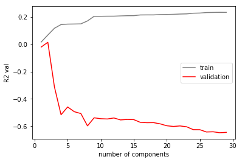


PCA doesn't look great


```python
std_scale = preprocessing.MinMaxScaler().fit(xtrain)
pca_train_std = std_scale.transform(xtrain)
pca_test_std = std_scale.transform(xval)
    
pca_model = PCA(n_components=3)
    
Xtrain = pca_model.fit_transform(pca_train_std)
Xtest = pca_model.fit_transform(pca_test_std)

regression_model = LinearRegression(fit_intercept=True)
regression_model.fit(Xtrain, ytrain)
    
print('train R2: {}'.format(regression_model.score(Xtrain, ytrain)))
print('validation R2: {}'.format(regression_model.score(Xtest, yval)))
```

    train R2: 0.11787742226128062
    validation R2: -0.31239132938402636


## kNN


```python
trainlist = []
testlist = []
k = [2,4,8,16,32,64]

for i in range(len(k)):  
    knn = KNeighborsRegressor(n_neighbors=k[i])
    knn = knn.fit(xtrain, ytrain)
    predtra = knn.predict(xtrain)  
    predtest = knn.predict(xval)
    trainlist.append(r2_score(ytrain,predtra))
    testlist.append(r2_score(yval,predtest))
    
plt.plot(k, trainlist, color = 'grey', alpha = 0.5)
plt.plot(k, testlist, color = 'red', alpha = 0.5)
```


    [<matplotlib.lines.Line2D at 0x7fbb0c6e5e48>]


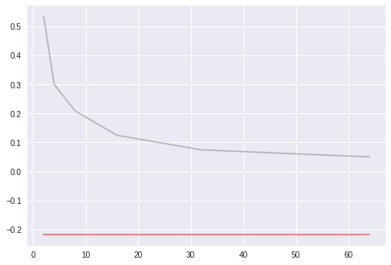


kNN also doesn't perform very well for us.

## Response variable scaling

Since the response variable appears to be very skewed, we thought that transforming it might increase our modeling.


```python
train_nz = train[train['playlist_followers']!=0]
test_nz = val[val['playlist_followers']!=0]
```

In order to do some of the transformations, we'll need to drop the parameters that are equal to zero.


```python
ytrain = train_nz['playlist_followers']
xtrain = train_nz.drop(['playlist_followers','playlist_id','Unnamed: 0','Unnamed: 0.1'],axis = 1)
yval = test_nz['playlist_followers']
xval = test_nz.drop(['playlist_followers','playlist_id','Unnamed: 0','Unnamed: 0.1'],axis = 1)
```


```python
ytrain.shape, xtrain.shape, yval.shape, xval.shape
```


    ((877,), (877, 319), (292,), (292, 319))


```python
ytrain_root = ytrain**(1/2)
ytrain_cub = ytrain**(1/3)
ytrain_log = np.log10(ytrain)
ytrain_rec_root = ytrain**(-1/2)
ytrain_rec = ytrain**(-1)
ytrains = [ytrain,ytrain_root,ytrain_cub,ytrain_log,ytrain_rec_root,ytrain_rec]
```

We took the square root, cubic root, log(base 10), inverse root, and inverse of the response variable.

### Let's see how our models do with the transformed response variable!

#### Linear Regression


```python
train_scores = []
test_scores = []

for i in range(len(ytrains)): 
    model = OLS(endog=ytrains[i], exog=xtrain)
    result = model.fit()

    y_hat_train = result.predict()
    y_hat_test = result.predict(exog=xval)
    
    if i == 1: 
        y_hat_train = y_hat_train**2
        y_hat_test = y_hat_test**2
    if i == 2:
        y_hat_train = y_hat_train**3
        y_hat_test = y_hat_test**3
    if i == 3:
        y_hat_train = 10**y_hat_train
        y_hat_test = 10**y_hat_test
    if i == 4:
        y_hat_train = y_hat_train**-2
        y_hat_test = y_hat_test**-2
    if i == 5: 
        y_hat_train = y_hat_train**-1
        y_hat_test = y_hat_test**-1

    train_scores.append(r2_score(ytrain, y_hat_train))
    test_scores.append(r2_score(yval, y_hat_test))
test_scores
```


    [-0.28781846764438179,
     0.29040892200834434,
     0.25290770899078863,
     -7.5329670770700936,
     -68393.546075854072,
     -0.21617307206142677]


We did a simple linear regression, fitting on all of the different transformed response variables. We transformed y-hat back using the inverse operation, then calculated the R2 using the un-transformed, true y values. The inverse root transformed appears to perform very poorly. 


```python
plt.scatter([1,2,3,4,5,6],train_scores, color = 'grey', s= 100, alpha = 0.5,label = 'train') 
plt.scatter([1,2,3,4,5,6],test_scores, color= 'red', s = 100, alpha = 0.5,label = 'val')
plt.ylim(-1,1)
plt.xticks(range(1,7),('untransformed','square root','cubic root','log10','reciprocal root','reciprocal'),rotation = 90)
plt.xlabel('response variable transormation')
plt.ylabel('R2')
plt.title('effect of response variable transformation on model performance')
plt.legend()
```


    <matplotlib.legend.Legend at 0x7fbb14d0c0f0>


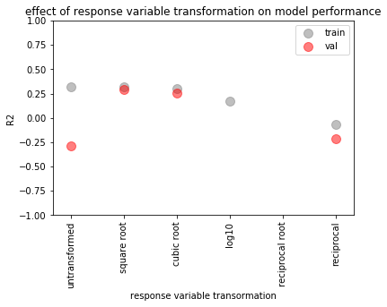


The square root- and cubic root-transformed trained models appear to perform better than the untransformed response variable. Let's see if it holds up for other types of models.

#### Lasso


```python
def cv_optimize_lasso(x, y, list_of_lambdas, n_folds=5):
    las = Lasso()
    parameters = {'alpha': list_of_lambdas}
    gs = GridSearchCV(las, param_grid=parameters, cv=n_folds, scoring="neg_mean_squared_error")
    gs.fit(x, y)
    return gs

lol = [1e-5, 1e-4, 1e-3, 1e-2, 1e-1, 1e0, 1e1, 1e2, 1e3, 1e4, 1e5]
train_scores = []
test_scores = []
for i in range(len(ytrains)):
    
    lmodel = cv_optimize_lasso(xtrain, ytrains[i], lol, n_folds=5)
    lambdal = lmodel.best_params_['alpha']
    est_lasso = Lasso(alpha=lambdal).fit(xtrain,ytrains[i])

    yhat_train = est_lasso.predict(xtrain)
    yhat_test = est_lasso.predict(xval)

    if i == 1: 
        yhat_train = yhat_train**2
        yhat_test = yhat_test**2
    if i == 2:
        yhat_train = yhat_train**3
        yhat_test = yhat_test**3
    if i == 3:
        yhat_train = 10**yhat_train
        yhat_test = 10**yhat_test
    if i == 4:
        yhat_train = yhat_train**(-2)
        yhat_test = yhat_test**(-2)
    
    train_scores.append(r2_score(ytrain, yhat_train))
    test_scores.append(r2_score(yval, yhat_test))
test_scores
```

    /home/erica/python/anaconda3/lib/python3.6/site-packages/sklearn/linear_model/coordinate_descent.py:491: ConvergenceWarning: Objective did not converge. You might want to increase the number of iterations. Fitting data with very small alpha may cause precision problems.
      ConvergenceWarning)
    /home/erica/python/anaconda3/lib/python3.6/site-packages/sklearn/linear_model/coordinate_descent.py:491: ConvergenceWarning: Objective did not converge. You might want to increase the number of iterations. Fitting data with very small alpha may cause precision problems.
      ConvergenceWarning)
    /home/erica/python/anaconda3/lib/python3.6/site-packages/sklearn/linear_model/coordinate_descent.py:491: ConvergenceWarning: Objective did not converge. You might want to increase the number of iterations. Fitting data with very small alpha may cause precision problems.
      ConvergenceWarning)
    /home/erica/python/anaconda3/lib/python3.6/site-packages/sklearn/linear_model/coordinate_descent.py:491: ConvergenceWarning: Objective did not converge. You might want to increase the number of iterations. Fitting data with very small alpha may cause precision problems.
      ConvergenceWarning)
    /home/erica/python/anaconda3/lib/python3.6/site-packages/sklearn/linear_model/coordinate_descent.py:491: ConvergenceWarning: Objective did not converge. You might want to increase the number of iterations. Fitting data with very small alpha may cause precision problems.
      ConvergenceWarning)
    /home/erica/python/anaconda3/lib/python3.6/site-packages/sklearn/linear_model/coordinate_descent.py:491: ConvergenceWarning: Objective did not converge. You might want to increase the number of iterations. Fitting data with very small alpha may cause precision problems.
      ConvergenceWarning)
    /home/erica/python/anaconda3/lib/python3.6/site-packages/sklearn/linear_model/coordinate_descent.py:491: ConvergenceWarning: Objective did not converge. You might want to increase the number of iterations. Fitting data with very small alpha may cause precision problems.
      ConvergenceWarning)
    /home/erica/python/anaconda3/lib/python3.6/site-packages/sklearn/linear_model/coordinate_descent.py:491: ConvergenceWarning: Objective did not converge. You might want to increase the number of iterations. Fitting data with very small alpha may cause precision problems.
      ConvergenceWarning)
    /home/erica/python/anaconda3/lib/python3.6/site-packages/sklearn/linear_model/coordinate_descent.py:491: ConvergenceWarning: Objective did not converge. You might want to increase the number of iterations. Fitting data with very small alpha may cause precision problems.
      ConvergenceWarning)
    /home/erica/python/anaconda3/lib/python3.6/site-packages/sklearn/linear_model/coordinate_descent.py:491: ConvergenceWarning: Objective did not converge. You might want to increase the number of iterations. Fitting data with very small alpha may cause precision problems.
      ConvergenceWarning)
    /home/erica/python/anaconda3/lib/python3.6/site-packages/sklearn/linear_model/coordinate_descent.py:491: ConvergenceWarning: Objective did not converge. You might want to increase the number of iterations. Fitting data with very small alpha may cause precision problems.
      ConvergenceWarning)
    /home/erica/python/anaconda3/lib/python3.6/site-packages/sklearn/linear_model/coordinate_descent.py:491: ConvergenceWarning: Objective did not converge. You might want to increase the number of iterations. Fitting data with very small alpha may cause precision problems.
      ConvergenceWarning)
    /home/erica/python/anaconda3/lib/python3.6/site-packages/sklearn/linear_model/coordinate_descent.py:491: ConvergenceWarning: Objective did not converge. You might want to increase the number of iterations. Fitting data with very small alpha may cause precision problems.
      ConvergenceWarning)
    /home/erica/python/anaconda3/lib/python3.6/site-packages/sklearn/linear_model/coordinate_descent.py:491: ConvergenceWarning: Objective did not converge. You might want to increase the number of iterations. Fitting data with very small alpha may cause precision problems.
      ConvergenceWarning)
    /home/erica/python/anaconda3/lib/python3.6/site-packages/sklearn/linear_model/coordinate_descent.py:491: ConvergenceWarning: Objective did not converge. You might want to increase the number of iterations. Fitting data with very small alpha may cause precision problems.
      ConvergenceWarning)
    /home/erica/python/anaconda3/lib/python3.6/site-packages/sklearn/linear_model/coordinate_descent.py:491: ConvergenceWarning: Objective did not converge. You might want to increase the number of iterations. Fitting data with very small alpha may cause precision problems.
      ConvergenceWarning)
    /home/erica/python/anaconda3/lib/python3.6/site-packages/sklearn/linear_model/coordinate_descent.py:491: ConvergenceWarning: Objective did not converge. You might want to increase the number of iterations. Fitting data with very small alpha may cause precision problems.
      ConvergenceWarning)
    /home/erica/python/anaconda3/lib/python3.6/site-packages/sklearn/linear_model/coordinate_descent.py:491: ConvergenceWarning: Objective did not converge. You might want to increase the number of iterations. Fitting data with very small alpha may cause precision problems.
      ConvergenceWarning)
    /home/erica/python/anaconda3/lib/python3.6/site-packages/sklearn/linear_model/coordinate_descent.py:491: ConvergenceWarning: Objective did not converge. You might want to increase the number of iterations. Fitting data with very small alpha may cause precision problems.
      ConvergenceWarning)
    /home/erica/python/anaconda3/lib/python3.6/site-packages/sklearn/linear_model/coordinate_descent.py:491: ConvergenceWarning: Objective did not converge. You might want to increase the number of iterations. Fitting data with very small alpha may cause precision problems.
      ConvergenceWarning)
    /home/erica/python/anaconda3/lib/python3.6/site-packages/sklearn/linear_model/coordinate_descent.py:491: ConvergenceWarning: Objective did not converge. You might want to increase the number of iterations. Fitting data with very small alpha may cause precision problems.
      ConvergenceWarning)
    /home/erica/python/anaconda3/lib/python3.6/site-packages/sklearn/linear_model/coordinate_descent.py:491: ConvergenceWarning: Objective did not converge. You might want to increase the number of iterations. Fitting data with very small alpha may cause precision problems.
      ConvergenceWarning)
    /home/erica/python/anaconda3/lib/python3.6/site-packages/sklearn/linear_model/coordinate_descent.py:491: ConvergenceWarning: Objective did not converge. You might want to increase the number of iterations. Fitting data with very small alpha may cause precision problems.
      ConvergenceWarning)
    /home/erica/python/anaconda3/lib/python3.6/site-packages/sklearn/linear_model/coordinate_descent.py:491: ConvergenceWarning: Objective did not converge. You might want to increase the number of iterations. Fitting data with very small alpha may cause precision problems.
      ConvergenceWarning)
    /home/erica/python/anaconda3/lib/python3.6/site-packages/sklearn/linear_model/coordinate_descent.py:491: ConvergenceWarning: Objective did not converge. You might want to increase the number of iterations. Fitting data with very small alpha may cause precision problems.
      ConvergenceWarning)
    /home/erica/python/anaconda3/lib/python3.6/site-packages/sklearn/linear_model/coordinate_descent.py:491: ConvergenceWarning: Objective did not converge. You might want to increase the number of iterations. Fitting data with very small alpha may cause precision problems.
      ConvergenceWarning)
    /home/erica/python/anaconda3/lib/python3.6/site-packages/sklearn/linear_model/coordinate_descent.py:491: ConvergenceWarning: Objective did not converge. You might want to increase the number of iterations. Fitting data with very small alpha may cause precision problems.
      ConvergenceWarning)
    /home/erica/python/anaconda3/lib/python3.6/site-packages/sklearn/linear_model/coordinate_descent.py:491: ConvergenceWarning: Objective did not converge. You might want to increase the number of iterations. Fitting data with very small alpha may cause precision problems.
      ConvergenceWarning)
    /home/erica/python/anaconda3/lib/python3.6/site-packages/sklearn/linear_model/coordinate_descent.py:491: ConvergenceWarning: Objective did not converge. You might want to increase the number of iterations. Fitting data with very small alpha may cause precision problems.
      ConvergenceWarning)
    /home/erica/python/anaconda3/lib/python3.6/site-packages/sklearn/linear_model/coordinate_descent.py:491: ConvergenceWarning: Objective did not converge. You might want to increase the number of iterations. Fitting data with very small alpha may cause precision problems.
      ConvergenceWarning)
    /home/erica/python/anaconda3/lib/python3.6/site-packages/sklearn/linear_model/coordinate_descent.py:491: ConvergenceWarning: Objective did not converge. You might want to increase the number of iterations. Fitting data with very small alpha may cause precision problems.
      ConvergenceWarning)
    /home/erica/python/anaconda3/lib/python3.6/site-packages/sklearn/linear_model/coordinate_descent.py:491: ConvergenceWarning: Objective did not converge. You might want to increase the number of iterations. Fitting data with very small alpha may cause precision problems.
      ConvergenceWarning)
    /home/erica/python/anaconda3/lib/python3.6/site-packages/sklearn/linear_model/coordinate_descent.py:491: ConvergenceWarning: Objective did not converge. You might want to increase the number of iterations. Fitting data with very small alpha may cause precision problems.
      ConvergenceWarning)
    /home/erica/python/anaconda3/lib/python3.6/site-packages/sklearn/linear_model/coordinate_descent.py:491: ConvergenceWarning: Objective did not converge. You might want to increase the number of iterations. Fitting data with very small alpha may cause precision problems.
      ConvergenceWarning)
    /home/erica/python/anaconda3/lib/python3.6/site-packages/sklearn/linear_model/coordinate_descent.py:491: ConvergenceWarning: Objective did not converge. You might want to increase the number of iterations. Fitting data with very small alpha may cause precision problems.
      ConvergenceWarning)
    /home/erica/python/anaconda3/lib/python3.6/site-packages/sklearn/linear_model/coordinate_descent.py:491: ConvergenceWarning: Objective did not converge. You might want to increase the number of iterations. Fitting data with very small alpha may cause precision problems.
      ConvergenceWarning)


    [0.19290710282919021,
     0.33657983782230294,
     0.29719561317820253,
     -0.38816061328174456,
     -6966.9528004870363,
     -0.21581229893620302]


```python
plt.scatter([1,2,3,4,5,6],train_scores, color = 'grey', s= 100, alpha = 0.5,label = 'train') 
plt.scatter([1,2,3,4,5,6],test_scores, color= 'red', s = 100, alpha = 0.5,label = 'val')
plt.ylim(-1,1)
plt.xticks(range(1,7),('untransformed','square root','cubic root','log10','reciprocal root','reciprocal'),rotation = 90)
plt.xlabel('response variable transormation')
plt.ylabel('R2')
plt.title('effect of response variable transformation on model performance')
plt.legend()
```


    <matplotlib.legend.Legend at 0x7fbb14bb4438>


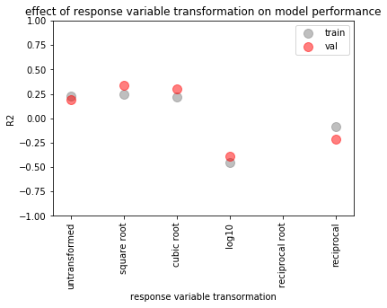


Holds up! The same two transformations perform better than untransformed.

#### Ridge


```python
def cv_optimize_ridge(x, y, list_of_lambdas, n_folds=5):
    rid = Ridge()
    parameters = {'alpha': list_of_lambdas}
    gs = GridSearchCV(rid, param_grid=parameters, cv=n_folds, scoring="neg_mean_squared_error")
    gs.fit(x, y)
    return gs

lol = [1e-5, 1e-4, 1e-3, 1e-2, 1e-1, 1e0, 1e1, 1e2, 1e3, 1e4, 1e5]
train_scores = []
test_scores = []
for i in range(len(ytrains)):
    
    rmodel = cv_optimize_ridge(xtrain, ytrains[i], lol, n_folds=5)
    lambdar = rmodel.best_params_['alpha']
    est_ridge = Ridge(alpha=lambdar).fit(xtrain,ytrains[i])

    yhat_train = est_ridge.predict(xtrain)
    yhat_test = est_ridge.predict(xval)

    if i == 1: 
        yhat_train = yhat_train**2
        yhat_test = yhat_test**2
    if i == 2:
        yhat_train = yhat_train**3
        yhat_test = yhat_test**3
    if i == 3:
        yhat_train = 10**yhat_train
        y_hat_test = 10**yhat_test
    if i == 4:
        yhat_train = yhat_train**-2
        yhat_test = yhat_test**-2
  
    train_scores.append(r2_score(ytrain, yhat_train))
    test_scores.append(r2_score(yval, yhat_test))
test_scores
```


    [0.19925269914930011,
     0.33480101415022911,
     0.28647639333678443,
     -0.21580127162778484,
     -128.5443539977195,
     -0.21581229879448394]


```python
plt.scatter([1,2,3,4,5,6],train_scores, color = 'grey', s= 100, alpha = 0.5,label = 'train') 
plt.scatter([1,2,3,4,5,6],test_scores, color= 'red', s = 100, alpha = 0.5, label = 'val')
plt.ylim(-1,1)
plt.xticks(range(1,7),('untransformed','square root','cubic root','log10','reciprocal root','reciprocal'),rotation = 90)
plt.xlabel('response variable transormation')
plt.ylabel('R2')
plt.title('effect of response variable transformation on model performance')
plt.legend()
```


    <matplotlib.legend.Legend at 0x7fbb14b56cc0>


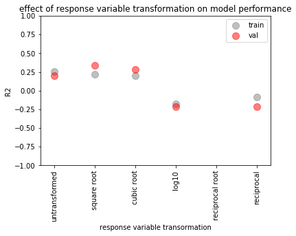


Ridge Regression performs about as well as Lasso Regression. The same trend remains with the model trained on the different response variables.

#### PCA

PCA didn't work so well with un-transformed respons variable. We chose the transformation demonstrated to work best above (square root), and decided to check if PCA worked any better, just in case.


```python
train_pca_R2 = []
test_pca_R2 = []
pca_vals = range(1,30,1)

for i in range(len(pca_vals)):
    std_scale = preprocessing.MinMaxScaler().fit(xtrain)
    pca_train_std = std_scale.transform(xtrain)
    pca_test_std = std_scale.transform(xval)
    
    pca_model = PCA(n_components=pca_vals[i])
    
    Xtrain = pca_model.fit_transform(pca_train_std)
    Xtest = pca_model.fit_transform(pca_test_std)
    
    regression_model = LinearRegression(fit_intercept=True)
    regression_model.fit(Xtrain, ytrains[1])
    
    yhat_train = regression_model.predict(Xtrain)
    yhat_test = regression_model.predict(Xtest)

    y_hat_train = yhat_train**2
    y_hat_test = yhat_test**2
    
    train_pca_R2.append(r2_score(ytrain, y_hat_train))
    test_pca_R2.append(r2_score(yval, y_hat_test))

plt.plot(pca_vals,train_pca_R2, color = 'grey', label = 'train')
plt.plot(pca_vals,test_pca_R2, color = 'red', label = 'test')
plt.xlabel('number of components')
plt.ylabel('R2 val')
plt.legend(loc = 'upper left')
plt.grid(False)
```


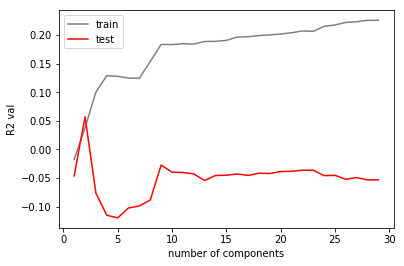


It does perform better than the un-transformed! But doesn't compete with the R2 values given by lasso and ridge regression.

### Looking at root transformed model - what are the significant predictors??

Linear regression with lasso or ridge regression, using the square root-transformed response variable seems like our best model, but we want to know how it's working - what are the important features?


```python
model = OLS(endog=ytrain_root, exog=xtrain)
result = model.fit()

y_hat_train = result.predict()
y_hat_train = y_hat_train**2
y_hat_test = result.predict(exog=xval)
y_hat_test = y_hat_test**2

print('train R2 = ', r2_score(ytrain, y_hat_train))
print('validation R2 = ', r2_score(yval, y_hat_test))
result.summary()
```

    train R2 =  0.315672715513
    validation R2 =  0.290408922008


<table class="simpletable">
<caption>OLS Regression Results</caption>
<tr>
  <th>Dep. Variable:</th>    <td>playlist_followers</td> <th>  R-squared:         </th> <td>   0.725</td> 
</tr>
<tr>
  <th>Model:</th>                    <td>OLS</td>        <th>  Adj. R-squared:    </th> <td>   0.615</td> 
</tr>
<tr>
  <th>Method:</th>              <td>Least Squares</td>   <th>  F-statistic:       </th> <td>   6.575</td> 
</tr>
<tr>
  <th>Date:</th>              <td>Thu, 07 Dec 2017</td>  <th>  Prob (F-statistic):</th> <td>1.99e-81</td> 
</tr>
<tr>
  <th>Time:</th>                  <td>23:17:46</td>      <th>  Log-Likelihood:    </th> <td> -6104.0</td> 
</tr>
<tr>
  <th>No. Observations:</th>       <td>   877</td>       <th>  AIC:               </th> <td>1.271e+04</td>
</tr>
<tr>
  <th>Df Residuals:</th>           <td>   626</td>       <th>  BIC:               </th> <td>1.391e+04</td>
</tr>
<tr>
  <th>Df Model:</th>               <td>   251</td>       <th>                     </th>     <td> </td>    
</tr>
<tr>
  <th>Covariance Type:</th>       <td>nonrobust</td>     <th>                     </th>     <td> </td>    
</tr>
</table>
<table class="simpletable">
<tr>
                           <td></td>                              <th>coef</th>     <th>std err</th>      <th>t</th>      <th>P>|t|</th>  <th>[0.025</th>    <th>0.975]</th>  
</tr>
<tr>
  <th>release_year_diff</th>                                   <td>    0.8024</td> <td>    2.888</td> <td>    0.278</td> <td> 0.781</td> <td>   -4.868</td> <td>    6.473</td>
</tr>
<tr>
  <th>release_month_diff</th>                                  <td>  -12.6538</td> <td>    8.973</td> <td>   -1.410</td> <td> 0.159</td> <td>  -30.274</td> <td>    4.967</td>
</tr>
<tr>
  <th>artists_per_track</th>                                   <td>   -5.4010</td> <td>   61.042</td> <td>   -0.088</td> <td> 0.930</td> <td> -125.273</td> <td>  114.471</td>
</tr>
<tr>
  <th>number_tracks</th>                                       <td>    1.9640</td> <td>    0.864</td> <td>    2.273</td> <td> 0.023</td> <td>    0.267</td> <td>    3.661</td>
</tr>
<tr>
  <th>number_of_genres</th>                                    <td>   -1.5275</td> <td>    0.649</td> <td>   -2.353</td> <td> 0.019</td> <td>   -2.802</td> <td>   -0.253</td>
</tr>
<tr>
  <th>track_duration(ms)</th>                                  <td> 3.416e-05</td> <td>    0.000</td> <td>    0.138</td> <td> 0.890</td> <td>   -0.000</td> <td>    0.001</td>
</tr>
<tr>
  <th>dominant_genre_acousmatic</th>                           <td> 9.663e-09</td> <td> 3.07e-08</td> <td>    0.315</td> <td> 0.753</td> <td>-5.05e-08</td> <td> 6.99e-08</td>
</tr>
<tr>
  <th>dominant_genre_acoustic blues</th>                       <td>-8.813e-08</td> <td> 3.38e-07</td> <td>   -0.261</td> <td> 0.794</td> <td>-7.52e-07</td> <td> 5.75e-07</td>
</tr>
<tr>
  <th>dominant_genre_adult standards</th>                      <td>  134.6963</td> <td>  126.738</td> <td>    1.063</td> <td> 0.288</td> <td> -114.187</td> <td>  383.580</td>
</tr>
<tr>
  <th>dominant_genre_album rock</th>                           <td>  182.7324</td> <td>  113.740</td> <td>    1.607</td> <td> 0.109</td> <td>  -40.626</td> <td>  406.090</td>
</tr>
<tr>
  <th>dominant_genre_alt-indie rock</th>                       <td>  238.4992</td> <td>  313.441</td> <td>    0.761</td> <td> 0.447</td> <td> -377.024</td> <td>  854.022</td>
</tr>
<tr>
  <th>dominant_genre_alternative country</th>                  <td> -188.9849</td> <td>  198.836</td> <td>   -0.950</td> <td> 0.342</td> <td> -579.451</td> <td>  201.481</td>
</tr>
<tr>
  <th>dominant_genre_alternative dance</th>                    <td>   78.9086</td> <td>  151.943</td> <td>    0.519</td> <td> 0.604</td> <td> -219.470</td> <td>  377.288</td>
</tr>
<tr>
  <th>dominant_genre_alternative hip hop</th>                  <td>   61.4489</td> <td>  326.154</td> <td>    0.188</td> <td> 0.851</td> <td> -579.040</td> <td>  701.938</td>
</tr>
<tr>
  <th>dominant_genre_alternative metal</th>                    <td>  192.5691</td> <td>  101.349</td> <td>    1.900</td> <td> 0.058</td> <td>   -6.455</td> <td>  391.593</td>
</tr>
<tr>
  <th>dominant_genre_alternative rock</th>                     <td>  182.5804</td> <td>  115.301</td> <td>    1.584</td> <td> 0.114</td> <td>  -43.843</td> <td>  409.004</td>
</tr>
<tr>
  <th>dominant_genre_ambient</th>                              <td> -121.1063</td> <td>  325.193</td> <td>   -0.372</td> <td> 0.710</td> <td> -759.707</td> <td>  517.495</td>
</tr>
<tr>
  <th>dominant_genre_anthem emo</th>                           <td> 2.921e-08</td> <td> 3.89e-08</td> <td>    0.751</td> <td> 0.453</td> <td>-4.72e-08</td> <td> 1.06e-07</td>
</tr>
<tr>
  <th>dominant_genre_anti-folk</th>                            <td>   82.7961</td> <td>  317.335</td> <td>    0.261</td> <td> 0.794</td> <td> -540.373</td> <td>  705.965</td>
</tr>
<tr>
  <th>dominant_genre_antiviral pop</th>                        <td>  201.8270</td> <td>  312.616</td> <td>    0.646</td> <td> 0.519</td> <td> -412.076</td> <td>  815.730</td>
</tr>
<tr>
  <th>dominant_genre_argentine rock</th>                       <td>  -64.2054</td> <td>  330.897</td> <td>   -0.194</td> <td> 0.846</td> <td> -714.009</td> <td>  585.598</td>
</tr>
<tr>
  <th>dominant_genre_art rock</th>                             <td>   95.2546</td> <td>  316.615</td> <td>    0.301</td> <td> 0.764</td> <td> -526.501</td> <td>  717.010</td>
</tr>
<tr>
  <th>dominant_genre_avant-garde</th>                          <td>  158.6496</td> <td>  346.541</td> <td>    0.458</td> <td> 0.647</td> <td> -521.875</td> <td>  839.174</td>
</tr>
<tr>
  <th>dominant_genre_avant-garde jazz</th>                     <td> -173.9611</td> <td>  318.856</td> <td>   -0.546</td> <td> 0.586</td> <td> -800.119</td> <td>  452.196</td>
</tr>
<tr>
  <th>dominant_genre_azontobeats</th>                          <td>   37.4105</td> <td>  313.255</td> <td>    0.119</td> <td> 0.905</td> <td> -577.747</td> <td>  652.568</td>
</tr>
<tr>
  <th>dominant_genre_barnmusik</th>                            <td>  -55.4930</td> <td>  341.625</td> <td>   -0.162</td> <td> 0.871</td> <td> -726.362</td> <td>  615.376</td>
</tr>
<tr>
  <th>dominant_genre_baroque</th>                              <td>   52.5638</td> <td>  207.363</td> <td>    0.253</td> <td> 0.800</td> <td> -354.648</td> <td>  459.775</td>
</tr>
<tr>
  <th>dominant_genre_bass trap</th>                            <td>-3.355e-08</td> <td> 9.38e-08</td> <td>   -0.358</td> <td> 0.721</td> <td>-2.18e-07</td> <td> 1.51e-07</td>
</tr>
<tr>
  <th>dominant_genre_beats</th>                                <td>  -93.1152</td> <td>  322.120</td> <td>   -0.289</td> <td> 0.773</td> <td> -725.682</td> <td>  539.452</td>
</tr>
<tr>
  <th>dominant_genre_bebop</th>                                <td> -199.8079</td> <td>  340.096</td> <td>   -0.588</td> <td> 0.557</td> <td> -867.675</td> <td>  468.059</td>
</tr>
<tr>
  <th>dominant_genre_big band</th>                             <td> -237.9082</td> <td>  330.692</td> <td>   -0.719</td> <td> 0.472</td> <td> -887.308</td> <td>  411.492</td>
</tr>
<tr>
  <th>dominant_genre_big room</th>                             <td>  197.4130</td> <td>  178.580</td> <td>    1.105</td> <td> 0.269</td> <td> -153.275</td> <td>  548.101</td>
</tr>
<tr>
  <th>dominant_genre_black metal</th>                          <td> 1.298e-08</td> <td> 1.53e-07</td> <td>    0.085</td> <td> 0.932</td> <td>-2.88e-07</td> <td> 3.14e-07</td>
</tr>
<tr>
  <th>dominant_genre_bluegrass</th>                            <td>  -68.5933</td> <td>  321.960</td> <td>   -0.213</td> <td> 0.831</td> <td> -700.846</td> <td>  563.659</td>
</tr>
<tr>
  <th>dominant_genre_blues</th>                                <td>   33.9852</td> <td>  237.327</td> <td>    0.143</td> <td> 0.886</td> <td> -432.067</td> <td>  500.038</td>
</tr>
<tr>
  <th>dominant_genre_blues-rock</th>                           <td> -5.73e-09</td> <td> 9.34e-08</td> <td>   -0.061</td> <td> 0.951</td> <td>-1.89e-07</td> <td> 1.78e-07</td>
</tr>
<tr>
  <th>dominant_genre_bossa nova</th>                           <td>   73.1382</td> <td>  317.608</td> <td>    0.230</td> <td> 0.818</td> <td> -550.568</td> <td>  696.844</td>
</tr>
<tr>
  <th>dominant_genre_boy band</th>                             <td>  216.0226</td> <td>  232.565</td> <td>    0.929</td> <td> 0.353</td> <td> -240.679</td> <td>  672.724</td>
</tr>
<tr>
  <th>dominant_genre_brazilian composition</th>                <td> 6.215e-09</td> <td> 1.83e-07</td> <td>    0.034</td> <td> 0.973</td> <td>-3.53e-07</td> <td> 3.65e-07</td>
</tr>
<tr>
  <th>dominant_genre_brill building pop</th>                   <td>  110.0802</td> <td>  126.297</td> <td>    0.872</td> <td> 0.384</td> <td> -137.936</td> <td>  358.097</td>
</tr>
<tr>
  <th>dominant_genre_british blues</th>                        <td> 2.395e-09</td> <td>  1.3e-07</td> <td>    0.018</td> <td> 0.985</td> <td>-2.53e-07</td> <td> 2.58e-07</td>
</tr>
<tr>
  <th>dominant_genre_british folk</th>                         <td>-8.992e-08</td> <td> 1.63e-07</td> <td>   -0.552</td> <td> 0.581</td> <td> -4.1e-07</td> <td>  2.3e-07</td>
</tr>
<tr>
  <th>dominant_genre_british invasion</th>                     <td>  212.0652</td> <td>  220.843</td> <td>    0.960</td> <td> 0.337</td> <td> -221.617</td> <td>  645.748</td>
</tr>
<tr>
  <th>dominant_genre_brostep</th>                              <td>  365.9244</td> <td>  231.964</td> <td>    1.578</td> <td> 0.115</td> <td>  -89.598</td> <td>  821.447</td>
</tr>
<tr>
  <th>dominant_genre_brutal death metal</th>                   <td>  9.92e-08</td> <td> 1.92e-07</td> <td>    0.516</td> <td> 0.606</td> <td>-2.78e-07</td> <td> 4.77e-07</td>
</tr>
<tr>
  <th>dominant_genre_bubblegum dance</th>                      <td>  146.2007</td> <td>  322.848</td> <td>    0.453</td> <td> 0.651</td> <td> -487.795</td> <td>  780.197</td>
</tr>
<tr>
  <th>dominant_genre_cabaret</th>                              <td>-7.277e-08</td> <td> 1.72e-07</td> <td>   -0.423</td> <td> 0.673</td> <td>-4.11e-07</td> <td> 2.65e-07</td>
</tr>
<tr>
  <th>dominant_genre_ccm</th>                                  <td>  173.0869</td> <td>  316.621</td> <td>    0.547</td> <td> 0.585</td> <td> -448.680</td> <td>  794.854</td>
</tr>
<tr>
  <th>dominant_genre_celtic</th>                               <td>  -79.3475</td> <td>  314.281</td> <td>   -0.252</td> <td> 0.801</td> <td> -696.520</td> <td>  537.825</td>
</tr>
<tr>
  <th>dominant_genre_chamber pop</th>                          <td>   96.7465</td> <td>  316.715</td> <td>    0.305</td> <td> 0.760</td> <td> -525.206</td> <td>  718.699</td>
</tr>
<tr>
  <th>dominant_genre_chanson</th>                              <td>  162.8722</td> <td>  224.805</td> <td>    0.725</td> <td> 0.469</td> <td> -278.591</td> <td>  604.336</td>
</tr>
<tr>
  <th>dominant_genre_children's christmas</th>                 <td>  117.0075</td> <td>  204.820</td> <td>    0.571</td> <td> 0.568</td> <td> -285.211</td> <td>  519.226</td>
</tr>
<tr>
  <th>dominant_genre_children's music</th>                     <td>   70.7990</td> <td>  234.455</td> <td>    0.302</td> <td> 0.763</td> <td> -389.614</td> <td>  531.212</td>
</tr>
<tr>
  <th>dominant_genre_chillhop</th>                             <td> 1.779e-08</td> <td> 8.28e-08</td> <td>    0.215</td> <td> 0.830</td> <td>-1.45e-07</td> <td>  1.8e-07</td>
</tr>
<tr>
  <th>dominant_genre_chillwave</th>                            <td>   62.6098</td> <td>  316.943</td> <td>    0.198</td> <td> 0.843</td> <td> -559.790</td> <td>  685.010</td>
</tr>
<tr>
  <th>dominant_genre_christian hip hop</th>                    <td> -111.0514</td> <td>  309.270</td> <td>   -0.359</td> <td> 0.720</td> <td> -718.384</td> <td>  496.281</td>
</tr>
<tr>
  <th>dominant_genre_christian music</th>                      <td>-9.056e-08</td> <td> 1.35e-07</td> <td>   -0.673</td> <td> 0.501</td> <td>-3.55e-07</td> <td> 1.74e-07</td>
</tr>
<tr>
  <th>dominant_genre_christmas</th>                            <td>  212.9952</td> <td>  236.125</td> <td>    0.902</td> <td> 0.367</td> <td> -250.698</td> <td>  676.689</td>
</tr>
<tr>
  <th>dominant_genre_classic funk rock</th>                    <td>  169.1401</td> <td>  161.878</td> <td>    1.045</td> <td> 0.296</td> <td> -148.750</td> <td>  487.030</td>
</tr>
<tr>
  <th>dominant_genre_classic rock</th>                         <td>  338.7784</td> <td>  159.657</td> <td>    2.122</td> <td> 0.034</td> <td>   25.250</td> <td>  652.306</td>
</tr>
<tr>
  <th>dominant_genre_classical</th>                            <td>    0.4713</td> <td>  115.311</td> <td>    0.004</td> <td> 0.997</td> <td> -225.971</td> <td>  226.914</td>
</tr>
<tr>
  <th>dominant_genre_classify</th>                             <td> -104.4617</td> <td>  324.281</td> <td>   -0.322</td> <td> 0.747</td> <td> -741.272</td> <td>  532.348</td>
</tr>
<tr>
  <th>dominant_genre_comedy</th>                               <td>  123.2308</td> <td>  220.428</td> <td>    0.559</td> <td> 0.576</td> <td> -309.638</td> <td>  556.099</td>
</tr>
<tr>
  <th>dominant_genre_comic</th>                                <td>  359.6179</td> <td>  353.937</td> <td>    1.016</td> <td> 0.310</td> <td> -335.429</td> <td> 1054.665</td>
</tr>
<tr>
  <th>dominant_genre_compositional ambient</th>                <td>  -95.1999</td> <td>  203.969</td> <td>   -0.467</td> <td> 0.641</td> <td> -495.746</td> <td>  305.346</td>
</tr>
<tr>
  <th>dominant_genre_contemporary country</th>                 <td>  142.8240</td> <td>  120.269</td> <td>    1.188</td> <td> 0.235</td> <td>  -93.355</td> <td>  379.003</td>
</tr>
<tr>
  <th>dominant_genre_contemporary jazz</th>                    <td> 1.477e-08</td> <td>    1e-07</td> <td>    0.147</td> <td> 0.883</td> <td>-1.82e-07</td> <td> 2.12e-07</td>
</tr>
<tr>
  <th>dominant_genre_contemporary post-bop</th>                <td>   85.4590</td> <td>  163.028</td> <td>    0.524</td> <td> 0.600</td> <td> -234.690</td> <td>  405.608</td>
</tr>
<tr>
  <th>dominant_genre_cool jazz</th>                            <td>  261.2444</td> <td>  319.656</td> <td>    0.817</td> <td> 0.414</td> <td> -366.483</td> <td>  888.972</td>
</tr>
<tr>
  <th>dominant_genre_country</th>                              <td>  -17.5275</td> <td>  225.949</td> <td>   -0.078</td> <td> 0.938</td> <td> -461.237</td> <td>  426.182</td>
</tr>
<tr>
  <th>dominant_genre_country blues</th>                        <td> 3.146e-08</td> <td> 8.15e-08</td> <td>    0.386</td> <td> 0.700</td> <td>-1.29e-07</td> <td> 1.92e-07</td>
</tr>
<tr>
  <th>dominant_genre_country gospel</th>                       <td> 1.705e-08</td> <td> 7.25e-08</td> <td>    0.235</td> <td> 0.814</td> <td>-1.25e-07</td> <td> 1.59e-07</td>
</tr>
<tr>
  <th>dominant_genre_country road</th>                         <td>  3.01e-08</td> <td> 9.54e-08</td> <td>    0.316</td> <td> 0.752</td> <td>-1.57e-07</td> <td> 2.17e-07</td>
</tr>
<tr>
  <th>dominant_genre_country rock</th>                         <td>-3.184e-08</td> <td> 1.22e-07</td> <td>   -0.260</td> <td> 0.795</td> <td>-2.72e-07</td> <td> 2.08e-07</td>
</tr>
<tr>
  <th>dominant_genre_dance pop</th>                            <td>  187.7554</td> <td>   84.250</td> <td>    2.229</td> <td> 0.026</td> <td>   22.309</td> <td>  353.202</td>
</tr>
<tr>
  <th>dominant_genre_dance rock</th>                           <td>  161.8016</td> <td>  171.416</td> <td>    0.944</td> <td> 0.346</td> <td> -174.818</td> <td>  498.421</td>
</tr>
<tr>
  <th>dominant_genre_dancehall</th>                            <td>   27.5202</td> <td>  318.549</td> <td>    0.086</td> <td> 0.931</td> <td> -598.035</td> <td>  653.075</td>
</tr>
<tr>
  <th>dominant_genre_danish pop</th>                           <td>   49.0425</td> <td>  316.013</td> <td>    0.155</td> <td> 0.877</td> <td> -571.532</td> <td>  669.617</td>
</tr>
<tr>
  <th>dominant_genre_dark jazz</th>                            <td> 6.054e-08</td> <td> 7.08e-08</td> <td>    0.855</td> <td> 0.393</td> <td>-7.85e-08</td> <td>    2e-07</td>
</tr>
<tr>
  <th>dominant_genre_death metal</th>                          <td>-1.834e-08</td> <td> 7.06e-08</td> <td>   -0.260</td> <td> 0.795</td> <td>-1.57e-07</td> <td>  1.2e-07</td>
</tr>
<tr>
  <th>dominant_genre_deep big room</th>                        <td>  870.1316</td> <td>  393.988</td> <td>    2.209</td> <td> 0.028</td> <td>   96.434</td> <td> 1643.830</td>
</tr>
<tr>
  <th>dominant_genre_deep funk</th>                            <td>    1.8559</td> <td>  232.242</td> <td>    0.008</td> <td> 0.994</td> <td> -454.212</td> <td>  457.924</td>
</tr>
<tr>
  <th>dominant_genre_deep groove house</th>                    <td>   38.2055</td> <td>  319.184</td> <td>    0.120</td> <td> 0.905</td> <td> -588.595</td> <td>  665.006</td>
</tr>
<tr>
  <th>dominant_genre_deep hardstyle</th>                       <td>  216.0766</td> <td>  316.258</td> <td>    0.683</td> <td> 0.495</td> <td> -404.979</td> <td>  837.132</td>
</tr>
<tr>
  <th>dominant_genre_deep indie r&b</th>                       <td> -152.3346</td> <td>  224.140</td> <td>   -0.680</td> <td> 0.497</td> <td> -592.492</td> <td>  287.823</td>
</tr>
<tr>
  <th>dominant_genre_deep melodic euro house</th>              <td>   48.3533</td> <td>  327.283</td> <td>    0.148</td> <td> 0.883</td> <td> -594.353</td> <td>  691.059</td>
</tr>
<tr>
  <th>dominant_genre_deep pop edm</th>                         <td>    7.2054</td> <td>  341.351</td> <td>    0.021</td> <td> 0.983</td> <td> -663.126</td> <td>  677.537</td>
</tr>
<tr>
  <th>dominant_genre_deep pop r&b</th>                         <td>-5.315e-09</td> <td> 7.69e-08</td> <td>   -0.069</td> <td> 0.945</td> <td>-1.56e-07</td> <td> 1.46e-07</td>
</tr>
<tr>
  <th>dominant_genre_deep swedish hip hop</th>                 <td>  -37.1567</td> <td>  313.484</td> <td>   -0.119</td> <td> 0.906</td> <td> -652.765</td> <td>  578.451</td>
</tr>
<tr>
  <th>dominant_genre_deep swedish indie pop</th>               <td>   98.9122</td> <td>  241.609</td> <td>    0.409</td> <td> 0.682</td> <td> -375.551</td> <td>  573.375</td>
</tr>
<tr>
  <th>dominant_genre_desi</th>                                 <td>-6.529e-08</td> <td> 1.68e-07</td> <td>   -0.389</td> <td> 0.698</td> <td>-3.95e-07</td> <td> 2.65e-07</td>
</tr>
<tr>
  <th>dominant_genre_dirty south rap</th>                      <td>  271.4649</td> <td>  313.114</td> <td>    0.867</td> <td> 0.386</td> <td> -343.417</td> <td>  886.346</td>
</tr>
<tr>
  <th>dominant_genre_disco</th>                                <td>   93.2454</td> <td>  321.175</td> <td>    0.290</td> <td> 0.772</td> <td> -537.465</td> <td>  723.956</td>
</tr>
<tr>
  <th>dominant_genre_djent</th>                                <td> -187.1413</td> <td>  233.234</td> <td>   -0.802</td> <td> 0.423</td> <td> -645.157</td> <td>  270.874</td>
</tr>
<tr>
  <th>dominant_genre_doo-wop</th>                              <td>-1.698e-08</td> <td> 9.32e-08</td> <td>   -0.182</td> <td> 0.855</td> <td>   -2e-07</td> <td> 1.66e-07</td>
</tr>
<tr>
  <th>dominant_genre_doom metal</th>                           <td>   51.4139</td> <td>  316.948</td> <td>    0.162</td> <td> 0.871</td> <td> -570.995</td> <td>  673.823</td>
</tr>
<tr>
  <th>dominant_genre_drama</th>                                <td>  -54.9875</td> <td>  231.483</td> <td>   -0.238</td> <td> 0.812</td> <td> -509.564</td> <td>  399.589</td>
</tr>
<tr>
  <th>dominant_genre_drone folk</th>                           <td>  -29.0086</td> <td>  318.950</td> <td>   -0.091</td> <td> 0.928</td> <td> -655.350</td> <td>  597.333</td>
</tr>
<tr>
  <th>dominant_genre_drum and bass</th>                        <td> -150.2790</td> <td>  333.142</td> <td>   -0.451</td> <td> 0.652</td> <td> -804.490</td> <td>  503.932</td>
</tr>
<tr>
  <th>dominant_genre_dub</th>                                  <td>    0.1882</td> <td>  241.781</td> <td>    0.001</td> <td> 0.999</td> <td> -474.611</td> <td>  474.987</td>
</tr>
<tr>
  <th>dominant_genre_early music</th>                          <td> -7.58e-09</td> <td> 8.59e-08</td> <td>   -0.088</td> <td> 0.930</td> <td>-1.76e-07</td> <td> 1.61e-07</td>
</tr>
<tr>
  <th>dominant_genre_edm</th>                                  <td>   92.5584</td> <td>  109.258</td> <td>    0.847</td> <td> 0.397</td> <td> -121.999</td> <td>  307.115</td>
</tr>
<tr>
  <th>dominant_genre_electric blues</th>                       <td>   99.1593</td> <td>  232.055</td> <td>    0.427</td> <td> 0.669</td> <td> -356.542</td> <td>  554.861</td>
</tr>
<tr>
  <th>dominant_genre_electro</th>                              <td>  246.4940</td> <td>  319.075</td> <td>    0.773</td> <td> 0.440</td> <td> -380.093</td> <td>  873.081</td>
</tr>
<tr>
  <th>dominant_genre_electro house</th>                        <td> 3.915e-09</td> <td> 1.08e-07</td> <td>    0.036</td> <td> 0.971</td> <td>-2.08e-07</td> <td> 2.16e-07</td>
</tr>
<tr>
  <th>dominant_genre_electro swing</th>                        <td> -174.9034</td> <td>  313.566</td> <td>   -0.558</td> <td> 0.577</td> <td> -790.673</td> <td>  440.866</td>
</tr>
<tr>
  <th>dominant_genre_electronic</th>                           <td>  356.7996</td> <td>  227.387</td> <td>    1.569</td> <td> 0.117</td> <td>  -89.734</td> <td>  803.333</td>
</tr>
<tr>
  <th>dominant_genre_electronic trap</th>                      <td>  783.4499</td> <td>  311.814</td> <td>    2.513</td> <td> 0.012</td> <td>  171.122</td> <td> 1395.777</td>
</tr>
<tr>
  <th>dominant_genre_emo</th>                                  <td>  247.7566</td> <td>  228.603</td> <td>    1.084</td> <td> 0.279</td> <td> -201.166</td> <td>  696.679</td>
</tr>
<tr>
  <th>dominant_genre_escape room</th>                          <td>   61.3273</td> <td>  308.602</td> <td>    0.199</td> <td> 0.843</td> <td> -544.694</td> <td>  667.349</td>
</tr>
<tr>
  <th>dominant_genre_europop</th>                              <td>  161.3950</td> <td>  233.657</td> <td>    0.691</td> <td> 0.490</td> <td> -297.451</td> <td>  620.241</td>
</tr>
<tr>
  <th>dominant_genre_eurovision</th>                           <td>-6.734e-08</td> <td> 1.06e-07</td> <td>   -0.635</td> <td> 0.526</td> <td>-2.76e-07</td> <td> 1.41e-07</td>
</tr>
<tr>
  <th>dominant_genre_filter house</th>                         <td> 3.785e-09</td> <td> 4.02e-08</td> <td>    0.094</td> <td> 0.925</td> <td>-7.51e-08</td> <td> 8.26e-08</td>
</tr>
<tr>
  <th>dominant_genre_fingerstyle</th>                          <td>  417.5735</td> <td>  320.005</td> <td>    1.305</td> <td> 0.192</td> <td> -210.841</td> <td> 1045.988</td>
</tr>
<tr>
  <th>dominant_genre_float house</th>                          <td> 3.208e-08</td> <td> 8.83e-08</td> <td>    0.363</td> <td> 0.716</td> <td>-1.41e-07</td> <td> 2.05e-07</td>
</tr>
<tr>
  <th>dominant_genre_fluxwork</th>                             <td>   -4.2609</td> <td>  312.531</td> <td>   -0.014</td> <td> 0.989</td> <td> -617.997</td> <td>  609.476</td>
</tr>
<tr>
  <th>dominant_genre_focus</th>                                <td>  185.3918</td> <td>  171.804</td> <td>    1.079</td> <td> 0.281</td> <td> -151.991</td> <td>  522.774</td>
</tr>
<tr>
  <th>dominant_genre_folk</th>                                 <td>  259.2298</td> <td>  318.729</td> <td>    0.813</td> <td> 0.416</td> <td> -366.678</td> <td>  885.138</td>
</tr>
<tr>
  <th>dominant_genre_folk metal</th>                           <td>  131.7706</td> <td>  315.579</td> <td>    0.418</td> <td> 0.676</td> <td> -487.952</td> <td>  751.493</td>
</tr>
<tr>
  <th>dominant_genre_folk rock</th>                            <td>   49.3116</td> <td>  149.974</td> <td>    0.329</td> <td> 0.742</td> <td> -245.202</td> <td>  343.825</td>
</tr>
<tr>
  <th>dominant_genre_folk-pop</th>                             <td>  175.4307</td> <td>  109.763</td> <td>    1.598</td> <td> 0.110</td> <td>  -40.117</td> <td>  390.978</td>
</tr>
<tr>
  <th>dominant_genre_footwork</th>                             <td>-5.303e-09</td> <td> 1.47e-07</td> <td>   -0.036</td> <td> 0.971</td> <td>-2.94e-07</td> <td> 2.83e-07</td>
</tr>
<tr>
  <th>dominant_genre_fourth world</th>                         <td>-3.932e-09</td> <td> 8.75e-08</td> <td>   -0.045</td> <td> 0.964</td> <td>-1.76e-07</td> <td> 1.68e-07</td>
</tr>
<tr>
  <th>dominant_genre_funk</th>                                 <td>  180.3451</td> <td>  169.983</td> <td>    1.061</td> <td> 0.289</td> <td> -153.461</td> <td>  514.151</td>
</tr>
<tr>
  <th>dominant_genre_gangster rap</th>                         <td>  -73.8669</td> <td>  319.816</td> <td>   -0.231</td> <td> 0.817</td> <td> -701.910</td> <td>  554.176</td>
</tr>
<tr>
  <th>dominant_genre_garage rock</th>                          <td>  149.5214</td> <td>  168.020</td> <td>    0.890</td> <td> 0.374</td> <td> -180.431</td> <td>  479.473</td>
</tr>
<tr>
  <th>dominant_genre_gospel</th>                               <td>  442.7060</td> <td>  311.762</td> <td>    1.420</td> <td> 0.156</td> <td> -169.519</td> <td> 1054.931</td>
</tr>
<tr>
  <th>dominant_genre_gothic symphonic metal</th>               <td> 1.509e-08</td> <td> 8.77e-08</td> <td>    0.172</td> <td> 0.863</td> <td>-1.57e-07</td> <td> 1.87e-07</td>
</tr>
<tr>
  <th>dominant_genre_grime</th>                                <td>  -27.5364</td> <td>  189.004</td> <td>   -0.146</td> <td> 0.884</td> <td> -398.695</td> <td>  343.623</td>
</tr>
<tr>
  <th>dominant_genre_grunge</th>                               <td> 4.226e-09</td> <td>  9.3e-08</td> <td>    0.045</td> <td> 0.964</td> <td>-1.78e-07</td> <td> 1.87e-07</td>
</tr>
<tr>
  <th>dominant_genre_guidance</th>                             <td>   96.6513</td> <td>  162.130</td> <td>    0.596</td> <td> 0.551</td> <td> -221.734</td> <td>  415.036</td>
</tr>
<tr>
  <th>dominant_genre_gypsy jazz</th>                           <td> 3.345e-09</td> <td> 8.53e-08</td> <td>    0.039</td> <td> 0.969</td> <td>-1.64e-07</td> <td> 1.71e-07</td>
</tr>
<tr>
  <th>dominant_genre_hard rock</th>                            <td>  124.9062</td> <td>  321.093</td> <td>    0.389</td> <td> 0.697</td> <td> -505.643</td> <td>  755.456</td>
</tr>
<tr>
  <th>dominant_genre_hardcore</th>                             <td>  -87.6811</td> <td>  236.348</td> <td>   -0.371</td> <td> 0.711</td> <td> -551.812</td> <td>  376.450</td>
</tr>
<tr>
  <th>dominant_genre_hawaiian</th>                             <td> -244.3779</td> <td>  332.053</td> <td>   -0.736</td> <td> 0.462</td> <td> -896.451</td> <td>  407.696</td>
</tr>
<tr>
  <th>dominant_genre_healing</th>                              <td> 5.498e-08</td> <td> 9.82e-08</td> <td>    0.560</td> <td> 0.576</td> <td>-1.38e-07</td> <td> 2.48e-07</td>
</tr>
<tr>
  <th>dominant_genre_heavy christmas</th>                      <td>   14.7246</td> <td>  237.814</td> <td>    0.062</td> <td> 0.951</td> <td> -452.285</td> <td>  481.734</td>
</tr>
<tr>
  <th>dominant_genre_hip hop</th>                              <td>   -0.7851</td> <td>  190.508</td> <td>   -0.004</td> <td> 0.997</td> <td> -374.897</td> <td>  373.327</td>
</tr>
<tr>
  <th>dominant_genre_hip pop</th>                              <td> 1.353e-07</td> <td> 1.58e-07</td> <td>    0.857</td> <td> 0.392</td> <td>-1.75e-07</td> <td> 4.45e-07</td>
</tr>
<tr>
  <th>dominant_genre_hollywood</th>                            <td>  173.4726</td> <td>  318.664</td> <td>    0.544</td> <td> 0.586</td> <td> -452.308</td> <td>  799.253</td>
</tr>
<tr>
  <th>dominant_genre_house</th>                                <td>  117.5779</td> <td>  320.697</td> <td>    0.367</td> <td> 0.714</td> <td> -512.194</td> <td>  747.350</td>
</tr>
<tr>
  <th>dominant_genre_indie folk</th>                           <td>  333.2158</td> <td>   82.951</td> <td>    4.017</td> <td> 0.000</td> <td>  170.320</td> <td>  496.111</td>
</tr>
<tr>
  <th>dominant_genre_indie jazz</th>                           <td>  106.4894</td> <td>  310.948</td> <td>    0.342</td> <td> 0.732</td> <td> -504.138</td> <td>  717.117</td>
</tr>
<tr>
  <th>dominant_genre_indie pop</th>                            <td>   95.3590</td> <td>  141.092</td> <td>    0.676</td> <td> 0.499</td> <td> -181.711</td> <td>  372.429</td>
</tr>
<tr>
  <th>dominant_genre_indie poptimism</th>                      <td>  -78.4558</td> <td>  184.226</td> <td>   -0.426</td> <td> 0.670</td> <td> -440.231</td> <td>  283.319</td>
</tr>
<tr>
  <th>dominant_genre_indie psych-rock</th>                     <td>-2.151e-08</td> <td> 6.65e-08</td> <td>   -0.323</td> <td> 0.747</td> <td>-1.52e-07</td> <td> 1.09e-07</td>
</tr>
<tr>
  <th>dominant_genre_indie punk</th>                           <td>  326.8857</td> <td>  322.554</td> <td>    1.013</td> <td> 0.311</td> <td> -306.532</td> <td>  960.304</td>
</tr>
<tr>
  <th>dominant_genre_indie r&b</th>                            <td>  212.4522</td> <td>  149.038</td> <td>    1.425</td> <td> 0.155</td> <td>  -80.223</td> <td>  505.127</td>
</tr>
<tr>
  <th>dominant_genre_indie rock</th>                           <td>  125.1650</td> <td>  226.566</td> <td>    0.552</td> <td> 0.581</td> <td> -319.756</td> <td>  570.086</td>
</tr>
<tr>
  <th>dominant_genre_indiecoustica</th>                        <td>-6.434e-08</td> <td> 1.12e-07</td> <td>   -0.575</td> <td> 0.566</td> <td>-2.84e-07</td> <td> 1.55e-07</td>
</tr>
<tr>
  <th>dominant_genre_indietronica</th>                         <td>  144.4877</td> <td>  115.957</td> <td>    1.246</td> <td> 0.213</td> <td>  -83.225</td> <td>  372.200</td>
</tr>
<tr>
  <th>dominant_genre_irish folk</th>                           <td>-5.882e-08</td> <td> 1.02e-07</td> <td>   -0.577</td> <td> 0.564</td> <td>-2.59e-07</td> <td> 1.41e-07</td>
</tr>
<tr>
  <th>dominant_genre_irish rock</th>                           <td>  277.0056</td> <td>  318.328</td> <td>    0.870</td> <td> 0.385</td> <td> -348.114</td> <td>  902.125</td>
</tr>
<tr>
  <th>dominant_genre_j-rock</th>                               <td> 2.849e-08</td> <td> 4.82e-08</td> <td>    0.591</td> <td> 0.554</td> <td>-6.61e-08</td> <td> 1.23e-07</td>
</tr>
<tr>
  <th>dominant_genre_jam band</th>                             <td>   36.5635</td> <td>  321.338</td> <td>    0.114</td> <td> 0.909</td> <td> -594.467</td> <td>  667.594</td>
</tr>
<tr>
  <th>dominant_genre_jazz</th>                                 <td>  -14.3646</td> <td>  198.591</td> <td>   -0.072</td> <td> 0.942</td> <td> -404.349</td> <td>  375.620</td>
</tr>
<tr>
  <th>dominant_genre_jazz blues</th>                           <td>  207.5341</td> <td>  174.089</td> <td>    1.192</td> <td> 0.234</td> <td> -134.334</td> <td>  549.402</td>
</tr>
<tr>
  <th>dominant_genre_jazz christmas</th>                       <td>  -93.1442</td> <td>  330.532</td> <td>   -0.282</td> <td> 0.778</td> <td> -742.230</td> <td>  555.942</td>
</tr>
<tr>
  <th>dominant_genre_jazz funk</th>                            <td> -123.7916</td> <td>  323.340</td> <td>   -0.383</td> <td> 0.702</td> <td> -758.754</td> <td>  511.170</td>
</tr>
<tr>
  <th>dominant_genre_jazz fusion</th>                          <td>  133.8686</td> <td>  328.091</td> <td>    0.408</td> <td> 0.683</td> <td> -510.424</td> <td>  778.161</td>
</tr>
<tr>
  <th>dominant_genre_jazz metal</th>                           <td> 8.385e-08</td> <td> 1.27e-07</td> <td>    0.662</td> <td> 0.508</td> <td>-1.65e-07</td> <td> 3.33e-07</td>
</tr>
<tr>
  <th>dominant_genre_judaica</th>                              <td>  146.2425</td> <td>  328.920</td> <td>    0.445</td> <td> 0.657</td> <td> -499.678</td> <td>  792.163</td>
</tr>
<tr>
  <th>dominant_genre_jump blues</th>                           <td>  -63.6570</td> <td>  325.588</td> <td>   -0.196</td> <td> 0.845</td> <td> -703.035</td> <td>  575.721</td>
</tr>
<tr>
  <th>dominant_genre_k-pop</th>                                <td>  -10.9329</td> <td>  130.321</td> <td>   -0.084</td> <td> 0.933</td> <td> -266.853</td> <td>  244.987</td>
</tr>
<tr>
  <th>dominant_genre_korean pop</th>                           <td> -249.7175</td> <td>  170.530</td> <td>   -1.464</td> <td> 0.144</td> <td> -584.597</td> <td>   85.162</td>
</tr>
<tr>
  <th>dominant_genre_latin</th>                                <td> 1055.4752</td> <td>  225.026</td> <td>    4.690</td> <td> 0.000</td> <td>  613.577</td> <td> 1497.373</td>
</tr>
<tr>
  <th>dominant_genre_lift kit</th>                             <td>  -60.6256</td> <td>  226.603</td> <td>   -0.268</td> <td> 0.789</td> <td> -505.620</td> <td>  384.369</td>
</tr>
<tr>
  <th>dominant_genre_mandible</th>                             <td> 2.262e-09</td> <td> 8.26e-08</td> <td>    0.027</td> <td> 0.978</td> <td> -1.6e-07</td> <td> 1.64e-07</td>
</tr>
<tr>
  <th>dominant_genre_mellow gold</th>                          <td>   58.6817</td> <td>  120.317</td> <td>    0.488</td> <td> 0.626</td> <td> -177.593</td> <td>  294.956</td>
</tr>
<tr>
  <th>dominant_genre_melodic death metal</th>                  <td>-2.622e-08</td> <td> 9.12e-08</td> <td>   -0.287</td> <td> 0.774</td> <td>-2.05e-07</td> <td> 1.53e-07</td>
</tr>
<tr>
  <th>dominant_genre_metal</th>                                <td>    0.7417</td> <td>  161.939</td> <td>    0.005</td> <td> 0.996</td> <td> -317.267</td> <td>  318.751</td>
</tr>
<tr>
  <th>dominant_genre_metalcore</th>                            <td>  -20.2589</td> <td>  322.224</td> <td>   -0.063</td> <td> 0.950</td> <td> -653.029</td> <td>  612.511</td>
</tr>
<tr>
  <th>dominant_genre_minimal</th>                              <td> 2.753e-08</td> <td> 7.05e-08</td> <td>    0.391</td> <td> 0.696</td> <td>-1.11e-07</td> <td> 1.66e-07</td>
</tr>
<tr>
  <th>dominant_genre_modern blues</th>                         <td>  264.7873</td> <td>  128.072</td> <td>    2.067</td> <td> 0.039</td> <td>   13.284</td> <td>  516.291</td>
</tr>
<tr>
  <th>dominant_genre_modern classical</th>                     <td>  -35.0833</td> <td>  199.855</td> <td>   -0.176</td> <td> 0.861</td> <td> -427.552</td> <td>  357.385</td>
</tr>
<tr>
  <th>dominant_genre_modern rock</th>                          <td>   98.9808</td> <td>   88.708</td> <td>    1.116</td> <td> 0.265</td> <td>  -75.220</td> <td>  273.182</td>
</tr>
<tr>
  <th>dominant_genre_motown</th>                               <td>   34.2411</td> <td>  175.806</td> <td>    0.195</td> <td> 0.846</td> <td> -310.999</td> <td>  379.481</td>
</tr>
<tr>
  <th>dominant_genre_movie tunes</th>                          <td>  192.3781</td> <td>  241.162</td> <td>    0.798</td> <td> 0.425</td> <td> -281.206</td> <td>  665.962</td>
</tr>
<tr>
  <th>dominant_genre_native american</th>                      <td>  167.6505</td> <td>  333.350</td> <td>    0.503</td> <td> 0.615</td> <td> -486.970</td> <td>  822.271</td>
</tr>
<tr>
  <th>dominant_genre_neo mellow</th>                           <td>   12.6934</td> <td>  120.053</td> <td>    0.106</td> <td> 0.916</td> <td> -223.062</td> <td>  248.449</td>
</tr>
<tr>
  <th>dominant_genre_neo soul</th>                             <td>   58.0887</td> <td>  167.773</td> <td>    0.346</td> <td> 0.729</td> <td> -271.377</td> <td>  387.554</td>
</tr>
<tr>
  <th>dominant_genre_neo-psychedelic</th>                      <td>-9.619e-08</td> <td> 1.16e-07</td> <td>   -0.827</td> <td> 0.409</td> <td>-3.25e-07</td> <td> 1.32e-07</td>
</tr>
<tr>
  <th>dominant_genre_new age</th>                              <td>  8.35e-08</td> <td> 1.01e-07</td> <td>    0.830</td> <td> 0.407</td> <td>-1.14e-07</td> <td> 2.81e-07</td>
</tr>
<tr>
  <th>dominant_genre_new americana</th>                        <td>  190.6570</td> <td>  117.015</td> <td>    1.629</td> <td> 0.104</td> <td>  -39.133</td> <td>  420.447</td>
</tr>
<tr>
  <th>dominant_genre_new orleans blues</th>                    <td>-2.402e-09</td> <td> 2.34e-08</td> <td>   -0.103</td> <td> 0.918</td> <td>-4.84e-08</td> <td> 4.36e-08</td>
</tr>
<tr>
  <th>dominant_genre_new romantic</th>                         <td>   1.4e-08</td> <td> 1.06e-07</td> <td>    0.133</td> <td> 0.894</td> <td>-1.93e-07</td> <td> 2.21e-07</td>
</tr>
<tr>
  <th>dominant_genre_new wave</th>                             <td>  232.6481</td> <td>  192.869</td> <td>    1.206</td> <td> 0.228</td> <td> -146.101</td> <td>  611.397</td>
</tr>
<tr>
  <th>dominant_genre_new wave pop</th>                         <td>  234.1323</td> <td>  190.064</td> <td>    1.232</td> <td> 0.218</td> <td> -139.107</td> <td>  607.372</td>
</tr>
<tr>
  <th>dominant_genre_new weird america</th>                    <td>   91.1291</td> <td>  309.672</td> <td>    0.294</td> <td> 0.769</td> <td> -516.993</td> <td>  699.251</td>
</tr>
<tr>
  <th>dominant_genre_noise pop</th>                            <td>  841.1552</td> <td>  390.721</td> <td>    2.153</td> <td> 0.032</td> <td>   73.872</td> <td> 1608.439</td>
</tr>
<tr>
  <th>dominant_genre_nu gaze</th>                              <td>  196.1074</td> <td>  319.862</td> <td>    0.613</td> <td> 0.540</td> <td> -432.025</td> <td>  824.240</td>
</tr>
<tr>
  <th>dominant_genre_nursery</th>                              <td>  246.8483</td> <td>  319.082</td> <td>    0.774</td> <td> 0.439</td> <td> -379.753</td> <td>  873.449</td>
</tr>
<tr>
  <th>dominant_genre_nwobhm</th>                               <td> -1.11e-08</td> <td> 3.53e-08</td> <td>   -0.314</td> <td> 0.754</td> <td>-8.05e-08</td> <td> 5.83e-08</td>
</tr>
<tr>
  <th>dominant_genre_oratory</th>                              <td>   32.4625</td> <td>  202.259</td> <td>    0.160</td> <td> 0.873</td> <td> -364.725</td> <td>  429.650</td>
</tr>
<tr>
  <th>dominant_genre_outlaw country</th>                       <td>  274.6310</td> <td>  233.571</td> <td>    1.176</td> <td> 0.240</td> <td> -184.047</td> <td>  733.309</td>
</tr>
<tr>
  <th>dominant_genre_permanent wave</th>                       <td>  140.4196</td> <td>  318.994</td> <td>    0.440</td> <td> 0.660</td> <td> -486.009</td> <td>  766.848</td>
</tr>
<tr>
  <th>dominant_genre_poetry</th>                               <td>   25.3488</td> <td>  156.544</td> <td>    0.162</td> <td> 0.871</td> <td> -282.065</td> <td>  332.763</td>
</tr>
<tr>
  <th>dominant_genre_pop</th>                                  <td>  238.2749</td> <td>   68.239</td> <td>    3.492</td> <td> 0.001</td> <td>  104.269</td> <td>  372.280</td>
</tr>
<tr>
  <th>dominant_genre_pop christmas</th>                        <td>  150.5350</td> <td>  135.662</td> <td>    1.110</td> <td> 0.268</td> <td> -115.873</td> <td>  416.943</td>
</tr>
<tr>
  <th>dominant_genre_pop punk</th>                             <td>   25.9641</td> <td>  170.187</td> <td>    0.153</td> <td> 0.879</td> <td> -308.243</td> <td>  360.171</td>
</tr>
<tr>
  <th>dominant_genre_pop rap</th>                              <td>  180.1983</td> <td>   92.457</td> <td>    1.949</td> <td> 0.052</td> <td>   -1.365</td> <td>  361.762</td>
</tr>
<tr>
  <th>dominant_genre_pop rock</th>                             <td>  237.3159</td> <td>  189.798</td> <td>    1.250</td> <td> 0.212</td> <td> -135.403</td> <td>  610.034</td>
</tr>
<tr>
  <th>dominant_genre_post rock</th>                            <td>   33.7572</td> <td>  321.449</td> <td>    0.105</td> <td> 0.916</td> <td> -597.492</td> <td>  665.006</td>
</tr>
<tr>
  <th>dominant_genre_post-grunge</th>                          <td>  214.8883</td> <td>  237.603</td> <td>    0.904</td> <td> 0.366</td> <td> -251.708</td> <td>  681.485</td>
</tr>
<tr>
  <th>dominant_genre_post-metal</th>                           <td> 3.898e-08</td> <td> 8.56e-08</td> <td>    0.455</td> <td> 0.649</td> <td>-1.29e-07</td> <td> 2.07e-07</td>
</tr>
<tr>
  <th>dominant_genre_post-screamo</th>                         <td> -147.0505</td> <td>  321.090</td> <td>   -0.458</td> <td> 0.647</td> <td> -777.594</td> <td>  483.493</td>
</tr>
<tr>
  <th>dominant_genre_post-teen pop</th>                        <td>-3.973e-08</td> <td> 8.91e-08</td> <td>   -0.446</td> <td> 0.656</td> <td>-2.15e-07</td> <td> 1.35e-07</td>
</tr>
<tr>
  <th>dominant_genre_power metal</th>                          <td>-1.134e-08</td> <td> 5.04e-08</td> <td>   -0.225</td> <td> 0.822</td> <td> -1.1e-07</td> <td> 8.77e-08</td>
</tr>
<tr>
  <th>dominant_genre_power pop</th>                            <td>  119.2909</td> <td>  318.641</td> <td>    0.374</td> <td> 0.708</td> <td> -506.445</td> <td>  745.026</td>
</tr>
<tr>
  <th>dominant_genre_preverb</th>                              <td>   74.3818</td> <td>  309.469</td> <td>    0.240</td> <td> 0.810</td> <td> -533.341</td> <td>  682.105</td>
</tr>
<tr>
  <th>dominant_genre_progressive bluegrass</th>                <td>  -51.5399</td> <td>  170.343</td> <td>   -0.303</td> <td> 0.762</td> <td> -386.053</td> <td>  282.973</td>
</tr>
<tr>
  <th>dominant_genre_progressive deathcore</th>                <td>   57.1087</td> <td>  319.615</td> <td>    0.179</td> <td> 0.858</td> <td> -570.539</td> <td>  684.756</td>
</tr>
<tr>
  <th>dominant_genre_progressive house</th>                    <td>  251.2263</td> <td>  332.113</td> <td>    0.756</td> <td> 0.450</td> <td> -400.965</td> <td>  903.417</td>
</tr>
<tr>
  <th>dominant_genre_progressive metal</th>                    <td>  242.7376</td> <td>  231.694</td> <td>    1.048</td> <td> 0.295</td> <td> -212.253</td> <td>  697.728</td>
</tr>
<tr>
  <th>dominant_genre_progressive rock</th>                     <td>  203.5957</td> <td>  320.017</td> <td>    0.636</td> <td> 0.525</td> <td> -424.841</td> <td>  832.032</td>
</tr>
<tr>
  <th>dominant_genre_psychedelic rock</th>                     <td>  572.9034</td> <td>  315.262</td> <td>    1.817</td> <td> 0.070</td> <td>  -46.196</td> <td> 1192.003</td>
</tr>
<tr>
  <th>dominant_genre_psychobilly</th>                          <td>-1.473e-08</td> <td> 3.63e-08</td> <td>   -0.406</td> <td> 0.685</td> <td>-8.61e-08</td> <td> 5.66e-08</td>
</tr>
<tr>
  <th>dominant_genre_pub rock</th>                             <td> 4.241e-09</td> <td> 8.82e-09</td> <td>    0.481</td> <td> 0.631</td> <td>-1.31e-08</td> <td> 2.16e-08</td>
</tr>
<tr>
  <th>dominant_genre_punk</th>                                 <td>  404.5155</td> <td>  237.221</td> <td>    1.705</td> <td> 0.089</td> <td>  -61.329</td> <td>  870.360</td>
</tr>
<tr>
  <th>dominant_genre_quiet storm</th>                          <td>  360.2508</td> <td>  315.611</td> <td>    1.141</td> <td> 0.254</td> <td> -259.533</td> <td>  980.035</td>
</tr>
<tr>
  <th>dominant_genre_r&b</th>                                  <td>  -88.1996</td> <td>  313.014</td> <td>   -0.282</td> <td> 0.778</td> <td> -702.884</td> <td>  526.484</td>
</tr>
<tr>
  <th>dominant_genre_rap</th>                                  <td>  381.3650</td> <td>  106.025</td> <td>    3.597</td> <td> 0.000</td> <td>  173.158</td> <td>  589.572</td>
</tr>
<tr>
  <th>dominant_genre_rap metal</th>                            <td>  201.6197</td> <td>  318.841</td> <td>    0.632</td> <td> 0.527</td> <td> -424.507</td> <td>  827.747</td>
</tr>
<tr>
  <th>dominant_genre_reading</th>                              <td>    4.7172</td> <td>  265.410</td> <td>    0.018</td> <td> 0.986</td> <td> -516.485</td> <td>  525.919</td>
</tr>
<tr>
  <th>dominant_genre_redneck</th>                              <td>  -21.7692</td> <td>  313.246</td> <td>   -0.069</td> <td> 0.945</td> <td> -636.909</td> <td>  593.371</td>
</tr>
<tr>
  <th>dominant_genre_reggae</th>                               <td>  426.5338</td> <td>  321.815</td> <td>    1.325</td> <td> 0.186</td> <td> -205.434</td> <td> 1058.502</td>
</tr>
<tr>
  <th>dominant_genre_reggae rock</th>                          <td>-6.504e-12</td> <td> 6.26e-09</td> <td>   -0.001</td> <td> 0.999</td> <td>-1.23e-08</td> <td> 1.23e-08</td>
</tr>
<tr>
  <th>dominant_genre_reggaeton</th>                            <td> -295.1896</td> <td>  313.207</td> <td>   -0.942</td> <td> 0.346</td> <td> -910.253</td> <td>  319.874</td>
</tr>
<tr>
  <th>dominant_genre_relaxative</th>                           <td>  133.7287</td> <td>  174.117</td> <td>    0.768</td> <td> 0.443</td> <td> -208.196</td> <td>  475.654</td>
</tr>
<tr>
  <th>dominant_genre_rock</th>                                 <td>  129.9302</td> <td>   91.574</td> <td>    1.419</td> <td> 0.156</td> <td>  -49.900</td> <td>  309.760</td>
</tr>
<tr>
  <th>dominant_genre_rock steady</th>                          <td> -182.4721</td> <td>  252.995</td> <td>   -0.721</td> <td> 0.471</td> <td> -679.293</td> <td>  314.349</td>
</tr>
<tr>
  <th>dominant_genre_rock-and-roll</th>                        <td>  142.0114</td> <td>  181.011</td> <td>    0.785</td> <td> 0.433</td> <td> -213.452</td> <td>  497.475</td>
</tr>
<tr>
  <th>dominant_genre_rockabilly</th>                           <td> 2.439e-10</td> <td> 1.74e-09</td> <td>    0.140</td> <td> 0.889</td> <td>-3.17e-09</td> <td> 3.66e-09</td>
</tr>
<tr>
  <th>dominant_genre_romantic</th>                             <td>   78.9747</td> <td>  322.175</td> <td>    0.245</td> <td> 0.806</td> <td> -553.700</td> <td>  711.649</td>
</tr>
<tr>
  <th>dominant_genre_roots reggae</th>                         <td> 1.496e-09</td> <td> 9.05e-09</td> <td>    0.165</td> <td> 0.869</td> <td>-1.63e-08</td> <td> 1.93e-08</td>
</tr>
<tr>
  <th>dominant_genre_roots rock</th>                           <td>  113.1908</td> <td>  190.699</td> <td>    0.594</td> <td> 0.553</td> <td> -261.296</td> <td>  487.677</td>
</tr>
<tr>
  <th>dominant_genre_salsa</th>                                <td>    0.1226</td> <td>  325.453</td> <td>    0.000</td> <td> 1.000</td> <td> -638.989</td> <td>  639.234</td>
</tr>
<tr>
  <th>dominant_genre_screamo</th>                              <td>-6.779e-09</td> <td> 2.31e-08</td> <td>   -0.293</td> <td> 0.770</td> <td>-5.22e-08</td> <td> 3.86e-08</td>
</tr>
<tr>
  <th>dominant_genre_serialism</th>                            <td>-6.031e-09</td> <td> 2.54e-08</td> <td>   -0.237</td> <td> 0.813</td> <td> -5.6e-08</td> <td> 4.39e-08</td>
</tr>
<tr>
  <th>dominant_genre_show tunes</th>                           <td>   70.7667</td> <td>  317.841</td> <td>    0.223</td> <td> 0.824</td> <td> -553.396</td> <td>  694.930</td>
</tr>
<tr>
  <th>dominant_genre_singer-songwriter</th>                    <td>  480.8877</td> <td>  173.788</td> <td>    2.767</td> <td> 0.006</td> <td>  139.610</td> <td>  822.165</td>
</tr>
<tr>
  <th>dominant_genre_ska punk</th>                             <td>   91.5273</td> <td>  318.144</td> <td>    0.288</td> <td> 0.774</td> <td> -533.231</td> <td>  716.285</td>
</tr>
<tr>
  <th>dominant_genre_skate punk</th>                           <td> 1.483e-09</td> <td> 2.18e-09</td> <td>    0.679</td> <td> 0.497</td> <td>-2.81e-09</td> <td> 5.77e-09</td>
</tr>
<tr>
  <th>dominant_genre_sleep</th>                                <td>  402.3971</td> <td>  347.575</td> <td>    1.158</td> <td> 0.247</td> <td> -280.157</td> <td> 1084.951</td>
</tr>
<tr>
  <th>dominant_genre_slow core</th>                            <td>  -11.3619</td> <td>  316.643</td> <td>   -0.036</td> <td> 0.971</td> <td> -633.172</td> <td>  610.449</td>
</tr>
<tr>
  <th>dominant_genre_sludge metal</th>                         <td>-1.416e-09</td> <td> 2.93e-09</td> <td>   -0.483</td> <td> 0.629</td> <td>-7.17e-09</td> <td> 4.34e-09</td>
</tr>
<tr>
  <th>dominant_genre_smooth jazz</th>                          <td> -147.3497</td> <td>  194.905</td> <td>   -0.756</td> <td> 0.450</td> <td> -530.096</td> <td>  235.397</td>
</tr>
<tr>
  <th>dominant_genre_soft rock</th>                            <td>   31.3475</td> <td>  167.374</td> <td>    0.187</td> <td> 0.851</td> <td> -297.336</td> <td>  360.031</td>
</tr>
<tr>
  <th>dominant_genre_soul</th>                                 <td>  298.0060</td> <td>  318.791</td> <td>    0.935</td> <td> 0.350</td> <td> -328.023</td> <td>  924.035</td>
</tr>
<tr>
  <th>dominant_genre_soundtrack</th>                           <td>  -81.0479</td> <td>  206.620</td> <td>   -0.392</td> <td> 0.695</td> <td> -486.800</td> <td>  324.704</td>
</tr>
<tr>
  <th>dominant_genre_southern rock</th>                        <td>-1.056e-09</td> <td> 1.41e-09</td> <td>   -0.747</td> <td> 0.456</td> <td>-3.83e-09</td> <td> 1.72e-09</td>
</tr>
<tr>
  <th>dominant_genre_speed metal</th>                          <td>  -19.2661</td> <td>  324.856</td> <td>   -0.059</td> <td> 0.953</td> <td> -657.205</td> <td>  618.673</td>
</tr>
<tr>
  <th>dominant_genre_stomp and holler</th>                     <td>  292.0059</td> <td>  186.141</td> <td>    1.569</td> <td> 0.117</td> <td>  -73.530</td> <td>  657.542</td>
</tr>
<tr>
  <th>dominant_genre_strut</th>                                <td> 7.998e-10</td> <td> 6.29e-10</td> <td>    1.271</td> <td> 0.204</td> <td>-4.36e-10</td> <td> 2.04e-09</td>
</tr>
<tr>
  <th>dominant_genre_swedish alternative rock</th>             <td>   26.5132</td> <td>  311.809</td> <td>    0.085</td> <td> 0.932</td> <td> -585.805</td> <td>  638.831</td>
</tr>
<tr>
  <th>dominant_genre_swedish eurodance</th>                    <td>   45.7030</td> <td>  313.611</td> <td>    0.146</td> <td> 0.884</td> <td> -570.155</td> <td>  661.561</td>
</tr>
<tr>
  <th>dominant_genre_swedish folk pop</th>                     <td>   95.1396</td> <td>  190.551</td> <td>    0.499</td> <td> 0.618</td> <td> -279.058</td> <td>  469.337</td>
</tr>
<tr>
  <th>dominant_genre_swedish idol pop</th>                     <td>-1.554e-10</td> <td> 6.83e-10</td> <td>   -0.228</td> <td> 0.820</td> <td> -1.5e-09</td> <td> 1.19e-09</td>
</tr>
<tr>
  <th>dominant_genre_swedish indie pop</th>                    <td>    8.2475</td> <td>  318.534</td> <td>    0.026</td> <td> 0.979</td> <td> -617.276</td> <td>  633.771</td>
</tr>
<tr>
  <th>dominant_genre_swedish indie rock</th>                   <td>   89.0704</td> <td>  144.566</td> <td>    0.616</td> <td> 0.538</td> <td> -194.822</td> <td>  372.963</td>
</tr>
<tr>
  <th>dominant_genre_swedish jazz</th>                         <td>  -70.3483</td> <td>  315.081</td> <td>   -0.223</td> <td> 0.823</td> <td> -689.092</td> <td>  548.395</td>
</tr>
<tr>
  <th>dominant_genre_swedish pop</th>                          <td>   14.2000</td> <td>  188.896</td> <td>    0.075</td> <td> 0.940</td> <td> -356.747</td> <td>  385.147</td>
</tr>
<tr>
  <th>dominant_genre_swedish punk</th>                         <td>   -4.4847</td> <td>  318.047</td> <td>   -0.014</td> <td> 0.989</td> <td> -629.052</td> <td>  620.083</td>
</tr>
<tr>
  <th>dominant_genre_tango</th>                                <td>  -70.3572</td> <td>  324.752</td> <td>   -0.217</td> <td> 0.829</td> <td> -708.092</td> <td>  567.377</td>
</tr>
<tr>
  <th>dominant_genre_tech house</th>                           <td>  -78.0154</td> <td>  218.737</td> <td>   -0.357</td> <td> 0.721</td> <td> -507.562</td> <td>  351.532</td>
</tr>
<tr>
  <th>dominant_genre_texas blues</th>                          <td>  180.4958</td> <td>  317.617</td> <td>    0.568</td> <td> 0.570</td> <td> -443.228</td> <td>  804.220</td>
</tr>
<tr>
  <th>dominant_genre_tracestep</th>                            <td>-5.158e-10</td> <td> 2.02e-09</td> <td>   -0.256</td> <td> 0.798</td> <td>-4.47e-09</td> <td> 3.44e-09</td>
</tr>
<tr>
  <th>dominant_genre_traditional folk</th>                     <td>  166.0630</td> <td>  324.216</td> <td>    0.512</td> <td> 0.609</td> <td> -470.619</td> <td>  802.745</td>
</tr>
<tr>
  <th>dominant_genre_traditional swing</th>                    <td>-1.502e-10</td> <td> 4.04e-10</td> <td>   -0.372</td> <td> 0.710</td> <td>-9.43e-10</td> <td> 6.43e-10</td>
</tr>
<tr>
  <th>dominant_genre_trap francais</th>                        <td> 1.729e-10</td> <td> 6.44e-10</td> <td>    0.269</td> <td> 0.788</td> <td>-1.09e-09</td> <td> 1.44e-09</td>
</tr>
<tr>
  <th>dominant_genre_trap music</th>                           <td>-2.745e-10</td> <td> 7.76e-10</td> <td>   -0.354</td> <td> 0.723</td> <td> -1.8e-09</td> <td> 1.25e-09</td>
</tr>
<tr>
  <th>dominant_genre_tropical house</th>                       <td>  299.7090</td> <td>   97.451</td> <td>    3.075</td> <td> 0.002</td> <td>  108.338</td> <td>  491.080</td>
</tr>
<tr>
  <th>dominant_genre_underground hip hop</th>                  <td>   54.6227</td> <td>  311.841</td> <td>    0.175</td> <td> 0.861</td> <td> -557.758</td> <td>  667.003</td>
</tr>
<tr>
  <th>dominant_genre_uplifting trance</th>                     <td>  -65.7740</td> <td>  325.680</td> <td>   -0.202</td> <td> 0.840</td> <td> -705.332</td> <td>  573.784</td>
</tr>
<tr>
  <th>dominant_genre_urban contemporary</th>                   <td>  145.1288</td> <td>  134.028</td> <td>    1.083</td> <td> 0.279</td> <td> -118.069</td> <td>  408.327</td>
</tr>
<tr>
  <th>dominant_genre_vapor soul</th>                           <td>-6.941e-13</td> <td> 5.53e-11</td> <td>   -0.013</td> <td> 0.990</td> <td>-1.09e-10</td> <td> 1.08e-10</td>
</tr>
<tr>
  <th>dominant_genre_video game music</th>                     <td>  -69.4639</td> <td>  320.245</td> <td>   -0.217</td> <td> 0.828</td> <td> -698.349</td> <td>  559.421</td>
</tr>
<tr>
  <th>dominant_genre_viral pop</th>                            <td>  555.5951</td> <td>  195.325</td> <td>    2.844</td> <td> 0.005</td> <td>  172.024</td> <td>  939.166</td>
</tr>
<tr>
  <th>dominant_genre_vocal jazz</th>                           <td>   62.8041</td> <td>  233.251</td> <td>    0.269</td> <td> 0.788</td> <td> -395.245</td> <td>  520.853</td>
</tr>
<tr>
  <th>dominant_genre_voidgaze</th>                             <td>  119.2500</td> <td>  324.264</td> <td>    0.368</td> <td> 0.713</td> <td> -517.527</td> <td>  756.027</td>
</tr>
<tr>
  <th>dominant_genre_west coast trap</th>                      <td>  354.6147</td> <td>  312.312</td> <td>    1.135</td> <td> 0.257</td> <td> -258.691</td> <td>  967.921</td>
</tr>
<tr>
  <th>dominant_genre_world</th>                                <td>   69.9297</td> <td>  314.341</td> <td>    0.222</td> <td> 0.824</td> <td> -547.361</td> <td>  687.221</td>
</tr>
<tr>
  <th>year_dif</th>                                            <td>    1.6313</td> <td>    1.123</td> <td>    1.453</td> <td> 0.147</td> <td>   -0.573</td> <td>    3.836</td>
</tr>
<tr>
  <th>num_of_newly_released_tracks</th>                        <td>   -0.3038</td> <td>    0.130</td> <td>   -2.331</td> <td> 0.020</td> <td>   -0.560</td> <td>   -0.048</td>
</tr>
<tr>
  <th>num_of_tracks_in_playlist</th>                           <td>    0.0449</td> <td>    0.040</td> <td>    1.115</td> <td> 0.265</td> <td>   -0.034</td> <td>    0.124</td>
</tr>
<tr>
  <th>fraction_newly_released_tracks</th>                      <td>  700.7982</td> <td>   83.719</td> <td>    8.371</td> <td> 0.000</td> <td>  536.395</td> <td>  865.202</td>
</tr>
<tr>
  <th>num_of_toptrack_in_playlist</th>                         <td>    9.9898</td> <td>    2.979</td> <td>    3.353</td> <td> 0.001</td> <td>    4.140</td> <td>   15.840</td>
</tr>
<tr>
  <th>fraction_top_tracks_given_artist</th>                    <td>-1502.6360</td> <td>  959.261</td> <td>   -1.566</td> <td> 0.118</td> <td>-3386.396</td> <td>  381.124</td>
</tr>
<tr>
  <th>2012-2016 featured O/X</th>                              <td>  439.0530</td> <td>   52.758</td> <td>    8.322</td> <td> 0.000</td> <td>  335.448</td> <td>  542.658</td>
</tr>
<tr>
  <th>num_of_spotify_recommended_in_playlist</th>              <td>    6.8227</td> <td>    2.264</td> <td>    3.013</td> <td> 0.003</td> <td>    2.376</td> <td>   11.270</td>
</tr>
<tr>
  <th>num_of_spotify_recommended(given genre)_in_playlist</th> <td>    9.3257</td> <td>   10.043</td> <td>    0.929</td> <td> 0.353</td> <td>  -10.396</td> <td>   29.047</td>
</tr>
<tr>
  <th>fraction_spotify_recommended(given artist)</th>          <td>-2743.5656</td> <td>  886.191</td> <td>   -3.096</td> <td> 0.002</td> <td>-4483.834</td> <td>-1003.298</td>
</tr>
<tr>
  <th>fraction_spotify_recommended(given genre)</th>           <td> 2613.1121</td> <td> 4674.192</td> <td>    0.559</td> <td> 0.576</td> <td>-6565.883</td> <td> 1.18e+04</td>
</tr>
<tr>
  <th>energy_x</th>                                            <td>  159.9242</td> <td>  276.617</td> <td>    0.578</td> <td> 0.563</td> <td> -383.286</td> <td>  703.134</td>
</tr>
<tr>
  <th>liveness_x</th>                                          <td> -263.9178</td> <td>  367.911</td> <td>   -0.717</td> <td> 0.473</td> <td> -986.406</td> <td>  458.571</td>
</tr>
<tr>
  <th>tempo_x</th>                                             <td>   -1.3737</td> <td>    2.105</td> <td>   -0.653</td> <td> 0.514</td> <td>   -5.507</td> <td>    2.760</td>
</tr>
<tr>
  <th>speechiness_x</th>                                       <td>    9.3910</td> <td>  210.691</td> <td>    0.045</td> <td> 0.964</td> <td> -404.356</td> <td>  423.137</td>
</tr>
<tr>
  <th>acousticness_x</th>                                      <td>  126.9763</td> <td>  181.297</td> <td>    0.700</td> <td> 0.484</td> <td> -229.047</td> <td>  483.000</td>
</tr>
<tr>
  <th>instrumentalness_x</th>                                  <td>  284.9333</td> <td>  138.214</td> <td>    2.062</td> <td> 0.040</td> <td>   13.514</td> <td>  556.353</td>
</tr>
<tr>
  <th>time_signature_x</th>                                    <td>   94.6705</td> <td>   91.588</td> <td>    1.034</td> <td> 0.302</td> <td>  -85.186</td> <td>  274.527</td>
</tr>
<tr>
  <th>danceability_x</th>                                      <td>   58.9098</td> <td>  302.074</td> <td>    0.195</td> <td> 0.845</td> <td> -534.292</td> <td>  652.111</td>
</tr>
<tr>
  <th>key_x</th>                                               <td>   -2.3430</td> <td>   20.233</td> <td>   -0.116</td> <td> 0.908</td> <td>  -42.075</td> <td>   37.389</td>
</tr>
<tr>
  <th>duration_ms_x</th>                                       <td>  6.73e-05</td> <td>    0.000</td> <td>    0.193</td> <td> 0.847</td> <td>   -0.001</td> <td>    0.001</td>
</tr>
<tr>
  <th>loudness_x</th>                                          <td>    2.9881</td> <td>    7.003</td> <td>    0.427</td> <td> 0.670</td> <td>  -10.763</td> <td>   16.739</td>
</tr>
<tr>
  <th>valence_x</th>                                           <td>   -3.2661</td> <td>  221.922</td> <td>   -0.015</td> <td> 0.988</td> <td> -439.067</td> <td>  432.535</td>
</tr>
<tr>
  <th>mode_x</th>                                              <td>  -93.6985</td> <td>  164.867</td> <td>   -0.568</td> <td> 0.570</td> <td> -417.459</td> <td>  230.062</td>
</tr>
<tr>
  <th>energy_y</th>                                            <td> -670.6835</td> <td>  482.130</td> <td>   -1.391</td> <td> 0.165</td> <td>-1617.472</td> <td>  276.105</td>
</tr>
<tr>
  <th>liveness_y</th>                                          <td>  208.2731</td> <td>  399.445</td> <td>    0.521</td> <td> 0.602</td> <td> -576.142</td> <td>  992.688</td>
</tr>
<tr>
  <th>tempo_y</th>                                             <td>    2.7740</td> <td>    2.911</td> <td>    0.953</td> <td> 0.341</td> <td>   -2.942</td> <td>    8.490</td>
</tr>
<tr>
  <th>speechiness_y</th>                                       <td>   11.6621</td> <td>  295.001</td> <td>    0.040</td> <td> 0.968</td> <td> -567.650</td> <td>  590.974</td>
</tr>
<tr>
  <th>acousticness_y</th>                                      <td>  241.9592</td> <td>  289.935</td> <td>    0.835</td> <td> 0.404</td> <td> -327.404</td> <td>  811.323</td>
</tr>
<tr>
  <th>instrumentalness_y</th>                                  <td>  -79.3228</td> <td>  166.637</td> <td>   -0.476</td> <td> 0.634</td> <td> -406.557</td> <td>  247.911</td>
</tr>
<tr>
  <th>time_signature_y</th>                                    <td>  -47.7280</td> <td>   76.125</td> <td>   -0.627</td> <td> 0.531</td> <td> -197.219</td> <td>  101.763</td>
</tr>
<tr>
  <th>danceability_y</th>                                      <td> -645.3570</td> <td>  655.586</td> <td>   -0.984</td> <td> 0.325</td> <td>-1932.770</td> <td>  642.056</td>
</tr>
<tr>
  <th>key_y</th>                                               <td>   -9.5076</td> <td>   45.549</td> <td>   -0.209</td> <td> 0.835</td> <td>  -98.954</td> <td>   79.939</td>
</tr>
<tr>
  <th>duration_ms_y</th>                                       <td>-8.079e-05</td> <td>    0.000</td> <td>   -0.371</td> <td> 0.711</td> <td>   -0.001</td> <td>    0.000</td>
</tr>
<tr>
  <th>loudness_y</th>                                          <td>  -11.5626</td> <td>   21.562</td> <td>   -0.536</td> <td> 0.592</td> <td>  -53.904</td> <td>   30.779</td>
</tr>
<tr>
  <th>valence_y</th>                                           <td> -103.8447</td> <td>  421.387</td> <td>   -0.246</td> <td> 0.805</td> <td> -931.347</td> <td>  723.658</td>
</tr>
<tr>
  <th>mode_y</th>                                              <td> -262.1284</td> <td>  310.493</td> <td>   -0.844</td> <td> 0.399</td> <td> -871.863</td> <td>  347.606</td>
</tr>
</table>
<table class="simpletable">
<tr>
  <th>Omnibus:</th>       <td>533.226</td> <th>  Durbin-Watson:     </th> <td>   1.892</td> 
</tr>
<tr>
  <th>Prob(Omnibus):</th> <td> 0.000</td>  <th>  Jarque-Bera (JB):  </th> <td>14814.291</td>
</tr>
<tr>
  <th>Skew:</th>          <td> 2.258</td>  <th>  Prob(JB):          </th> <td>    0.00</td> 
</tr>
<tr>
  <th>Kurtosis:</th>      <td>22.622</td>  <th>  Cond. No.          </th> <td>7.16e+22</td> 
</tr>
</table>


```python
result.pvalues[((result.pvalues < 0.05) & (result.params > 0))]
```


    number_tracks                             2.339168e-02
    dominant_genre_classic rock               3.423711e-02
    dominant_genre_dance pop                  2.619817e-02
    dominant_genre_deep big room              2.756937e-02
    dominant_genre_electronic trap            1.223621e-02
    dominant_genre_indie folk                 6.610040e-05
    dominant_genre_latin                      3.349202e-06
    dominant_genre_modern blues               3.909913e-02
    dominant_genre_noise pop                  3.171378e-02
    dominant_genre_pop                        5.136286e-04
    dominant_genre_rap                        3.473732e-04
    dominant_genre_singer-songwriter          5.822840e-03
    dominant_genre_tropical house             2.193305e-03
    dominant_genre_viral pop                  4.593877e-03
    fraction_newly_released_tracks            3.742590e-16
    num_of_toptrack_in_playlist               8.467495e-04
    2012-2016 featured O/X                    5.431803e-16
    num_of_spotify_recommended_in_playlist    2.691017e-03
    instrumentalness_x                        3.966435e-02
    dtype: float64


```python
result.pvalues[((result.pvalues < 0.0005) & (result.params > 0))]
```


    dominant_genre_indie folk         6.610040e-05
    dominant_genre_latin              3.349202e-06
    dominant_genre_rap                3.473732e-04
    fraction_newly_released_tracks    3.742590e-16
    2012-2016 featured O/X            5.431803e-16
    dtype: float64


There are 19 parameters that have a p value less than 0.05. Looking at the really highly significant parameters those with a p value of less than 0.0005, something jumped out at us. The most significant predictors (p values of 1e-16) are spotify's 'featured playlists', and 'fraction of newly released tracks'. We engineered the 'fraction of newly releasted tracks' feature, but the using spotify's featured playlists as a parameter seems like a poor way to move forward with using this model to generate a successful playlist, since we can't control whether or not spotify features it...and that seems cheap anyway, we want our playlist to be successful because it's good, not because spotify features it.


```python
def cv_optimize_lasso(x, y, list_of_lambdas, n_folds=5):
    las = Lasso()
    parameters = {'alpha': list_of_lambdas}
    gs = GridSearchCV(las, param_grid=parameters, cv=n_folds, scoring="neg_mean_squared_error")
    gs.fit(x, y)
    return gs

lol = [1e-5, 1e-4, 1e-3, 1e-2, 1e-1, 1e0, 1e1, 1e2, 1e3, 1e4, 1e5]
lmodel = cv_optimize_lasso(xtrain, ytrain_root, lol, n_folds=5)

lambdal = lmodel.best_params_['alpha']
est_lasso = Lasso(alpha=lambdal).fit(xtrain,ytrain_root)

yhat_train = est_lasso.predict(xtrain)
yhat_train = yhat_train**2
yhat_test = est_lasso.predict(xval)
yhat_test = yhat_test**2
print('train R2 = ', r2_score(ytrain, yhat_train))
print('validation R2 = ', r2_score(yval, yhat_test))
```

    /home/erica/python/anaconda3/lib/python3.6/site-packages/sklearn/linear_model/coordinate_descent.py:491: ConvergenceWarning: Objective did not converge. You might want to increase the number of iterations. Fitting data with very small alpha may cause precision problems.
      ConvergenceWarning)
    /home/erica/python/anaconda3/lib/python3.6/site-packages/sklearn/linear_model/coordinate_descent.py:491: ConvergenceWarning: Objective did not converge. You might want to increase the number of iterations. Fitting data with very small alpha may cause precision problems.
      ConvergenceWarning)
    /home/erica/python/anaconda3/lib/python3.6/site-packages/sklearn/linear_model/coordinate_descent.py:491: ConvergenceWarning: Objective did not converge. You might want to increase the number of iterations. Fitting data with very small alpha may cause precision problems.
      ConvergenceWarning)
    /home/erica/python/anaconda3/lib/python3.6/site-packages/sklearn/linear_model/coordinate_descent.py:491: ConvergenceWarning: Objective did not converge. You might want to increase the number of iterations. Fitting data with very small alpha may cause precision problems.
      ConvergenceWarning)
    /home/erica/python/anaconda3/lib/python3.6/site-packages/sklearn/linear_model/coordinate_descent.py:491: ConvergenceWarning: Objective did not converge. You might want to increase the number of iterations. Fitting data with very small alpha may cause precision problems.
      ConvergenceWarning)
    /home/erica/python/anaconda3/lib/python3.6/site-packages/sklearn/linear_model/coordinate_descent.py:491: ConvergenceWarning: Objective did not converge. You might want to increase the number of iterations. Fitting data with very small alpha may cause precision problems.
      ConvergenceWarning)
    /home/erica/python/anaconda3/lib/python3.6/site-packages/sklearn/linear_model/coordinate_descent.py:491: ConvergenceWarning: Objective did not converge. You might want to increase the number of iterations. Fitting data with very small alpha may cause precision problems.
      ConvergenceWarning)
    /home/erica/python/anaconda3/lib/python3.6/site-packages/sklearn/linear_model/coordinate_descent.py:491: ConvergenceWarning: Objective did not converge. You might want to increase the number of iterations. Fitting data with very small alpha may cause precision problems.
      ConvergenceWarning)


    train R2 =  0.249645286166
    validation R2 =  0.336579837822


```python
par = []
nums = []
si= np.argsort(np.abs(est_lasso.coef_))
for i,x in enumerate(est_lasso.coef_[si]):
    par.append(xtrain.columns[si][i])
    nums.append(x)
sig_par = []
coefs = []
for i in range(len(par)):
    if nums[i] > 0:
        sig_par.append(par[i])
        coefs.append(nums[i])
        
dic = {
        'coefficients': coefs,
        'parameters': sig_par
}
sig = pd.DataFrame(dic)
sig.index = sig['parameters']

plt.figure(figsize= (10,10))
sig['coefficients'].plot(kind='barh', alpha = 0.3, color = 'green')
plt.title('parameters with nonzero coefficients in lasso regression')
plt.xlabel('coefficient')
plt.ylabel('parameter')
```


    <matplotlib.text.Text at 0x7fbb18b849e8>


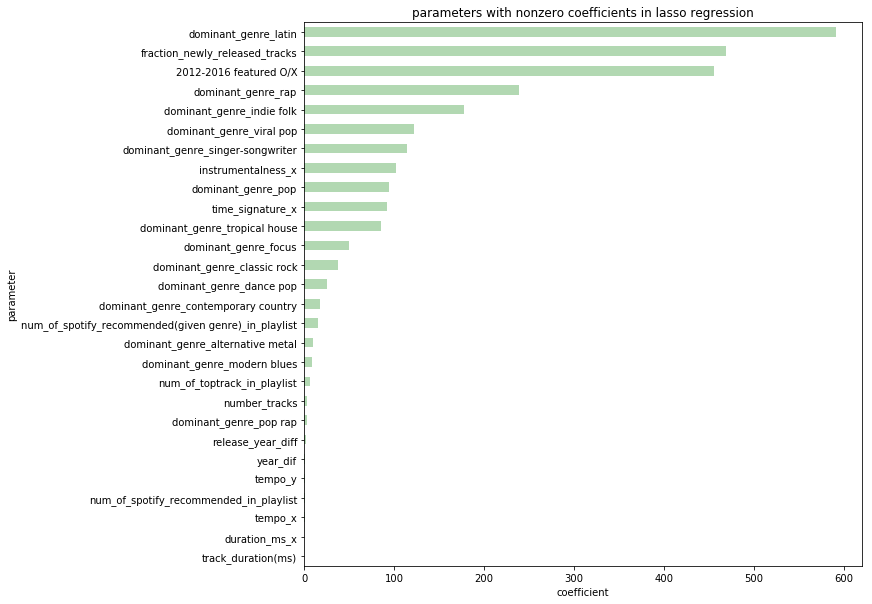


We see something a little different when we look at nonzero lasso regression coefficients, but the spotify featuring parameter appears to still be important. 

## Get rid of featured playlist parameter!!

Let's look at how our model performs without the spotify-recommendation information. This would be a better prediction of how successful a playlist will be, given that we don't want to assume whether or not Spotify will feature it. This will also shed light on what features are important for the playlist we design. 


```python
ytrain = train['playlist_followers']
xtrain = train.drop(['playlist_followers','playlist_id', '2012-2016 featured O/X','num_of_spotify_recommended_in_playlist', 'Unnamed: 0.1',
 'num_of_spotify_recommended(given genre)_in_playlist','Unnamed: 0','fraction_spotify_recommended(given artist)','fraction_spotify_recommended(given genre)'],axis = 1)
yval = val['playlist_followers']
xval = val.drop(['playlist_followers','playlist_id', '2012-2016 featured O/X','num_of_spotify_recommended_in_playlist', 'Unnamed: 0.1',
 'num_of_spotify_recommended(given genre)_in_playlist','Unnamed: 0','fraction_spotify_recommended(given artist)','fraction_spotify_recommended(given genre)'],axis = 1)
ytest = test['playlist_followers']
xtest = test.drop(['playlist_followers','playlist_id', '2012-2016 featured O/X','num_of_spotify_recommended_in_playlist', 'Unnamed: 0.1',
 'num_of_spotify_recommended(given genre)_in_playlist','Unnamed: 0','fraction_spotify_recommended(given artist)','fraction_spotify_recommended(given genre)'],axis = 1)
```

We'll use the square root tranformed response variable.


```python
ytrain = ytrain**.5
```


```python
def cv_optimize_lasso(x, y, list_of_lambdas, n_folds=5):
    las = Lasso()
    parameters = {'alpha': list_of_lambdas}
    gs = GridSearchCV(las, param_grid=parameters, cv=n_folds, scoring="neg_mean_squared_error")
    gs.fit(x, y)
    return gs

lol = [1e-5, 1e-4, 1e-3, 1e-2, 1e-1, 1e0, 1e1, 1e2, 1e3, 1e4, 1e5]
lmodel = cv_optimize_lasso(xtrain, ytrain, lol, n_folds=5)

lambdal = lmodel.best_params_['alpha']
est_lasso = Lasso(alpha=lambdal).fit(xtrain,ytrain)

yhat_train = est_lasso.predict(xtrain)
yhat_test = est_lasso.predict(xval)
print('train R2 = ', r2_score(ytrain, yhat_train))
print('validation R2 = ', r2_score(yval, yhat_test))
```

    /home/erica/python/anaconda3/lib/python3.6/site-packages/sklearn/linear_model/coordinate_descent.py:491: ConvergenceWarning: Objective did not converge. You might want to increase the number of iterations. Fitting data with very small alpha may cause precision problems.
      ConvergenceWarning)
    /home/erica/python/anaconda3/lib/python3.6/site-packages/sklearn/linear_model/coordinate_descent.py:491: ConvergenceWarning: Objective did not converge. You might want to increase the number of iterations. Fitting data with very small alpha may cause precision problems.
      ConvergenceWarning)
    /home/erica/python/anaconda3/lib/python3.6/site-packages/sklearn/linear_model/coordinate_descent.py:491: ConvergenceWarning: Objective did not converge. You might want to increase the number of iterations. Fitting data with very small alpha may cause precision problems.
      ConvergenceWarning)
    /home/erica/python/anaconda3/lib/python3.6/site-packages/sklearn/linear_model/coordinate_descent.py:491: ConvergenceWarning: Objective did not converge. You might want to increase the number of iterations. Fitting data with very small alpha may cause precision problems.
      ConvergenceWarning)
    /home/erica/python/anaconda3/lib/python3.6/site-packages/sklearn/linear_model/coordinate_descent.py:491: ConvergenceWarning: Objective did not converge. You might want to increase the number of iterations. Fitting data with very small alpha may cause precision problems.
      ConvergenceWarning)


    train R2 =  0.375207968323
    validation R2 =  -0.210348813205


This is bad! Ok, we need to come up with something else.

### New plan: instead, let's train on a model where we train on the playlists that aren't featured

Using playlists that have been featured on spotify might be biasing our dataset. There may be a trend between the features of a playlist and its number of followers that is obscured by the inflation playlist followers gets after it has been featured.


```python
train_wout_feat = train[train['2012-2016 featured O/X']!=1]
val_wout_feat = val[val['2012-2016 featured O/X']!=1]
test_wout_feat = test[test['2012-2016 featured O/X']!=1]
```


```python
ytrain = train_wout_feat['playlist_followers']
xtrain = train_wout_feat.drop(['playlist_followers','playlist_id', '2012-2016 featured O/X','num_of_spotify_recommended_in_playlist',
 'num_of_spotify_recommended(given genre)_in_playlist','Unnamed: 0','fraction_spotify_recommended(given artist)','fraction_spotify_recommended(given genre)'],axis = 1)
yval = val_wout_feat['playlist_followers']
xval = val_wout_feat.drop(['playlist_followers','playlist_id', '2012-2016 featured O/X','num_of_spotify_recommended_in_playlist',
 'num_of_spotify_recommended(given genre)_in_playlist','Unnamed: 0','fraction_spotify_recommended(given artist)','fraction_spotify_recommended(given genre)'],axis = 1)
ytest = test_wout_feat['playlist_followers']
xtest = test_wout_feat.drop(['playlist_followers','playlist_id', '2012-2016 featured O/X','num_of_spotify_recommended_in_playlist',
 'num_of_spotify_recommended(given genre)_in_playlist','Unnamed: 0','fraction_spotify_recommended(given artist)','fraction_spotify_recommended(given genre)'],axis = 1)
```

#### Un-transformed response variable

The distribution could be different, so we'll look at transformation again.


```python
model = OLS(endog=ytrain, exog=xtrain)
result = model.fit()

y_hat_train = result.predict()
y_hat_test = result.predict(exog=xval)

print('train R2 = ', r2_score(ytrain, y_hat_train))
print('validation R2 = ', r2_score(yval, y_hat_test))
```

    train R2 =  0.406571625318
    validation R2 =  -0.513289635325


```python
result.pvalues[((result.pvalues < 0.05) & (result.params > 0))]
```


    dominant_genre_classic rock            4.472142e-02
    dominant_genre_contemporary country    4.358673e-02
    dominant_genre_indie folk              8.478000e-04
    dominant_genre_latin                   3.253449e-25
    dominant_genre_singer-songwriter       4.428825e-02
    dominant_genre_tropical house          1.138554e-02
    dominant_genre_viral pop               1.781931e-03
    fraction_newly_released_tracks         7.157417e-08
    num_of_toptrack_in_playlist            1.879455e-02
    dtype: float64


```python
def cv_optimize_lasso(x, y, list_of_lambdas, n_folds=5):
    las = Lasso()
    parameters = {'alpha': list_of_lambdas}
    gs = GridSearchCV(las, param_grid=parameters, cv=n_folds, scoring="neg_mean_squared_error")
    gs.fit(x, y)
    return gs

lol = [1e-5, 1e-4, 1e-3, 1e-2, 1e-1, 1e0, 1e1, 1e2, 1e3, 1e4, 1e5]
lmodel = cv_optimize_lasso(xtrain, ytrain, lol, n_folds=5)

lambdal = lmodel.best_params_['alpha']
est_lasso = Lasso(alpha=lambdal).fit(xtrain,ytrain)

yhat_train = est_lasso.predict(xtrain)
yhat_test = est_lasso.predict(xval)
print('train R2 = ', r2_score(ytrain, yhat_train))
print('validation R2 = ', r2_score(yval, yhat_test))
```

    /home/erica/python/anaconda3/lib/python3.6/site-packages/sklearn/linear_model/coordinate_descent.py:491: ConvergenceWarning: Objective did not converge. You might want to increase the number of iterations. Fitting data with very small alpha may cause precision problems.
      ConvergenceWarning)
    /home/erica/python/anaconda3/lib/python3.6/site-packages/sklearn/linear_model/coordinate_descent.py:491: ConvergenceWarning: Objective did not converge. You might want to increase the number of iterations. Fitting data with very small alpha may cause precision problems.
      ConvergenceWarning)
    /home/erica/python/anaconda3/lib/python3.6/site-packages/sklearn/linear_model/coordinate_descent.py:491: ConvergenceWarning: Objective did not converge. You might want to increase the number of iterations. Fitting data with very small alpha may cause precision problems.
      ConvergenceWarning)
    /home/erica/python/anaconda3/lib/python3.6/site-packages/sklearn/linear_model/coordinate_descent.py:491: ConvergenceWarning: Objective did not converge. You might want to increase the number of iterations. Fitting data with very small alpha may cause precision problems.
      ConvergenceWarning)
    /home/erica/python/anaconda3/lib/python3.6/site-packages/sklearn/linear_model/coordinate_descent.py:491: ConvergenceWarning: Objective did not converge. You might want to increase the number of iterations. Fitting data with very small alpha may cause precision problems.
      ConvergenceWarning)
    /home/erica/python/anaconda3/lib/python3.6/site-packages/sklearn/linear_model/coordinate_descent.py:491: ConvergenceWarning: Objective did not converge. You might want to increase the number of iterations. Fitting data with very small alpha may cause precision problems.
      ConvergenceWarning)
    /home/erica/python/anaconda3/lib/python3.6/site-packages/sklearn/linear_model/coordinate_descent.py:491: ConvergenceWarning: Objective did not converge. You might want to increase the number of iterations. Fitting data with very small alpha may cause precision problems.
      ConvergenceWarning)
    /home/erica/python/anaconda3/lib/python3.6/site-packages/sklearn/linear_model/coordinate_descent.py:491: ConvergenceWarning: Objective did not converge. You might want to increase the number of iterations. Fitting data with very small alpha may cause precision problems.
      ConvergenceWarning)
    /home/erica/python/anaconda3/lib/python3.6/site-packages/sklearn/linear_model/coordinate_descent.py:491: ConvergenceWarning: Objective did not converge. You might want to increase the number of iterations. Fitting data with very small alpha may cause precision problems.
      ConvergenceWarning)
    /home/erica/python/anaconda3/lib/python3.6/site-packages/sklearn/linear_model/coordinate_descent.py:491: ConvergenceWarning: Objective did not converge. You might want to increase the number of iterations. Fitting data with very small alpha may cause precision problems.
      ConvergenceWarning)
    /home/erica/python/anaconda3/lib/python3.6/site-packages/sklearn/linear_model/coordinate_descent.py:491: ConvergenceWarning: Objective did not converge. You might want to increase the number of iterations. Fitting data with very small alpha may cause precision problems.
      ConvergenceWarning)
    /home/erica/python/anaconda3/lib/python3.6/site-packages/sklearn/linear_model/coordinate_descent.py:491: ConvergenceWarning: Objective did not converge. You might want to increase the number of iterations. Fitting data with very small alpha may cause precision problems.
      ConvergenceWarning)
    /home/erica/python/anaconda3/lib/python3.6/site-packages/sklearn/linear_model/coordinate_descent.py:491: ConvergenceWarning: Objective did not converge. You might want to increase the number of iterations. Fitting data with very small alpha may cause precision problems.
      ConvergenceWarning)
    /home/erica/python/anaconda3/lib/python3.6/site-packages/sklearn/linear_model/coordinate_descent.py:491: ConvergenceWarning: Objective did not converge. You might want to increase the number of iterations. Fitting data with very small alpha may cause precision problems.
      ConvergenceWarning)
    /home/erica/python/anaconda3/lib/python3.6/site-packages/sklearn/linear_model/coordinate_descent.py:491: ConvergenceWarning: Objective did not converge. You might want to increase the number of iterations. Fitting data with very small alpha may cause precision problems.
      ConvergenceWarning)
    /home/erica/python/anaconda3/lib/python3.6/site-packages/sklearn/linear_model/coordinate_descent.py:491: ConvergenceWarning: Objective did not converge. You might want to increase the number of iterations. Fitting data with very small alpha may cause precision problems.
      ConvergenceWarning)
    /home/erica/python/anaconda3/lib/python3.6/site-packages/sklearn/linear_model/coordinate_descent.py:491: ConvergenceWarning: Objective did not converge. You might want to increase the number of iterations. Fitting data with very small alpha may cause precision problems.
      ConvergenceWarning)
    /home/erica/python/anaconda3/lib/python3.6/site-packages/sklearn/linear_model/coordinate_descent.py:491: ConvergenceWarning: Objective did not converge. You might want to increase the number of iterations. Fitting data with very small alpha may cause precision problems.
      ConvergenceWarning)
    /home/erica/python/anaconda3/lib/python3.6/site-packages/sklearn/linear_model/coordinate_descent.py:491: ConvergenceWarning: Objective did not converge. You might want to increase the number of iterations. Fitting data with very small alpha may cause precision problems.
      ConvergenceWarning)
    /home/erica/python/anaconda3/lib/python3.6/site-packages/sklearn/linear_model/coordinate_descent.py:491: ConvergenceWarning: Objective did not converge. You might want to increase the number of iterations. Fitting data with very small alpha may cause precision problems.
      ConvergenceWarning)
    /home/erica/python/anaconda3/lib/python3.6/site-packages/sklearn/linear_model/coordinate_descent.py:491: ConvergenceWarning: Objective did not converge. You might want to increase the number of iterations. Fitting data with very small alpha may cause precision problems.
      ConvergenceWarning)
    /home/erica/python/anaconda3/lib/python3.6/site-packages/sklearn/linear_model/coordinate_descent.py:491: ConvergenceWarning: Objective did not converge. You might want to increase the number of iterations. Fitting data with very small alpha may cause precision problems.
      ConvergenceWarning)
    /home/erica/python/anaconda3/lib/python3.6/site-packages/sklearn/linear_model/coordinate_descent.py:491: ConvergenceWarning: Objective did not converge. You might want to increase the number of iterations. Fitting data with very small alpha may cause precision problems.
      ConvergenceWarning)
    /home/erica/python/anaconda3/lib/python3.6/site-packages/sklearn/linear_model/coordinate_descent.py:491: ConvergenceWarning: Objective did not converge. You might want to increase the number of iterations. Fitting data with very small alpha may cause precision problems.
      ConvergenceWarning)


    train R2 =  0.11384626124
    validation R2 =  0.101949219596


```python
par = []
nums = []
si= np.argsort(np.abs(est_lasso.coef_))
for i,x in enumerate(est_lasso.coef_[si]):
    par.append(xtrain.columns[si][i])
    nums.append(x)
sig_par = []
coefs = []
for i in range(len(par)):
    if nums[i] > 0:
        sig_par.append(par[i])
        coefs.append(nums[i])
        
dic = {
        'coefficients': coefs,
        'parameters': sig_par
}
sig = pd.DataFrame(dic)
sig.index = sig['parameters']

sig['coefficients'].plot(kind='barh', alpha = 0.3, color = 'green')
plt.title('parameters with nonzero coefficients in lasso regression')
plt.xlabel('coefficient')
plt.ylabel('parameter')
```


    <matplotlib.text.Text at 0x7fbb149a6e80>


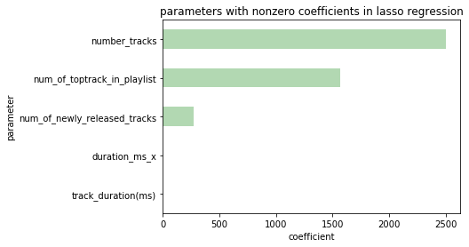


```python
ytrain = ytrain**0.5
```


```python
model = OLS(endog=ytrain, exog=xtrain)
result = model.fit()

y_hat_train = result.predict()
y_hat_test = result.predict(exog=xval)

print('train R2 = ', r2_score(ytrain, y_hat_train))
print('validation R2 = ', r2_score(yval, y_hat_test))
```

    train R2 =  0.489440105739
    validation R2 =  -0.215820966975


```python
result.pvalues[((result.pvalues < 0.05) & (result.params > 0))]
```


    number_tracks                       1.130290e-03
    dominant_genre_classic rock         4.483837e-02
    dominant_genre_electronic trap      1.189763e-02
    dominant_genre_indie folk           3.401390e-04
    dominant_genre_latin                1.198797e-07
    dominant_genre_psychedelic rock     4.451303e-02
    dominant_genre_singer-songwriter    2.686967e-03
    dominant_genre_tropical house       7.428961e-03
    dominant_genre_viral pop            3.984138e-03
    fraction_newly_released_tracks      3.257773e-08
    num_of_toptrack_in_playlist         2.507031e-02
    instrumentalness_x                  1.888566e-02
    dtype: float64


```python
def cv_optimize_lasso(x, y, list_of_lambdas, n_folds=5):
    las = Lasso()
    parameters = {'alpha': list_of_lambdas}
    gs = GridSearchCV(las, param_grid=parameters, cv=n_folds, scoring="neg_mean_squared_error")
    gs.fit(x, y)
    return gs

lol = [1e-5, 1e-4, 1e-3, 1e-2, 1e-1, 1e0, 1e1, 1e2, 1e3, 1e4, 1e5]
lmodel = cv_optimize_lasso(xtrain, ytrain, lol, n_folds=5)

lambdal = lmodel.best_params_['alpha']
est_lasso = Lasso(alpha=lambdal).fit(xtrain,ytrain)

yhat_train = est_lasso.predict(xtrain)
yhat_test = est_lasso.predict(xval)
print('train R2 = ', r2_score(ytrain, yhat_train))
print('validation R2 = ', r2_score(yval, yhat_test))
```

    /home/erica/python/anaconda3/lib/python3.6/site-packages/sklearn/linear_model/coordinate_descent.py:491: ConvergenceWarning: Objective did not converge. You might want to increase the number of iterations. Fitting data with very small alpha may cause precision problems.
      ConvergenceWarning)
    /home/erica/python/anaconda3/lib/python3.6/site-packages/sklearn/linear_model/coordinate_descent.py:491: ConvergenceWarning: Objective did not converge. You might want to increase the number of iterations. Fitting data with very small alpha may cause precision problems.
      ConvergenceWarning)
    /home/erica/python/anaconda3/lib/python3.6/site-packages/sklearn/linear_model/coordinate_descent.py:491: ConvergenceWarning: Objective did not converge. You might want to increase the number of iterations. Fitting data with very small alpha may cause precision problems.
      ConvergenceWarning)
    /home/erica/python/anaconda3/lib/python3.6/site-packages/sklearn/linear_model/coordinate_descent.py:491: ConvergenceWarning: Objective did not converge. You might want to increase the number of iterations. Fitting data with very small alpha may cause precision problems.
      ConvergenceWarning)
    /home/erica/python/anaconda3/lib/python3.6/site-packages/sklearn/linear_model/coordinate_descent.py:491: ConvergenceWarning: Objective did not converge. You might want to increase the number of iterations. Fitting data with very small alpha may cause precision problems.
      ConvergenceWarning)
    /home/erica/python/anaconda3/lib/python3.6/site-packages/sklearn/linear_model/coordinate_descent.py:491: ConvergenceWarning: Objective did not converge. You might want to increase the number of iterations. Fitting data with very small alpha may cause precision problems.
      ConvergenceWarning)
    /home/erica/python/anaconda3/lib/python3.6/site-packages/sklearn/linear_model/coordinate_descent.py:491: ConvergenceWarning: Objective did not converge. You might want to increase the number of iterations. Fitting data with very small alpha may cause precision problems.
      ConvergenceWarning)
    /home/erica/python/anaconda3/lib/python3.6/site-packages/sklearn/linear_model/coordinate_descent.py:491: ConvergenceWarning: Objective did not converge. You might want to increase the number of iterations. Fitting data with very small alpha may cause precision problems.
      ConvergenceWarning)


    train R2 =  0.276062251989
    validation R2 =  -0.215918505392


Interesting! The un-transformed response variable works much better for this dataset with no featured playlists. This model will be the one we use to predict playlist success.

### Moment of truth: testing our model on the test set!


```python
def cv_optimize_lasso(x, y, list_of_lambdas, n_folds=5):
    las = Lasso()
    parameters = {'alpha': list_of_lambdas}
    gs = GridSearchCV(las, param_grid=parameters, cv=n_folds, scoring="neg_mean_squared_error")
    gs.fit(x, y)
    return gs

lol = [1e-5, 1e-4, 1e-3, 1e-2, 1e-1, 1e0, 1e1, 1e2, 1e3, 1e4, 1e5]
lmodel = cv_optimize_lasso(xtrain, ytrain, lol, n_folds=5)

lambdal = lmodel.best_params_['alpha']
est_lasso = Lasso(alpha=lambdal).fit(xtrain,ytrain)

yhat_test = est_lasso.predict(xtest)
print('test R2 = ', r2_score(ytest, yhat_test))
```

    /home/erica/python/anaconda3/lib/python3.6/site-packages/sklearn/linear_model/coordinate_descent.py:491: ConvergenceWarning: Objective did not converge. You might want to increase the number of iterations. Fitting data with very small alpha may cause precision problems.
      ConvergenceWarning)
    /home/erica/python/anaconda3/lib/python3.6/site-packages/sklearn/linear_model/coordinate_descent.py:491: ConvergenceWarning: Objective did not converge. You might want to increase the number of iterations. Fitting data with very small alpha may cause precision problems.
      ConvergenceWarning)
    /home/erica/python/anaconda3/lib/python3.6/site-packages/sklearn/linear_model/coordinate_descent.py:491: ConvergenceWarning: Objective did not converge. You might want to increase the number of iterations. Fitting data with very small alpha may cause precision problems.
      ConvergenceWarning)
    /home/erica/python/anaconda3/lib/python3.6/site-packages/sklearn/linear_model/coordinate_descent.py:491: ConvergenceWarning: Objective did not converge. You might want to increase the number of iterations. Fitting data with very small alpha may cause precision problems.
      ConvergenceWarning)
    /home/erica/python/anaconda3/lib/python3.6/site-packages/sklearn/linear_model/coordinate_descent.py:491: ConvergenceWarning: Objective did not converge. You might want to increase the number of iterations. Fitting data with very small alpha may cause precision problems.
      ConvergenceWarning)
    /home/erica/python/anaconda3/lib/python3.6/site-packages/sklearn/linear_model/coordinate_descent.py:491: ConvergenceWarning: Objective did not converge. You might want to increase the number of iterations. Fitting data with very small alpha may cause precision problems.
      ConvergenceWarning)
    /home/erica/python/anaconda3/lib/python3.6/site-packages/sklearn/linear_model/coordinate_descent.py:491: ConvergenceWarning: Objective did not converge. You might want to increase the number of iterations. Fitting data with very small alpha may cause precision problems.
      ConvergenceWarning)
    /home/erica/python/anaconda3/lib/python3.6/site-packages/sklearn/linear_model/coordinate_descent.py:491: ConvergenceWarning: Objective did not converge. You might want to increase the number of iterations. Fitting data with very small alpha may cause precision problems.
      ConvergenceWarning)


    test R2 =  -0.125410132394


This isn't terrible!

# Classification Modeling

We're thinking using classification methods could also help us determine if a playlist is successful or not.


```python
from sklearn.linear_model import LinearRegression
from sklearn.linear_model import LogisticRegressionCV
from sklearn.linear_model import LogisticRegression
from sklearn.metrics import make_scorer
import sklearn.metrics as metrics
from sklearn import preprocessing
from sklearn.preprocessing import PolynomialFeatures
from sklearn.discriminant_analysis import LinearDiscriminantAnalysis as LDA
from sklearn.discriminant_analysis import QuadraticDiscriminantAnalysis as QDA
from sklearn.neighbors import KNeighborsClassifier as KNN
from sklearn.tree import DecisionTreeClassifier as DecisionTree
from sklearn.metrics import roc_curve, auc
import seaborn as sns
import sklearn.tree as tree
from sklearn.tree import DecisionTreeClassifier
from sklearn.model_selection import cross_val_score
from sklearn.ensemble import RandomForestClassifier
from sklearn.metrics import confusion_matrix
from sklearn.ensemble import AdaBoostClassifier
```

We transformed the response variable into a binary 0 or 1, successful or not.


```python
df['followers_bin'] = pd.qcut(df["playlist_followers"], q=2, labels=[0, 1])
df.head()
```


<div>
<style>
    .dataframe thead tr:only-child th {
        text-align: right;
    }

    .dataframe thead th {
        text-align: left;
    }

    .dataframe tbody tr th {
        vertical-align: top;
    }
</style>
<table border="1" class="dataframe">
  <thead>
    <tr style="text-align: right;">
      <th></th>
      <th>Unnamed: 0</th>
      <th>release_year_diff</th>
      <th>release_month_diff</th>
      <th>playlist_id</th>
      <th>artists_per_track</th>
      <th>number_tracks</th>
      <th>number_of_genres</th>
      <th>playlist_followers</th>
      <th>track_duration(ms)</th>
      <th>dominant_genre_acousmatic</th>
      <th>...</th>
      <th>acousticness_y</th>
      <th>instrumentalness_y</th>
      <th>time_signature_y</th>
      <th>danceability_y</th>
      <th>key_y</th>
      <th>duration_ms_y</th>
      <th>loudness_y</th>
      <th>valence_y</th>
      <th>mode_y</th>
      <th>followers_bin</th>
    </tr>
  </thead>
  <tbody>
    <tr>
      <th>0</th>
      <td>0</td>
      <td>17.0</td>
      <td>8.0</td>
      <td>01WIu4Rst0xeZnTunWxUL7</td>
      <td>0.384615</td>
      <td>65</td>
      <td>99</td>
      <td>23.0</td>
      <td>1.203072e+06</td>
      <td>0</td>
      <td>...</td>
      <td>0.289052</td>
      <td>0.175111</td>
      <td>0.528059</td>
      <td>0.122818</td>
      <td>3.831173</td>
      <td>1.407763e+06</td>
      <td>6.588808</td>
      <td>0.170671</td>
      <td>0.434122</td>
      <td>0</td>
    </tr>
    <tr>
      <th>1</th>
      <td>1</td>
      <td>31.0</td>
      <td>6.0</td>
      <td>056jpfChuMP5D1NMMaDXRR</td>
      <td>0.033333</td>
      <td>30</td>
      <td>8</td>
      <td>6190.0</td>
      <td>3.307805e+05</td>
      <td>0</td>
      <td>...</td>
      <td>0.164292</td>
      <td>0.270791</td>
      <td>0.000000</td>
      <td>0.074540</td>
      <td>3.546084</td>
      <td>8.687627e+04</td>
      <td>1.235932</td>
      <td>0.141140</td>
      <td>0.466092</td>
      <td>0</td>
    </tr>
    <tr>
      <th>2</th>
      <td>2</td>
      <td>21.0</td>
      <td>8.0</td>
      <td>05dTMGk8MjnpQg3bKuoXcc</td>
      <td>0.901961</td>
      <td>51</td>
      <td>75</td>
      <td>333.0</td>
      <td>2.567173e+05</td>
      <td>0</td>
      <td>...</td>
      <td>0.261471</td>
      <td>0.068757</td>
      <td>0.300327</td>
      <td>0.133804</td>
      <td>3.538140</td>
      <td>8.111940e+04</td>
      <td>3.305971</td>
      <td>0.251370</td>
      <td>0.482640</td>
      <td>0</td>
    </tr>
    <tr>
      <th>3</th>
      <td>3</td>
      <td>12.0</td>
      <td>8.0</td>
      <td>070FVPBKvfu6M5tf4I9rt2</td>
      <td>0.900000</td>
      <td>30</td>
      <td>64</td>
      <td>73.0</td>
      <td>2.738869e+05</td>
      <td>0</td>
      <td>...</td>
      <td>0.222374</td>
      <td>0.183141</td>
      <td>0.345746</td>
      <td>0.108553</td>
      <td>3.675955</td>
      <td>8.025760e+04</td>
      <td>2.798294</td>
      <td>0.163551</td>
      <td>0.504007</td>
      <td>0</td>
    </tr>
    <tr>
      <th>4</th>
      <td>4</td>
      <td>2.0</td>
      <td>7.0</td>
      <td>08vPKM3pmoyF6crB2EtASQ</td>
      <td>0.937500</td>
      <td>32</td>
      <td>41</td>
      <td>6182.0</td>
      <td>2.286980e+05</td>
      <td>0</td>
      <td>...</td>
      <td>0.270141</td>
      <td>0.101206</td>
      <td>0.353553</td>
      <td>0.126652</td>
      <td>3.738288</td>
      <td>2.853897e+04</td>
      <td>2.523320</td>
      <td>0.162358</td>
      <td>0.507007</td>
      <td>0</td>
    </tr>
  </tbody>
</table>
<p>5 rows × 324 columns</p>
</div>


We took care to remove any features that we believed sullied our prediction, e.g. the spotified featured parameter.


```python
CLF_fieldsToDrop_NotPredictors = CLF_fieldsToDrop_NotPredictors = ["Unnamed: 0","playlist_followers", 'playlist_id', "followers_bin",
                                                                   '2012-2016 featured O/X','num_of_spotify_recommended_in_playlist',
                                                                   'num_of_spotify_recommended(given genre)_in_playlist',
                                                                   'fraction_spotify_recommended(given artist)',
                                                                   'fraction_spotify_recommended(given genre)']
```


```python
np.random.seed(9001)
msk = np.random.rand(len(df)) < 0.75
data_train = df[msk]
data_test = df[~msk]
train, val =  train_test_split(data_train, test_size=.25)

ytrain = train['followers_bin']
xtrain = train.drop(CLF_fieldsToDrop_NotPredictors, axis = 1)
ytest = val["followers_bin"]
xtest = val.drop(CLF_fieldsToDrop_NotPredictors, axis = 1)
ytest_real = data_test["followers_bin"]
xtest_real = data_test.drop(CLF_fieldsToDrop_NotPredictors, axis = 1)

Playlist_CLF_Data = {}
Playlist_CLF_Data["Xtrain"] = xtrain
Playlist_CLF_Data["ytrain"] = ytrain
Playlist_CLF_Data["Xtest"] = xtest
Playlist_CLF_Data["ytest"] = ytest
```

We ran through many different classification techniques.

### kNN


```python
y_train = Playlist_CLF_Data["ytrain"]
x_train =  Playlist_CLF_Data["Xtrain"] 

y_test = Playlist_CLF_Data["ytest"] 
x_test = Playlist_CLF_Data["Xtest"]

#Fitting KNN
print('Fitting K-NN')
knn = KNN(n_neighbors=20)
knn.fit(x_train, y_train)

knn_Acc_train = knn.score(x_train, y_train)
knn_Acc_test = knn.score(x_test, y_test)

print("Train Accuracy:", knn_Acc_train)
print("Test Accuracy:", knn_Acc_test)
```

    Fitting K-NN
    Train Accuracy: 0.635241301908
    Test Accuracy: 0.558922558923


```python
sns.set_context("poster")

fpr_LR, tpr_LR, thresholds_LR = roc_curve(y_test, knn.predict_proba(x_test)[:,1])

roc_auc_LR = auc(fpr_LR, tpr_LR)
name_LR = "kNN"

fig, ax = plt.subplots(1, 1, figsize=(12, 10))
ax.plot(fpr_LR, tpr_LR, '.-', alpha=0.5, label='ROC curve for %s (AUC = %0.2f)' % (name_LR, roc_auc_LR))

ax.set_title("kNN Classification: Top or Bottom")

ax.legend()
plt.show()
```


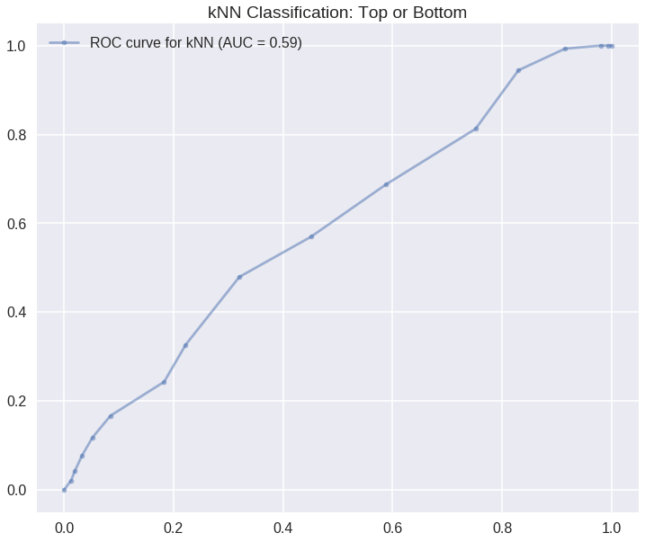


### unweighted logistic regression


```python
y_train = Playlist_CLF_Data["ytrain"]
x_train =  Playlist_CLF_Data["Xtrain"] 

y_test = Playlist_CLF_Data["ytest"] 
x_test = Playlist_CLF_Data["Xtest"]

print('Fitting Unweighted Log Regr')

unweighted_logistic = LogisticRegression(C=1000)
unweighted_logistic.fit(x_train, y_train)

unweighted_logistic_Acc_train = unweighted_logistic.score(x_train, y_train)
unweighted_logistic_Acc_test = unweighted_logistic.score(x_test, y_test)

print("Train Accuracy:", unweighted_logistic_Acc_train)
print("Test Accuracy:", unweighted_logistic_Acc_test)

```

    Fitting Unweighted Log Regr
    Train Accuracy: 0.778900112233
    Test Accuracy: 0.760942760943


```python
sns.set_context("poster")

fpr_LR, tpr_LR, thresholds_LR = roc_curve(y_test, unweighted_logistic.predict_proba(x_test)[:,1])

roc_auc_LR = auc(fpr_LR, tpr_LR)
name_LR = "logistic regression"

fig, ax = plt.subplots(1, 1, figsize=(12, 10))
ax.plot(fpr_LR, tpr_LR, '.-', alpha=0.5, label='ROC curve for %s (AUC = %0.2f)' % (name_LR, roc_auc_LR))

ax.set_title("Unweighted LogReg Classification: Top or Bottom")

ax.legend()
plt.show()
```


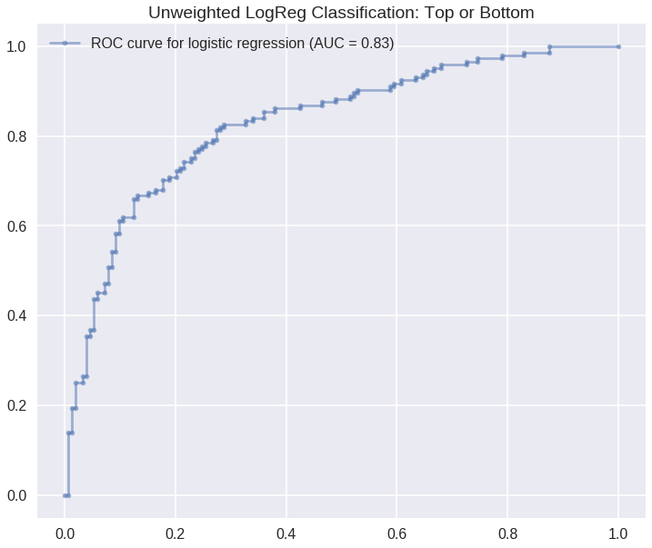


### weighted logistic regression


```python
y_train = Playlist_CLF_Data["ytrain"]
x_train =  Playlist_CLF_Data["Xtrain"] 

y_test = Playlist_CLF_Data["ytest"] 
x_test = Playlist_CLF_Data["Xtest"]

#Fitting KNN
print('Fitting Unweighted Log Regr')

weighted_logistic = LogisticRegressionCV(cv=5)
weighted_logistic.fit(x_train, y_train)

weighted_logistic_Acc_train = weighted_logistic.score(x_train, y_train)
weighted_logistic_Acc_test = weighted_logistic.score(x_test, y_test)

print("Train Accuracy:", weighted_logistic_Acc_train)
print("Test Accuracy:", weighted_logistic_Acc_test)
```

    Fitting Unweighted Log Regr
    Train Accuracy: 0.739618406285
    Test Accuracy: 0.740740740741


```python
sns.set_context("poster")

fpr_LR, tpr_LR, thresholds_LR = roc_curve(y_test, weighted_logistic.predict_proba(x_test)[:,1])

roc_auc_LR = auc(fpr_LR, tpr_LR)
name_LR = "logistic regression"

fig, ax = plt.subplots(1, 1, figsize=(12, 10))
ax.plot(fpr_LR, tpr_LR, '.-', alpha=0.5, label='ROC curve for %s (AUC = %0.2f)' % (name_LR, roc_auc_LR))

ax.set_title("Weighted LogReg Classification: Top or Bottom")

ax.legend()
plt.show()
```


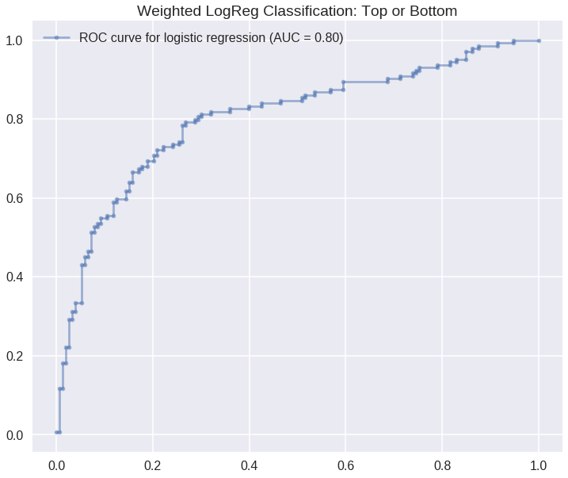


### Random Forest


```python
clf = RandomForestClassifier(max_depth=3, random_state=0)
clf.fit(x_train, y_train)


#print(clf.feature_importances_)

print("Test Train:", clf.score(x_train, y_train) )
print("Test Acc:", clf.score(x_test, y_test) )

y_test_Pred = clf.predict(x_test)

confusion_matrix(y_test, y_test_Pred)
```

    Test Train: 0.765432098765
    Test Acc: 0.750841750842


    array([[108,  45],
           [ 29, 115]])


```python
sns.set_context("poster")

fpr_LR, tpr_LR, thresholds_LR = roc_curve(y_test, clf.predict_proba(x_test)[:,1])

roc_auc_LR = auc(fpr_LR, tpr_LR)
name_LR = "random forest"

fig, ax = plt.subplots(1, 1, figsize=(12, 10))
ax.plot(fpr_LR, tpr_LR, '.-', alpha=0.5, label='ROC curve for %s (AUC = %0.2f)' % (name_LR, roc_auc_LR))

ax.set_title("RF Classification: Top or Bottom")

ax.legend()
plt.show()
```


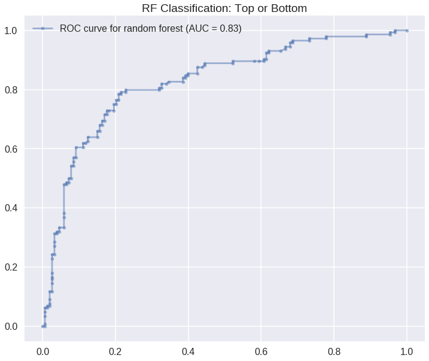


### AdaBoost


```python
clf = AdaBoostClassifier( n_estimators=1000, random_state=0, learning_rate=1)
clf.fit(x_train, y_train)


#print(clf.feature_importances_)

print("Test Train:", clf.score(x_train, y_train) )
print("Test Acc:", clf.score(x_test, y_test) )

y_test_Pred = clf.predict(x_test)


print(y_test.shape)

print( confusion_matrix(y_test, y_test_Pred) )

tn, fp, fn, tp = confusion_matrix(y_test, y_test_Pred).ravel()
(tn, fp, fn, tp)
```

    Test Train: 1.0
    Test Acc: 0.734006734007
    (297,)
    [[112  41]
     [ 38 106]]


    (112, 41, 38, 106)


```python
sns.set_context("poster")

fpr_LR, tpr_LR, thresholds_LR = roc_curve(y_test, clf.predict_proba(x_test)[:,1])

roc_auc_LR = auc(fpr_LR, tpr_LR)
name_LR = "logistic regression"

fig, ax = plt.subplots(1, 1, figsize=(12, 10))
ax.plot(fpr_LR, tpr_LR, '.-', alpha=0.5, label='ROC curve for %s (AUC = %0.2f)' % (name_LR, roc_auc_LR))

ax.set_title("AdaBoost Classification: Top or Bottom")

ax.legend()
plt.show()
```


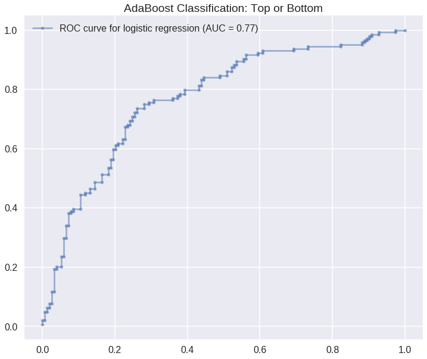


## Unfeatured playlists only

Let's see how performance is affected when we train on unfeatured playlists only.


```python
df_wout_feat = df[df['2012-2016 featured O/X']!=1]
```


```python
np.random.seed(9001)
msk = np.random.rand(len(df_wout_feat)) < 0.75
data_train = df_wout_feat[msk]
data_test = df_wout_feat[~msk]
train, val =  train_test_split(train, test_size=.25)

ytrain = train["followers_bin"]
xtrain = train.drop(CLF_fieldsToDrop_NotPredictors, axis = 1)
ytest = val["followers_bin"]
xtest = val.drop(CLF_fieldsToDrop_NotPredictors, axis = 1)
ytest_real = data_test["followers_bin"]
xtest_real = data_test.drop(CLF_fieldsToDrop_NotPredictors, axis = 1)

```

We'll use the best model as determined in the analysis above.


```python
clf = AdaBoostClassifier( n_estimators=1000, random_state=0, learning_rate=1)
clf.fit(xtrain, ytrain)


#print(clf.feature_importances_)

print("Test Train:", clf.score(xtrain, ytrain) )
print("Test Acc:", clf.score(xtest, ytest) )

y_test_Pred = clf.predict(xtest)

print( confusion_matrix(ytest, y_test_Pred) )
```

    Test Train: 1.0
    Test Acc: 0.668161434978
    [[75 38]
     [36 74]]


```python
sns.set_context("poster")

fpr_LR, tpr_LR, thresholds_LR = roc_curve(y_test, clf.predict_proba(x_test)[:,1])

roc_auc_LR = auc(fpr_LR, tpr_LR)
name_LR = "logistic regression"

fig, ax = plt.subplots(1, 1, figsize=(12, 10))
ax.plot(fpr_LR, tpr_LR, '.-', alpha=0.5, label='ROC curve for %s (AUC = %0.2f)' % (name_LR, roc_auc_LR))

ax.set_title("AdaBoost Classification: Top or Bottom")

ax.legend()
plt.show()
```


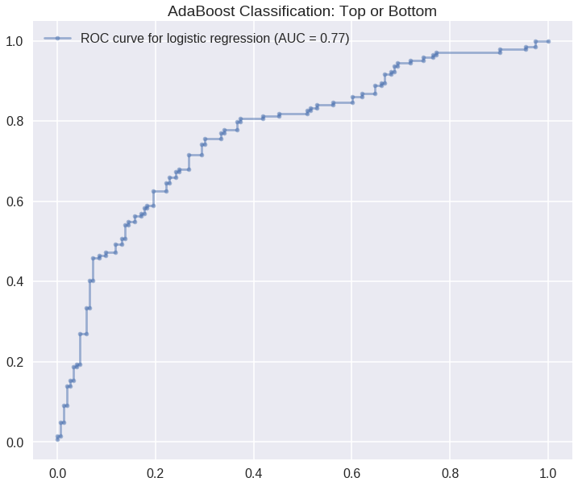


## Moment of truth: test model on the test set


```python
clf = AdaBoostClassifier( n_estimators=1000, random_state=0, learning_rate=1)
clf.fit(xtrain, ytrain)

print("Test Acc:", clf.score(xtest_real, ytest_real) )

y_test_Pred = clf.predict(xtest_real)

print(y_test.shape)

print( confusion_matrix(ytest_real, y_test_Pred) )
```

    Test Train: 1.0
    Test Acc: 0.818181818182
    (297,)
    [[169  40]
     [ 28 137]]


Not bad!
